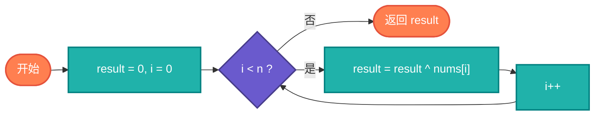

# 找出单独数字算法完整教学资源

## 说明

找出单独数字算法用于在数组中找到只出现一次的数字，其他数字都出现两次。利用XOR运算的性质（a ^ a = 0, a ^ 0 = a），可以高效地解决这个问题。该算法广泛应用于数据去重、错误检测、密码学等领域。

> **生活类比**：就像在成对的鞋子中找到一只单只鞋，XOR运算就像把成对的鞋子相互抵消，最后剩下的就是单只鞋。

## 实现过程

1. 初始化结果为0
2. 遍历数组中的每个数字
3. 将结果与当前数字进行XOR运算
4. 重复直到遍历完所有数字
5. 返回结果

## 算法流程



## 核心思想

### XOR性质

- a ^ a = 0（任何数与自己异或结果为0）
- a ^ 0 = a（任何数与0异或结果为自身）
- 异或运算满足交换律和结合律

### 算法过程

遍历数组，对所有元素进行XOR运算。出现两次的数字会相互抵消（a ^ a = 0），最终结果就是只出现一次的数字。

### 扩展问题

如果其他数字出现三次，需要使用位计数的方法。

## 目录结构

```
single-number/
├── single_number.c     # C 语言实现
├── SingleNumber.java    # Java 语言实现
├── single_number.go    # Go 语言实现
├── single_number.py    # Python 语言实现
├── single_number.js    # JavaScript 语言实现
├── single_number.rs    # Rust 语言实现
├── single_number.ts    # TypeScript 语言实现
└── README.md          # 本文档
```

## 核心思想

### XOR性质

- a ^ a = 0（任何数与自己异或结果为0）
- a ^ 0 = a（任何数与0异或结果为自身）
- 异或运算满足交换律和结合律

### 算法过程

遍历数组，对所有元素进行XOR运算。出现两次的数字会相互抵消（a ^ a = 0），最终结果就是只出现一次的数字。

### 扩展问题

如果其他数字出现三次，需要使用位计数的方法。

## 复杂度分析

| 问题 | 时间复杂度 | 空间复杂度 | 描述 |
|------|----------|----------|------|
| 出现一次，其他两次 | O(n) | O(1) | 单次遍历 |
| 出现一次，其他三次 | O(n) | O(1) | 位计数 |

## 应用场景

- 数据去重
- 错误检测
- 密码学
- 校验和计算
- 数据验证

## 简单例子

### Python 示例
```python
def single_number(nums):
    """找出只出现一次的数字"""
    result = 0
    for num in nums:
        result ^= num
    return result

print(single_number([4, 1, 2, 1, 2]))  # 输出: 4
```

### C 语言示例
```c
#include <stdio.h>

int singleNumber(int* nums, int numsSize) {
    int result = 0;
    for (int i = 0; i < numsSize; i++) {
        result ^= nums[i];
    }
    return result;
}

int main() {
    int nums[] = {4, 1, 2, 1, 2};
    int size = sizeof(nums) / sizeof(nums[0]);
    printf("%d\n", singleNumber(nums, size));  // 输出: 4
    return 0;
}
```

### Java 示例
```java
public class SingleNumber {
    public static int singleNumber(int[] nums) {
        int result = 0;
        for (int num : nums) {
            result ^= num;
        }
        return result;
    }
    
    public static void main(String[] args) {
        int[] nums = {4, 1, 2, 1, 2};
        System.out.println(singleNumber(nums));  // 输出: 4
    }
}
```

## 特点

### 优点
- 执行效率高：线性时间复杂度
- 空间占用小：常数空间复杂度
- 代码简洁：只需一行循环
- 应用广泛：多个场景使用

### 缺点
- 限制条件：只能处理特定出现次数
- 扩展困难：出现三次需要其他方法
- 可读性：需要理解XOR性质

## 优化技巧

### 1. 基础XOR
```python
def single_number(nums):
    result = 0
    for num in nums:
        result ^= num
    return result
```

### 2. 出现三次的情况
```python
def single_number_iii(nums):
    """其他数字出现三次，找出出现一次的数字"""
    result = 0
    for i in range(32):
        bit_sum = 0
        for num in nums:
            bit_sum += (num >> i) & 1
        if bit_sum % 3 == 1:
            result |= (1 << i)
    return result
```

### 3. 使用reduce
```python
from functools import reduce

def single_number(nums):
    return reduce(lambda x, y: x ^ y, nums)
```

## 学习建议

1. 理解XOR性质：掌握异或运算的基本性质
2. 练习位运算：熟悉位操作的使用
3. 分析扩展问题：思考如何处理其他出现次数
4. 实际应用：了解算法在实际项目中的应用
5. 性能分析：理解算法的时间和空间复杂度
