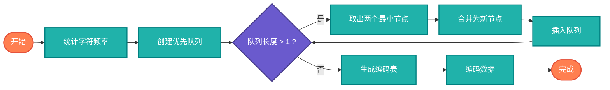

## 【压缩算法详解】Java/Go/Python/JS/C不同语言实现

## 说明

压缩算法（Compression Algorithms）是数据压缩的核心技术，通过特定编码方式减少数据存储空间和传输带宽。在AI时代，数据压缩对于高效存储、快速传输和降低计算成本至关重要。

> **生活类比**：就像整理行李箱，通过巧妙折叠和分类，让更多物品装入同样的空间。压缩算法就是数据的"智能折叠"技术。

## 算法分类

### 1. 无损压缩算法
- **Huffman编码** - 基于频率的最优前缀编码
- **LZ77算法** - 滑动窗口字典压缩
- **LZW算法** - 字典式压缩
- **Run-Length Encoding** - 行程编码

### 2. 有损压缩算法
- **离散余弦变换(DCT)** - 图像压缩基础
- **量化压缩** - 精度换取空间
- **采样压缩** - 降采样减少数据量

### 3. 混合压缩算法
- **DEFLATE** - ZIP格式核心算法
- **JPEG** - 图像压缩标准
- **MP3** - 音频压缩标准

## 算法流程

### Huffman编码流程图



# 代码

## Java

```java
import java.util.*;

public class CompressionAlgorithms {
    
    // Huffman编码实现
    public static class HuffmanCoding {
        
        static class HuffmanNode implements Comparable<HuffmanNode> {
            char character;
            int frequency;
            HuffmanNode left, right;
            
            HuffmanNode(char character, int frequency) {
                this.character = character;
                this.frequency = frequency;
            }
            
            HuffmanNode(int frequency, HuffmanNode left, HuffmanNode right) {
                this.frequency = frequency;
                this.left = left;
                this.right = right;
            }
            
            @Override
            public int compareTo(HuffmanNode other) {
                return this.frequency - other.frequency;
            }
        }
        
        public static Map<Character, String> huffmanEncode(String text) {
            // 统计频率
            Map<Character, Integer> frequencyMap = new HashMap<>();
            for (char c : text.toCharArray()) {
                frequencyMap.put(c, frequencyMap.getOrDefault(c, 0) + 1);
            }
            
            // 构建优先队列
            PriorityQueue<HuffmanNode> pq = new PriorityQueue<>();
            for (Map.Entry<Character, Integer> entry : frequencyMap.entrySet()) {
                pq.offer(new HuffmanNode(entry.getKey(), entry.getValue()));
            }
            
            // 构建Huffman树
            while (pq.size() > 1) {
                HuffmanNode left = pq.poll();
                HuffmanNode right = pq.poll();
                HuffmanNode parent = new HuffmanNode(
                    left.frequency + right.frequency, left, right
                );
                pq.offer(parent);
            }
            
            // 生成编码表
            Map<Character, String> encodingMap = new HashMap<>();
            HuffmanNode root = pq.poll();
            generateCodes(root, "", encodingMap);
            
            return encodingMap;
        }
        
        private static void generateCodes(HuffmanNode node, String code, 
                                       Map<Character, String> encodingMap) {
            if (node == null) return;
            
            if (node.left == null && node.right == null) {
                encodingMap.put(node.character, code.isEmpty() ? "0" : code);
                return;
            }
            
            generateCodes(node.left, code + "0", encodingMap);
            generateCodes(node.right, code + "1", encodingMap);
        }
        
        public static String compress(String text, Map<Character, String> encodingMap) {
            StringBuilder compressed = new StringBuilder();
            for (char c : text.toCharArray()) {
                compressed.append(encodingMap.get(c));
            }
            return compressed.toString();
        }
        
        public static String decompress(String compressed, HuffmanNode root) {
            StringBuilder decompressed = new StringBuilder();
            HuffmanNode current = root;
            
            for (char bit : compressed.toCharArray()) {
                current = bit == '0' ? current.left : current.right;
                
                if (current.left == null && current.right == null) {
                    decompressed.append(current.character);
                    current = root;
                }
            }
            
            return decompressed.toString();
        }
    }
    
    // Run-Length Encoding (RLE) 实现
    public static class RunLengthEncoding {
        
        public static String compress(String text) {
            if (text.isEmpty()) return text;
            
            StringBuilder compressed = new StringBuilder();
            char currentChar = text.charAt(0);
            int count = 1;
            
            for (int i = 1; i < text.length(); i++) {
                if (text.charAt(i) == currentChar) {
                    count++;
                } else {
                    compressed.append(currentChar);
                    if (count > 1) {
                        compressed.append(count);
                    }
                    currentChar = text.charAt(i);
                    count = 1;
                }
            }
            
            compressed.append(currentChar);
            if (count > 1) {
                compressed.append(count);
            }
            
            return compressed.toString();
        }
        
        public static String decompress(String compressed) {
            StringBuilder decompressed = new StringBuilder();
            int i = 0;
            
            while (i < compressed.length()) {
                char currentChar = compressed.charAt(i++);
                StringBuilder countStr = new StringBuilder();
                
                // 解析数字
                while (i < compressed.length() && Character.isDigit(compressed.charAt(i))) {
                    countStr.append(compressed.charAt(i++));
                }
                
                int count = countStr.length() > 0 ? Integer.parseInt(countStr.toString()) : 1;
                
                // 添加字符
                for (int j = 0; j < count; j++) {
                    decompressed.append(currentChar);
                }
            }
            
            return decompressed.toString();
        }
    }
    
    // LZ77算法实现
    public static class LZ77 {
        
        private static final int WINDOW_SIZE = 4096;
        private static final int MAX_MATCH_LENGTH = 18;
        
        public static List<LZ77Token> compress(String text) {
            List<LZ77Token> tokens = new ArrayList<>();
            int position = 0;
            
            while (position < text.length()) {
                int bestLength = 0;
                int bestOffset = 0;
                
                // 在滑动窗口中查找最长匹配
                int searchStart = Math.max(0, position - WINDOW_SIZE);
                for (int i = searchStart; i < position; i++) {
                    int matchLength = 0;
                    while (matchLength < MAX_MATCH_LENGTH &&
                           position + matchLength < text.length() &&
                           text.charAt(i + matchLength) == text.charAt(position + matchLength)) {
                        matchLength++;
                    }
                    
                    if (matchLength > bestLength) {
                        bestLength = matchLength;
                        bestOffset = position - i;
                    }
                }
                
                if (bestLength >= 2) {
                    tokens.add(new LZ77Token(bestOffset, bestLength, '\0'));
                    position += bestLength;
                } else {
                    tokens.add(new LZ77Token(0, 0, text.charAt(position)));
                    position++;
                }
            }
            
            return tokens;
        }
        
        public static String decompress(List<LZ77Token> tokens) {
            StringBuilder decompressed = new StringBuilder();
            
            for (LZ77Token token : tokens) {
                if (token.offset == 0) {
                    // 字面量
                    decompressed.append(token.literal);
                } else {
                    // 引用
                    int start = decompressed.length() - token.offset;
                    for (int i = 0; i < token.length; i++) {
                        decompressed.append(decompressed.charAt(start + i));
                    }
                }
            }
            
            return decompressed.toString();
        }
        
        static class LZ77Token {
            int offset;
            int length;
            char literal;
            
            LZ77Token(int offset, int length, char literal) {
                this.offset = offset;
                this.length = length;
                this.literal = literal;
            }
        }
    }
    
    // LZW算法实现
    public static class LZW {
        
        public static List<Integer> compress(String text) {
            Map<String, Integer> dictionary = new HashMap<>();
            List<Integer> compressed = new ArrayList<>();
            
            // 初始化字典
            int dictSize = 256;
            for (int i = 0; i < 256; i++) {
                dictionary.put(String.valueOf((char) i), i);
            }
            
            String current = "";
            for (char c : text.toCharArray()) {
                String combined = current + c;
                if (dictionary.containsKey(combined)) {
                    current = combined;
                } else {
                    compressed.add(dictionary.get(current));
                    dictionary.put(combined, dictSize++);
                    current = String.valueOf(c);
                }
            }
            
            if (!current.isEmpty()) {
                compressed.add(dictionary.get(current));
            }
            
            return compressed;
        }
        
        public static String decompress(List<Integer> compressed) {
            Map<Integer, String> dictionary = new HashMap<>();
            StringBuilder decompressed = new StringBuilder();
            
            // 初始化字典
            int dictSize = 256;
            for (int i = 0; i < 256; i++) {
                dictionary.put(i, String.valueOf((char) i));
            }
            
            String previous = String.valueOf((char) (int) compressed.get(0));
            decompressed.append(previous);
            
            for (int i = 1; i < compressed.size(); i++) {
                int code = compressed.get(i);
                String current;
                
                if (dictionary.containsKey(code)) {
                    current = dictionary.get(code);
                } else if (code == dictSize) {
                    current = previous + previous.charAt(0);
                } else {
                    throw new IllegalArgumentException("Invalid compressed data");
                }
                
                decompressed.append(current);
                dictionary.put(dictSize++, previous + current.charAt(0));
                previous = current;
            }
            
            return decompressed.toString();
        }
    }
}
```

## Python

```python
from typing import Dict, List, Tuple
import heapq
from collections import defaultdict

class CompressionAlgorithms:
    
    class HuffmanCoding:
        
        class HuffmanNode:
            def __init__(self, char=None, freq=0, left=None, right=None):
                self.char = char
                self.freq = freq
                self.left = left
                self.right = right
            
            def __lt__(self, other):
                return self.freq < other.freq
        
        @staticmethod
        def huffman_encode(text: str) -> Dict[str, str]:
            """生成Huffman编码表"""
            # 统计频率
            frequency = defaultdict(int)
            for char in text:
                frequency[char] += 1
            
            # 构建优先队列
            heap = []
            for char, freq in frequency.items():
                heapq.heappush(heap, CompressionAlgorithms.HuffmanCoding.HuffmanNode(char, freq))
            
            # 构建Huffman树
            while len(heap) > 1:
                left = heapq.heappop(heap)
                right = heapq.heappop(heap)
                parent = CompressionAlgorithms.HuffmanCoding.HuffmanNode(
                    freq=left.freq + right.freq, left=left, right=right
                )
                heapq.heappush(heap, parent)
            
            # 生成编码表
            encoding_map = {}
            root = heapq.heappop(heap) if heap else None
            CompressionAlgorithms.HuffmanCoding._generate_codes(root, "", encoding_map)
            
            return encoding_map
        
        @staticmethod
        def _generate_codes(node: 'HuffmanNode', code: str, encoding_map: Dict[str, str]):
            if node is None:
                return
            
            if node.left is None and node.right is None:
                encoding_map[node.char] = code if code else "0"
                return
            
            CompressionAlgorithms.HuffmanCoding._generate_codes(node.left, code + "0", encoding_map)
            CompressionAlgorithms.HuffmanCoding._generate_codes(node.right, code + "1", encoding_map)
        
        @staticmethod
        def compress(text: str, encoding_map: Dict[str, str]) -> str:
            """使用Huffman编码压缩文本"""
            compressed = ""
            for char in text:
                compressed += encoding_map[char]
            return compressed
    
    class RunLengthEncoding:
        
        @staticmethod
        def compress(text: str) -> str:
            """行程编码压缩"""
            if not text:
                return text
            
            compressed = []
            current_char = text[0]
            count = 1
            
            for char in text[1:]:
                if char == current_char:
                    count += 1
                else:
                    compressed.append(current_char)
                    if count > 1:
                        compressed.append(str(count))
                    current_char = char
                    count = 1
            
            compressed.append(current_char)
            if count > 1:
                compressed.append(str(count))
            
            return ''.join(compressed)
        
        @staticmethod
        def decompress(compressed: str) -> str:
            """行程编码解压"""
            decompressed = []
            i = 0
            
            while i < len(compressed):
                current_char = compressed[i]
                i += 1
                count_str = ""
                
                # 解析数字
                while i < len(compressed) and compressed[i].isdigit():
                    count_str += compressed[i]
                    i += 1
                
                count = int(count_str) if count_str else 1
                
                # 添加字符
                decompressed.append(current_char * count)
            
            return ''.join(decompressed)
    
    class LZ77:
        
        WINDOW_SIZE = 4096
        MAX_MATCH_LENGTH = 18
        
        @staticmethod
        def compress(text: str) -> List[Tuple[int, int, str]]:
            """LZ77压缩"""
            tokens = []
            position = 0
            
            while position < len(text):
                best_length = 0
                best_offset = 0
                
                # 在滑动窗口中查找最长匹配
                search_start = max(0, position - CompressionAlgorithms.LZ77.WINDOW_SIZE)
                for i in range(search_start, position):
                    match_length = 0
                    while (match_length < CompressionAlgorithms.LZ77.MAX_MATCH_LENGTH and
                           position + match_length < len(text) and
                           text[i + match_length] == text[position + match_length]):
                        match_length += 1
                    
                    if match_length > best_length:
                        best_length = match_length
                        best_offset = position - i
                
                if best_length >= 2:
                    tokens.append((best_offset, best_length, ''))
                    position += best_length
                else:
                    tokens.append((0, 0, text[position]))
                    position += 1
            
            return tokens
        
        @staticmethod
        def decompress(tokens: List[Tuple[int, int, str]]) -> str:
            """LZ77解压"""
            decompressed = []
            
            for offset, length, literal in tokens:
                if offset == 0:
                    # 字面量
                    decompressed.append(literal)
                else:
                    # 引用
                    start = len(decompressed) - offset
                    for i in range(length):
                        decompressed.append(decompressed[start + i])
            
            return ''.join(decompressed)
    
    class LZW:
        
        @staticmethod
        def compress(text: str) -> List[int]:
            """LZW压缩"""
            dictionary = {}
            compressed = []
            
            # 初始化字典
            dict_size = 256
            for i in range(256):
                dictionary[chr(i)] = i
            
            current = ""
            for char in text:
                combined = current + char
                if combined in dictionary:
                    current = combined
                else:
                    compressed.append(dictionary[current])
                    dictionary[combined] = dict_size
                    dict_size += 1
                    current = char
            
            if current:
                compressed.append(dictionary[current])
            
            return compressed
        
        @staticmethod
        def decompress(compressed: List[int]) -> str:
            """LZW解压"""
            dictionary = {}
            decompressed = ""
            
            # 初始化字典
            dict_size = 256
            for i in range(256):
                dictionary[i] = chr(i)
            
            previous = chr(compressed[0])
            decompressed += previous
            
            for code in compressed[1:]:
                if code in dictionary:
                    current = dictionary[code]
                elif code == dict_size:
                    current = previous + previous[0]
                else:
                    raise ValueError("Invalid compressed data")
                
                decompressed += current
                dictionary[dict_size] = previous + current[0]
                dict_size += 1
                previous = current
            
            return decompressed
```

## Go

```go
package compression

import (
	"container/heap"
	"strings"
)

// Huffman编码实现
type HuffmanNode struct {
	char     rune
	freq     int
	left     *HuffmanNode
	right    *HuffmanNode
}

type HuffmanHeap []*HuffmanNode

func (h HuffmanHeap) Len() int           { return len(h) }
func (h HuffmanHeap) Less(i, j int) bool { return h[i].freq < h[j].freq }
func (h HuffmanHeap) Swap(i, j int)      { h[i], h[j] = h[j], h[i] }
func (h *HuffmanHeap) Push(x interface{}) { *h = append(*h, x.(*HuffmanNode)) }
func (h *HuffmanHeap) Pop() interface{} {
	old := *h
	n := len(old)
	item := old[n-1]
	*h = old[0 : n-1]
	return item
}

func HuffmanEncode(text string) map[rune]string {
	// 统计频率
	freqMap := make(map[rune]int)
	for _, char := range text {
		freqMap[char]++
	}
	
	// 构建优先队列
	h := &HuffmanHeap{}
	heap.Init(h)
	for char, freq := range freqMap {
		heap.Push(h, &HuffmanNode{char: char, freq: freq})
	}
	
	// 构建Huffman树
	for h.Len() > 1 {
		left := heap.Pop(h).(*HuffmanNode)
		right := heap.Pop(h).(*HuffmanNode)
		parent := &HuffmanNode{
			freq:  left.freq + right.freq,
			left:  left,
			right: right,
		}
		heap.Push(h, parent)
	}
	
	// 生成编码表
	encodingMap := make(map[rune]string)
	var root *HuffmanNode
	if h.Len() > 0 {
		root = heap.Pop(h).(*HuffmanNode)
	}
	generateCodes(root, "", encodingMap)
	
	return encodingMap
}

func generateCodes(node *HuffmanNode, code string, encodingMap map[rune]string) {
	if node == nil {
		return
	}
	
	if node.left == nil && node.right == nil {
		if code == "" {
			encodingMap[node.char] = "0"
		} else {
			encodingMap[node.char] = code
		}
		return
	}
	
	generateCodes(node.left, code+"0", encodingMap)
	generateCodes(node.right, code+"1", encodingMap)
}

func HuffmanCompress(text string, encodingMap map[rune]string) string {
	var compressed strings.Builder
	for _, char := range text {
		compressed.WriteString(encodingMap[char])
	}
	return compressed.String()
}

// Run-Length Encoding (RLE) 实现
func RLECompress(text string) string {
	if len(text) == 0 {
		return text
	}
	
	var compressed strings.Builder
	currentChar := text[0]
	count := 1
	
	for i := 1; i < len(text); i++ {
		if text[i] == currentChar {
			count++
		} else {
			compressed.WriteByte(currentChar)
			if count > 1 {
				compressed.WriteString(string(rune(count + '0')))
			}
			currentChar = text[i]
			count = 1
		}
	}
	
	compressed.WriteByte(currentChar)
	if count > 1 {
		compressed.WriteString(string(rune(count + '0')))
	}
	
	return compressed.String()
}

func RLEDecompress(compressed string) string {
	var decompressed strings.Builder
	i := 0
	
	for i < len(compressed) {
		currentChar := compressed[i]
		i++
		count := 0
		
		// 解析数字
		for i < len(compressed) && compressed[i] >= '0' && compressed[i] <= '9' {
			count = count*10 + int(compressed[i]-'0')
			i++
		}
		
		if count == 0 {
			count = 1
		}
		
		// 添加字符
		for j := 0; j < count; j++ {
			decompressed.WriteByte(currentChar)
		}
	}
	
	return decompressed.String()
}

// LZ77算法实现
type LZ77Token struct {
	Offset  int
	Length  int
	Literal rune
}

const (
	WINDOW_SIZE      = 4096
	MAX_MATCH_LENGTH = 18
)

func LZ77Compress(text string) []LZ77Token {
	var tokens []LZ77Token
	position := 0
	
	for position < len(text) {
		bestLength := 0
		bestOffset := 0
		
		// 在滑动窗口中查找最长匹配
		searchStart := position - WINDOW_SIZE
		if searchStart < 0 {
			searchStart = 0
		}
		
		for i := searchStart; i < position; i++ {
			matchLength := 0
			for matchLength < MAX_MATCH_LENGTH &&
				position+matchLength < len(text) &&
				text[i+matchLength] == text[position+matchLength] {
				matchLength++
			}
			
			if matchLength > bestLength {
				bestLength = matchLength
				bestOffset = position - i
			}
		}
		
		if bestLength >= 2 {
			tokens = append(tokens, LZ77Token{Offset: bestOffset, Length: bestLength})
			position += bestLength
		} else {
			tokens = append(tokens, LZ77Token{Literal: rune(text[position])})
			position++
		}
	}
	
	return tokens
}

func LZ77Decompress(tokens []LZ77Token) string {
	var decompressed strings.Builder
	
	for _, token := range tokens {
		if token.Offset == 0 {
			// 字面量
			decompressed.WriteRune(token.Literal)
		} else {
			// 引用
			start := decompressed.Len() - token.Offset
			for i := 0; i < token.Length; i++ {
				decompressed.WriteByte(decompressed.String()[start+i])
			}
		}
	}
	
	return decompressed.String()
}

// LZW算法实现
func LZWCompress(text string) []int {
	dictionary := make(map[string]int)
	var compressed []int
	
	// 初始化字典
	dictSize := 256
	for i := 0; i < 256; i++ {
		dictionary[string(rune(i))] = i
	}
	
	current := ""
	for _, char := range text {
		combined := current + string(char)
		if _, exists := dictionary[combined]; exists {
			current = combined
		} else {
			compressed = append(compressed, dictionary[current])
			dictionary[combined] = dictSize
			dictSize++
			current = string(char)
		}
	}
	
	if current != "" {
		compressed = append(compressed, dictionary[current])
	}
	
	return compressed
}

func LZWDecompress(compressed []int) string {
	dictionary := make(map[int]string)
	var decompressed strings.Builder
	
	// 初始化字典
	dictSize := 256
	for i := 0; i < 256; i++ {
		dictionary[i] = string(rune(i))
	}
	
	previous := string(rune(compressed[0]))
	decompressed.WriteString(previous)
	
	for i := 1; i < len(compressed); i++ {
		code := compressed[i]
		var current string
		
		if entry, exists := dictionary[code]; exists {
			current = entry
		} else if code == dictSize {
			current = previous + string(previous[0])
		} else {
			panic("Invalid compressed data")
		}
		
		decompressed.WriteString(current)
		dictionary[dictSize] = previous + string(current[0])
		dictSize++
		previous = current
	}
	
	return decompressed.String()
}
```

# 链接

压缩算法源码：[https://github.com/microwind/algorithms/tree/main/compression](https://github.com/microwind/algorithms/tree/main/compression)

其他算法源码：[https://github.com/microwind/algorithms](https://github.com/microwind/algorithms)
