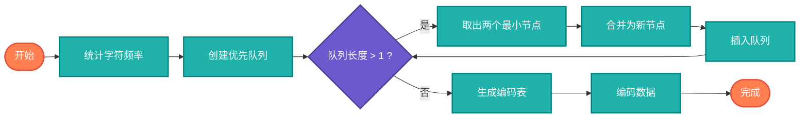

## 【Huffman编码算法详解】Java/Go/Python/JS/C不同语言实现

## 说明

Huffman编码是一种基于字符出现频率的无损压缩算法。通过构建最优二叉树，为高频字符分配短编码，低频字符分配长编码，从而达到压缩效果。

> **生活类比**：就像整理书架，把最常读的书放在最容易拿到的位置，不常读的书放在高处。Huffman编码就是为数据"智能整理存储位置"。

## 实现过程

1. 统计字符频率
2. 构建优先队列（最小堆）
3. 构建Huffman树
4. 生成编码表
5. 编码/解码数据

## 算法流程



## 时间复杂度分析

- **构建频率表**: O(n)
- **构建Huffman树**: O(n log n)
- **生成编码表**: O(n)
- **编码数据**: O(n)
- **总体复杂度**: O(n log n)

# 代码

## Java

```java
import java.util.*;

public class HuffmanCoding {
    
    static class HuffmanNode implements Comparable<HuffmanNode> {
        char character;
        int frequency;
        HuffmanNode left, right;
        
        HuffmanNode(char character, int frequency) {
            this.character = character;
            this.frequency = frequency;
        }
        
        HuffmanNode(int frequency, HuffmanNode left, HuffmanNode right) {
            this.frequency = frequency;
            this.left = left;
            this.right = right;
        }
        
        @Override
        public int compareTo(HuffmanNode other) {
            return this.frequency - other.frequency;
        }
    }
    
    public static Map<Character, String> huffmanEncode(String text) {
        // 统计频率
        Map<Character, Integer> frequencyMap = new HashMap<>();
        for (char c : text.toCharArray()) {
            frequencyMap.put(c, frequencyMap.getOrDefault(c, 0) + 1);
        }
        
        // 构建优先队列
        PriorityQueue<HuffmanNode> pq = new PriorityQueue<>();
        for (Map.Entry<Character, Integer> entry : frequencyMap.entrySet()) {
            pq.offer(new HuffmanNode(entry.getKey(), entry.getValue()));
        }
        
        // 构建Huffman树
        while (pq.size() > 1) {
            HuffmanNode left = pq.poll();
            HuffmanNode right = pq.poll();
            HuffmanNode parent = new HuffmanNode(
                left.frequency + right.frequency, left, right
            );
            pq.offer(parent);
        }
        
        // 生成编码表
        Map<Character, String> encodingMap = new HashMap<>();
        HuffmanNode root = pq.poll();
        generateCodes(root, "", encodingMap);
        
        return encodingMap;
    }
    
    private static void generateCodes(HuffmanNode node, String code, 
                                   Map<Character, String> encodingMap) {
        if (node == null) return;
        
        if (node.left == null && node.right == null) {
            encodingMap.put(node.character, code.isEmpty() ? "0" : code);
            return;
        }
        
        generateCodes(node.left, code + "0", encodingMap);
        generateCodes(node.right, code + "1", encodingMap);
    }
    
    public static String compress(String text, Map<Character, String> encodingMap) {
        StringBuilder compressed = new StringBuilder();
        for (char c : text.toCharArray()) {
            compressed.append(encodingMap.get(c));
        }
        return compressed.toString();
    }
    
    public static String decompress(String compressed, HuffmanNode root) {
        StringBuilder decompressed = new StringBuilder();
        HuffmanNode current = root;
        
        for (char bit : compressed.toCharArray()) {
            current = bit == '0' ? current.left : current.right;
            
            if (current.left == null && current.right == null) {
                decompressed.append(current.character);
                current = root;
            }
        }
        
        return decompressed.toString();
    }
    
    public static void main(String[] args) {
        String text = "hello world";
        System.out.println("原始文本: " + text);
        
        Map<Character, String> encodingMap = huffmanEncode(text);
        System.out.println("编码表: " + encodingMap);
        
        String compressed = compress(text, encodingMap);
        System.out.println("压缩后: " + compressed);
        
        // 重建树进行解压（实际应用中需要保存树结构）
        System.out.println("压缩率: " + (double)compressed.length() / (text.length() * 8));
    }
}
```

## Python

```python
import heapq
from collections import defaultdict

class HuffmanNode:
    def __init__(self, char=None, freq=0, left=None, right=None):
        self.char = char
        self.freq = freq
        self.left = left
        self.right = right
    
    def __lt__(self, other):
        return self.freq < other.freq

def huffman_encode(text):
    """生成Huffman编码表"""
    # 统计频率
    frequency = defaultdict(int)
    for char in text:
        frequency[char] += 1
    
    # 构建优先队列
    heap = []
    for char, freq in frequency.items():
        heapq.heappush(heap, HuffmanNode(char, freq))
    
    # 构建Huffman树
    while len(heap) > 1:
        left = heapq.heappop(heap)
        right = heapq.heappop(heap)
        parent = HuffmanNode(freq=left.freq + right.freq, left=left, right=right)
        heapq.heappush(heap, parent)
    
    # 生成编码表
    encoding_map = {}
    root = heapq.heappop(heap) if heap else None
    _generate_codes(root, "", encoding_map)
    
    return encoding_map

def _generate_codes(node, code, encoding_map):
    if node is None:
        return
    
    if node.left is None and node.right is None:
        encoding_map[node.char] = code if code else "0"
        return
    
    _generate_codes(node.left, code + "0", encoding_map)
    _generate_codes(node.right, code + "1", encoding_map)

def compress(text, encoding_map):
    """使用Huffman编码压缩文本"""
    compressed = ""
    for char in text:
        compressed += encoding_map[char]
    return compressed

def decompress(compressed, root):
    """使用Huffman树解压文本"""
    decompressed = ""
    current = root
    
    for bit in compressed:
        current = current.left if bit == '0' else current.right
        
        if current.left is None and current.right is None:
            decompressed += current.char
            current = root
    
    return decompressed

def main():
    text = "hello world"
    print(f"原始文本: {text}")
    
    encoding_map = huffman_encode(text)
    print(f"编码表: {encoding_map}")
    
    compressed = compress(text, encoding_map)
    print(f"压缩后: {compressed}")
    
    print(f"压缩率: {len(compressed) / (len(text) * 8):.2f}")

if __name__ == "__main__":
    main()
```

## Go

```go
package main

import (
	"container/heap"
	"fmt"
	"strings"
)

type HuffmanNode struct {
	char     rune
	freq     int
	left     *HuffmanNode
	right    *HuffmanNode
}

type HuffmanHeap []*HuffmanNode

func (h HuffmanHeap) Len() int           { return len(h) }
func (h HuffmanHeap) Less(i, j int) bool { return h[i].freq < h[j].freq }
func (h HuffmanHeap) Swap(i, j int)      { h[i], h[j] = h[j], h[i] }
func (h *HuffmanHeap) Push(x interface{}) { *h = append(*h, x.(*HuffmanNode)) }
func (h *HuffmanHeap) Pop() interface{} {
	old := *h
	n := len(old)
	item := old[n-1]
	*h = old[0 : n-1]
	return item
}

func HuffmanEncode(text string) map[rune]string {
	// 统计频率
	freqMap := make(map[rune]int)
	for _, char := range text {
		freqMap[char]++
	}
	
	// 构建优先队列
	h := &HuffmanHeap{}
	heap.Init(h)
	for char, freq := range freqMap {
		heap.Push(h, &HuffmanNode{char: char, freq: freq})
	}
	
	// 构建Huffman树
	for h.Len() > 1 {
		left := heap.Pop(h).(*HuffmanNode)
		right := heap.Pop(h).(*HuffmanNode)
		parent := &HuffmanNode{
			freq:  left.freq + right.freq,
			left:  left,
			right: right,
		}
		heap.Push(h, parent)
	}
	
	// 生成编码表
	encodingMap := make(map[rune]string)
	var root *HuffmanNode
	if h.Len() > 0 {
		root = heap.Pop(h).(*HuffmanNode)
	}
	generateCodes(root, "", encodingMap)
	
	return encodingMap
}

func generateCodes(node *HuffmanNode, code string, encodingMap map[rune]string) {
	if node == nil {
		return
	}
	
	if node.left == nil && node.right == nil {
		if code == "" {
			encodingMap[node.char] = "0"
		} else {
			encodingMap[node.char] = code
		}
		return
	}
	
	generateCodes(node.left, code+"0", encodingMap)
	generateCodes(node.right, code+"1", encodingMap)
}

func HuffmanCompress(text string, encodingMap map[rune]string) string {
	var compressed strings.Builder
	for _, char := range text {
		compressed.WriteString(encodingMap[char])
	}
	return compressed.String()
}

func main() {
	text := "hello world"
	fmt.Printf("原始文本: %s\n", text)
	
	encodingMap := HuffmanEncode(text)
	fmt.Printf("编码表: %v\n", encodingMap)
	
	compressed := HuffmanCompress(text, encodingMap)
	fmt.Printf("压缩后: %s\n", compressed)
	
	fmt.Printf("压缩率: %.2f\n", float64(len(compressed))/float64(len(text)*8))
}
```

## JavaScript

```javascript
class HuffmanNode {
    constructor(char, freq, left = null, right = null) {
        this.char = char;
        this.freq = freq;
        this.left = left;
        this.right = right;
    }
}

class HuffmanCoding {
    static huffmanEncode(text) {
        // 统计频率
        const frequency = {};
        for (const char of text) {
            frequency[char] = (frequency[char] || 0) + 1;
        }
        
        // 构建优先队列
        const queue = [];
        for (const [char, freq] of Object.entries(frequency)) {
            queue.push(new HuffmanNode(char, freq));
        }
        queue.sort((a, b) => a.freq - b.freq);
        
        // 构建Huffman树
        while (queue.length > 1) {
            const left = queue.shift();
            const right = queue.shift();
            const parent = new HuffmanNode(null, left.freq + right.freq, left, right);
            
            // 保持队列有序
            let inserted = false;
            for (let i = 0; i < queue.length; i++) {
                if (queue[i].freq >= parent.freq) {
                    queue.splice(i, 0, parent);
                    inserted = true;
                    break;
                }
            }
            if (!inserted) {
                queue.push(parent);
            }
        }
        
        // 生成编码表
        const encodingMap = {};
        const root = queue[0];
        this.generateCodes(root, "", encodingMap);
        
        return encodingMap;
    }
    
    static generateCodes(node, code, encodingMap) {
        if (!node) return;
        
        if (!node.left && !node.right) {
            encodingMap[node.char] = code || "0";
            return;
        }
        
        this.generateCodes(node.left, code + "0", encodingMap);
        this.generateCodes(node.right, code + "1", encodingMap);
    }
    
    static compress(text, encodingMap) {
        let compressed = "";
        for (const char of text) {
            compressed += encodingMap[char];
        }
        return compressed;
    }
    
    static decompress(compressed, root) {
        let decompressed = "";
        let current = root;
        
        for (const bit of compressed) {
            current = bit === '0' ? current.left : current.right;
            
            if (!current.left && !current.right) {
                decompressed += current.char;
                current = root;
            }
        }
        
        return decompressed;
    }
}

// 示例使用
const text = "hello world";
console.log("原始文本:", text);

const encodingMap = HuffmanCoding.huffmanEncode(text);
console.log("编码表:", encodingMap);

const compressed = HuffmanCoding.compress(text, encodingMap);
console.log("压缩后:", compressed);

console.log("压缩率:", compressed.length / (text.length * 8));
```

## C

```c
#include <stdio.h>
#include <stdlib.h>
#include <string.h>
#include <limits.h>

typedef struct HuffmanNode {
    char character;
    int frequency;
    struct HuffmanNode *left, *right;
} HuffmanNode;

typedef struct {
    int size;
    int capacity;
    HuffmanNode** array;
} MinHeap;

HuffmanNode* createNode(char character, int frequency) {
    HuffmanNode* node = (HuffmanNode*)malloc(sizeof(HuffmanNode));
    node->character = character;
    node->frequency = frequency;
    node->left = node->right = NULL;
    return node;
}

MinHeap* createMinHeap(int capacity) {
    MinHeap* heap = (MinHeap*)malloc(sizeof(MinHeap));
    heap->size = 0;
    heap->capacity = capacity;
    heap->array = (HuffmanNode**)malloc(capacity * sizeof(HuffmanNode*));
    return heap;
}

void swapNodes(HuffmanNode** a, HuffmanNode** b) {
    HuffmanNode* temp = *a;
    *a = *b;
    *b = temp;
}

void minHeapify(MinHeap* heap, int idx) {
    int smallest = idx;
    int left = 2 * idx + 1;
    int right = 2 * idx + 2;

    if (left < heap->size && 
        heap->array[left]->frequency < heap->array[smallest]->frequency)
        smallest = left;

    if (right < heap->size && 
        heap->array[right]->frequency < heap->array[smallest]->frequency)
        smallest = right;

    if (smallest != idx) {
        swapNodes(&heap->array[smallest], &heap->array[idx]);
        minHeapify(heap, smallest);
    }
}

HuffmanNode* extractMin(MinHeap* heap) {
    HuffmanNode* temp = heap->array[0];
    heap->array[0] = heap->array[heap->size - 1];
    --heap->size;
    minHeapify(heap, 0);
    return temp;
}

void insertMinHeap(MinHeap* heap, HuffmanNode* node) {
    ++heap->size;
    int i = heap->size - 1;
    
    while (i && node->frequency < heap->array[(i - 1) / 2]->frequency) {
        heap->array[i] = heap->array[(i - 1) / 2];
        i = (i - 1) / 2;
    }
    
    heap->array[i] = node;
}

void buildMinHeap(MinHeap* heap) {
    int n = heap->size - 1;
    for (int i = (n - 1) / 2; i >= 0; --i)
        minHeapify(heap, i);
}

void printCodes(HuffmanNode* root, char* arr, int top) {
    if (root->left) {
        arr[top] = '0';
        printCodes(root->left, arr, top + 1);
    }
    
    if (root->right) {
        arr[top] = '1';
        printCodes(root->right, arr, top + 1);
    }
    
    if (!root->left && !root->right) {
        printf("%c: ", root->character);
        for (int i = 0; i < top; ++i)
            printf("%c", arr[i]);
        printf("\n");
    }
}

void HuffmanCodes(char* data, int* freq, int size) {
    MinHeap* heap = createMinHeap(size);
    
    for (int i = 0; i < size; ++i)
        heap->array[i] = createNode(data[i], freq[i]);
    
    heap->size = size;
    buildMinHeap(heap);
    
    while (heap->size > 1) {
        HuffmanNode* left = extractMin(heap);
        HuffmanNode* right = extractMin(heap);
        
        HuffmanNode* parent = createNode('$', left->frequency + right->frequency);
        parent->left = left;
        parent->right = right;
        
        insertMinHeap(heap, parent);
    }
    
    char arr[100];
    printCodes(heap->array[0], arr, 0);
}

int main() {
    char* data = "hello world";
    int freq[256] = {0};
    
    // 统计频率
    for (int i = 0; data[i] != '\0'; ++i)
        freq[(unsigned char)data[i]]++;
    
    // 获取唯一字符
    char uniqueChars[256];
    int uniqueFreq[256];
    int uniqueCount = 0;
    
    for (int i = 0; i < 256; ++i) {
        if (freq[i] > 0) {
            uniqueChars[uniqueCount] = (char)i;
            uniqueFreq[uniqueCount] = freq[i];
            uniqueCount++;
        }
    }
    
    printf("Huffman编码:\n");
    HuffmanCodes(uniqueChars, uniqueFreq, uniqueCount);
    
    return 0;
}
```

# 链接

Huffman编码源码：[https://github.com/microwind/algorithms/tree/main/compression/huffman](https://github.com/microwind/algorithms/tree/main/compression/huffman)

压缩算法源码：[https://github.com/microwind/algorithms/tree/main/compression](https://github.com/microwind/algorithms/tree/main/compression)

其他算法源码：[https://github.com/microwind/algorithms](https://github.com/microwind/algorithms)
