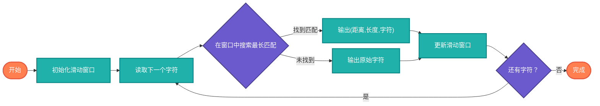

## 【LZ77压缩算法详解】Java/Go/Python/JS/C/Rust不同语言实现

## 说明

LZ77是一种基于字典的压缩算法，通过查找重复的数据序列并用距离和长度来替换，达到压缩效果。它是ZIP、PNG等格式的基础。

> **生活类比**：就像写作时用"同上"或"同前文"来避免重复写相同内容，LZ77就是数据的"智能引用系统"。

## 算法流程



## 时间复杂度分析

- **压缩过程**: O(n × m) m为窗口大小
- **解压过程**: O(n)
- **空间复杂度**: O(m)

# 代码

## Java

```java
import java.util.*;

public class LZ77 {
    
    static class Token {
        int offset, length;
        char character;
        
        Token(int offset, int length, char character) {
            this.offset = offset;
            this.length = length;
            this.character = character;
        }
        
        @Override
        public String toString() {
            if (length > 0) {
                return String.format("(%d,%d)", offset, length);
            } else {
                return String.format("(%c)", character);
            }
        }
    }
    
    public static List<Token> compress(String input) {
        List<Token> tokens = new ArrayList<>();
        int windowSize = 256;
        int position = 0;
        
        while (position < input.length()) {
            int maxLength = Math.min(windowSize, position);
            String window = input.substring(Math.max(0, position - maxLength), position);
            
            int bestLength = 0;
            int bestOffset = 0;
            
            // 在窗口中搜索最长匹配
            for (int i = 0; i < window.length(); i++) {
                int matchLength = 0;
                while (position + matchLength < input.length() &&
                       i + matchLength < window.length() &&
                       input.charAt(position + matchLength) == window.charAt(i + matchLength)) {
                    matchLength++;
                }
                
                if (matchLength > bestLength) {
                    bestLength = matchLength;
                    bestOffset = window.length() - i;
                }
            }
            
            if (bestLength >= 3) { // 最小匹配长度
                char nextChar = position + bestLength < input.length() ? 
                               input.charAt(position + bestLength) : '\0';
                tokens.add(new Token(bestOffset, bestLength, nextChar));
                position += bestLength + 1;
            } else {
                tokens.add(new Token(0, 0, input.charAt(position)));
                position++;
            }
        }
        
        return tokens;
    }
    
    public static String decompress(List<Token> tokens) {
        StringBuilder output = new StringBuilder();
        
        for (Token token : tokens) {
            if (token.length > 0) {
                int start = output.length() - token.offset;
                for (int i = 0; i < token.length; i++) {
                    output.append(output.charAt(start + i));
                }
                if (token.character != '\0') {
                    output.append(token.character);
                }
            } else {
                output.append(token.character);
            }
        }
        
        return output.toString();
    }
    
    public static void main(String[] args) {
        String input = "ABABABABABAABABABABA";
        System.out.println("原始文本: " + input);
        
        List<Token> compressed = compress(input);
        System.out.println("压缩后: " + compressed);
        
        String decompressed = decompress(compressed);
        System.out.println("解压后: " + decompressed);
        
        System.out.println("验证: " + input.equals(decompressed));
    }
}
```

## Python

```python
class Token:
    def __init__(self, offset=0, length=0, character=None):
        self.offset = offset
        self.length = length
        self.character = character
    
    def __str__(self):
        if self.length > 0:
            return f"({self.offset},{self.length})"
        else:
            return f"({self.character})"

def compress(input_str):
    """LZ77压缩"""
    tokens = []
    window_size = 256
    position = 0
    
    while position < len(input_str):
        max_length = min(window_size, position)
        window = input_str[max(0, position - max_length):position]
        
        best_length = 0
        best_offset = 0
        
        # 在窗口中搜索最长匹配
        for i in range(len(window)):
            match_length = 0
            while (position + match_length < len(input_str) and
                   i + match_length < len(window) and
                   input_str[position + match_length] == window[i + match_length]):
                match_length += 1
            
            if match_length > best_length:
                best_length = match_length
                best_offset = len(window) - i
        
        if best_length >= 3:  # 最小匹配长度
            next_char = input_str[position + best_length] if position + best_length < len(input_str) else None
            tokens.append(Token(best_offset, best_length, next_char))
            position += best_length + 1
        else:
            tokens.append(Token(0, 0, input_str[position]))
            position += 1
    
    return tokens

def decompress(tokens):
    """LZ77解压"""
    output = []
    
    for token in tokens:
        if token.length > 0:
            start = len(output) - token.offset
            for i in range(token.length):
                output.append(output[start + i])
            if token.character is not None:
                output.append(token.character)
        else:
            output.append(token.character)
    
    return ''.join(output)

def main():
    input_str = "ABABABABABAABABABABA"
    print(f"原始文本: {input_str}")
    
    compressed = compress(input_str)
    print(f"压缩后: {compressed}")
    
    decompressed = decompress(compressed)
    print(f"解压后: {decompressed}")
    
    print(f"验证: {input_str == decompressed}")

if __name__ == "__main__":
    main()
```

## Go

```go
package main

import (
	"fmt"
	"strings"
)

type Token struct {
	Offset    int
	Length    int
	Character rune
}

func (t Token) String() string {
	if t.Length > 0 {
		return fmt.Sprintf("(%d,%d)", t.Offset, t.Length)
	}
	return fmt.Sprintf("(%c)", t.Character)
}

func compress(input string) []Token {
	var tokens []Token
	windowSize := 256
	position := 0
	
	for position < len(input) {
		maxLength := windowSize
		if position < windowSize {
			maxLength = position
		}
		
		window := input[position-maxLength : position]
		
		bestLength := 0
		bestOffset := 0
		
		// 在窗口中搜索最长匹配
		for i := 0; i < len(window); i++ {
			matchLength := 0
			for position+matchLength < len(input) &&
				i+matchLength < len(window) &&
				input[position+matchLength] == window[i+matchLength] {
				matchLength++
			}
			
			if matchLength > bestLength {
				bestLength = matchLength
				bestOffset = len(window) - i
			}
		}
		
		if bestLength >= 3 { // 最小匹配长度
			var nextChar rune
			if position+bestLength < len(input) {
				nextChar = rune(input[position+bestLength])
			}
			tokens = append(tokens, Token{bestOffset, bestLength, nextChar})
			position += bestLength + 1
		} else {
			tokens = append(tokens, Token{0, 0, rune(input[position])})
			position++
		}
	}
	
	return tokens
}

func decompress(tokens []Token) string {
	var output strings.Builder
	
	for _, token := range tokens {
		if token.Length > 0 {
			start := output.Len() - token.Offset
			for i := 0; i < token.Length; i++ {
				output.WriteByte(output.String()[start+i])
			}
			if token.Character != 0 {
				output.WriteRune(token.Character)
			}
		} else {
			output.WriteRune(token.Character)
		}
	}
	
	return output.String()
}

func main() {
	input := "ABABABABABAABABABABA"
	fmt.Printf("原始文本: %s\n", input)
	
	compressed := compress(input)
	fmt.Printf("压缩后: %v\n", compressed)
	
	decompressed := decompress(compressed)
	fmt.Printf("解压后: %s\n", decompressed)
	
	fmt.Printf("验证: %t\n", input == decompressed)
}
```

## JavaScript

```javascript
class Token {
    constructor(offset = 0, length = 0, character = null) {
        this.offset = offset;
        this.length = length;
        this.character = character;
    }
    
    toString() {
        if (this.length > 0) {
            return `(${this.offset},${this.length})`;
        } else {
            return `(${this.character})`;
        }
    }
}

function compress(input) {
    const tokens = [];
    const windowSize = 256;
    let position = 0;
    
    while (position < input.length) {
        const maxLength = Math.min(windowSize, position);
        const window = input.substring(position - maxLength, position);
        
        let bestLength = 0;
        let bestOffset = 0;
        
        // 在窗口中搜索最长匹配
        for (let i = 0; i < window.length; i++) {
            let matchLength = 0;
            while (position + matchLength < input.length &&
                   i + matchLength < window.length &&
                   input[position + matchLength] === window[i + matchLength]) {
                matchLength++;
            }
            
            if (matchLength > bestLength) {
                bestLength = matchLength;
                bestOffset = window.length - i;
            }
        }
        
        if (bestLength >= 3) { // 最小匹配长度
            const nextChar = position + bestLength < input.length ? 
                              input[position + bestLength] : null;
            tokens.push(new Token(bestOffset, bestLength, nextChar));
            position += bestLength + 1;
        } else {
            tokens.push(new Token(0, 0, input[position]));
            position++;
        }
    }
    
    return tokens;
}

function decompress(tokens) {
    let output = '';
    
    for (const token of tokens) {
        if (token.length > 0) {
            const start = output.length - token.offset;
            for (let i = 0; i < token.length; i++) {
                output += output[start + i];
            }
            if (token.character !== null) {
                output += token.character;
            }
        } else {
            output += token.character;
        }
    }
    
    return output;
}

// 示例使用
const input = "ABABABABABAABABABABA";
console.log("原始文本:", input);

const compressed = compress(input);
console.log("压缩后:", compressed);

const decompressed = decompress(compressed);
console.log("解压后:", decompressed);

console.log("验证:", input === decompressed);
```

## C

```c
#include <stdio.h>
#include <stdlib.h>
#include <string.h>

typedef struct {
    int offset, length;
    char character;
} Token;

char* tokenToString(Token* token) {
    char* result = malloc(50);
    if (token->length > 0) {
        sprintf(result, "(%d,%d)", token->offset, token->length);
    } else {
        sprintf(result, "(%c)", token->character);
    }
    return result;
}

Token* compress(const char* input, int* tokenCount) {
    int windowSize = 256;
    int position = 0;
    int inputLength = strlen(input);
    
    Token* tokens = malloc(inputLength * sizeof(Token));
    *tokenCount = 0;
    
    while (position < inputLength) {
        int maxLength = windowSize < position ? windowSize : position;
        int windowStart = position - maxLength;
        if (windowStart < 0) windowStart = 0;
        
        int bestLength = 0;
        int bestOffset = 0;
        
        // 在窗口中搜索最长匹配
        for (int i = 0; i < maxLength; i++) {
            int matchLength = 0;
            while (position + matchLength < inputLength &&
                   i + matchLength < maxLength &&
                   input[position + matchLength] == input[windowStart + i + matchLength]) {
                matchLength++;
            }
            
            if (matchLength > bestLength) {
                bestLength = matchLength;
                bestOffset = maxLength - i;
            }
        }
        
        if (bestLength >= 3) { // 最小匹配长度
            char nextChar = (position + bestLength < inputLength) ? 
                           input[position + bestLength] : '\0';
            tokens[*tokenCount] = (Token){bestOffset, bestLength, nextChar};
            position += bestLength + 1;
        } else {
            tokens[*tokenCount] = (Token){0, 0, input[position]};
            position++;
        }
        (*tokenCount)++;
    }
    
    return tokens;
}

char* decompress(Token* tokens, int tokenCount) {
    char* output = malloc(1000); // 假设最大输出长度
    int outputLength = 0;
    
    for (int i = 0; i < tokenCount; i++) {
        Token token = tokens[i];
        if (token.length > 0) {
            int start = outputLength - token.offset;
            for (int j = 0; j < token.length; j++) {
                output[outputLength++] = output[start + j];
            }
            if (token.character != '\0') {
                output[outputLength++] = token.character;
            }
        } else {
            output[outputLength++] = token.character;
        }
    }
    
    output[outputLength] = '\0';
    return output;
}

int main() {
    const char* input = "ABABABABABAABABABABA";
    printf("原始文本: %s\n", input);
    
    int tokenCount;
    Token* compressed = compress(input, &tokenCount);
    
    printf("压缩后: ");
    for (int i = 0; i < tokenCount; i++) {
        char* tokenStr = tokenToString(&compressed[i]);
        printf("%s", tokenStr);
        free(tokenStr);
    }
    printf("\n");
    
    char* decompressed = decompress(compressed, tokenCount);
    printf("解压后: %s\n", decompressed);
    
    printf("验证: %d\n", strcmp(input, decompressed) == 0);
    
    free(compressed);
    free(decompressed);
    
    return 0;
}
```

## Rust

```rust
#[derive(Debug)]
struct Token {
    offset: usize,
    length: usize,
    character: Option<char>,
}

impl Token {
    fn new(offset: usize, length: usize, character: Option<char>) -> Self {
        Token { offset, length, character }
    }
    
    fn literal(c: char) -> Self {
        Token { offset: 0, length: 0, character: Some(c) }
    }
    
    fn is_literal(&self) -> bool {
        self.length == 0
    }
}

fn compress(input: &str) -> Vec<Token> {
    let mut tokens = Vec::new();
    let window_size = 256;
    let mut position = 0;
    
    while position < input.len() {
        let max_length = window_size.min(position);
        let window_start = position - max_length;
        let window = &input[window_start..position];
        
        let mut best_length = 0;
        let mut best_offset = 0;
        
        // 在窗口中搜索最长匹配
        for (i, _) in window.char_indices() {
            let mut match_length = 0;
            while position + match_length < input.len() &&
                  i + match_length < window.len() &&
                  input.chars().nth(position + match_length) == window.chars().nth(i + match_length) {
                match_length += 1;
            }
            
            if match_length > best_length {
                best_length = match_length;
                best_offset = window.len() - i;
            }
        }
        
        if best_length >= 3 { // 最小匹配长度
            let next_char = if position + best_length < input.len() {
                input.chars().nth(position + best_length)
            } else {
                None
            };
            
            tokens.push(Token::new(best_offset, best_length, next_char));
            position += best_length + 1;
        } else {
            tokens.push(Token::literal(input.chars().nth(position).unwrap()));
            position += 1;
        }
    }
    
    tokens
}

fn decompress(tokens: &[Token]) -> String {
    let mut output = String::new();
    
    for token in tokens {
        if token.is_literal() {
            output.push(token.character.unwrap());
        } else {
            let start = output.len() - token.offset;
            for i in 0..token.length {
                output.push(output.chars().nth(start + i).unwrap());
            }
            if let Some(c) = token.character {
                output.push(c);
            }
        }
    }
    
    output
}

fn main() {
    let input = "ABABABABABAABABABABA";
    println!("原始文本: {}", input);
    
    let compressed = compress(input);
    println!("压缩后: {:?}", compressed);
    
    let decompressed = decompress(&compressed);
    println!("解压后: {}", decompressed);
    
    println!("验证: {}", input == decompressed);
}
```

# 链接

LZ77压缩算法源码：[https://github.com/microwind/algorithms/tree/main/compression/lz77](https://github.com/microwind/algorithms/tree/main/compression/lz77)

压缩算法源码：[https://github.com/microwind/algorithms/tree/main/compression](https://github.com/microwind/algorithms/tree/main/compression)

其他算法源码：[https://github.com/microwind/algorithms](https://github.com/microwind/algorithms)
