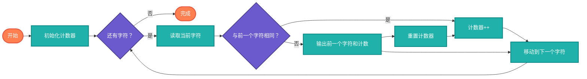

## 【行程编码算法详解】Java/Go/Python/JS/C不同语言实现

## 说明

行程编码（Run-Length Encoding, RLE）是一种简单的无损压缩算法，通过将连续重复的字符序列替换为字符和重复次数来达到压缩效果。特别适合处理有大量连续重复数据的场景。

> **生活类比**：就像记录"连续晴天"天气，与其写"晴、晴、晴、晴、晴"，不如写"晴×5天"。RLE就是数据的"智能记录方式"。

## 实现过程

1. 遍历输入数据
2. 统计连续相同字符的数量
3. 输出字符和计数
4. 重复直到处理完所有数据

## 算法流程



## 时间复杂度分析

- **压缩过程**: O(n)
- **解压过程**: O(n)
- **空间复杂度**: O(n) 最坏情况下

## 适用场景

- 图像压缩（位图）
- 简单文本压缩
- 游戏地图数据
- 传真传输

# 代码

## Java

```java
public class RunLengthEncoding {
    
    public static String compress(String text) {
        if (text == null || text.isEmpty()) {
            return text;
        }
        
        StringBuilder compressed = new StringBuilder();
        char currentChar = text.charAt(0);
        int count = 1;
        
        for (int i = 1; i < text.length(); i++) {
            if (text.charAt(i) == currentChar) {
                count++;
            } else {
                compressed.append(currentChar);
                if (count > 1) {
                    compressed.append(count);
                }
                currentChar = text.charAt(i);
                count = 1;
            }
        }
        
        // 处理最后一个字符
        compressed.append(currentChar);
        if (count > 1) {
            compressed.append(count);
        }
        
        return compressed.toString();
    }
    
    public static String decompress(String compressed) {
        if (compressed == null || compressed.isEmpty()) {
            return compressed;
        }
        
        StringBuilder decompressed = new StringBuilder();
        int i = 0;
        
        while (i < compressed.length()) {
            char currentChar = compressed.charAt(i++);
            StringBuilder countStr = new StringBuilder();
            
            // 解析数字
            while (i < compressed.length() && Character.isDigit(compressed.charAt(i))) {
                countStr.append(compressed.charAt(i++));
            }
            
            int count = countStr.length() > 0 ? Integer.parseInt(countStr.toString()) : 1;
            
            // 添加字符
            for (int j = 0; j < count; j++) {
                decompressed.append(currentChar);
            }
        }
        
        return decompressed.toString();
    }
    
    public static double compressionRatio(String original, String compressed) {
        return (double) compressed.length() / original.length();
    }
    
    public static void main(String[] args) {
        String text = "AAAABBBCCDAA";
        System.out.println("原始文本: " + text);
        
        String compressed = compress(text);
        System.out.println("压缩后: " + compressed);
        
        String decompressed = decompress(compressed);
        System.out.println("解压后: " + decompressed);
        
        System.out.println("压缩比: " + compressionRatio(text, compressed));
        System.out.println("验证: " + text.equals(decompressed));
    }
}
```

## Python

```python
def compress(text):
    """行程编码压缩"""
    if not text:
        return text
    
    compressed = []
    current_char = text[0]
    count = 1
    
    for char in text[1:]:
        if char == current_char:
            count += 1
        else:
            compressed.append(current_char)
            if count > 1:
                compressed.append(str(count))
            current_char = char
            count = 1
    
    # 处理最后一个字符
    compressed.append(current_char)
    if count > 1:
        compressed.append(str(count))
    
    return ''.join(compressed)

def decompress(compressed):
    """行程编码解压"""
    if not compressed:
        return compressed
    
    decompressed = []
    i = 0
    
    while i < len(compressed):
        current_char = compressed[i]
        i += 1
        count_str = ""
        
        # 解析数字
        while i < len(compressed) and compressed[i].isdigit():
            count_str += compressed[i]
            i += 1
        
        count = int(count_str) if count_str else 1
        
        # 添加字符
        decompressed.append(current_char * count)
    
    return ''.join(decompressed)

def compression_ratio(original, compressed):
    """计算压缩比"""
    return len(compressed) / len(original)

def main():
    text = "AAAABBBCCDAA"
    print(f"原始文本: {text}")
    
    compressed = compress(text)
    print(f"压缩后: {compressed}")
    
    decompressed = decompress(compressed)
    print(f"解压后: {decompressed}")
    
    print(f"压缩比: {compression_ratio(text, compressed):.2f}")
    print(f"验证: {text == decompressed}")

if __name__ == "__main__":
    main()
```

## Go

```go
package main

import (
	"fmt"
	"strconv"
	"strings"
)

func compress(text string) string {
	if len(text) == 0 {
		return text
	}
	
	var compressed strings.Builder
	currentChar := text[0]
	count := 1
	
	for i := 1; i < len(text); i++ {
		if text[i] == currentChar {
			count++
		} else {
			compressed.WriteByte(currentChar)
			if count > 1 {
				compressed.WriteString(strconv.Itoa(count))
			}
			currentChar = text[i]
			count = 1
		}
	}
	
	// 处理最后一个字符
	compressed.WriteByte(currentChar)
	if count > 1 {
		compressed.WriteString(strconv.Itoa(count))
	}
	
	return compressed.String()
}

func decompress(compressed string) string {
	if len(compressed) == 0 {
		return compressed
	}
	
	var decompressed strings.Builder
	i := 0
	
	for i < len(compressed) {
		currentChar := compressed[i]
		i++
		countStr := ""
		
		// 解析数字
		for i < len(compressed) && compressed[i] >= '0' && compressed[i] <= '9' {
			countStr += string(compressed[i])
			i++
		}
		
		count := 1
		if countStr != "" {
			count, _ = strconv.Atoi(countStr)
		}
		
		// 添加字符
		for j := 0; j < count; j++ {
			decompressed.WriteByte(currentChar)
		}
	}
	
	return decompressed.String()
}

func compressionRatio(original, compressed string) float64 {
	return float64(len(compressed)) / float64(len(original))
}

func main() {
	text := "AAAABBBCCDAA"
	fmt.Printf("原始文本: %s\n", text)
	
	compressed := compress(text)
	fmt.Printf("压缩后: %s\n", compressed)
	
	decompressed := decompress(compressed)
	fmt.Printf("解压后: %s\n", decompressed)
	
	fmt.Printf("压缩比: %.2f\n", compressionRatio(text, compressed))
	fmt.Printf("验证: %t\n", text == decompressed)
}
```

## JavaScript

```javascript
class RunLengthEncoding {
    static compress(text) {
        if (!text) return text;
        
        let compressed = "";
        let currentChar = text[0];
        let count = 1;
        
        for (let i = 1; i < text.length; i++) {
            if (text[i] === currentChar) {
                count++;
            } else {
                compressed += currentChar;
                if (count > 1) {
                    compressed += count;
                }
                currentChar = text[i];
                count = 1;
            }
        }
        
        // 处理最后一个字符
        compressed += currentChar;
        if (count > 1) {
            compressed += count;
        }
        
        return compressed;
    }
    
    static decompress(compressed) {
        if (!compressed) return compressed;
        
        let decompressed = "";
        let i = 0;
        
        while (i < compressed.length) {
            const currentChar = compressed[i++];
            let countStr = "";
            
            // 解析数字
            while (i < compressed.length && /\d/.test(compressed[i])) {
                countStr += compressed[i++];
            }
            
            const count = countStr ? parseInt(countStr) : 1;
            
            // 添加字符
            decompressed += currentChar.repeat(count);
        }
        
        return decompressed;
    }
    
    static compressionRatio(original, compressed) {
        return compressed.length / original.length;
    }
}

// 示例使用
const text = "AAAABBBCCDAA";
console.log("原始文本:", text);

const compressed = RunLengthEncoding.compress(text);
console.log("压缩后:", compressed);

const decompressed = RunLengthEncoding.decompress(compressed);
console.log("解压后:", decompressed);

console.log("压缩比:", RunLengthEncoding.compressionRatio(text, compressed));
console.log("验证:", text === decompressed);
```

## C

```c
#include <stdio.h>
#include <stdlib.h>
#include <string.h>
#include <ctype.h>

char* compress(const char* text) {
    if (!text || *text == '\0') {
        return strdup(text);
    }
    
    int compressed_size = strlen(text) * 2 + 1; // 最坏情况
    char* compressed = (char*)malloc(compressed_size);
    int compressed_index = 0;
    
    char current_char = text[0];
    int count = 1;
    
    for (int i = 1; text[i] != '\0'; i++) {
        if (text[i] == current_char) {
            count++;
        } else {
            compressed[compressed_index++] = current_char;
            if (count > 1) {
                compressed_index += sprintf(compressed + compressed_index, "%d", count);
            }
            current_char = text[i];
            count = 1;
        }
    }
    
    // 处理最后一个字符
    compressed[compressed_index++] = current_char;
    if (count > 1) {
        compressed_index += sprintf(compressed + compressed_index, "%d", count);
    }
    
    compressed[compressed_index] = '\0';
    return compressed;
}

char* decompress(const char* compressed) {
    if (!compressed || *compressed == '\0') {
        return strdup(compressed);
    }
    
    int decompressed_size = strlen(compressed) * 10; // 估算大小
    char* decompressed = (char*)malloc(decompressed_size);
    int decompressed_index = 0;
    
    int i = 0;
    while (compressed[i] != '\0') {
        char current_char = compressed[i++];
        char count_str[20] = "";
        int count_index = 0;
        
        // 解析数字
        while (compressed[i] != '\0' && isdigit(compressed[i])) {
            count_str[count_index++] = compressed[i++];
        }
        count_str[count_index] = '\0';
        
        int count = count_str[0] != '\0' ? atoi(count_str) : 1;
        
        // 添加字符
        for (int j = 0; j < count; j++) {
            decompressed[decompressed_index++] = current_char;
        }
    }
    
    decompressed[decompressed_index] = '\0';
    return decompressed;
}

double compression_ratio(const char* original, const char* compressed) {
    return (double)strlen(compressed) / strlen(original);
}

int main() {
    const char* text = "AAAABBBCCDAA";
    printf("原始文本: %s\n", text);
    
    char* compressed = compress(text);
    printf("压缩后: %s\n", compressed);
    
    char* decompressed = decompress(compressed);
    printf("解压后: %s\n", decompressed);
    
    printf("压缩比: %.2f\n", compression_ratio(text, compressed));
    printf("验证: %d\n", strcmp(text, decompressed) == 0);
    
    free(compressed);
    free(decompressed);
    
    return 0;
}
```

# 链接

行程编码源码：[https://github.com/microwind/algorithms/tree/main/compression/rle](https://github.com/microwind/algorithms/tree/main/compression/rle)

压缩算法源码：[https://github.com/microwind/algorithms/tree/main/compression](https://github.com/microwind/algorithms/tree/main/compression)

其他算法源码：[https://github.com/microwind/algorithms](https://github.com/microwind/algorithms)
