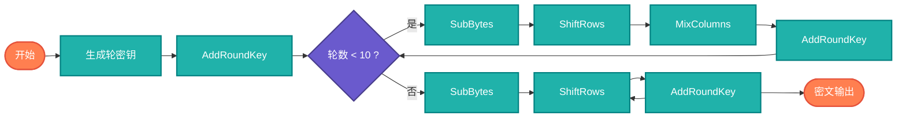

## 【加密算法详解】Java/Go/Python/JS/C不同语言实现

## 说明

加密算法（Cryptography Algorithms）是信息安全的基石，通过数学变换保护数据的机密性、完整性和真实性。在AI时代，数据安全和隐私保护变得尤为重要，理解加密算法原理有助于构建安全可靠的AI系统。

> **生活类比**：就像保险箱锁，只有拥有正确钥匙的人才能打开。加密算法就是数字世界的"保险箱锁"，保护敏感信息不被未授权访问。

## 算法分类

### 1. 对称加密算法
- **AES (Advanced Encryption Standard)** - 现代加密标准
- **DES (Data Encryption Standard)** - 经典加密算法
- **3DES (Triple DES)** - DES的增强版本
- **RC4** - 流密码算法

### 2. 非对称加密算法
- **RSA** - 基于大数分解难题
- **ECC (Elliptic Curve Cryptography)** - 椭圆曲线加密
- **Diffie-Hellman** - 密钥交换协议

### 3. 哈希算法
- **MD5** - 消息摘要算法（已不安全）
- **SHA系列** - 安全哈希算法
- **HMAC** - 基于哈希的消息认证码

### 4. 古典加密算法
- **凯撒密码** - 字符移位加密
- **维吉尼亚密码** - 多表替换加密
- **Playfair密码** - 双字母替换加密

## 算法流程

### AES加密流程图



# 代码

## Java

```java
import javax.crypto.*;
import javax.crypto.spec.*;
import java.security.*;
import java.util.Base64;

public class CryptographyAlgorithms {
    
    // AES加密实现
    public static class AES {
        
        public static String encrypt(String plainText, String key) throws Exception {
            // 创建密钥
            SecretKeySpec secretKey = new SecretKeySpec(key.getBytes(), "AES");
            
            // 创建加密器
            Cipher cipher = Cipher.getInstance("AES/ECB/PKCS5Padding");
            cipher.init(Cipher.ENCRYPT_MODE, secretKey);
            
            // 加密
            byte[] encryptedBytes = cipher.doFinal(plainText.getBytes());
            return Base64.getEncoder().encodeToString(encryptedBytes);
        }
        
        public static String decrypt(String encryptedText, String key) throws Exception {
            // 创建密钥
            SecretKeySpec secretKey = new SecretKeySpec(key.getBytes(), "AES");
            
            // 创建解密器
            Cipher cipher = Cipher.getInstance("AES/ECB/PKCS5Padding");
            cipher.init(Cipher.DECRYPT_MODE, secretKey);
            
            // 解密
            byte[] decryptedBytes = cipher.doFinal(Base64.getDecoder().decode(encryptedText));
            return new String(decryptedBytes);
        }
    }
    
    // RSA加密实现
    public static class RSA {
        
        public static KeyPair generateKeyPair() throws Exception {
            KeyPairGenerator keyGen = KeyPairGenerator.getInstance("RSA");
            keyGen.initialize(2048);
            return keyGen.generateKeyPair();
        }
        
        public static String encrypt(String plainText, PublicKey publicKey) throws Exception {
            Cipher cipher = Cipher.getInstance("RSA/ECB/OAEPWithSHA-256AndMGF1Padding");
            cipher.init(Cipher.ENCRYPT_MODE, publicKey);
            byte[] encryptedBytes = cipher.doFinal(plainText.getBytes());
            return Base64.getEncoder().encodeToString(encryptedBytes);
        }
        
        public static String decrypt(String encryptedText, PrivateKey privateKey) throws Exception {
            Cipher cipher = Cipher.getInstance("RSA/ECB/OAEPWithSHA-256AndMGF1Padding");
            cipher.init(Cipher.DECRYPT_MODE, privateKey);
            byte[] decryptedBytes = cipher.doFinal(Base64.getDecoder().decode(encryptedText));
            return new String(decryptedBytes);
        }
    }
    
    // SHA哈希实现
    public static class SHA {
        
        public static String hash256(String input) throws Exception {
            MessageDigest digest = MessageDigest.getInstance("SHA-256");
            byte[] hashBytes = digest.digest(input.getBytes());
            return bytesToHex(hashBytes);
        }
        
        public static String hash512(String input) throws Exception {
            MessageDigest digest = MessageDigest.getInstance("SHA-512");
            byte[] hashBytes = digest.digest(input.getBytes());
            return bytesToHex(hashBytes);
        }
        
        private static String bytesToHex(byte[] bytes) {
            StringBuilder hexString = new StringBuilder();
            for (byte b : bytes) {
                String hex = Integer.toHexString(0xff & b);
                if (hex.length() == 1) {
                    hexString.append('0');
                }
                hexString.append(hex);
            }
            return hexString.toString();
        }
    }
    
    // HMAC实现
    public static class HMAC {
        
        public static String hmacSHA256(String data, String key) throws Exception {
            SecretKeySpec secretKey = new SecretKeySpec(key.getBytes(), "HmacSHA256");
            Mac mac = Mac.getInstance("HmacSHA256");
            mac.init(secretKey);
            byte[] hmacBytes = mac.doFinal(data.getBytes());
            return bytesToHex(hmacBytes);
        }
        
        private static String bytesToHex(byte[] bytes) {
            StringBuilder hexString = new StringBuilder();
            for (byte b : bytes) {
                String hex = Integer.toHexString(0xff & b);
                if (hex.length() == 1) {
                    hexString.append('0');
                }
                hexString.append(hex);
            }
            return hexString.toString();
        }
    }
    
    // 凯撒密码实现
    public static class CaesarCipher {
        
        public static String encrypt(String plainText, int shift) {
            StringBuilder encrypted = new StringBuilder();
            
            for (char c : plainText.toCharArray()) {
                if (Character.isUpperCase(c)) {
                    char encryptedChar = (char) ((c - 'A' + shift) % 26 + 'A');
                    encrypted.append(encryptedChar);
                } else if (Character.isLowerCase(c)) {
                    char encryptedChar = (char) ((c - 'a' + shift) % 26 + 'a');
                    encrypted.append(encryptedChar);
                } else {
                    encrypted.append(c);
                }
            }
            
            return encrypted.toString();
        }
        
        public static String decrypt(String encryptedText, int shift) {
            return encrypt(encryptedText, 26 - shift);
        }
    }
    
    // 维吉尼亚密码实现
    public static class VigenereCipher {
        
        public static String encrypt(String plainText, String key) {
            StringBuilder encrypted = new StringBuilder();
            key = key.toUpperCase();
            int keyIndex = 0;
            
            for (char c : plainText.toCharArray()) {
                if (Character.isUpperCase(c)) {
                    int shift = key.charAt(keyIndex % key.length()) - 'A';
                    char encryptedChar = (char) ((c - 'A' + shift) % 26 + 'A');
                    encrypted.append(encryptedChar);
                    keyIndex++;
                } else if (Character.isLowerCase(c)) {
                    int shift = key.charAt(keyIndex % key.length()) - 'A';
                    char encryptedChar = (char) ((c - 'a' + shift) % 26 + 'a');
                    encrypted.append(encryptedChar);
                    keyIndex++;
                } else {
                    encrypted.append(c);
                }
            }
            
            return encrypted.toString();
        }
        
        public static String decrypt(String encryptedText, String key) {
            StringBuilder decrypted = new StringBuilder();
            key = key.toUpperCase();
            int keyIndex = 0;
            
            for (char c : encryptedText.toCharArray()) {
                if (Character.isUpperCase(c)) {
                    int shift = key.charAt(keyIndex % key.length()) - 'A';
                    char decryptedChar = (char) ((c - 'A' - shift + 26) % 26 + 'A');
                    decrypted.append(decryptedChar);
                    keyIndex++;
                } else if (Character.isLowerCase(c)) {
                    int shift = key.charAt(keyIndex % key.length()) - 'A';
                    char decryptedChar = (char) ((c - 'a' - shift + 26) % 26 + 'a');
                    decrypted.append(decryptedChar);
                    keyIndex++;
                } else {
                    decrypted.append(c);
                }
            }
            
            return decrypted.toString();
        }
    }
}
```

## Python

```python
import hashlib
import hmac
import base64
from Crypto.Cipher import AES, PKCS1_OAEP
from Crypto.PublicKey import RSA
from Crypto.Util.Padding import pad, unpad

class CryptographyAlgorithms:
    
    class AES:
        
        @staticmethod
        def encrypt(plain_text: str, key: str) -> str:
            """AES加密"""
            key_bytes = key.encode('utf-8')
            plain_bytes = plain_text.encode('utf-8')
            
            # 创建加密器
            cipher = AES.new(key_bytes, AES.MODE_ECB)
            encrypted_bytes = cipher.encrypt(pad(plain_bytes, AES.block_size))
            
            return base64.b64encode(encrypted_bytes).decode('utf-8')
        
        @staticmethod
        def decrypt(encrypted_text: str, key: str) -> str:
            """AES解密"""
            key_bytes = key.encode('utf-8')
            encrypted_bytes = base64.b64decode(encrypted_text)
            
            # 创建解密器
            cipher = AES.new(key_bytes, AES.MODE_ECB)
            decrypted_bytes = unpad(cipher.decrypt(encrypted_bytes), AES.block_size)
            
            return decrypted_bytes.decode('utf-8')
    
    class RSA:
        
        @staticmethod
        def generate_key_pair():
            """生成RSA密钥对"""
            key = RSA.generate(2048)
            private_key = key.export_key()
            public_key = key.publickey().export_key()
            return private_key, public_key
        
        @staticmethod
        def encrypt(plain_text: str, public_key_pem: str) -> str:
            """RSA加密"""
            public_key = RSA.import_key(public_key_pem)
            cipher_rsa = PKCS1_OAEP.new(public_key)
            
            encrypted_bytes = cipher_rsa.encrypt(plain_text.encode('utf-8'))
            return base64.b64encode(encrypted_bytes).decode('utf-8')
        
        @staticmethod
        def decrypt(encrypted_text: str, private_key_pem: str) -> str:
            """RSA解密"""
            private_key = RSA.import_key(private_key_pem)
            cipher_rsa = PKCS1_OAEP.new(private_key)
            
            encrypted_bytes = base64.b64decode(encrypted_text)
            decrypted_bytes = cipher_rsa.decrypt(encrypted_bytes)
            
            return decrypted_bytes.decode('utf-8')
    
    class SHA:
        
        @staticmethod
        def hash256(input_text: str) -> str:
            """SHA-256哈希"""
            return hashlib.sha256(input_text.encode('utf-8')).hexdigest()
        
        @staticmethod
        def hash512(input_text: str) -> str:
            """SHA-512哈希"""
            return hashlib.sha512(input_text.encode('utf-8')).hexdigest()
        
        @staticmethod
        def hash1(input_text: str) -> str:
            """SHA-1哈希"""
            return hashlib.sha1(input_text.encode('utf-8')).hexdigest()
    
    class HMAC:
        
        @staticmethod
        def hmac_sha256(data: str, key: str) -> str:
            """HMAC-SHA256"""
            return hmac.new(
                key.encode('utf-8'),
                data.encode('utf-8'),
                hashlib.sha256
            ).hexdigest()
        
        @staticmethod
        def hmac_sha512(data: str, key: str) -> str:
            """HMAC-SHA512"""
            return hmac.new(
                key.encode('utf-8'),
                data.encode('utf-8'),
                hashlib.sha512
            ).hexdigest()
    
    class CaesarCipher:
        
        @staticmethod
        def encrypt(plain_text: str, shift: int) -> str:
            """凯撒密码加密"""
            encrypted = []
            
            for c in plain_text:
                if c.isupper():
                    encrypted_char = chr((ord(c) - ord('A') + shift) % 26 + ord('A'))
                    encrypted.append(encrypted_char)
                elif c.islower():
                    encrypted_char = chr((ord(c) - ord('a') + shift) % 26 + ord('a'))
                    encrypted.append(encrypted_char)
                else:
                    encrypted.append(c)
            
            return ''.join(encrypted)
        
        @staticmethod
        def decrypt(encrypted_text: str, shift: int) -> str:
            """凯撒密码解密"""
            return CryptographyAlgorithms.CaesarCipher.encrypt(encrypted_text, 26 - shift)
    
    class VigenereCipher:
        
        @staticmethod
        def encrypt(plain_text: str, key: str) -> str:
            """维吉尼亚密码加密"""
            encrypted = []
            key = key.upper()
            key_index = 0
            
            for c in plain_text:
                if c.isupper():
                    shift = ord(key[key_index % len(key)]) - ord('A')
                    encrypted_char = chr((ord(c) - ord('A') + shift) % 26 + ord('A'))
                    encrypted.append(encrypted_char)
                    key_index += 1
                elif c.islower():
                    shift = ord(key[key_index % len(key)]) - ord('A')
                    encrypted_char = chr((ord(c) - ord('a') + shift) % 26 + ord('a'))
                    encrypted.append(encrypted_char)
                    key_index += 1
                else:
                    encrypted.append(c)
            
            return ''.join(encrypted)
        
        @staticmethod
        def decrypt(encrypted_text: str, key: str) -> str:
            """维吉尼亚密码解密"""
            decrypted = []
            key = key.upper()
            key_index = 0
            
            for c in encrypted_text:
                if c.isupper():
                    shift = ord(key[key_index % len(key)]) - ord('A')
                    decrypted_char = chr((ord(c) - ord('A') - shift + 26) % 26 + ord('A'))
                    decrypted.append(decrypted_char)
                    key_index += 1
                elif c.islower():
                    shift = ord(key[key_index % len(key)]) - ord('A')
                    decrypted_char = chr((ord(c) - ord('a') - shift + 26) % 26 + ord('a'))
                    decrypted.append(decrypted_char)
                    key_index += 1
                else:
                    decrypted.append(c)
            
            return ''.join(decrypted)
```

## Go

```go
package cryptography

import (
	"crypto/aes"
	"crypto/cipher"
	"crypto/rand"
	"crypto/rsa"
	"crypto/sha1"
	"crypto/sha256"
	"crypto/sha512"
	"crypto/x509"
	"encoding/base64"
	"encoding/hex"
	"encoding/pem"
	"errors"
	"fmt"
	"io"
	"math/big"
)

// AES加密实现
func AESEncrypt(plainText, key string) (string, error) {
	keyBytes := []byte(key)
	plainBytes := []byte(plainText)
	
	block, err := aes.NewCipher(keyBytes)
	if err != nil {
		return "", err
	}
	
	// 使用PKCS7填充
	plainBytes = pkcs7Pad(plainBytes, aes.BlockSize)
	
	// 创建加密器
	ciphertext := make([]byte, aes.BlockSize+len(plainBytes))
	iv := ciphertext[:aes.BlockSize]
	if _, err := io.ReadFull(rand.Reader, iv); err != nil {
		return "", err
	}
	
	mode := cipher.NewCBCEncrypter(block, iv)
	mode.CryptBlocks(ciphertext[aes.BlockSize:], plainBytes)
	
	return base64.StdEncoding.EncodeToString(ciphertext), nil
}

func AESDecrypt(encryptedText, key string) (string, error) {
	keyBytes := []byte(key)
	ciphertext, err := base64.StdEncoding.DecodeString(encryptedText)
	if err != nil {
		return "", err
	}
	
	block, err := aes.NewCipher(keyBytes)
	if err != nil {
		return "", err
	}
	
	if len(ciphertext) < aes.BlockSize {
		return "", errors.New("ciphertext too short")
	}
	
	iv := ciphertext[:aes.BlockSize]
	ciphertext = ciphertext[aes.BlockSize:]
	
	// 创建解密器
	mode := cipher.NewCBCDecrypter(block, iv)
	mode.CryptBlocks(ciphertext, ciphertext)
	
	// 移除PKCS7填充
	plainBytes, err := pkcs7Unpad(ciphertext, aes.BlockSize)
	if err != nil {
		return "", err
	}
	
	return string(plainBytes), nil
}

// RSA加密实现
func RSAGenerateKeyPair() (string, string, error) {
	privateKey, err := rsa.GenerateKey(rand.Reader, 2048)
	if err != nil {
		return "", "", err
	}
	
	// 编码私钥
	privateKeyPEM := pem.EncodeToMemory(&pem.Block{
		Type:  "RSA PRIVATE KEY",
		Bytes: x509.MarshalPKCS1PrivateKey(privateKey),
	})
	
	// 编码公钥
	publicKeyPEM := pem.EncodeToMemory(&pem.Block{
		Type:  "RSA PUBLIC KEY",
		Bytes: x509.MarshalPKCS1PublicKey(&privateKey.PublicKey),
	})
	
	return string(privateKeyPEM), string(publicKeyPEM), nil
}

func RSAEncrypt(plainText, publicKeyPEM string) (string, error) {
	block, _ := pem.Decode([]byte(publicKeyPEM))
	if block == nil {
		return "", errors.New("failed to parse PEM block containing the key")
	}
	
	publicKey, err := x509.ParsePKCS1PublicKey(block.Bytes)
	if err != nil {
		return "", err
	}
	
	ciphertext, err := rsa.EncryptPKCS1v15(rand.Reader, publicKey, []byte(plainText))
	if err != nil {
		return "", err
	}
	
	return base64.StdEncoding.EncodeToString(ciphertext), nil
}

func RSADecrypt(encryptedText, privateKeyPEM string) (string, error) {
	block, _ := pem.Decode([]byte(privateKeyPEM))
	if block == nil {
		return "", errors.New("failed to parse PEM block containing the key")
	}
	
	privateKey, err := x509.ParsePKCS1PrivateKey(block.Bytes)
	if err != nil {
		return "", err
	}
	
	ciphertext, err := base64.StdEncoding.DecodeString(encryptedText)
	if err != nil {
		return "", err
	}
	
	plainText, err := rsa.DecryptPKCS1v15(rand.Reader, privateKey, ciphertext)
	if err != nil {
		return "", err
	}
	
	return string(plainText), nil
}

// SHA哈希实现
func SHA256(input string) string {
	hash := sha256.Sum256([]byte(input))
	return hex.EncodeToString(hash[:])
}

func SHA512(input string) string {
	hash := sha512.Sum512([]byte(input))
	return hex.EncodeToString(hash[:])
}

func SHA1(input string) string {
	hash := sha1.Sum([]byte(input))
	return hex.EncodeToString(hash[:])
}

// HMAC实现
func HMACSHA256(data, key string) string {
	h := hmac.New(sha256.New, []byte(key))
	h.Write([]byte(data))
	return hex.EncodeToString(h.Sum(nil))
}

func HMACSHA512(data, key string) string {
	h := hmac.New(sha512.New, []byte(key))
	h.Write([]byte(data))
	return hex.EncodeToString(h.Sum(nil))
}

// 凯撒密码实现
func CaesarEncrypt(plainText string, shift int) string {
	var encrypted []rune
	
	for _, c := range plainText {
		if c >= 'A' && c <= 'Z' {
			encryptedChar := rune((c-'A'+rune(shift))%26 + 'A')
			encrypted = append(encrypted, encryptedChar)
		} else if c >= 'a' && c <= 'z' {
			encryptedChar := rune((c-'a'+rune(shift))%26 + 'a')
			encrypted = append(encrypted, encryptedChar)
		} else {
			encrypted = append(encrypted, c)
		}
	}
	
	return string(encrypted)
}

func CaesarDecrypt(encryptedText string, shift int) string {
	return CaesarEncrypt(encryptedText, 26-shift)
}

// 维吉尼亚密码实现
func VigenereEncrypt(plainText, key string) string {
	var encrypted []rune
	key = strings.ToUpper(key)
	keyIndex := 0
	
	for _, c := range plainText {
		if c >= 'A' && c <= 'Z' {
			shift := rune(key[keyIndex%len(key)] - 'A')
			encryptedChar := rune((c-'A'+shift)%26 + 'A')
			encrypted = append(encrypted, encryptedChar)
			keyIndex++
		} else if c >= 'a' && c <= 'z' {
			shift := rune(key[keyIndex%len(key)] - 'A')
			encryptedChar := rune((c-'a'+shift)%26 + 'a')
			encrypted = append(encrypted, encryptedChar)
			keyIndex++
		} else {
			encrypted = append(encrypted, c)
		}
	}
	
	return string(encrypted)
}

func VigenereDecrypt(encryptedText, key string) string {
	var decrypted []rune
	key = strings.ToUpper(key)
	keyIndex := 0
	
	for _, c := range encryptedText {
		if c >= 'A' && c <= 'Z' {
			shift := rune(key[keyIndex%len(key)] - 'A')
			decryptedChar := rune((c-'A'-shift+26)%26 + 'A')
			decrypted = append(decrypted, decryptedChar)
			keyIndex++
		} else if c >= 'a' && c <= 'z' {
			shift := rune(key[keyIndex%len(key)] - 'A')
			decryptedChar := rune((c-'a'-shift+26)%26 + 'a')
			decrypted = append(decrypted, decryptedChar)
			keyIndex++
		} else {
			decrypted = append(decrypted, c)
		}
	}
	
	return string(decrypted)
}

// 辅助函数：PKCS7填充
func pkcs7Pad(data []byte, blockSize int) []byte {
	padding := blockSize - len(data)%blockSize
	padtext := make([]byte, padding)
	for i := range padtext {
		padtext[i] = byte(padding)
	}
	return append(data, padtext...)
}

func pkcs7Unpad(data []byte, blockSize int) ([]byte, error) {
	if len(data) == 0 {
		return nil, errors.New("pkcs7: data is empty")
	}
	if len(data)%blockSize != 0 {
		return nil, errors.New("pkcs7: data is not block-aligned")
	}
	
	padding := int(data[len(data)-1])
	if padding < 1 || padding > blockSize {
		return nil, errors.New("pkcs7: invalid padding")
	}
	
	// 检查padding是否正确
	for i := len(data) - padding; i < len(data); i++ {
		if data[i] != byte(padding) {
			return nil, errors.New("pkcs7: invalid padding")
		}
	}
	
	return data[:len(data)-padding], nil
}
```

# 链接

加密算法源码：[https://github.com/microwind/algorithms/tree/main/cryptography](https://github.com/microwind/algorithms/tree/main/cryptography)

其他算法源码：[https://github.com/microwind/algorithms](https://github.com/microwind/algorithms)
