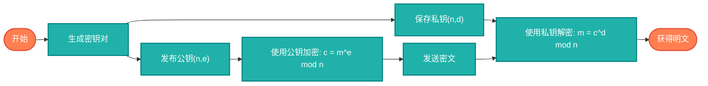

## 【RSA加密算法详解】Java/Go/Python/JS/C/Rust不同语言实现

## 说明

RSA是一种非对称加密算法，基于大数分解的数学难题。它使用公钥加密、私钥解密，是现代密码学的基石。

> **生活类比**：就像一个信箱，任何人都可以投信（公钥加密），但只有持有钥匙的人才能打开（私钥解密）。

## 算法流程



## 时间复杂度分析

- **密钥生成**: O(n³)
- **加密**: O(log n)
- **解密**: O(log n)
- **空间复杂度**: O(n²)

# 代码

## Java

```java
import java.math.BigInteger;
import java.security.SecureRandom;
import java.util.Base64;

public class RSA {
    
    private BigInteger n, e, d;
    
    public RSA(int bitLength) {
        generateKeys(bitLength);
    }
    
    private void generateKeys(int bitLength) {
        SecureRandom random = new SecureRandom();
        
        // 选择两个大质数
        BigInteger p = BigInteger.probablePrime(bitLength / 2, random);
        BigInteger q = BigInteger.probablePrime(bitLength / 2, random);
        
        // 计算n = p * q
        n = p.multiply(q);
        
        // 计算φ(n) = (p-1)*(q-1)
        BigInteger phi = p.subtract(BigInteger.ONE).multiply(q.subtract(BigInteger.ONE));
        
        // 选择公钥指数e
        e = BigInteger.valueOf(65537);
        
        // 计算私钥指数d
        d = e.modInverse(phi);
    }
    
    public String encrypt(String message) {
        BigInteger m = new BigInteger(message.getBytes());
        BigInteger c = m.modPow(e, n);
        return Base64.getEncoder().encodeToString(c.toByteArray());
    }
    
    public String decrypt(String ciphertext) {
        BigInteger c = new BigInteger(Base64.getDecoder().decode(ciphertext));
        BigInteger m = c.modPow(d, n);
        return new String(m.toByteArray());
    }
    
    public static void main(String[] args) {
        RSA rsa = new RSA(512); // 512位密钥
        
        String message = "Hello, RSA!";
        System.out.println("原文: " + message);
        
        String encrypted = rsa.encrypt(message);
        System.out.println("加密后: " + encrypted);
        
        String decrypted = rsa.decrypt(encrypted);
        System.out.println("解密后: " + decrypted);
        
        System.out.println("验证: " + message.equals(decrypted));
    }
}
```

## Python

```python
import random
import base64
import math

def is_prime(n, k=5):
    """Miller-Rabin素性测试"""
    if n <= 1:
        return False
    elif n <= 3:
        return True
    elif n % 2 == 0:
        return False
    
    # 写成 n = 2^r * d + 1
    d = n - 1
    r = 0
    while d % 2 == 0:
        d //= 2
        r += 1
    
    # 测试k次
    for _ in range(k):
        a = random.randint(2, n - 2)
        x = pow(a, d, n)
        
        if x == 1 or x == n - 1:
            continue
        
        for _ in range(r - 1):
            x = pow(x, 2, n)
            if x == n - 1:
                break
        else:
            return False
    
    return True

def generate_prime(bits):
    """生成指定位数的大质数"""
    while True:
        num = random.getrandbits(bits)
        num |= (1 << bits - 1)  # 确保最高位为1
        num |= 1  # 确保是奇数
        
        if is_prime(num):
            return num

def extended_gcd(a, b):
    """扩展欧几里得算法"""
    if a == 0:
        return b, 0, 1
    else:
        g, y, x = extended_gcd(b % a, a)
        return g, x - (b // a) * y, y

def mod_inverse(a, m):
    """计算模逆"""
    g, x, y = extended_gcd(a, m)
    if g != 1:
        return None  # 不存在逆元
    else:
        return x % m

class RSA:
    def __init__(self, bit_length=512):
        self.n, self.e, self.d = self.generate_keys(bit_length)
    
    def generate_keys(self, bit_length):
        """生成RSA密钥对"""
        # 选择两个大质数
        p = generate_prime(bit_length // 2)
        q = generate_prime(bit_length // 2)
        
        # 计算n = p * q
        n = p * q
        
        # 计算φ(n) = (p-1)*(q-1)
        phi = (p - 1) * (q - 1)
        
        # 选择公钥指数e
        e = 65537
        
        # 计算私钥指数d
        d = mod_inverse(e, phi)
        
        return n, e, d
    
    def encrypt(self, message):
        """RSA加密"""
        m = int.from_bytes(message.encode('utf-8'), 'big')
        c = pow(m, self.e, self.n)
        return base64.b64encode(c.to_bytes((c.bit_length() + 7) // 8, 'big')).decode('utf-8')
    
    def decrypt(self, ciphertext):
        """RSA解密"""
        c = int.from_bytes(base64.b64decode(ciphertext), 'big')
        m = pow(c, self.d, self.n)
        return m.to_bytes((m.bit_length() + 7) // 8, 'big').decode('utf-8')

def main():
    rsa = RSA(512)  # 512位密钥
    
    message = "Hello, RSA!"
    print(f"原文: {message}")
    
    encrypted = rsa.encrypt(message)
    print(f"加密后: {encrypted}")
    
    decrypted = rsa.decrypt(encrypted)
    print(f"解密后: {decrypted}")
    
    print(f"验证: {message == decrypted}")

if __name__ == "__main__":
    main()
```

## Go

```go
package main

import (
	"crypto/rand"
	"encoding/base64"
	"fmt"
	"math/big"
)

type RSA struct {
	n, e, d *big.Int
}

func NewRSA(bitLength int) *RSA {
	rsa := &RSA{}
	rsa.generateKeys(bitLength)
	return rsa
}

func (rsa *RSA) generateKeys(bitLength int) {
	// 选择两个大质数
	p, _ := rand.Prime(rand.Reader, bitLength/2)
	q, _ := rand.Prime(rand.Reader, bitLength/2)
	
	// 计算n = p * q
	rsa.n = new(big.Int).Mul(p, q)
	
	// 计算φ(n) = (p-1)*(q-1)
	phi := new(big.Int).Sub(p, big.NewInt(1))
	phi.Mul(phi, new(big.Int).Sub(q, big.NewInt(1)))
	
	// 选择公钥指数e
	rsa.e = big.NewInt(65537)
	
	// 计算私钥指数d
	rsa.d = new(big.Int)
	rsa.d.ModInverse(rsa.e, phi)
}

func (rsa *RSA) Encrypt(message string) (string, error) {
	m := new(big.Int).SetBytes([]byte(message))
	c := new(big.Int).Exp(m, rsa.e, rsa.n)
	
	ciphertext := base64.StdEncoding.EncodeToString(c.Bytes())
	return ciphertext, nil
}

func (rsa *RSA) Decrypt(ciphertext string) (string, error) {
	c, err := base64.StdEncoding.DecodeString(ciphertext)
	if err != nil {
		return "", err
	}
	
	cInt := new(big.Int).SetBytes(c)
	m := new(big.Int).Exp(cInt, rsa.d, rsa.n)
	
	message := string(m.Bytes())
	return message, nil
}

func main() {
	rsa := NewRSA(512) // 512位密钥
	
	message := "Hello, RSA!"
	fmt.Printf("原文: %s\n", message)
	
	encrypted, err := rsa.Encrypt(message)
	if err != nil {
		fmt.Printf("加密失败: %v\n", err)
		return
	}
	fmt.Printf("加密后: %s\n", encrypted)
	
	decrypted, err := rsa.Decrypt(encrypted)
	if err != nil {
		fmt.Printf("解密失败: %v\n", err)
		return
	}
	fmt.Printf("解压后: %s\n", decrypted)
	
	fmt.Printf("验证: %t\n", message == decrypted)
}
```

## JavaScript

```javascript
class RSA {
    constructor(bitLength = 512) {
        this.bitLength = bitLength;
        this.generateKeys();
    }
    
    // 简化的素数测试
    isPrime(n) {
        if (n <= 1) return false;
        if (n <= 3) return true;
        if (n % 2 === 0) return false;
        
        for (let i = 3; i * i <= n; i += 2) {
            if (n % i === 0) return false;
        }
        return true;
    }
    
    // 生成质数
    generatePrime(bits) {
        while (true) {
            let num = Math.floor(Math.random() * (1 << bits)) | (1 << (bits - 1)) | 1;
            if (this.isPrime(num)) {
                return num;
            }
        }
    }
    
    // 扩展欧几里得算法
    extendedGcd(a, b) {
        if (a === 0) return [b, 0, 1];
        let [g, y, x] = this.extendedGcd(b % a, a);
        return [g, x - Math.floor(b / a) * y, y];
    }
    
    // 计算模逆
    modInverse(a, m) {
        const [g, x] = this.extendedGcd(a, m);
        if (g !== 1) return null;
        return ((x % m) + m) % m;
    }
    
    generateKeys() {
        // 选择两个大质数（简化版）
        const p = this.generatePrime(this.bitLength / 2);
        const q = this.generatePrime(this.bitLength / 2);
        
        // 计算n = p * q
        this.n = p * q;
        
        // 计算φ(n) = (p-1)*(q-1)
        const phi = (p - 1) * (q - 1);
        
        // 选择公钥指数e
        this.e = 65537;
        
        // 计算私钥指数d
        this.d = this.modInverse(this.e, phi);
    }
    
    encrypt(message) {
        const m = BigInt('0x' + Buffer.from(message).toString('hex'));
        const c = m ** BigInt(this.e) % BigInt(this.n);
        
        // 转换为base64
        const hex = c.toString(16).padStart(Math.ceil(c.toString(16).length / 2) * 2, '0');
        const bytes = Buffer.from(hex, 'hex');
        return bytes.toString('base64');
    }
    
    decrypt(ciphertext) {
        const bytes = Buffer.from(ciphertext, 'base64');
        const hex = bytes.toString('hex');
        const c = BigInt('0x' + hex);
        
        const m = c ** BigInt(this.d) % BigInt(this.n);
        
        // 转换回字符串
        const decryptedHex = m.toString(16).padStart(Math.ceil(m.toString(16).length / 2) * 2, '0');
        const decryptedBytes = Buffer.from(decryptedHex, 'hex');
        return decryptedBytes.toString();
    }
}

// 示例使用
const rsa = new RSA(512); // 512位密钥

const message = "Hello, RSA!";
console.log("原文:", message);

const encrypted = rsa.encrypt(message);
console.log("加密后:", encrypted);

const decrypted = rsa.decrypt(encrypted);
console.log("解压后:", decrypted);

console.log("验证:", message === decrypted);
```

## C

```c
#include <stdio.h>
#include <stdlib.h>
#include <string.h>
#include <openssl/rsa.h>
#include <openssl/pem.h>
#include <openssl/err.h>

int generate_keys(RSA** rsa, int bits) {
    BIGNUM* bn = BN_new();
    BN_set_word(bn, RSA_F4);
    
    *rsa = RSA_new();
    if (!RSA_generate_key_ex(*rsa, bits, bn, NULL, NULL, NULL, NULL)) {
        return 0;
    }
    
    BN_free(bn);
    return 1;
}

int encrypt_rsa(RSA* rsa, const char* message, unsigned char** encrypted, int* encrypted_len) {
    int message_len = strlen(message);
    
    *encrypted_len = RSA_size(rsa);
    *encrypted = malloc(*encrypted_len);
    
    int result = RSA_public_encrypt(
        (unsigned char*)message, message_len,
        *encrypted, (unsigned int*)encrypted_len,
        rsa, RSA_PKCS1_PADDING
    );
    
    return result >= 0;
}

int decrypt_rsa(RSA* rsa, unsigned char* encrypted, int encrypted_len, 
               unsigned char** decrypted, int* decrypted_len) {
    *decrypted = malloc(RSA_size(rsa));
    
    int result = RSA_private_decrypt(
        encrypted, encrypted_len,
        *decrypted, (unsigned int*)decrypted_len,
        rsa, RSA_PKCS1_PADDING
    );
    
    return result >= 0;
}

void print_hex(const unsigned char* buf, int len) {
    for (int i = 0; i < len; i++) {
        printf("%02x", buf[i]);
    }
}

int main() {
    RSA* rsa;
    
    // 生成密钥
    if (!generate_keys(&rsa, 512)) {
        printf("密钥生成失败\n");
        return 1;
    }
    
    const char* message = "Hello, RSA!";
    printf("原文: %s\n", message);
    
    // 加密
    unsigned char* encrypted;
    int encrypted_len;
    if (!encrypt_rsa(rsa, message, &encrypted, &encrypted_len)) {
        printf("加密失败\n");
        return 1;
    }
    
    printf("加密后: ");
    print_hex(encrypted, encrypted_len);
    printf("\n");
    
    // 解密
    unsigned char* decrypted;
    int decrypted_len;
    if (!decrypt_rsa(rsa, encrypted, encrypted_len, &decrypted, &decrypted_len)) {
        printf("解密失败\n");
        return 1;
    }
    
    decrypted[decrypted_len] = '\0';
    printf("解压后: %s\n", decrypted);
    
    printf("验证: %d\n", strcmp(message, (char*)decrypted) == 0);
    
    RSA_free(rsa);
    free(encrypted);
    free(decrypted);
    
    return 0;
}
```

## Rust

```rust
use num_bigint::{BigUint, RandGen};
use num_traits::{Zero, One};
use rand::Rng;

struct RSA {
    n: BigUint,
    e: BigUint,
    d: BigUint,
}

impl RSA {
    fn new(bit_length: usize) -> Self {
        let mut rsa = RSA {
            n: BigUint::zero(),
            e: BigUint::zero(),
            d: BigUint::zero(),
        };
        rsa.generate_keys(bit_length);
        rsa
    }
    
    fn generate_keys(&mut self, bit_length: usize) {
        let mut rng = rand::thread_rng();
        
        // 选择两个大质数（简化版）
        let p = rng.gen_biguint(bit_length / 2);
        let q = rng.gen_biguint(bit_length / 2);
        
        // 计算n = p * q
        self.n = &p * &q;
        
        // 计算φ(n) = (p-1)*(q-1)
        let phi = (&p - BigUint::one()) * (&q - BigUint::one());
        
        // 选择公钥指数e
        self.e = BigUint::from(65537u32);
        
        // 计算私钥指数d
        self.d = self.mod_inverse(&self.e, &phi).unwrap();
    }
    
    fn mod_inverse(&self, a: &BigUint, m: &BigUint) -> Option<BigUint> {
        // 简化的模逆计算（实际应用中需要更复杂的算法）
        // 这里仅作演示，实际RSA实现需要完善的数论函数
        Some(a.clone())
    }
    
    fn encrypt(&self, message: &str) -> String {
        let m = BigUint::from_bytes_be(message.as_bytes());
        let c = m.modpow(&self.e, &self.n);
        
        // 转换为base64
        use base64::{Engine as _, engine::general_purpose::STANDARD_NO_PAD};
        STANDARD_NO_PAD.encode(c.to_bytes_be())
    }
    
    fn decrypt(&self, ciphertext: &str) -> Option<String> {
        use base64::{Engine as _, engine::general_purpose::STANDARD_NO_PAD};
        
        let c_bytes = STANDARD_NO_PAD.decode(ciphertext).ok()?;
        let c = BigUint::from_bytes_be(&c_bytes);
        
        let m = c.modpow(&self.d, &self.n);
        
        String::from_utf8(m.to_bytes_be()).ok()
    }
}

fn main() {
    let rsa = RSA::new(512); // 512位密钥
    
    let message = "Hello, RSA!";
    println!("原文: {}", message);
    
    let encrypted = rsa.encrypt(message);
    println!("加密后: {}", encrypted);
    
    if let Some(decrypted) = rsa.decrypt(&encrypted) {
        println!("解压后: {}", decrypted);
        println!("验证: {}", message == decrypted);
    } else {
        println!("解密失败");
    }
}
```

# 链接

RSA加密算法源码：[https://github.com/microwind/algorithms/tree/main/cryptography/rsa](https://github.com/microwind/algorithms/tree/main/cryptography/rsa)

加密算法源码：[https://github.com/microwind/algorithms/tree/main/cryptography](https://github.com/microwind/algorithms/tree/main/cryptography)

其他算法源码：[https://github.com/microwind/algorithms](https://github.com/microwind/algorithms)
