# 数据结构（Data Structures）

> 数据结构决定了数据的组织方式，是程序的骨架。选对了结构，算法才能高效。
>
> 本目录提供完整的数据结构介绍以及源码例子，供您学习参考。

---

## 1. 分类总览
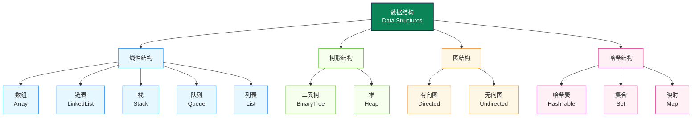

| 数据结构 | 目录 | 分类 | 一句话说明 |
|---------|------|------|-----------|
| 数组 Array | [`array/`](./array/) | 线性结构 | 连续内存存储，支持 O(1) 随机访问的最基础线性结构 |
| 链表 Linked List | [`linked/`](./linked/) | 线性结构 | 节点通过指针串联，支持 O(1) 插入删除（含单向/双向/循环） |
| 栈 Stack | [`stack/`](./stack/) | 线性结构 | 后进先出（LIFO），用于函数调用栈、括号匹配、DFS 等场景 |
| 队列 Queue | [`queue/`](./queue/) | 线性结构 | 先进先出（FIFO），用于任务调度、消息队列、BFS 等场景 |
| 列表 List | [`list/`](./list/) | 线性结构 | 有序元素集合，是数组和链表的上层抽象 |
| 哈希表 Hash Table | [`hash/`](./hash/) | 哈希结构 | 通过哈希函数将键映射到存储位置，平均 O(1) 增删查改 |
| 集合 Set | [`set/`](./set/) | 哈希结构 | 无序不重复元素集合，基于哈希表或红黑树实现快速判重 |
| 映射 Map | [`map/`](./map/) | 哈希结构 | 键值对存储，通过唯一键高效查找对应值 |
| 树 Tree | [`tree/`](./tree/) | 树形结构 | 层次化节点结构，广泛用于搜索、排序和索引 |
| 堆 Heap | [`heap/`](./heap/) | 树形结构 | 满足堆性质的完全二叉树，O(1) 取最值，O(log n) 插入删除 |
| 图 Graph | [`graph/`](./graph/) | 图结构 | 由顶点和边组成的网络结构，表示多对多关系 |
| 结构体 Struct | [`struct/`](./struct/) | 基础/复合结构 | 将多种不同类型的数据字段组合为一个复合类型 |

---

## 2. 核心概念

### 2.1 数据结构三要素

| 要素 | 含义 | 示例 |
|------|------|------|
| **逻辑结构** | 数据元素之间的逻辑关系 | 线性、树形、图形、集合 |
| **存储结构** | 数据在内存中的物理存储方式 | 顺序、链式、索引、散列 |
| **数据运算** | 对数据执行的操作 | 增、删、查、改、遍历、排序 |

### 2.2 四种存储方式对比

| 存储方式 | 原理 | 优势 | 劣势 |
|---------|------|------|------|
| **顺序存储** | 物理位置连续 | 随机访问 O(1) | 插入删除需移动元素 |
| **链式存储** | 指针连接离散节点 | 插入删除 O(1) | 访问需遍历 O(n) |
| **索引存储** | 附加索引表加速查找 | 查找效率高 | 额外空间存储索引 |
| **散列存储** | 哈希函数直接定位 | 理想 O(1) 读写 | 存在哈希冲突问题 |

---

## 3. 线性结构

### 3.1 数组（Array）

连续内存中存储固定大小的同类型元素，通过下标直接访问。

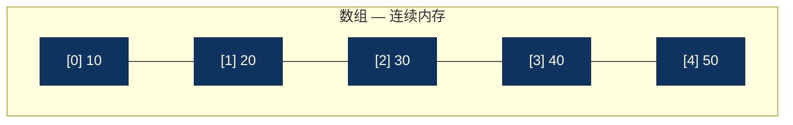

| 操作 | 时间复杂度 | 说明 |
|------|-----------|------|
| 访问 | O(1) | 通过索引直接定位 |
| 搜索 | O(n) / O(log n) | 无序遍历 / 有序二分查找 |
| 插入 | O(n) | 需要移动后续元素 |
| 删除 | O(n) | 需要移动后续元素 |

> 详见 [`array/`](./array/)

### 3.2 链表（Linked List）

节点离散存储，每个节点包含数据和指向下一个节点的指针。

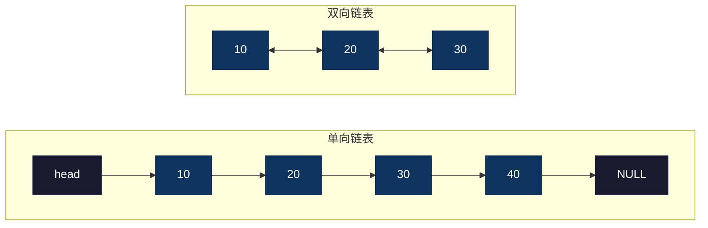

| 操作 | 时间复杂度 | 说明 |
|------|-----------|------|
| 访问 | O(n) | 需要从头遍历 |
| 搜索 | O(n) | 需要逐节点比较 |
| 插入 | O(1) | 已知位置时，修改指针即可 |
| 删除 | O(1) | 已知位置时，修改指针即可 |

> 详见 [`linked/`](./linked/)（含单向、双向、循环、双向循环链表）

### 3.3 栈（Stack）

后进先出（LIFO），只允许在栈顶进行 push/pop 操作。

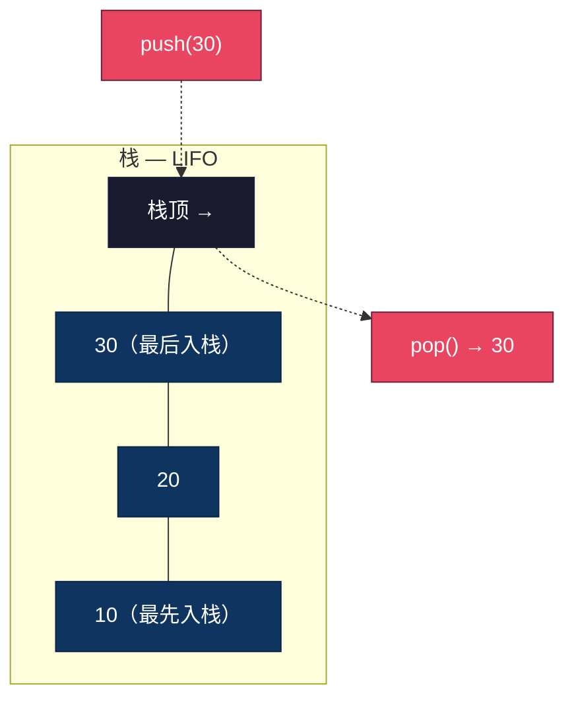

**典型应用**：函数调用栈、表达式求值（中缀转后缀）、括号匹配、浏览器前进后退、DFS

> 详见 [`stack/`](./stack/)

### 3.4 队列（Queue）

先进先出（FIFO），队尾入队（enqueue），队头出队（dequeue）。

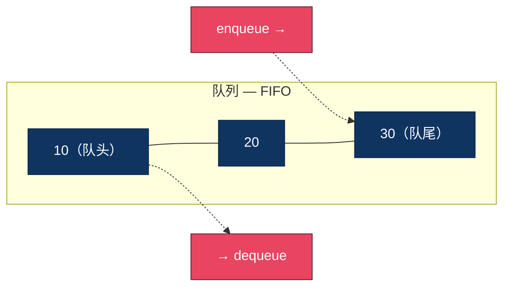

**典型应用**：任务调度、消息队列、BFS、缓存淘汰（LRU）

> 详见 [`queue/`](./queue/)

---

## 4. 树形结构

### 4.1 二叉树（Binary Tree）

每个节点最多有两个子节点。包括二叉搜索树（BST）、平衡树（AVL/红黑树）等变体。

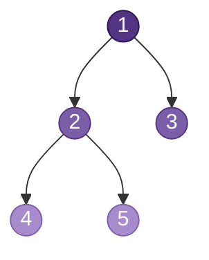

**四种遍历方式**：

| 遍历 | 顺序 | 结果 |
|------|------|------|
| 前序 | 根 → 左 → 右 | 1 → 2 → 4 → 5 → 3 |
| 中序 | 左 → 根 → 右 | 4 → 2 → 5 → 1 → 3 |
| 后序 | 左 → 右 → 根 | 4 → 5 → 2 → 3 → 1 |
| 层序 | 逐层从上到下 | 1 → 2 → 3 → 4 → 5 |

| 操作 | 时间复杂度（BST 平均） | 最坏 |
|------|----------------------|------|
| 查找 | O(log n) | O(n) |
| 插入 | O(log n) | O(n) |
| 删除 | O(log n) | O(n) |
| 遍历 | O(n) | O(n) |

**典型应用**：文件系统、表达式解析、决策树、数据库索引

> 详见 [`tree/`](./tree/)

### 4.2 堆（Heap）

满足堆性质的完全二叉树。大顶堆：父 >= 子；小顶堆：父 <= 子。底层用数组存储。

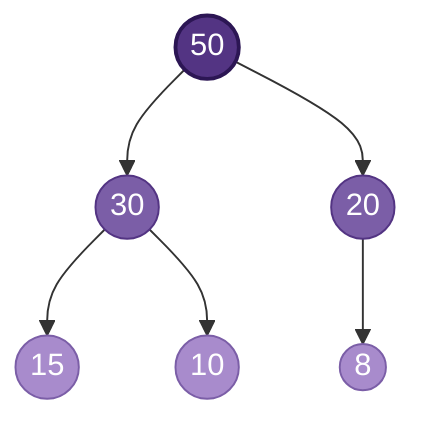

**数组映射**：节点 `i` 的左子节点 `2i+1`，右子节点 `2i+2`，父节点 `(i-1)/2`

| 操作 | 时间复杂度 |
|------|-----------|
| 获取最值 | O(1) |
| 插入 | O(log n) |
| 删除最值 | O(log n) |
| 建堆 | O(n) |

**典型应用**：优先队列、堆排序、Top K 问题、合并 K 个有序序列

> 详见 [`heap/`](./heap/)

---

## 5. 图形结构

### 图（Graph）

由顶点（Vertex）集合和边（Edge）集合组成，表示多对多的关系。

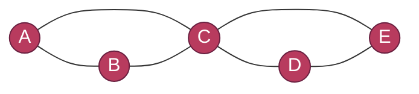

**两种存储方式**：

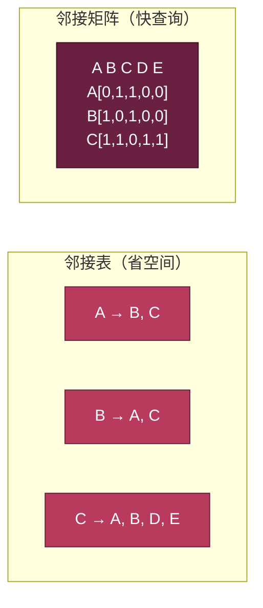

| 操作 | 时间复杂度 |
|------|-----------|
| DFS/BFS 遍历 | O(V + E) |
| 最短路径（Dijkstra） | O((V + E) log V) |
| 最小生成树（Kruskal/Prim） | O(E log V) |

**典型应用**：社交网络、地图导航、网络路由、任务调度（拓扑排序）

> 详见 [`graph/`](./graph/)

---

## 6. 哈希结构

### 哈希表（Hash Table）

通过哈希函数将键映射到数组索引，实现近似 O(1) 的增删查改。

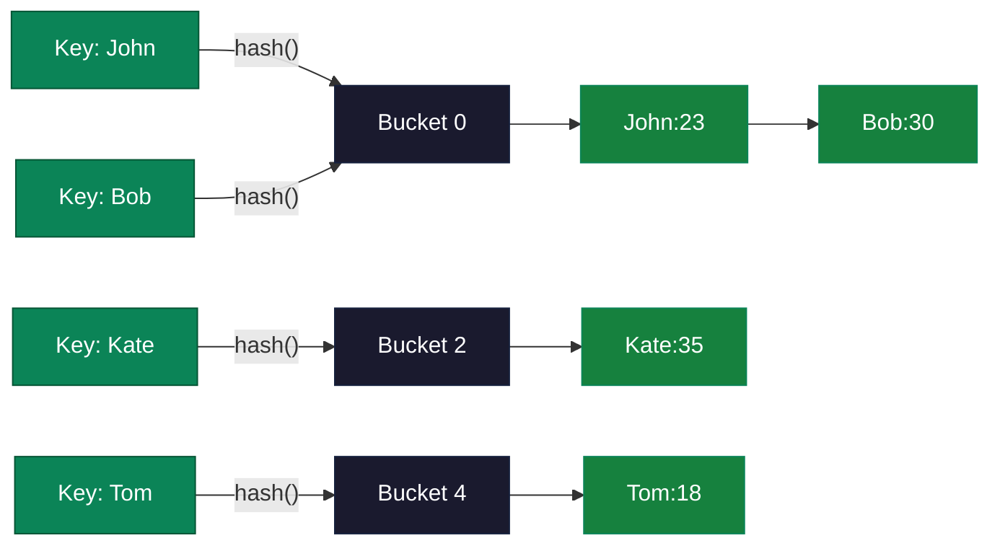

**冲突处理**：链地址法（冲突元素组成链表）、开放寻址法（线性探测/二次探测/双哈希）

| 操作 | 平均 | 最坏 |
|------|------|------|
| 插入 | O(1) | O(n) |
| 删除 | O(1) | O(n) |
| 查找 | O(1) | O(n) |

负载因子 `α = n/m`，通常保持 `α < 0.75` 以控制冲突率。

> 哈希表详见 [`hash/`](./hash/) | 集合详见 [`set/`](./set/) | 映射详见 [`map/`](./map/)

---

## 7. 复杂度对比

### 时间复杂度

| 数据结构 | 访问 | 搜索 | 插入 | 删除 | 备注 |
|---------|------|------|------|------|------|
| 数组 | **O(1)** | O(n) | O(n) | O(n) | 有序数组搜索 O(log n) |
| 链表 | O(n) | O(n) | **O(1)** | **O(1)** | 已知位置时 |
| 栈 | O(n) | O(n) | **O(1)** | **O(1)** | 仅栈顶操作 |
| 队列 | O(n) | O(n) | **O(1)** | **O(1)** | 队尾入、队头出 |
| 哈希表 | — | **O(1)** | **O(1)** | **O(1)** | 平均情况，最坏 O(n) |
| 二叉搜索树 | O(log n) | O(log n) | O(log n) | O(log n) | 平衡时，最坏 O(n) |
| 堆 | O(n) | O(n) | O(log n) | O(log n) | 取最值 O(1) |
| 图(邻接表) | O(1) | O(V+E) | O(1) | O(V+E) | — |

### 空间复杂度

| 数据结构 | 空间 | 说明 |
|---------|------|------|
| 数组 | O(n) | 连续存储，可能预分配未使用空间 |
| 链表 | O(n) | 每个节点额外存储指针 |
| 栈 / 队列 | O(n) | 取决于底层实现（数组或链表） |
| 哈希表 | O(n) | 受负载因子影响 |
| 二叉树 | O(n) | 每个节点存储两个子指针 |
| 图 | O(V+E) | 邻接表；邻接矩阵为 O(V^2) |

---

## 8. 如何选择数据结构

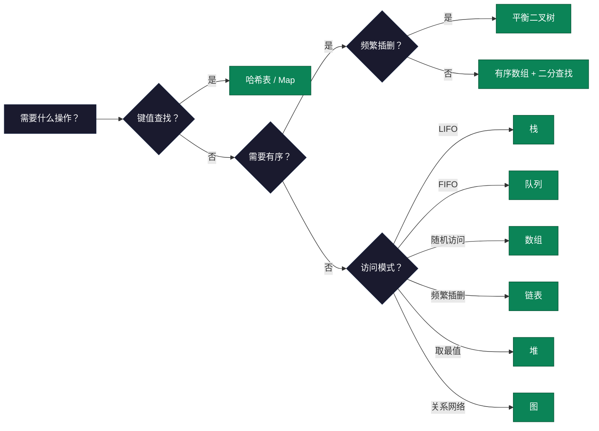

### 常见场景速查

| 场景 | 推荐结构 | 理由 |
|------|---------|------|
| 快速查找 | 哈希表 | 平均 O(1) |
| 有序查找 | 平衡 BST | O(log n) 查找 + 有序遍历 |
| LRU 缓存 | 哈希表 + 双向链表 | O(1) 查找 + O(1) 移动 |
| Top K 问题 | 堆 | O(n log k) |
| 社交网络关系 | 图 | 天然表达多对多关系 |
| 撤销/重做 | 栈 | LIFO 匹配操作顺序 |
| 任务排队 | 队列 | FIFO 保证公平调度 |

---

## 9. 学习路径

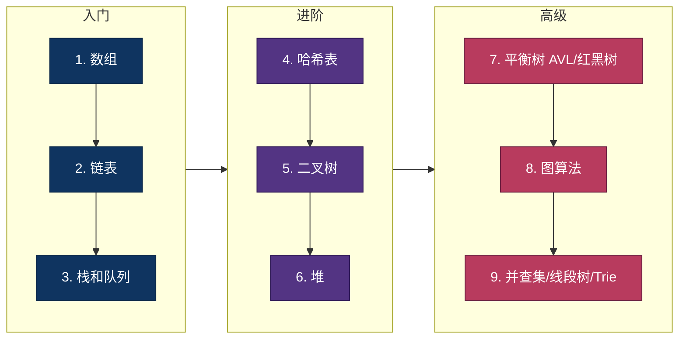

### 实践要点

- **手写实现**：每个数据结构的基本操作都亲手写一遍
- **复杂度分析**：养成分析时间/空间复杂度的习惯
- **灵活组合**：实际问题中往往需要组合多种数据结构
- **阅读源码**：参考语言标准库的工业级实现

## 10. 多语言支持

每种数据结构都提供了多语言实现：

| 语言 | 特点 |
|------|------|
| **C** | 底层实现，手动内存管理，深入理解原理 |
| **Java** | 面向对象，标准库（Collections Framework）封装完善 |
| **Go** | 简洁高效，内置 slice 和 map |
| **JavaScript** | 动态类型，数组和对象灵活 |
| **Python** | 语法简洁，内置 list/dict/set 开箱即用 |
| **Rust** | 内存安全，所有权系统保证无数据竞争 |
