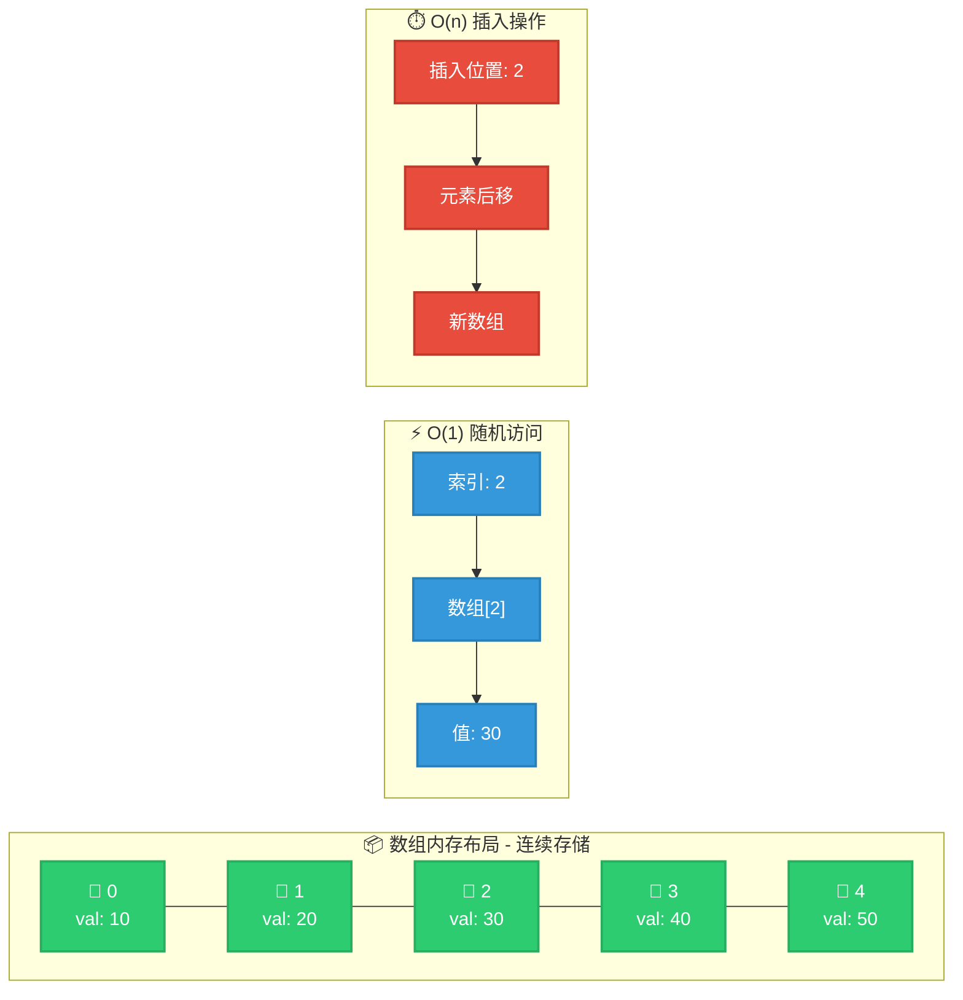
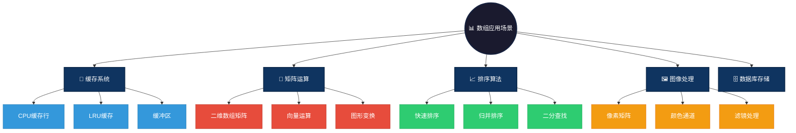

## Array 数据结构

### 概述
数组（Array）是一种基础的线性数据结构，用于存储固定大小的同类型元素集合。所有元素在内存中是连续存储的，每个元素都可以通过索引进行访问。数组的大小在创建时确定，且不可动态调整。

### 图形结构示例
数组的元素按顺序排列，索引从 0 开始。可以将数组表示为一个线性结构：
```cpp
// 这里的 1、2、3、4、5 是数组的元素
// 索引分别为 0、1、2、3、4。
值:  {1, 2, 3, 4, 5}
索引: 0  1  2  3  4
```

### 图形结构



### 特点

#### 优点
- **快速访问**：由于元素在内存中是连续存储的，可以通过索引直接访问，时间复杂度为 O(1)。
- **空间效率**：数组的存储是紧凑的，没有额外的内存开销。
- **简洁性**：数组的结构简单，易于实现和理解。

#### 缺点
- **大小固定**：数组的大小在创建时必须确定，且无法动态扩展。
- **插入和删除效率低**：插入或删除元素时需要移动元素，时间复杂度为 O(n)。
- **内存浪费**：如果数组定义的大小过大或元素较少，会导致内存浪费。

### 操作方式
- **访问**：通过索引直接访问数组元素。
- **更新**：通过索引更新数组中的元素。
- **遍历**：通过循环遍历数组，访问所有元素。
- **插入**：在指定位置插入元素（需要移动元素）。
- **删除**：删除指定位置的元素（需要移动元素）。

# 应用场景

1. **数据存储**：适用于存储大小固定且元素访问频繁的数据。
   - **静态数据表**：存储程序配置参数、常量表等固定大小数据
   - **查找表**：预计算结果存储，如三角函数表、CRC校验表
   - **循环缓冲区**：环形队列实现，用于日志缓冲、音频流处理

2. **缓存**：常用于实现缓存机制。
   - **CPU缓存行**：利用数组的连续内存特性，最大化缓存命中率
   - **LRU缓存**：结合哈希表和数组实现O(1)访问的LRU缓存
   - **图像缓冲区**：存储像素数据，支持快速的图像处理操作

3. **实现其他数据结构**：如栈、队列等。
   - **动态数组**：ArrayList/Vector 使用数组作为底层存储
   - **循环队列**：使用数组实现高效的FIFO队列
   - **二叉堆**：优先队列的完全二叉树使用数组存储，无需指针

4. **排序与查找**：适用于排序算法和查找算法，尤其是数据量较小或已排序的情况下。
   - **排序算法基础**：快速排序、归并排序、堆排序都基于数组
   - **二分查找**：有序数组支持O(log n)时间复杂度的查找
   - **矩阵运算**：二维数组实现矩阵乘法、转置、求逆等操作

### 应用场景可视化



### 简单例子

#### C 语言示例
```c
#include <stdio.h>

int main() {
    // 定义一个大小为 5 的整型数组
    int arr[5] = {1, 2, 3, 4, 5};

    // 通过索引访问数组元素
    for (int i = 0; i < 5; i++) {
        printf("%d ", arr[i]);
    }

    return 0;
}
```

#### Java 示例
```java
public class ArrayExample {
    public static void main(String[] args) {
        // 定义一个大小为 5 的整型数组
        int[] arr = {1, 2, 3, 4, 5};

        // 通过索引访问数组元素
        for (int i = 0; i < arr.length; i++) {
            System.out.print(arr[i] + " ");
        }
    }
}
```

#### JS 示例
```js
// 定义一个数组
let arr = [1, 2, 3, 4, 5];

// 遍历并打印数组元素
for (let i = 0; i < arr.length; i++) {
    console.log(arr[i]);
}
```

#### Go 示例
```Go
package main

import "fmt"

func main() {
    // 定义一个数组
    arr := [5]int{1, 2, 3, 4, 5}

    // 遍历并打印数组元素
    for i := 0; i < len(arr); i++ {
        fmt.Printf("%d ", arr[i])
    }
}
```
