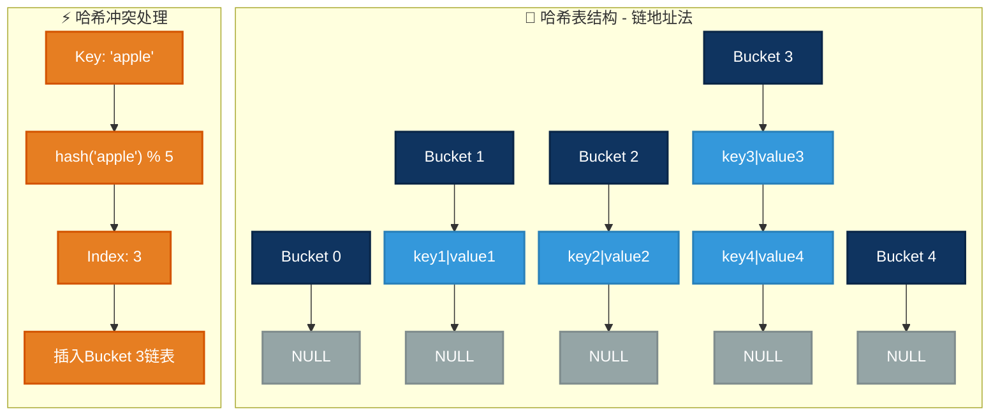
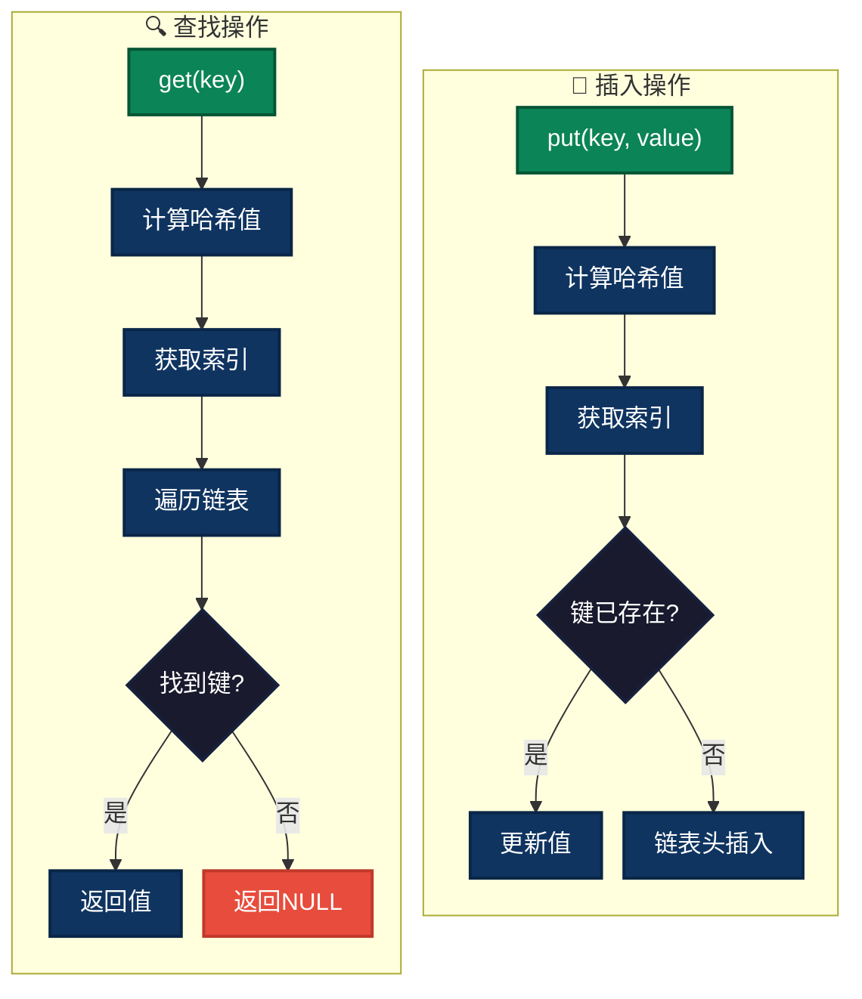

# 哈希数据结构

哈希表（Hash Table）是一种通过哈希函数将键（Key）映射到数组索引的特殊数据结构。它可以实现快速的查找、插入和删除操作，通常被用于解决一些需要高效存取的场景，如缓存、数据库索引、符号表等。

---

# 图形结构示例

哈希表的基本结构如下图所示：
```c
+-------------------+
|   Hash Table      |
|                   |
|  +-----------+    |   
|  | Index 0   |    |   +-----------+    +-----------+
|  +-----------+    |   | Index 1   |    | Index 2   |
|  | Key-Value  |   |   | Key-Value |    | Key-Value |
|  | (apple,10) |   |   | (banana,20) | | (cherry,30) |
|  +-----------+    |   +-----------+    +-----------+
|  | Index 3   |    |   
|  +-----------+    |   
|  | Empty     |    |  
+-------------------+
```

- 哈希表是由一个固定大小的数组（在图中每个索引位置表示）和一个哈希函数组成。每个索引位置对应一个链表或其他结构，用于存储映射到该索引的键值对。

### 图形结构



---

# 特点

哈希表的特点可以总结为以下几个方面：

## 优点

1. **快速的查找、插入和删除**：哈希表的平均时间复杂度是O(1)，即对数据的访问、添加或删除操作通常是常数时间，极大提高了效率。
2. **高效的空间利用**：通过使用哈希函数，将数据映射到一个较大的数组中，避免了像链表一样线性查找的性能瓶颈。
3. **灵活性**：哈希表可以灵活处理各种类型的键值对，且支持在不同应用场景下进行扩展和修改。

## 缺点

1. **哈希冲突**：多个键可能被哈希到同一个索引位置，这会导致哈希冲突。常用的解决方法包括链式哈希和开放寻址。
2. **内存消耗**：为了避免冲突，哈希表通常需要为数组分配较大的内存空间，特别是当数据量较小时，空间的浪费较为显著。
3. **不支持有序遍历**：哈希表本身并不保证键值对的顺序，虽然我们可以通过额外的数据结构来排序，但哈希表本身不适合处理排序操作。

---

# 操作方式

哈希表的常见操作包括：

1. **插入（Put）**：将一个键值对插入哈希表。哈希函数计算键的哈希值并将该键值对放入对应位置。
2. **查找（Get）**：查找给定键对应的值。使用哈希函数计算键的哈希值，直接访问数组索引位置。
3. **删除（Remove）**：删除给定键的键值对。计算键的哈希值，查找并移除对应的键值对。
4. **更新（Update）**：与查找类似，找到给定键的索引后，更新其值。

哈希表的哈希函数、冲突处理和扩容机制是决定其性能和效率的关键因素。

### 操作流程



---

# 应用场景

哈希表有广泛的应用，包括但不限于以下几个场景：

1. **缓存机制**：例如，Web 缓存、LRU 缓存等。
   - **浏览器缓存**：存储最近访问的网页资源，通过URL作为key快速查找缓存内容
   - **数据库查询缓存**：缓存SQL查询结果，相同查询直接从内存返回
   - **分布式缓存**：Redis/Memcached使用哈希表存储键值对，支持高并发读写

2. **数据库索引**：用于数据库表的快速检索。
   - **主键索引**：通过哈希函数直接定位到数据行，O(1)时间复杂度
   - **联合索引**：将多个字段组合成复合key进行哈希
   - **自适应哈希索引**：InnoDB根据查询频率自动为热点数据创建哈希索引

3. **数据去重**：快速查找并删除重复元素。
   - **日志去重**：实时处理海量日志，快速判断某条日志是否已处理
   - **URL去重**：爬虫系统避免重复抓取相同页面
   - **大数据去重**：Spark/Hadoop使用哈希表进行Shuffle去重

4. **符号表**：在编译器中，哈希表用于存储符号和变量的对应关系。
   - **变量作用域**：存储变量名到内存地址/类型的映射
   - **函数符号表**：记录函数名、参数列表、返回类型、入口地址
   - **宏定义表**：C/C++预处理器存储宏定义和替换文本

5. **网络路由表**：用于快速查找路由信息。
   - **IP路由查找**：最长前缀匹配，快速确定下一跳地址
   - **负载均衡**：一致性哈希将请求均匀分配到后端服务器
   - **DNS缓存**：域名到IP地址的快速解析

### 应用场景可视化

```mermaid
%%{init: {'flowchart': {'nodeSpacing': 25, 'rankSpacing': 40, 'padding': 20}}}%%
graph TB
    ROOT(("🔢 哈希表应用场景"))

    ROOT --> CACHE["💾 缓存系统"]
    ROOT --> DB["🗄️ 数据库索引"]
    ROOT --> DEDUP["🗑️ 数据去重"]
    ROOT --> COMPILER["🔧 编译器符号表"]
    ROOT --> NETWORK["🌐 网络路由"]

    CACHE --> CACHE1["浏览器缓存<br/>URL→资源"]
    CACHE --> CACHE2["数据库查询缓存<br/>SQL→结果集"]
    CACHE --> CACHE3["Redis分布式缓存<br/>Key→Value"]
    CACHE --> CACHE4["LRU缓存<br/>Key→Node"]

    DB --> DB1["主键索引<br/>ID→行记录"]
    DB --> DB2["联合索引<br/>(A,B)→行指针"]
    DB --> DB3["自适应哈希<br/>热点数据加速"]

    DEDUP --> DEDUP1["日志去重<br/>LogID→Bool"]
    DEDUP --> DEDUP2["URL去重<br/>URL→Status"]
    DEDUP --> DEDUP3["大数据去重<br/>Record→Count"]

    COMPILER --> COMP1["变量符号表<br/>var→{type,addr}"]
    COMPILER --> COMP2["函数符号表<br/>func→{params,ret}"]
    COMPILER --> COMP3["宏定义表<br/>macro→text"]

    NETWORK --> NET1["IP路由表<br/>IP前缀→下一跳"]
    NETWORK --> NET2["负载均衡<br/>Key→Server"]
    NETWORK --> NET3["DNS缓存<br/>Domain→IP"]

    classDef root fill:#1a1a2e,color:#fff,stroke:#16213e,stroke-width:3px
    classDef cat fill:#0f3460,color:#fff,stroke:#0a2647,stroke-width:2px
    classDef sub fill:#533483,color:#fff,stroke:#2c1654
    classDef cache fill:#3498db,color:#fff,stroke:#2980b9
    classDef db fill:#e74c3c,color:#fff,stroke:#c0392b
    classDef dedup fill:#2ecc71,color:#fff,stroke:#27ae60
    classDef comp fill:#f39c12,color:#fff,stroke:#e67e22
    classDef net fill:#9b59b6,color:#fff,stroke:#8e44ad

    class ROOT root
    class CACHE,DB,DEDUP,COMPILER,NETWORK cat
    class CACHE1,CACHE2,CACHE3,CACHE4 cache
    class DB1,DB2,DB3 db
    class DEDUP1,DEDUP2,DEDUP3 dedup
    class COMP1,COMP2,COMP3 comp
    class NET1,NET2,NET3 net
```



---

# 简单例子

以下是哈希表的基本实现，展示了插入、查找和删除的基本操作。

### C 语言示例

```c
#include <stdio.h>
#include <stdlib.h>
#include <string.h>

#define TABLE_SIZE 10

typedef struct Node {
    char *key;
    int value;
    struct Node *next;
} Node;

typedef struct HashMap {
    Node *table[TABLE_SIZE];
} HashMap;

unsigned int hash(char *key) {
    unsigned int hashValue = 0;
    while (*key) {
        hashValue = (hashValue << 5) + *key++;
    }
    return hashValue % TABLE_SIZE;
}

void put(HashMap *map, char *key, int value) {
    unsigned int index = hash(key);
    Node *newNode = (Node *)malloc(sizeof(Node));
    newNode->key = strdup(key);
    newNode->value = value;
    newNode->next = map->table[index];
    map->table[index] = newNode;
}

int get(HashMap *map, char *key) {
    unsigned int index = hash(key);
    Node *current = map->table[index];
    while (current) {
        if (strcmp(current->key, key) == 0) {
            return current->value;
        }
        current = current->next;
    }
    return -1;
}

void removeKey(HashMap *map, char *key) {
    unsigned int index = hash(key);
    Node *current = map->table[index];
    Node *prev = NULL;
    while (current) {
        if (strcmp(current->key, key) == 0) {
            if (prev) {
                prev->next = current->next;
            } else {
                map->table[index] = current->next;
            }
            free(current->key);
            free(current);
            return;
        }
        prev = current;
        current = current->next;
    }
}

int main() {
    HashMap *map = (HashMap *)malloc(sizeof(HashMap));
    for (int i = 0; i < TABLE_SIZE; i++) {
        map->table[i] = NULL;
    }

    put(map, "apple", 10);
    printf("Value of 'apple': %d\n", get(map, "apple"));
    put(map, "banana", 20);
    printf("Value of 'banana': %d\n", get(map, "banana"));

    removeKey(map, "apple");
    printf("Value of 'apple' after removal: %d\n", get(map, "apple"));

    return 0;
}
```

### Java 语言示例

```java
import java.util.LinkedList;

class HashMap {
    private final int TABLE_SIZE = 10;
    private LinkedList<Entry>[] table;

    class Entry {
        String key;
        int value;
        Entry(String key, int value) {
            this.key = key;
            this.value = value;
        }
    }

    public HashMap() {
        table = new LinkedList[TABLE_SIZE];
        for (int i = 0; i < TABLE_SIZE; i++) {
            table[i] = new LinkedList<>();
        }
    }

    private int hash(String key) {
        return key.hashCode() % TABLE_SIZE;
    }

    public void put(String key, int value) {
        int index = hash(key);
        for (Entry entry : table[index]) {
            if (entry.key.equals(key)) {
                entry.value = value;
                return;
            }
        }
        table[index].add(new Entry(key, value));
    }

    public int get(String key) {
        int index = hash(key);
        for (Entry entry : table[index]) {
            if (entry.key.equals(key)) {
                return entry.value;
            }
        }
        return -1;
    }

    public void remove(String key) {
        int index = hash(key);
        table[index].removeIf(entry -> entry.key.equals(key));
    }
}

public class Main {
    public static void main(String[] args) {
        HashMap map = new HashMap();
        map.put("apple", 10);
        System.out.println("Value of 'apple': " + map.get("apple"));
        map.put("banana", 20);
        System.out.println("Value of 'banana': " + map.get("banana"));
        map.remove("apple");
        System.out.println("Value of 'apple' after removal: " + map.get("apple"));
    }
}

```

### JS 语言示例

```js
class HashMap {
    constructor() {
        this.table = new Array(10).fill(null).map(() => []);
    }

    hash(key) {
        let hashValue = 0;
        for (let i = 0; i < key.length; i++) {
            hashValue = (hashValue << 5) + key.charCodeAt(i);
        }
        return hashValue % 10;
    }

    put(key, value) {
        const index = this.hash(key);
        if (!Array.isArray(this.table[index])) {
            this.table[index] = [];
        }
        for (let node of this.table[index]) {
            if (node.key === key) {
                node.value = value;
                return;
            }
        }
        this.table[index].push({ key, value });
    }

    get(key) {
        const index = this.hash(key);
        for (let node of this.table[index]) {
            if (node.key === key) {
                return node.value;
            }
        }
        return undefined;
    }

    remove(key) {
        const index = this.hash(key);
        this.table[index] = this.table[index].filter(node => node.key !== key);
    }
}

const map = new HashMap();
map.put("apple", 10);
console.log(map.get("apple"));
map.put("banana", 20);
console.log(map.get("banana"));
map.remove("apple");
console.log(map.get("apple"));

```

### Go 语言示例

```go
/*
代码说明：
- 哈希表结构：使用一个大小为10的数组 table，每个索引位置存储一个链表。链表用于处理哈希冲突。
- 哈希函数：将字符串键映射为一个哈希值，并取模 10 来确定其在数组中的位置。
- Put 方法：插入新的键值对。如果冲突，将新节点插入到链表的头部。
- Get 方法：查找指定键的值。如果键不存在，则返回 -1。
- Remove 方法：删除指定键的键值对。如果找到了键，移除对应的节点。
*/
package main

import (
	"fmt"
)

type Node struct {
	key   string
	value int
	next  *Node
}

type HashMap struct {
	table [10]*Node
}

// 哈希函数
func hash(key string) int {
	hashValue := 0
	for i := 0; i < len(key); i++ {
		hashValue = (hashValue << 5) + int(key[i])
	}
	return hashValue % 10
}

// 插入键值对
func (hm *HashMap) Put(key string, value int) {
	index := hash(key)
	newNode := &Node{key: key, value: value}
	newNode.next = hm.table[index]
	hm.table[index] = newNode
}

// 查找键值对
func (hm *HashMap) Get(key string) int {
	index := hash(key)
	current := hm.table[index]
	for current != nil {
		if current.key == key {
			return current.value
		}
		current = current.next
	}
	return -1 // 未找到返回 -1
}

// 删除键值对
func (hm *HashMap) Remove(key string) {
	index := hash(key)
	current := hm.table[index]
	var prev *Node
	for current != nil {
		if current.key == key {
			if prev == nil {
				hm.table[index] = current.next
			} else {
				prev.next = current.next
			}
			return
		}
		prev = current
		current = current.next
	}
}

func main() {
	var map1 HashMap

	// 插入键值对
	map1.Put("apple", 10)
	map1.Put("banana", 20)

	// 查找键值对
	fmt.Println("Value of 'apple':", map1.Get("apple"))
	fmt.Println("Value of 'banana':", map1.Get("banana"))

	// 删除键值对
	map1.Remove("apple")
	fmt.Println("Value of 'apple' after removal:", map1.Get("apple"))
}
```