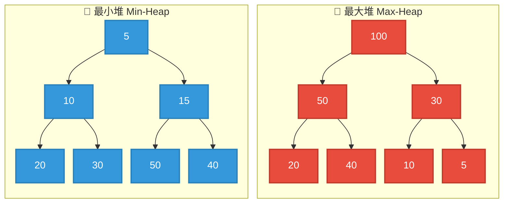
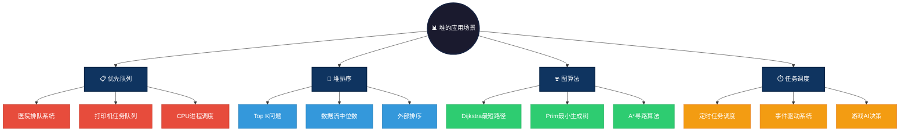

# Heap 数据结构概述

Heap（堆）是一种特殊的树状数据结构，它满足堆属性。堆是一种完全二叉树，其父节点的值总是大于或小于其子节点的值。根据堆的不同属性，堆可分为最大堆（Max-Heap）和最小堆（Min-Heap）。

- **最大堆**：父节点的值大于或等于子节点的值，根节点的值是最大值。
- **最小堆**：父节点的值小于或等于子节点的值，根节点的值是最小值。

Heap 通常用于实现优先队列、堆排序等。

# 图形结构示例

## 最大堆示例：
```c
    100
   /    \
  50     30
 /  \   /  \
20   40 10  5
```

## 最小堆示例：
```c
     5
   /   \
  10   15
 /  \  /  \
20  30 50  40
```

### 图形结构



---

# 特点

## 优点
1. **高效的插入和删除操作**：Heap 提供了对插入元素和删除根元素（最大值或最小值）操作的高效支持，时间复杂度为 O(log n)。
2. **优先级队列的实现**：Heap 可以非常方便地实现优先级队列，在许多算法（如 Dijkstra 算法、A* 搜索算法）中得到应用。
3. **自动排序**：在插入或删除元素时，Heap 会自动维护堆的结构。

## 缺点
1. **查找任意元素的效率较低**：Heap 只能在 O(1) 时间复杂度下访问根节点，查找任意其他元素的时间复杂度是 O(n)。
2. **不适合全局排序**：Heap 适合在插入、删除最小/最大元素时快速工作，但不适合全局排序任务。对于排序，通常会使用快速排序或归并排序。

# 操作方式

1. **插入元素**：将新元素插入到堆的末尾，然后通过“上浮”操作恢复堆的性质。
2. **删除根元素**：删除堆顶元素（最大值或最小值），然后将堆的最后一个元素移动到堆顶，通过“下沉”操作恢复堆的性质。
3. **查看根元素**：直接访问堆顶元素，时间复杂度 O(1)。

# 应用场景

1. **优先级队列**：Heap 是优先级队列的基础，广泛应用于调度算法、任务调度等场景。
   - **医院排队系统**：急诊优先级高于普通门诊，使用最大堆实现
   - **打印机任务队列**：高优先级文档（如管理层报告）优先打印
   - **CPU进程调度**：实时进程优先级高于普通进程，多级反馈队列

2. **堆排序**：Heap 可以用来实现高效的排序算法，时间复杂度为 O(n log n)。
   - **Top K问题**：从海量数据中找出最大的K个元素，如热门排行榜
   - **数据流中位数**：维护两个堆，动态计算实时数据流的中位数
   - **外部排序**：内存无法容纳全部数据时，使用堆进行多路归并

3. **图算法**：Heap 在图算法中常用于实现最短路径算法。
   - **Dijkstra最短路径**：优先队列优化，每次选择距离最小的节点
   - **Prim最小生成树**：使用堆维护边的权重，贪心选择最小边
   - **A*寻路算法**：游戏开发中，启发式函数 + 优先队列实现智能寻路

4. **任务调度**：基于优先级的定时任务和事件处理。
   - **定时任务调度**：Quartz/Timer 使用堆管理定时任务
   - **事件驱动系统**：Node.js/EventMachine 使用堆管理事件触发时间
   - **游戏AI决策**：策略游戏中，高优先级行动优先执行

### 应用场景可视化



---

# 简单例子

### C 语言实现
```c
#include <stdio.h>
#include <stdlib.h>

void heapify(int arr[], int n, int i) {
    int largest = i;
    int left = 2 * i + 1;
    int right = 2 * i + 2;

    if (left < n && arr[left] > arr[largest]) {
        largest = left;
    }

    if (right < n && arr[right] > arr[largest]) {
        largest = right;
    }

    if (largest != i) {
        int temp = arr[i];
        arr[i] = arr[largest];
        arr[largest] = temp;
        heapify(arr, n, largest);
    }
}

void heapSort(int arr[], int n) {
    for (int i = n / 2 - 1; i >= 0; i--) {
        heapify(arr, n, i);
    }

    for (int i = n - 1; i > 0; i--) {
        int temp = arr[0];
        arr[0] = arr[i];
        arr[i] = temp;
        heapify(arr, i, 0);
    }
}

int main() {
    int arr[] = {12, 11, 13, 5, 6, 7};
    int n = sizeof(arr) / sizeof(arr[0]);

    heapSort(arr, n);

    printf("Sorted array: \n");
    for (int i = 0; i < n; i++) {
        printf("%d ", arr[i]);
    }
    printf("\n");

    return 0;
}
```
### Java 语言实现
```java
import java.util.PriorityQueue;

public class HeapExample {
    public static void main(String[] args) {
        // Min Heap
        PriorityQueue<Integer> minHeap = new PriorityQueue<>();

        minHeap.add(12);
        minHeap.add(5);
        minHeap.add(7);
        minHeap.add(1);

        System.out.println("Min Heap:");
        while (!minHeap.isEmpty()) {
            System.out.println(minHeap.poll());
        }
    }
}
```

### Go 语言实现
```go
package main

import (
    "fmt"
    "container/heap"
)

type IntHeap []int

func (h IntHeap) Len() int           { return len(h) }
func (h IntHeap) Less(i, j int) bool { return h[i] < h[j] } // Min Heap
func (h IntHeap) Swap(i, j int)      { h[i], h[j] = h[j], h[i] }

func (h *IntHeap) Push(x interface{}) {
    *h = append(*h, x.(int))
}

func (h *IntHeap) Pop() interface{} {
    old := *h
    n := len(old)
    x := old[n-1]
    *h = old[0 : n-1]
    return x
}

func main() {
    h := &IntHeap{2, 1, 5}
    heap.Init(h)

    heap.Push(h, 3)
    fmt.Println("Min Heap:")
    for h.Len() > 0 {
        fmt.Printf("%d ", heap.Pop(h))
    }
}
```

### JS 语言实现
```js
class MaxHeap {
    constructor() {
        this.heap = [];
    }

    insert(value) {
        this.heap.push(value);
        this.bubbleUp();
    }

    bubbleUp() {
        let index = this.heap.length - 1;
        while (index > 0) {
            let parentIndex = Math.floor((index - 1) / 2);
            if (this.heap[index] <= this.heap[parentIndex]) break;
            [this.heap[index], this.heap[parentIndex]] = [this.heap[parentIndex], this.heap[index]];
            index = parentIndex;
        }
    }

    remove() {
        const root = this.heap[0];
        const last = this.heap.pop();
        if (this.heap.length > 0) {
            this.heap[0] = last;
            this.sinkDown();
        }
        return root;
    }

    sinkDown() {
        let index = 0;
        const length = this.heap.length;
        const element = this.heap[0];

        while (true) {
            let leftChildIndex = 2 * index + 1;
            let rightChildIndex = 2 * index + 2;
            let leftChild, rightChild;
            let swap = null;

            if (leftChildIndex < length) {
                leftChild = this.heap[leftChildIndex];
                if (leftChild > element) {
                    swap = leftChildIndex;
                }
            }

            if (rightChildIndex < length) {
                rightChild = this.heap[rightChildIndex];
                if ((swap === null && rightChild > element) || (swap !== null && rightChild > leftChild)) {
                    swap = rightChildIndex;
                }
            }

            if (swap === null) break;

            [this.heap[index], this.heap[swap]] = [this.heap[swap], this.heap[index]];
            index = swap;
        }
    }
}

const maxHeap = new MaxHeap();
maxHeap.insert(10);
maxHeap.insert(20);
maxHeap.insert(15);
maxHeap.insert(30);

console.log("Max Heap:");
while (maxHeap.heap.length > 0) {
    console.log(maxHeap.remove());
}
```