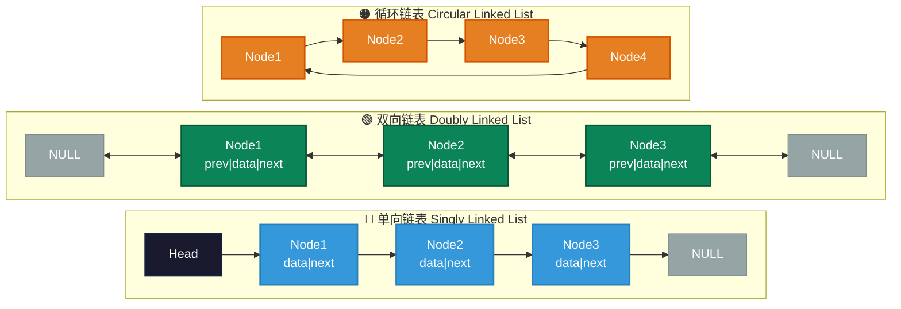

# 链表（Linked List）数据结构概述

链表是一种线性数据结构，由一系列节点（Node）组成，其中每个节点包含数据和指向下一个节点的指针（或引用）。链表的最主要特点是节点的插入和删除操作非常高效，尤其是在数据量大或者需要频繁修改的情况下。

与数组相比，链表的最大不同在于它的元素在内存中不是连续存储的，每个节点通过指针连接到下一个节点，这使得链表能够灵活地进行插入和删除操作，而不需要像数组一样移动大量元素。

## 目录结构

本目录包含通用链表实现（根目录）和按功能拆分的4个子目录，共7种语言实现（C、Java、Go、Rust、JavaScript、Python、TypeScript）：

```
linked/
├── linked_list.c           # 通用链表实现（C）
├── LinkedList.java         # 通用链表实现（Java）
├── linked_list.go          # 通用链表实现（Go）
├── linked_list.rs          # 通用链表实现（Rust）
├── linked_list.js          # 通用链表实现（JavaScript）
├── linked_list.py          # 通用链表实现（Python）
├── linked_list.ts          # 通用链表实现（TypeScript）
├── singly/                 # 单向链表子目录
│   ├── singly_linked.c/.go/.js/.py/.rs/.ts
│   ├── SinglyLinked.java
│   └── README.md
├── doubly/                 # 双向链表子目录
├── circular/               # 循环链表子目录
├── doubly-circular/        # 双向循环链表子目录
└── README.md               # 本文件
```

## 链表的特点

### 有序性
链表中的节点按照插入顺序排列，通过指针连接形成线性结构。

### 动态大小
链表的大小是动态的，可以根据需要增加或减少节点，无需预先分配固定内存空间。

### 内存布局
- **数组**：元素在内存中连续存储，通过索引直接访问
- **链表**：元素在内存中分散存储，通过指针顺序访问

### 常见操作
- **访问元素**：从头节点开始顺序遍历，时间复杂度 O(n)
- **头部插入/删除**：修改头指针，时间复杂度 O(1)
- **尾部插入/删除**：遍历到末尾，时间复杂度 O(n)（维护尾指针可优化为O(1)）
- **查找元素**：顺序遍历查找，时间复杂度 O(n)

---

# 链表的种类

## 1. 单向链表 (Singly Linked List)

每个节点包含两个部分：数据部分和指向下一个节点的指针（next）。从头节点开始，可以通过指针访问链表中的每个元素，只有一个方向的链接。

**结构示例：**
```c
Head -> Node1 -> Node2 -> Node3 -> NULL
```

**特点：**
- 内存占用小（每个节点只有一个指针）
- 只能从头到尾单向遍历
- 尾部操作需要O(n)时间

## 2. 双向链表 (Doubly Linked List)

每个节点包含三个部分：数据部分、指向下一个节点的指针（next）和指向前一个节点的指针（prev）。双向链表支持从任一方向进行遍历。

**结构示例：**
```c
NULL <- Node1 <-> Node2 <-> Node3 -> NULL
```

**特点：**
- 支持双向遍历
- 内存占用较大（每个节点两个指针）
- 删除操作更高效（可直接访问前驱节点）

## 3. 循环链表 (Circular Linked List)

循环链表是指链表的最后一个节点的指针指向头节点，形成一个环。常用于需要循环遍历的场景。

**结构示例：**
```c
Head -> Node1 -> Node2 -> Node3 -> Head
```

**特点：**
- 无NULL结尾，遍历需判断回到头节点
- 适合环形队列、轮询调度等场景
- 无法直接访问前驱节点（单向循环）

## 4. 双向循环链表 (Doubly Circular Linked List)

双向循环链表是双向链表的扩展，尾节点的next指向头节点，头节点的prev指向尾节点，形成双向环。

**结构示例：**
```c
Head <-> Node1 <-> Node2 <-> Node3 <-> Head
```

**特点：**
- 最灵活的结构，支持双向循环遍历
- 内存占用最大
- 头尾操作均为O(1)

---

# 图形结构对比



---

# 链表类型对比表

| 特性/链表类型 | 单向链表 | 双向链表 | 循环链表 | 双向循环链表 |
|--------------|---------|---------|---------|-------------|
| **节点结构** | data + next | data + next + prev | data + next | data + next + prev |
| **遍历方向** | 单向 | 双向 | 单向循环 | 双向循环 |
| **内存占用** | 最小 | 较大 | 较小 | 最大 |
| **头部插入** | O(1) | O(1) | O(1) | O(1) |
| **尾部插入** | O(n) | O(n) | O(n) | O(1) |
| **查找** | O(n) | O(n) | O(n) | O(n) |
| **删除节点** | O(n) | O(1)* | O(n) | O(1)* |
| **适用场景** | 简单列表 | 需要双向遍历 | 环形队列 | 双向循环队列 |

*已知节点指针时

---

# 不同语言链表实现对比

| 特性/语言 | C | Java | Go | Rust | JS | Python | TS |
|-----------|---|------|----|------|----|--------|----|
| **内存管理** | 手动malloc/free | 自动GC | 自动GC | 所有权系统 | 自动GC | 自动GC | 自动GC |
| **类型安全** | 无 | 强类型 | 强类型 | 强类型+所有权 | 动态类型 | 动态类型 | 强类型 |
| **指针/引用** | 原始指针 | 对象引用 | 指针/引用 | 智能指针 | 对象引用 | 对象引用 | 对象引用 |
| **实现难度** | 高 | 中 | 中 | 高 | 低 | 低 | 中 |
| **性能** | 最高 | 高 | 高 | 高 | 中 | 中 | 中 |

---

# 通用链表实现方法

根目录下的 `linked_list.*` 文件提供完整的通用链表实现，包含以下方法：

| 方法 | 功能 | 时间复杂度 |
|------|------|-----------|
| `insertHead(data)` | 头部插入节点 | O(1) |
| `insertTail(data)` | 尾部插入节点 | O(n) |
| `delete(data)` | 删除指定数据节点 | O(n) |
| `find(data)` | 查找节点 | O(n) |
| `printList()` | 打印链表 | O(n) |
| `getSize()` | 获取链表大小 | O(1) |

---

# 应用场景

## 1. 单向链表
- **简单列表操作**：不需要反向遍历的场景
- **栈实现**：只需要在头部操作的场景
- **函数调用栈**：编译器实现

## 2. 双向链表
- **浏览器前进/后退**：需要双向导航
- **音乐播放列表**：支持上一首/下一首
- **LRU缓存**：哈希表+双向链表实现

## 3. 循环链表
- **轮询调度算法**：操作系统进程调度
- **约瑟夫环问题**：经典算法问题
- **循环缓冲区**：数据流处理

## 4. 双向循环链表
- **双向循环队列**：高级队列实现
- **图片浏览器**：循环浏览图片
- **游戏角色移动**：环形地图移动

---

# 代码示例

## C语言实现
```c
#include <stdio.h>
#include <stdlib.h>

typedef struct Node {
    int data;
    struct Node *next;
} Node;

// 头部插入 O(1)
void insertHead(Node **head, int data) {
    Node *newNode = (Node *)malloc(sizeof(Node));
    newNode->data = data;
    newNode->next = *head;
    *head = newNode;
}

// 打印链表
void printList(Node *head) {
    while (head != NULL) {
        printf("%d -> ", head->data);
        head = head->next;
    }
    printf("NULL\n");
}
```

## Java实现
```java
public class LinkedList {
    private class Node {
        int data;
        Node next;
        Node(int data) { this.data = data; }
    }
    
    private Node head;
    
    // 头部插入 O(1)
    public void insertHead(int data) {
        Node newNode = new Node(data);
        newNode.next = head;
        head = newNode;
    }
}
```

## Python实现
```python
class Node:
    def __init__(self, data):
        self.data = data
        self.next = None

class LinkedList:
    def __init__(self):
        self.head = None
    
    # 头部插入 O(1)
    def insert_head(self, data):
        new_node = Node(data)
        new_node.next = self.head
        self.head = new_node
```

---

# 复杂度分析总结

## 时间复杂度
- **访问第n个元素**：O(n)
- **头部插入/删除**：O(1)
- **尾部插入/删除**：O(n)（无尾指针）/ O(1)（有尾指针）
- **中间插入/删除**：O(n)（需要查找）
- **查找元素**：O(n)

## 空间复杂度
- **节点空间**：O(n)，每个节点需要额外空间存储指针
- **单向链表**：每个节点1个指针（8字节64位系统）
- **双向链表**：每个节点2个指针（16字节64位系统）

---

# 学习路径建议

1. **入门**：从 `singly/` 目录的单向链表开始，理解基本指针操作
2. **进阶**：学习 `doubly/` 目录的双向链表，理解双向指针维护
3. **应用**：研究 `circular/` 和 `doubly-circular/` 的循环链表应用场景
4. **实践**：参考根目录的通用链表实现，尝试实现其他功能（反转、排序、合并等）

---

*Copyright © https://github.com/microwind All rights reserved.*
*@author: jarryli@gmail.com*
