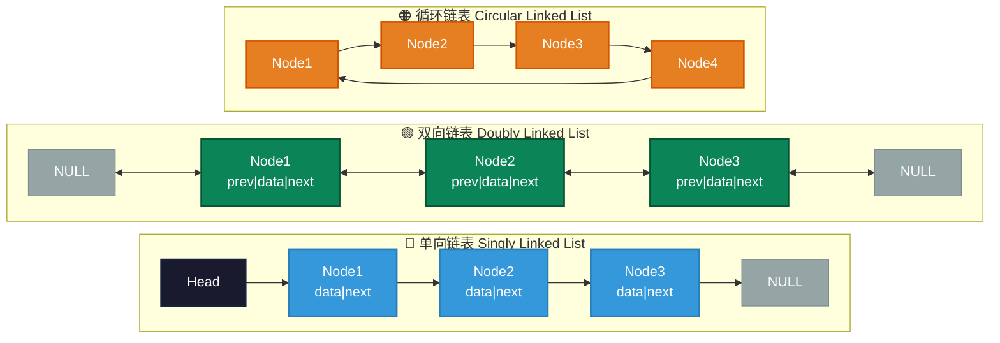
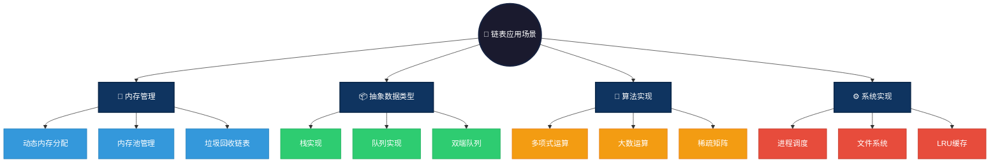

# 链表（Linked List）数据结构概述

链表是一种线性数据结构，由一系列节点（Node）组成，其中每个节点包含数据和指向下一个节点的指针（或引用）。链表的最主要特点是节点的插入和删除操作非常高效，尤其是在数据量大或者需要频繁修改的情况下。

与数组相比，链表的最大不同在于它的元素在内存中不是连续存储的，每个节点通过指针连接到下一个节点，这使得链表能够灵活地进行插入和删除操作，而不需要像数组一样移动大量元素。

# 链表的种类

链表有以下几种主要类型，每种类型都有其独特的结构和应用。下面是详细说明，并附带图形结构示例和对比表格：

## 1. 单向链表 (Singly Linked List)  
每个节点包含两个部分：数据部分和指向下一个节点的指针（next）。从头节点开始，可以通过指针访问链表中的每个元素，只有一个方向的链接。

## 2. 双向链表 (Doubly Linked List)  
每个节点包含三个部分：数据部分、指向下一个节点的指针（next）和指向前一个节点的指针（prev）。双向链表支持从任一方向进行遍历，既可以从头到尾遍历，也可以从尾到头遍历。

## 3. 循环链表 (Circular Linked List)  
循环链表是指链表的最后一个节点的指针指向头节点，形成一个环。循环链表可以是单向的，也可以是双向的，常用于需要循环遍历的场景。

## 4. 双向循环链表 (Doubly Circular Linked List)  
双向循环链表是双向链表的扩展，尾节点的指针指向头节点，头节点的指针指向尾节点，形成一个双向的环。

---

# 图形结构示例

1. **单向链表 (Singly Linked List)**  
```c
// 单向链表从头节点开始，依次指向下一个节点，最后指向 NULL。
Head -> Node1 -> Node2 -> Node3 -> NULL
```

2. **双向链表 (Doubly Linked List)**  
```c
// 双向链表的每个节点不仅指向下一个节点，还包含指向前一个节点的指针，形成双向连接。两端节点指向 NULL，表示链表的起始和结束。
NULL <- Node1 <-> Node2 <-> Node3 -> NULL
```

3. **循环链表 (Circular Linked List)**  
```c
// 循环链表的尾节点指向头节点，形成一个闭环。无论从哪个节点开始，都能循环地访问到其他节点。
Head -> Node1 -> Node2 -> Node3 -> Head (尾指向头)
```

4. **双向循环链表 (Doubly Circular Linked List)**  
```c
// 双向循环链表的尾节点指向头节点，头节点指向尾节点，形成一个双向循环结构。每个节点都可以双向遍历，支持从任意方向访问。
Head <-> Node1 <-> Node2 <-> Node3 <-> Head (循环互指)
```

### 图形结构



---

# 链表类型对比

| 特性/链表类型        | 单向链表 (Singly Linked List) | 双向链表 (Doubly Linked List) | 循环链表 (Circular Linked List) | 双向循环链表 (Doubly Circular Linked List) |
|---------------------|-----------------------------|------------------------------|--------------------------------|-------------------------------------------|
| **节点结构**        | 数据 + 指向下一个节点的指针   | 数据 + 指向下一个节点的指针 + 指向前一个节点的指针 | 数据 + 指向下一个节点的指针 (最后指向头节点) | 数据 + 指向下一个节点的指针 + 指向前一个节点的指针 (最后指向头节点, 头节点指向尾节点) |
| **遍历方向**        | 只能从头到尾遍历             | 可以从头到尾和尾到头遍历       | 只能从头到尾遍历（循环）        | 可以从头到尾和尾到头遍历（循环）           |
| **内存占用**        | 较小                        | 较大                         | 较小（但有循环）               | 较大（有循环）                           |
| **操作复杂度**      | 插入/删除较快 (头部操作)     | 插入/删除较快 (任意位置操作)   | 插入/删除较快 (任意位置操作)     | 插入/删除较快 (任意位置操作)               |
| **常见应用**        | 简单的列表操作               | 需要双向遍历的应用             | 环形队列/循环遍历               | 双向循环队列/双向遍历循环操作             |
| **缺点**            | 只能从头部访问               | 占用更多内存，需要维护双向指针 | 不容易访问前一个节点            | 占用更多内存且复杂度较高                |

---

# 总结

| 链表类型            | 适用场景                                        | 优点                           | 缺点                            |
|-------------------|---------------------------------------------|--------------------------------|--------------------------------|
| **单向链表**         | 适用于简单的数据存储和基本操作。                  | 内存占用少，结构简单。             | 只能单向遍历，操作灵活性差。         |
| **双向链表**         | 适用于需要双向遍历和频繁插入删除的场景。             | 支持双向遍历，插入删除更高效。       | 内存占用较大，维护双向指针。           |
| **循环链表**         | 适用于需要环形遍历的场景，如环形队列。               | 适合循环使用，避免了尾部的特殊情况。    | 只支持从头到尾遍历，不适合随机访问。   |
| **双向循环链表**      | 适用于需要双向环形遍历的应用，如循环双向队列。         | 支持双向环形遍历，操作更灵活。        | 内存占用最大，结构最复杂。             |

# 特点

## 优点

1. **动态大小**：链表的大小是动态的，可以根据需要在运行时增加或减少节点，避免了数组大小的限制。
2. **高效的插入和删除**：在链表中插入或删除元素时，不需要像数组那样移动其他元素，只需改变相应节点的指针即可。
3. **内存利用率高**：链表不需要像数组那样事先分配一块连续的内存，可以更灵活地管理内存。

## 缺点

1. **访问速度慢**：由于链表中的元素存储不连续，无法通过索引直接访问某个元素，必须从头节点开始逐个遍历，效率较低。
2. **额外空间开销**：每个节点除了存储数据外，还需要额外的空间来存储指向下一个节点的指针。
3. **复杂的实现**：链表的实现比数组复杂，尤其是在插入、删除、搜索等操作中需要处理指针的维护。

# 操作方式

常见的链表操作包括：
- **插入操作**：可以在链表的头部、尾部或中间插入一个节点。
- **删除操作**：删除链表中的某个节点。
- **查找操作**：从链表的头部开始遍历，查找特定的节点。
- **更新操作**：更新链表中某个节点的数据。
- **反转操作**：将链表的顺序反转。

# 应用场景

1. **内存管理**：链表在动态内存分配中有广泛应用，能够灵活管理内存块。
   - **动态内存分配**：malloc/free 使用空闲链表管理堆内存，快速分配/释放
   - **内存池管理**：预分配固定大小内存块，用链表管理空闲块，减少碎片
   - **垃圾回收链表**：标记-清除算法使用链表维护待回收对象

2. **实现队列、栈**：链表可以用于实现队列（FIFO）和栈（LIFO）数据结构。
   - **链表栈**：无容量限制，动态扩容，入栈/出栈O(1)
   - **链表队列**：双指针实现首尾O(1)操作，支持高效的任务调度
   - **双端队列**：双向链表实现两端O(1)插入删除

3. **动态数据结构**：在一些需要频繁修改（如插入、删除）数据的应用中，链表比数组更高效。
   - **多项式运算**：链表存储多项式项，支持高效的多项式加减乘除
   - **大数运算**：链表存储大整数每一位，支持任意精度计算
   - **稀疏矩阵**：十字链表存储稀疏矩阵非零元素，节省空间

4. **系统实现**：操作系统和底层系统广泛使用链表。
   - **进程调度**：Linux使用双向链表管理进程控制块（PCB）
   - **文件系统**：FAT表使用链表管理磁盘块分配
   - **LRU缓存**：哈希表+双向链表实现O(1)访问的LRU Cache

### 应用场景可视化



---

# 简单例子

## C语言实现单向链表

```c
#include <stdio.h>
#include <stdlib.h>

struct Node {
    int data;
    struct Node* next;
};

void printList(struct Node* head) {
    struct Node* temp = head;
    while (temp != NULL) {
        printf("%d -> ", temp->data);
        temp = temp->next;
    }
    printf("NULL\n");
}

int main() {
    struct Node* head = NULL;
    
    // 创建节点
    struct Node* first = (struct Node*) malloc(sizeof(struct Node));
    first->data = 1;
    first->next = NULL;
    head = first;
    
    // 插入节点
    struct Node* second = (struct Node*) malloc(sizeof(struct Node));
    second->data = 2;
    second->next = NULL;
    first->next = second;

    printList(head);  // 输出：1 -> 2 -> NULL

    return 0;
}
```
## Java语言实现单向链表

```java
class Node {
    int data;
    Node next;

    public Node(int data) {
        this.data = data;
        this.next = null;
    }
}

public class SinglyLinkedList {
    Node head;

    // 打印链表
    public void printList() {
        Node temp = head;
        while (temp != null) {
            System.out.print(temp.data + " -> ");
            temp = temp.next;
        }
        System.out.println("NULL");
    }

    public static void main(String[] args) {
        SinglyLinkedList list = new SinglyLinkedList();
        
        // 创建节点
        Node first = new Node(1);
        list.head = first;
        
        // 插入节点
        Node second = new Node(2);
        first.next = second;

        list.printList();  // 输出：1 -> 2 -> NULL
    }
}
```

## Go语言实现单向链表

```go
package main

import "fmt"

// 节点结构体
type Node struct {
    data int
    next *Node
}

// 打印链表
func printList(head *Node) {
    temp := head
    for temp != nil {
        fmt.Printf("%d -> ", temp.data)
        temp = temp.next
    }
    fmt.Println("NULL")
}

func main() {
    // 创建节点
    head := &Node{data: 1}
    
    // 插入节点
    second := &Node{data: 2}
    head.next = second

    printList(head)  // 输出：1 -> 2 -> NULL
}
```

## JS语言实现单向链表

```js
class Node {
    constructor(data) {
        this.data = data;
        this.next = null;
    }
}

class SinglyLinkedList {
    constructor() {
        this.head = null;
    }

    // 打印链表
    printList() {
        let temp = this.head;
        while (temp !== null) {
            console.log(temp.data + " -> ");
            temp = temp.next;
        }
        console.log("NULL");
    }
}

// 创建链表并插入节点
const list = new SinglyLinkedList();

// 创建节点
let first = new Node(1);
list.head = first;

// 插入节点
let second = new Node(2);
first.next = second;

list.printList();  // 输出：1 -> 2 -> NULL
```