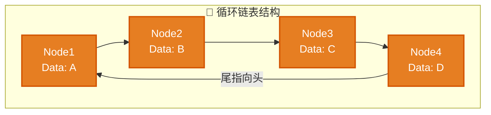
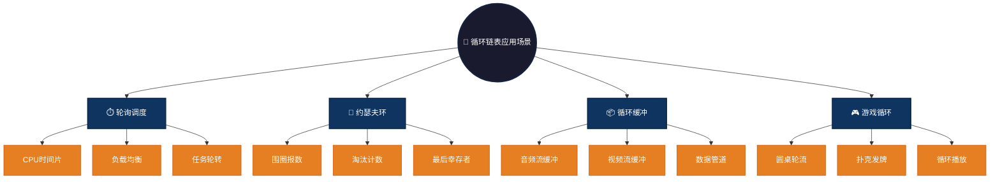

# 循环链表 (Circular Linked List)

## 概述

循环链表是指链表的最后一个节点的指针指向头节点，形成一个环。循环链表可以是单向的，也可以是双向的，常用于需要循环遍历的场景。

## 结构特点

```
Head -> Node1 -> Node2 -> Node3 -> Head (尾指向头)
```

- **环形结构**：尾节点的next指向头节点，形成闭环
- **无终点遍历**：没有NULL结尾，可无限循环遍历
- **任意起点**：从任一节点出发可遍历全表
- **统一处理**：头尾操作逻辑一致，无需特殊判断

### 图形结构



### 操作复杂度

| 操作 | 时间复杂度 | 说明 |
|------|-----------|------|
| 头部插入/删除 | O(1) | 只需修改头指针 |
| 遍历 | O(n) | 需判断回到起点终止 |
| 查找元素 | O(n) | 顺序遍历，最多一圈 |
| 合并链表 | O(1) | 首尾拼接即可 |
| 旋转链表 | O(k) | 移动头指针k步 |

## 文件列表

| 文件名 | 语言 |
|--------|------|
| circular_linked.c | C |
| circular_linked.js | JavaScript |
| circular_linked.py | Python |
| CircularLinked.java | Java |
| circular_linked.go | Go |
| circular_linked.rs | Rust |
| circular_linked.ts | TypeScript |

## 适用场景

- **轮询调度**：CPU时间片轮转、负载均衡
- **约瑟夫环问题**：经典的数学淘汰问题
- **循环缓冲区**：音频/视频流数据缓冲
- **环形队列**：固定大小的循环队列
- **游戏循环**：玩家轮流操作的圆桌游戏

### 应用场景可视化



## 优缺点

**优点：**
- **无边界循环**：天然适合循环遍历场景
- **统一操作**：头尾操作逻辑一致
- **任意起点**：从任何位置开始都能遍历全部
- **高效合并**：两循环链表O(1)合并

**缺点：**
- **终止条件复杂**：需记录起点避免死循环
- **单向限制**：单向循环无法反向访问
- **调试困难**：循环结构难以直观展示
- **内存泄漏风险**：环状结构易造成悬挂引用

## 简单示例

### C 语言
```c
typedef struct Node {
    int data;
    struct Node* next;
} Node;

// 创建循环链表节点
Node* createNode(int data) {
    Node* newNode = (Node*)malloc(sizeof(Node));
    newNode->data = data;
    newNode->next = NULL;
    return newNode;
}

// 插入到循环链表尾部
void insertToTail(Node** head, int data) {
    Node* newNode = createNode(data);
    if (*head == NULL) {
        newNode->next = newNode;  // 自环
        *head = newNode;
    } else {
        Node* temp = *head;
        while (temp->next != *head)  // 找到尾节点
            temp = temp->next;
        temp->next = newNode;
        newNode->next = *head;  // 接回头部
    }
}

// 遍历循环链表（需判断回到起点）
void traverse(Node* head) {
    if (head == NULL) return;
    Node* current = head;
    do {
        printf("%d ", current->data);
        current = current->next;
    } while (current != head);  // 回到起点终止
}
```

### Java
```java
class Node {
    int data;
    Node next;
    Node(int data) { this.data = data; }
}

class CircularLinkedList {
    Node head;
    
    void insert(int data) {
        Node newNode = new Node(data);
        if (head == null) {
            newNode.next = newNode;  // 自环
            head = newNode;
        } else {
            Node temp = head;
            while (temp.next != head)  // 找到尾节点
                temp = temp.next;
            temp.next = newNode;
            newNode.next = head;
        }
    }
    
    void traverse() {
        if (head == null) return;
        Node current = head;
        do {
            System.out.print(current.data + " ");
            current = current.next;
        } while (current != head);
    }
}
```

### Python
```python
class Node:
    def __init__(self, data):
        self.data = data
        self.next = None

class CircularLinkedList:
    def __init__(self):
        self.head = None
    
    def insert(self, data):
        new_node = Node(data)
        if not self.head:
            new_node.next = new_node  # 自环
            self.head = new_node
        else:
            current = self.head
            while current.next != self.head:  # 找到尾节点
                current = current.next
            current.next = new_node
            new_node.next = self.head
    
    def traverse(self):
        if not self.head:
            return
        current = self.head
        while True:
            print(current.data, end=" ")
            current = current.next
            if current == self.head:
                break
```

### JavaScript
```javascript
class Node {
    constructor(data) {
        this.data = data;
        this.next = null;
    }
}

class CircularLinkedList {
    constructor() {
        this.head = null;
    }
    
    insert(data) {
        const newNode = new Node(data);
        if (!this.head) {
            newNode.next = newNode;  // 自环
            this.head = newNode;
        } else {
            let current = this.head;
            while (current.next !== this.head)  // 找到尾节点
                current = current.next;
            current.next = newNode;
            newNode.next = this.head;
        }
    }
    
    traverse() {
        if (!this.head) return;
        let current = this.head;
        do {
            process.stdout.write(current.data + " ");
            current = current.next;
        } while (current !== this.head);
    }
}
```
