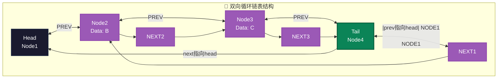
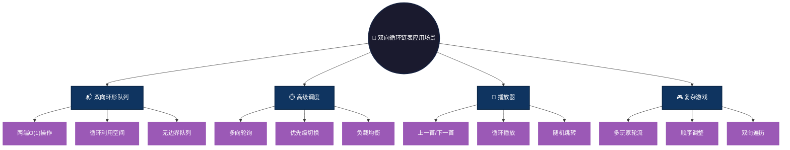

# 双向循环链表 (Doubly Circular Linked List)

## 概述

双向循环链表是双向链表的扩展，尾节点的指针指向头节点，头节点的指针指向尾节点，形成一个双向的环。这是最灵活的链表结构，支持双向遍历和循环访问。

## 结构特点

```
Head <-> Node1 <-> Node2 <-> Node3 <-> Head (循环互指)
```

- **双向环形**：每个节点prev和next形成双向闭环
- **无NULL边界**：首尾互相指向，无终止标志
- **完全灵活**：任意节点可向任意方向遍历全表
- **操作统一**：所有位置操作逻辑一致

### 图形结构



### 操作复杂度

| 操作 | 时间复杂度 | 说明 |
|------|-----------|------|
| 头部插入/删除 | O(1) | 直接修改指针 |
| 尾部插入/删除 | O(1) | 直接修改指针 |
| 任意位置删除 | O(1) | 已知节点时 |
| 双向遍历 | O(n) | 支持顺时针/逆时针 |
| 查找元素 | O(n) | 可双向搜索优化 |

## 文件列表

| 文件名 | 语言 |
|--------|------|
| doubly_circular_linked.c | C |
| doubly_circular_linked.js | JavaScript |
| doubly_circular_linked.py | Python |
| DoublyCircularLinked.java | Java |
| doubly_circular_linked.go | Go |
| doubly_circular_linked.rs | Rust |
| doubly_circular_linked.ts | TypeScript |

## 适用场景

- **双向环形队列**：Deque的循环版本，两端O(1)操作
- **高级调度算法**：多方向轮询、优先级调度
- **双向循环播放列表**：音乐播放器的前进/后退/循环
- **复杂游戏循环**：多玩家轮流且支持顺序调整
- **实时数据流**：双向扫描的环形缓冲区

### 应用场景可视化



## 优缺点

**优点：**
- **最灵活结构**：支持双向循环遍历
- **完全统一**：所有位置操作一致，无特殊边界
- **任意起点**：从任何节点出发都能到达任何位置
- **操作高效**：头尾任意操作都是O(1)
- **双向搜索**：可从两个方向同时查找

**缺点：**
- **内存最大**：每个节点需两个指针
- **实现最复杂**：需维护四个指针关系
- **调试困难**：环状结构难以追踪
- **易出死循环**：终止条件判断复杂
- **维护成本高**：修改需同时更新多个指针

## 简单示例

### C 语言
```c
typedef struct Node {
    int data;
    struct Node *prev, *next;
} Node;

Node* createNode(int data) {
    Node* newNode = (Node*)malloc(sizeof(Node));
    newNode->data = data;
    newNode->prev = newNode->next = NULL;
    return newNode;
}

// 初始化双向循环链表（创建头节点自环）
void initList(Node** head, int data) {
    *head = createNode(data);
    (*head)->prev = (*head)->next = *head;  // 自环
}

// 尾部插入
void insertToTail(Node* head, int data) {
    Node* newNode = createNode(data);
    Node* tail = head->prev;  // 头的前驱即尾
    
    tail->next = newNode;
    newNode->prev = tail;
    newNode->next = head;
    head->prev = newNode;
}

// 双向遍历（顺时针）
void traverseClockwise(Node* head) {
    Node* current = head;
    do {
        printf("%d ", current->data);
        current = current->next;
    } while (current != head);
}

// 双向遍历（逆时针）
void traverseCounterClockwise(Node* head) {
    Node* current = head;
    do {
        printf("%d ", current->data);
        current = current->prev;
    } while (current != head);
}
```

### Java
```java
class Node {
    int data;
    Node prev, next;
    Node(int data) { this.data = data; }
}

class DoublyCircularLinkedList {
    Node head;
    
    void init(int data) {
        head = new Node(data);
        head.prev = head.next = head;  // 自环
    }
    
    void insert(int data) {
        Node newNode = new Node(data);
        Node tail = head.prev;  // 头的前驱即尾
        
        tail.next = newNode;
        newNode.prev = tail;
        newNode.next = head;
        head.prev = newNode;
    }
    
    void traverseClockwise() {
        Node current = head;
        do {
            System.out.print(current.data + " ");
            current = current.next;
        } while (current != head);
    }
    
    void traverseCounterClockwise() {
        Node current = head;
        do {
            System.out.print(current.data + " ");
            current = current.prev;
        } while (current != head);
    }
}
```

### Python
```python
class Node:
    def __init__(self, data):
        self.data = data
        self.prev = None
        self.next = None

class DoublyCircularLinkedList:
    def __init__(self):
        self.head = None
    
    def init(self, data):
        self.head = Node(data)
        self.head.prev = self.head.next = self.head  # 自环
    
    def insert(self, data):
        new_node = Node(data)
        tail = self.head.prev  # 头的前驱即尾
        
        tail.next = new_node
        new_node.prev = tail
        new_node.next = self.head
        self.head.prev = new_node
    
    def traverse_clockwise(self):
        current = self.head
        while True:
            print(current.data, end=" ")
            current = current.next
            if current == self.head:
                break
    
    def traverse_counter_clockwise(self):
        current = self.head
        while True:
            print(current.data, end=" ")
            current = current.prev
            if current == self.head:
                break
```

### JavaScript
```javascript
class Node {
    constructor(data) {
        this.data = data;
        this.prev = null;
        this.next = null;
    }
}

class DoublyCircularLinkedList {
    constructor() {
        this.head = null;
    }
    
    init(data) {
        this.head = new Node(data);
        this.head.prev = this.head.next = this.head;  // 自环
    }
    
    insert(data) {
        const newNode = new Node(data);
        const tail = this.head.prev;  // 头的前驱即尾
        
        tail.next = newNode;
        newNode.prev = tail;
        newNode.next = this.head;
        this.head.prev = newNode;
    }
    
    traverseClockwise() {
        let current = this.head;
        do {
            process.stdout.write(current.data + " ");
            current = current.next;
        } while (current !== this.head);
    }
    
    traverseCounterClockwise() {
        let current = this.head;
        do {
            process.stdout.write(current.data + " ");
            current = current.prev;
        } while (current !== this.head);
    }
}
```
