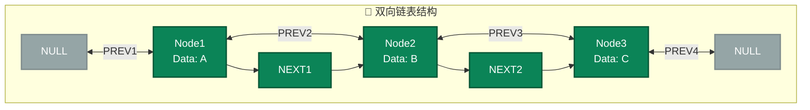
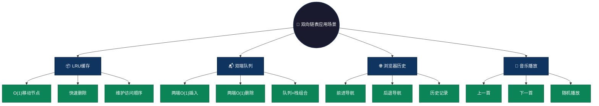

# 双向链表 (Doubly Linked List)

## 概述

双向链表每个节点包含三个部分：数据部分、指向下一个节点的指针（next）和指向前一个节点的指针（prev）。支持从任一方向进行遍历，既可以从头到尾遍历，也可以从尾到头遍历。

## 结构特点

```
NULL <- Node1 <-> Node2 <-> Node3 -> NULL
```

- **节点结构**：每个节点包含数据域 + prev指针 + next指针
- **双向遍历**：支持从头到尾或从尾到头遍历
- **内存布局**：非连续存储，前后双向链接
- **边界处理**：头节点的prev和尾节点的next都指向NULL

### 图形结构



### 操作复杂度

| 操作 | 时间复杂度 | 说明 |
|------|-----------|------|
| 头部插入/删除 | O(1) | 只需修改头指针 |
| 尾部插入/删除 | O(1) | 维护尾指针即可 |
| 中间删除 | O(1) | 已知节点位置时 |
| 查找元素 | O(n) | 需顺序遍历 |
| 双向遍历 | O(n) | 支持前后双向 |

## 文件列表

| 文件名 | 语言 |
|--------|------|
| doubly_linked.c | C |
| doubly_linked.js | JavaScript |
| doubly_linked.py | Python |
| DoublyLinked.java | Java |
| doubly_linked.go | Go |
| doubly_linked.rs | Rust |
| doubly_linked.ts | TypeScript |

## 适用场景

- **LRU缓存**：快速移动节点到头部，O(1)删除
- **双端队列**：Deque实现，两端O(1)操作
- **浏览器历史**：前进后退导航功能
- **音乐播放列表**：上一首/下一首切换
- **文本编辑器**：撤销/重做功能

### 应用场景可视化



## 优缺点

**优点：**
- **双向遍历**：支持从头到尾或反向遍历
- **O(1)删除**：已知节点位置时直接删除
- **尾部操作快**：维护尾指针后O(1)操作
- **灵活性高**：可向前或向后移动

**缺点：**
- **内存占用大**：每个节点需要两个指针
- **实现复杂**：需要维护prev和next指针
- **插入操作繁琐**：需修改前后节点的指针
- **指针易出错**：容易出现指针悬挂问题

## 简单示例

### C 语言
```c
typedef struct Node {
    int data;
    struct Node* prev;
    struct Node* next;
} Node;

// 创建节点
Node* createNode(int data) {
    Node* newNode = (Node*)malloc(sizeof(Node));
    newNode->data = data;
    newNode->prev = NULL;
    newNode->next = NULL;
    return newNode;
}

// 头部插入
void insertAtHead(Node** head, int data) {
    Node* newNode = createNode(data);
    newNode->next = *head;
    if (*head) (*head)->prev = newNode;
    *head = newNode;
}
```

### Java
```java
class Node {
    int data;
    Node prev, next;
    Node(int data) { this.data = data; }
}

class DoublyLinkedList {
    Node head, tail;
    
    void insertAtHead(int data) {
        Node newNode = new Node(data);
        newNode.next = head;
        if (head != null) head.prev = newNode;
        head = newNode;
        if (tail == null) tail = newNode;
    }
}
```

### Python
```python
class Node:
    def __init__(self, data):
        self.data = data
        self.prev = None
        self.next = None

class DoublyLinkedList:
    def __init__(self):
        self.head = None
        self.tail = None
    
    def insert_at_head(self, data):
        new_node = Node(data)
        new_node.next = self.head
        if self.head:
            self.head.prev = new_node
        self.head = new_node
        if not self.tail:
            self.tail = new_node
```

### JavaScript
```javascript
class Node {
    constructor(data) {
        this.data = data;
        this.prev = null;
        this.next = null;
    }
}

class DoublyLinkedList {
    constructor() {
        this.head = null;
        this.tail = null;
    }
    
    insertAtHead(data) {
        const newNode = new Node(data);
        newNode.next = this.head;
        if (this.head) this.head.prev = newNode;
        this.head = newNode;
        if (!this.tail) this.tail = newNode;
    }
}
```
