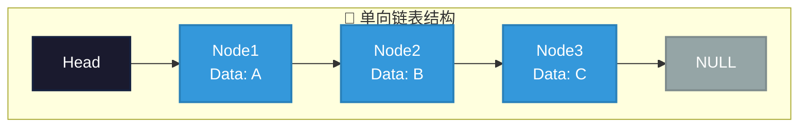
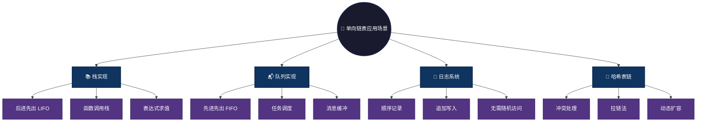

# 单向链表 (Singly Linked List)

## 概述

单向链表是最基础的链表结构，每个节点包含数据部分和指向下一个节点的指针（next）。从头节点开始，可以通过指针访问链表中的每个元素，只有一个方向的链接。

## 结构特点

```
Head -> Node1 -> Node2 -> Node3 -> NULL
```

- **节点结构**：每个节点包含数据域 + next指针
- **遍历方向**：只能从头到尾单向遍历
- **内存布局**：非连续存储，通过指针链接
- **结束标志**：尾节点的next指向NULL

### 图形结构



### 操作复杂度

| 操作 | 时间复杂度 | 说明 |
|------|-----------|------|
| 头部插入 | O(1) | 只需修改头指针 |
| 头部删除 | O(1) | 只需修改头指针 |
| 尾部插入 | O(n) | 需遍历到末尾 |
| 查找元素 | O(n) | 需顺序遍历 |
| 访问第k个 | O(n) | 需从头遍历k次 |

## 文件列表

| 文件名 | 语言 |
|--------|------|
| singly_linked.c | C |
| singly_linked.js | JavaScript |
| singly_linked.py | Python |
| SinglyLinked.java | Java |
| singly_linked.go | Go |
| singly_linked.rs | Rust |
| singly_linked.ts | TypeScript |

## 适用场景

- **简单数据存储**：实现栈、队列等基础数据结构
- **内存敏感场景**：嵌入式系统、内存受限环境
- **单向遍历应用**：日志记录、消息队列
- **算法基础**：学习递归、指针操作的最佳入门

### 应用场景可视化



## 优缺点

**优点：**
- **内存占用少**：每个节点只有一个指针
- **结构简单**：易于理解和实现
- **动态扩容**：无需预分配内存
- **插入删除快**：头部操作O(1)

**缺点：**
- **单向遍历**：无法反向访问
- **随机访问慢**：访问第n个元素需要O(n)
- **尾部操作慢**：需要遍历整个链表
- **无法回溯**：删除节点需知道前驱节点

## 简单示例

### C 语言
```c
#include <stdio.h>
#include <stdlib.h>

typedef struct Node {
    int data;
    struct Node* next;
} Node;

// 创建新节点
Node* createNode(int data) {
    Node* newNode = (Node*)malloc(sizeof(Node));
    newNode->data = data;
    newNode->next = NULL;
    return newNode;
}

// 头部插入
void insertAtHead(Node** head, int data) {
    Node* newNode = createNode(data);
    newNode->next = *head;
    *head = newNode;
}
```

### Java
```java
class Node {
    int data;
    Node next;
    Node(int data) { this.data = data; }
}

class SinglyLinkedList {
    Node head;
    
    // 头部插入
    void insertAtHead(int data) {
        Node newNode = new Node(data);
        newNode.next = head;
        head = newNode;
    }
}
```

### Python
```python
class Node:
    def __init__(self, data):
        self.data = data
        self.next = None

class SinglyLinkedList:
    def __init__(self):
        self.head = None
    
    # 头部插入
    def insert_at_head(self, data):
        new_node = Node(data)
        new_node.next = self.head
        self.head = new_node
```

### JavaScript
```javascript
class Node {
    constructor(data) {
        this.data = data;
        this.next = null;
    }
}

class SinglyLinkedList {
    constructor() {
        this.head = null;
    }
    
    // 头部插入
    insertAtHead(data) {
        const newNode = new Node(data);
        newNode.next = this.head;
        this.head = newNode;
    }
}
```
