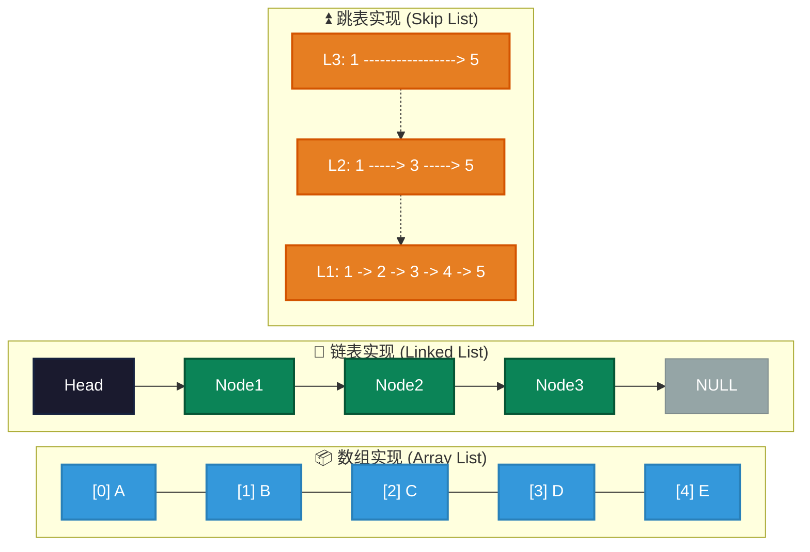
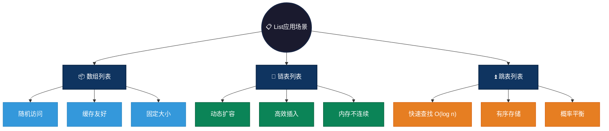

# List 数据结构概述

  `List` 是一种线性数据结构，表示一组有序的元素集合。主要有数组和链表两种实现。列表可以是线性的或非线性的，List 中的元素通常是按顺序存储的，可以通过索引进行直接访问。
  
  在大多数编程语言中，List 是常见的内置数据结构。不同的编程语言对列表有不同的实现方式，例如 Python 的 `list` 是动态数组，而 C++ 的 `std::list` 是双向链表。
  
## List结构特点
  
  **有序性：** List 中的元素按照插入顺序排列，每个元素都有一个固定的索引位置。
  **随机访问：** 可以通过索引快速访问任意位置的元素，时间复杂度为 O(1)。
  **动态大小：** 在许多实现中，List 的大小可以动态调整，能够根据需要自动扩展或收缩。
  **元素类型：** 可以存储相同类型或不同类型的数据元素，具体取决于编程语言的支持。
  
  **常见操作**
  - 访问元素：通过索引访问特定位置的元素。
  - 添加元素：在指定位置或末尾添加新元素。
  - 删除元素：删除指定位置的元素。
  - 修改元素：更新指定位置的元素值。
  - 查找元素：查找特定值的元素位置。
  - **排序**：对 List 中的元素进行排序。
  - **遍历**：逐个访问 List 中的所有元素。

## 图形结构示例

1. **数组结构（Array List）**
```java
[1] [2] [3] [4] [5] // 固定大小或动态扩容
```

2. **链表结构（Linked List）**
```c
Head -> Node1 -> Node2 -> Node3 -> NULL // 单向链表，其他链表请见linked目录
```

3. **跳表结构（Skip List）**
```c
Level 3:  1 ------------------------> 5
Level 2:  1 ---------> 3 ---------> 5
Level 1:  1 -> 2 -> 3 -> 4 -> 5
```

### 图形结构



## List 数据结构实现

1. **数组实现（Array List）**
   - 使用固定大小或动态扩容得方式存储元素，支持通过索引快速访问元素。array请查看[array](./array)目录。
   - **优点**：支持随机访问。
   - **缺点**：插入和删除时可能需要移动大量元素。

2. **链表实现（Linked List）**
   - 节点通过指针链接，每个节点包含数据和指向下一个节点的指针。可以是单向链表、双向链表或循环链表。  Linked List请查看[linked](./linked)目录。
   - **优点**：插入和删除操作高效。
   - **缺点**：不能直接随机访问元素。

3. **跳表（Skip List）**
   - 一种多层次的链表，允许快速查找。
   - **优点**：快速查找，性能接近平衡树。
   - **缺点**：实现复杂，内存开销大。

## 不同语言中的 List 数据结构对比

在不同的编程语言中，`List`（有序集合）有不同的实现。虽然基本功能相似，但各语言的实现细节、性能和特性有所不同。以下是对 C、Go、Java、JavaScript、Python 和 Rust 等语言中 `List` 数据结构的详细对比。

## List结构对比表

| 特性/语言       | C 语言                     | C++（std::list）        | Go                      | Java                     | JavaScript              | Python                | Rust                     |
|-----------------|----------------------------|-------------------------|--------------------------|--------------------------|-------------------------|------------------------|--------------------------|
| **实现方式**    | 动态数组（手动管理内存）     | 双向链表（`std::list`）  | 切片（Slice，动态数组）  | `ArrayList`（动态数组）  | 数组（动态数组）         | 动态数组（`list`）      | `Vec`（动态数组）         |
| **内存管理**    | 手动管理内存               | 自动管理（STL）          | 自动扩展，垃圾回收        | 自动扩展，垃圾回收        | 自动扩展，垃圾回收       | 自动扩展，垃圾回收      | 自动扩展，所有权管理       |
| **类型支持**    | 无类型检查                 | 泛型（C++11及以上）      | 强类型（切片）            | 泛型（`ArrayList<T>`）    | 动态类型                 | 动态类型                | 强类型（`Vec<T>`）        |
| **访问性能**    | O(1)（索引访问）            | O(n)（链表访问）         | O(1)（切片访问）          | O(1)（数组访问）          | O(1)（数组访问）         | O(1)（数组访问）        | O(1)（数组访问）          |
| **插入/删除性能**| O(n)（中间插入/删除）       | O(1)（在头/尾插入/删除） | O(n)（中间插入/删除）     | O(n)（中间插入/删除）     | O(n)（中间插入/删除）    | O(n)（中间插入/删除）   | O(n)（中间插入/删除）    |
| **动态扩展**    | 不支持自动扩展             | 支持（STL自动扩展）      | 支持自动扩展              | 支持自动扩展              | 支持自动扩展             | 支持自动扩展            | 支持自动扩展             |
| **内存安全**    | 无                         | 有（STL内存管理）        | 是（垃圾回收）            | 是（垃圾回收）            | 否（无类型检查）         | 否（无类型检查）        | 是（所有权管理，内存安全） |

## 不同语言List实现总结

- C 语言没有内建的 `List` 类型，通常使用数组来模拟实现 `List`。C 语言数组的大小在编译时确定，或者通过 `malloc` 进行动态分配。
- C++内置`std::list` 是双向链表，适合频繁插入和删除操作，但访问性能较差。
- Go 语言中的 `List` 通过切片（`slice`）来实现，切片是 Go 中非常灵活的数据结构，允许动态扩展。
- Java 提供了 `ArrayList` 类来实现动态数组。ArrayList 是 Java 集合框架的一部分，可以动态扩展，支持很多常见的操作。
- JavaScript 没有 `list`，但其数组是一个动态大小的数据结构，支持多种操作。由于其灵活性，JavaScript 数组被广泛用作实现 List 数据结构。
- Python 提供了内建的 `list` 类型，作为动态数组实现。Python 列表在许多方面都非常强大和灵活，支持动态扩展、内建方法以及对不同数据类型的支持。
- Rust 中的 `List` 通常使用 `Vec` 来实现。`Vec` 是一个动态大小的数组，能够高效地进行内存管理，具有相较于其他语言更高的内存安全性。

---

# List 应用场景

1. **数组列表（Array List）**：适用于随机访问频繁的场景。
   - **数据缓存**：需要频繁按索引访问的缓存数据
   - **批量处理**：顺序读取大量数据，如日志分析、报表生成
   - **查找表**：预计算结果存储，支持O(1)索引访问

2. **链表列表（Linked List）**：适用于频繁插入删除的场景。
   - **任务队列**：需要频繁入队出队的异步任务处理
   - **音乐播放列表**：支持前后切换、插入删除歌曲
   - **撤销重做栈**：编辑器使用双向链表实现无限级撤销

3. **跳表（Skip List）**：适用于需要快速查找的有序数据。
   - **有序集合**：Redis Sorted Set使用跳表实现，支持范围查询
   - **排行榜**：游戏排行榜按分数排序，快速获取前N名
   - **索引结构**：数据库索引替代B树，实现更简单

### List应用场景可视化



---

# 简单 List 示例

## C 语言（使用数组）

```c
#include <stdio.h>

int main() {
    // 定义一个包含 3 个元素的数组
    int list[] = {1, 2, 3};
    int n = sizeof(list) / sizeof(list[0]);

    // 打印数组内容
    for (int i = 0; i < n; i++) {
        printf("%d -> ", list[i]);
    }
    printf("NULL\n");

    return 0;
}
```

## Java 语言（使用ArrayList）
```java
import java.util.ArrayList;

public class Main {
    public static void main(String[] args) {
        // 创建 ArrayList 并添加元素
        ArrayList<Integer> list = new ArrayList<>();
        list.add(1);
        list.add(2);
        list.add(3);

        // 打印 ArrayList 内容
        for (Integer item : list) {
            System.out.print(item + " -> ");
        }
        System.out.println("NULL");
    }
}
```

## Go语言（使用内置切片 slice）
```go
package main

import "fmt"

func main() {
    // 定义一个包含 3 个元素的切片
    list := []int{1, 2, 3}

    // 打印切片内容
    for _, item := range list {
        fmt.Printf("%d -> ", item)
    }
    fmt.Println("NULL")
}
```

##  JavaScript语言（使用 Array）
```js
// 定义一个包含 3 个元素的数组
let list = [1, 2, 3];

// 打印数组内容
list.forEach(item => {
    process.stdout.write(item + " -> ");
});
console.log("NULL");
```

## Python语言（使用内置的 list）
```python
# 定义一个包含 3 个元素的列表
list = [1, 2, 3]

# 打印列表内容
for item in list:
    print(item, end=" -> ")
print("NULL")
```

## Rust语言（使用 Vec）
```rust
fn main() {
    // 创建一个包含 3 个元素的 Vec
    let list = vec![1, 2, 3];

    // 打印 Vec 内容
    for item in &list {
        print!("{} -> ", item);
    }
    println!("NULL");
}
```