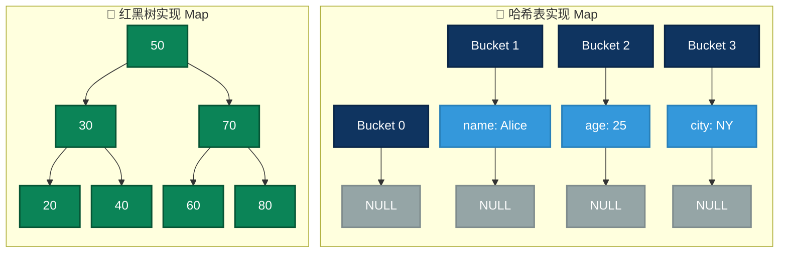
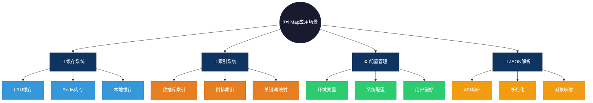

# Map 数据结构概述

`Map`（映射）是一种键值对（key-value）存储的数据结构，允许通过唯一的键快速查找对应的值。与数组不同，`Map` 并不依赖于索引访问，而是使用键进行高效的哈希查找或树形查找。

# 图形结构示例
```c
{ "name": "Alice", "age": 25, "city": "New York" }
// 在内存中可能存储为（哈希表示例）：
// [哈希桶1] -> (name, Alice) [哈希桶2] -> (age, 25) [哈希桶3] -> (city, New York)
```

### 图形结构



---

# Map的特点

## 优点
- **快速查找**：通常 `O(1)`（哈希表）或 `O(log n)`（红黑树）。
- **键值映射**：适合存储关联数据，如用户信息、配置等。
- **动态扩展**：多数 `Map` 实现支持自动扩容。

## 缺点
- **内存占用高**：哈希表需要额外存储哈希值和指针。
- **无序存储**（哈希表）/ **较慢的插入和删除**（红黑树）。
- **哈希冲突**可能会降低性能。

# Map操作方式

- **插入元素**：`map.put(key, value)`（Java） / `map[key] = value`（Python、JavaScript）
- **查找元素**：`map.get(key)`（Java、Go） / `map[key]`（Python、JavaScript）
- **删除元素**：`map.remove(key)`（Java） / `delete map[key]`（JavaScript）

# Map 在不同语言中的特性对比

| 语言   | 主要实现         | 底层结构         | 是否有序 | 线程安全性     | 主要操作方式                          |
|--------|----------------|----------------|---------|--------------|----------------------------------|
| C      | 手动实现（如哈希表） | 数组 + 链地址法 | 无序    | 需手动加锁    | `put(map, key, value)` / `get(map, key)` |
| C++    | `std::unordered_map` / `std::map` | 哈希表 / 红黑树 | `map` 有序，`unordered_map` 无序 | 非线程安全（需 `std::mutex`） | `map[key] = value` / `map.find(key)` |
| Java   | `HashMap` / `TreeMap` / `ConcurrentHashMap` | 哈希表 / 红黑树 | `TreeMap` 有序，`HashMap` 无序 | `ConcurrentHashMap` 线程安全 | `map.put(key, value)` / `map.get(key)` |
| Go     | `map` 内置类型 | 哈希表         | 无序    | 需加锁 (`sync.Mutex`) | `map[key] = value` / `val, ok := map[key]` |
| JavaScript | `Map` / `Object` | 哈希表         | `Map` 保持插入顺序 | 非线程安全     | `map.set(key, value)` / `map.get(key)` |
| Python | `dict`（3.7+ 保持顺序） | 哈希表         | 有序（3.7+） | 非线程安全（需 `threading.Lock`） | `dict[key] = value` / `dict.get(key)` |
| Rust   | `HashMap` / `BTreeMap` | 哈希表 / B-树 | `BTreeMap` 有序 | 非线程安全（需 `Mutex<HashMap>`） | `map.insert(key, value)` / `map.get(&key)` |

## Map不同语言说明
1. **底层结构**：
   - `unordered_map`（C++）、`HashMap`（Java/Rust）、`dict`（Python）、`Go map`、`JavaScript Map` **基于哈希表**，支持 `O(1)` 平均查找时间。
   - `map`（C++）、`TreeMap`（Java）、`BTreeMap`（Rust） **基于红黑树或 B-树**，查找时间 `O(log n)`，并保持 **键的有序性**。

2. **是否有序**：
   - `std::map`（C++）、`Java TreeMap`、`Rust BTreeMap`、`Python dict`（3.7+）、`JavaScript Map` **有序**。
   - `unordered_map`（C++）、`Java HashMap`、`Go map`、`C 手动实现哈希表` **无序**。

3. **线程安全性**：
   - `Java ConcurrentHashMap` **线程安全**。
   - `Rust HashMap` 可使用 `Mutex<HashMap>` 保证线程安全。
   - `C++ std::unordered_map` / `std::map` **非线程安全**，需 `std::mutex` 保护。

4. **主要操作**：
   - **插入/更新**：`put()` / `insert()` / `set()` / `map[key] = value`
   - **访问值**：`get()` / `find()` / `map[key]`
   - **删除键**：`remove()` / `erase()` / `delete()`

### 总结：
- **高效查找**：`unordered_map`（C++）、`HashMap`（Java）、`Go map`、`dict`（Python）。
- **保持有序**：`std::map`（C++）、`TreeMap`（Java）、`BTreeMap`（Rust）。
- **线程安全**：`ConcurrentHashMap`（Java）、`Mutex<HashMap>`（Rust）。

# Map、List、Queue、Set、Tree、Graph 对比

| 数据结构  | 主要用途                 | 底层结构         | 是否有序 | 是否允许重复元素 | 主要操作                           |
|----------|------------------------|----------------|---------|----------------|--------------------------------|
| **List**  | 顺序存储，支持索引访问      | 数组 / 链表     | 有序    | 允许             | 插入 (`append/push`)、访问 (`get[index]`)、删除 (`remove/pop`) |
| **Queue** | 先进先出（FIFO）           | 链表 / 环形缓冲区  | 有序    | 允许             | 入队 (`enqueue/push`)、出队 (`dequeue/pop`) |
| **Set**   | 唯一集合，去重             | 哈希表 / 红黑树  | 无序 / 有序 | 不允许           | 插入 (`insert/add`)、删除 (`remove/delete`)、查找 (`contains`) |
| **Map**   | 键值对存储，快速查找       | 哈希表 / B-树  | 无序 / 有序 | Key 不重复，Value 可重复 | 插入 (`put/set/insert`)、查找 (`get/find`)、删除 (`remove/delete`) |
| **Tree**  | 层次结构存储，适用于搜索    | 二叉树 / AVL 树 / B-树 | 有序    | 允许             | 插入 (`insert/add`)、删除 (`remove/delete`)、查找 (`find/search`) |
| **Graph** | 复杂关系建模，网络结构      | 邻接表 / 邻接矩阵  | 无序 / 有序 | 允许             | 添加节点 (`addNode`)、添加边 (`addEdge`)、遍历 (`DFS/BFS`) |


# Map应用场景

1. **缓存（Cache）**：快速存储和检索数据，如 LRU 缓存。
   - **LRU缓存**：哈希表+双向链表实现O(1)访问的最近最少使用缓存
   - **Redis内存**：Key-Value存储系统，支持字符串、列表、集合等多种数据结构
   - **本地缓存**：Guava Cache/Caffeine使用Map实现进程内缓存
   - **配置缓存**：将配置项缓存在内存中，避免频繁读取文件/数据库

2. **索引（Indexing）**：数据库索引或倒排索引。
   - **数据库索引**：哈希索引直接定位到数据行，O(1)时间复杂度
   - **倒排索引**：搜索引擎使用Map存储词到文档列表的映射
   - **关键词映射**：分词后将关键词映射到出现位置，支持快速全文检索

3. **计数统计**：如单词频率统计。
   - **词频统计**：MapReduce使用Map统计单词出现次数
   - **PV/UV统计**：网站访问计数，去重后计算独立访客
   - **限流计数**：滑动窗口计数器，统计单位时间内的请求数

4. **关联存储**：如 JSON 解析、配置文件存储。
   - **JSON解析**：FastAPI/Jackson将JSON映射为Map/Object
   - **环境变量**：os.environ存储系统环境变量键值对
   - **用户偏好**：存储用户设置，如主题、语言、通知开关

### Map应用场景可视化



---


## c语言实现
```c
#include <stdio.h>
#include <stdlib.h>
#include <string.h>

#define TABLE_SIZE 100

typedef struct Entry {
    char *key;
    int value;
    struct Entry *next;
} Entry;

typedef struct {
    Entry *buckets[TABLE_SIZE];
} HashMap;

unsigned int hash(const char *key) {
    unsigned int hash = 0;
    while (*key) hash = (hash * 31) + *key++;
    return hash % TABLE_SIZE;
}

void put(HashMap *map, const char *key, int value) {
    unsigned int index = hash(key);
    Entry *newEntry = (Entry *)malloc(sizeof(Entry));
    newEntry->key = strdup(key);
    newEntry->value = value;
    newEntry->next = map->buckets[index];
    map->buckets[index] = newEntry;
}

int get(HashMap *map, const char *key) {
    unsigned int index = hash(key);
    Entry *entry = map->buckets[index];
    while (entry) {
        if (strcmp(entry->key, key) == 0) return entry->value;
        entry = entry->next;
    }
    return -1; // Not found
}

int main() {
    HashMap map = {0};
    put(&map, "Alice", 25);
    printf("Alice's age: %d\n", get(&map, "Alice"));
    return 0;
}
```

## java语言使用
```java
import java.util.HashMap;

public class MapExample {
    public static void main(String[] args) {
        HashMap<String, Integer> map = new HashMap<>();
        map.put("Alice", 25);
        System.out.println("Alice's age: " + map.get("Alice"));
    }
}
```

## go语言使用
```go
package main

import "fmt"

func main() {
    m := make(map[string]int)
    m["Alice"] = 25
    fmt.Println("Alice's age:", m["Alice"])
}
```

## JS语言使用
```js
const map = new Map();
map.set("Alice", 25);
console.log("Alice's age:", map.get("Alice"));
```