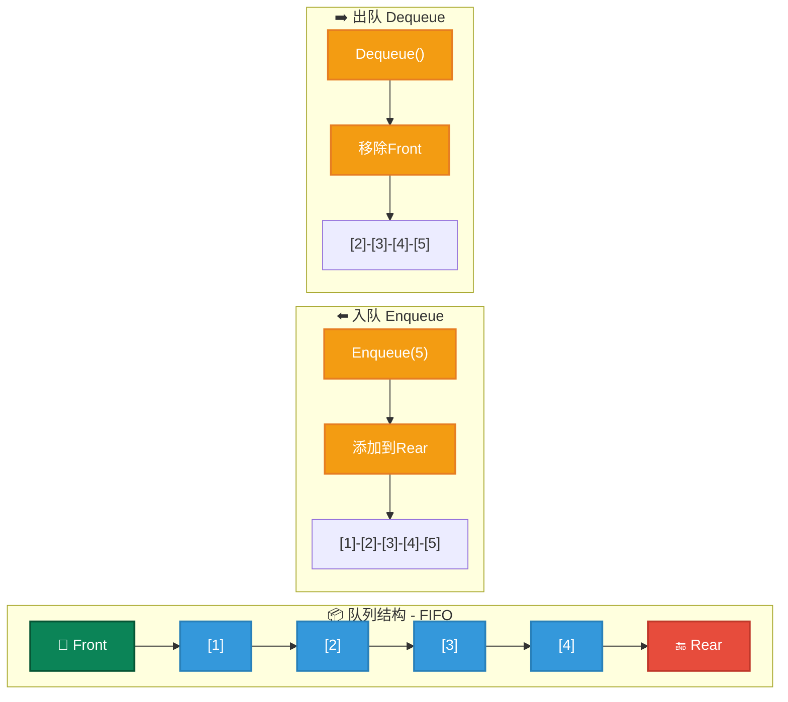
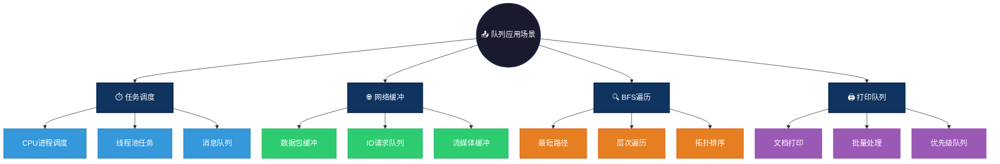

# Queue 数据结构概述

Queue（队列）是一种遵循先进先出（FIFO, First In First Out）原则的数据结构。即，第一个插入队列的元素最先被移除。队列通常用于处理需要按照顺序处理的任务。

# 图形结构示例
```c
Front -> [1, 2, 3, 4, 5] <- Rear
```

- 队列的插入（入队）发生在队列的尾部（Rear）。
- 队列的删除（出队）发生在队列的头部（Front）。

### 图形结构



---

# 特点

## 优点
- **先进先出**：能够保证任务按照接收到的顺序执行。
- **高效性**：队列操作（入队和出队）具有O(1)的时间复杂度。

## 缺点
- **访问受限**：只能访问队列的头部元素，不能直接访问队列中间或尾部的元素。
- **存储空间有限**：如果队列存储在数组中，可能会面临空间限制，导致内存浪费或容量不足。

# 操作方式

- **入队（Enqueue）**：将一个元素加入队列的尾部。
- **出队（Dequeue）**：将队列头部的元素移除并返回。
- **查看队列头部元素（Peek/Front）**：返回队列头部的元素但不移除它。
- **判断队列是否为空（IsEmpty）**：判断队列中是否有元素。
- **获取队列长度（Size）**：返回队列中元素的数量。


# 队列与栈、链表等数据结构的区别

| 特性           | 队列 (Queue)                | 栈 (Stack)                   | 链表 (Linked List)            |
|----------------|-----------------------------|------------------------------|------------------------------|
| **基本操作**   | 入队（Enqueue）、出队（Dequeue） | 入栈（Push）、出栈（Pop）      | 插入、删除、遍历（Insert/Delete/Traverse）|
| **数据存储方式**| 先进先出（FIFO）             | 后进先出（LIFO）              | 节点存储，通常每个节点包含数据和指向下一个节点的指针 |
| **访问位置**   | 只能访问队头（Front）         | 只能访问栈顶（Top）            | 可随机访问节点                |
| **操作时间复杂度**| O(1)                         | O(1)                          | O(n)（对于查找），O(1)（插入、删除）|
| **空间使用**   | 固定容量（基于数组或链表实现） | 固定容量（基于数组或链表实现） | 动态存储，灵活调整大小         |
| **应用场景**   | 任务调度、广度优先搜索、缓冲区 | 操作系统栈、深度优先搜索      | 动态数据结构、操作系统内存管理|
| **是否支持随机访问** | 不支持（只能访问队头元素）    | 不支持（只能访问栈顶元素）     | 支持（可以按节点顺序遍历）    |
| **插入删除操作位置** | 头部/尾部（根据实现）         | 只在栈顶（Top）               | 任意位置（前面或后面）        |
| **常见实现方式** | 数组或链表实现                | 数组或链表实现                | 数组、双向链表、单向链表等    |


# 应用场景

1. **任务调度**：操作系统中的进程调度，任务按顺序执行。
   - **CPU进程调度**：操作系统使用多级反馈队列管理进程优先级，如 Linux CFS 调度器
   - **线程池任务队列**：Java ThreadPoolExecutor 使用阻塞队列管理待执行任务
   - **消息队列**：RabbitMQ/Kafka 使用队列实现异步消息传递，削峰填谷

2. **缓冲区管理**：网络数据包缓冲、打印任务队列等。
   - **网络数据包缓冲**：TCP 协议栈使用队列缓存待发送/接收的数据包
   - **IO请求队列**：磁盘调度算法（如电梯算法）使用队列管理读写请求
   - **流媒体缓冲**：视频播放器使用队列预加载数据，保证流畅播放

3. **广度优先搜索**：图的遍历过程中，队列用于维护待访问的节点。
   - **最短路径算法**：Dijkstra/BFS 使用队列维护待探索节点
   - **层次遍历**：二叉树层序遍历使用队列记录每层节点
   - **拓扑排序**：Kahn 算法使用队列管理入度为 0 的节点

### 应用场景可视化



---

# 简单例子

### C 语言实现队列

```c
#include <stdio.h>
#include <stdlib.h>

#define MAX 5

typedef struct {
    int items[MAX];
    int front, rear;
} Queue;

void initQueue(Queue *q) {
    q->front = -1;
    q->rear = -1;
}

int isEmpty(Queue *q) {
    return q->front == -1;
}

int isFull(Queue *q) {
    return q->rear == MAX - 1;
}

void enqueue(Queue *q, int value) {
    if (isFull(q)) {
        printf("Queue is full\n");
        return;
    }
    if (q->front == -1) {
        q->front = 0;
    }
    q->rear++;
    q->items[q->rear] = value;
}

int dequeue(Queue *q) {
    if (isEmpty(q)) {
        printf("Queue is empty\n");
        return -1;
    }
    int value = q->items[q->front];
    for (int i = 0; i < q->rear; i++) {
        q->items[i] = q->items[i + 1];
    }
    q->rear--;
    if (q->rear == -1) {
        q->front = -1;
    }
    return value;
}

int peek(Queue *q) {
    if (isEmpty(q)) {
        printf("Queue is empty\n");
        return -1;
    }
    return q->items[q->front];
}

int main() {
    Queue q;
    initQueue(&q);

    enqueue(&q, 1);
    enqueue(&q, 2);
    enqueue(&q, 3);

    printf("Front: %d\n", peek(&q));
    printf("Dequeue: %d\n", dequeue(&q));
    printf("Front after dequeue: %d\n", peek(&q));

    return 0;
}
```

### java 语言实现队列

```java
import java.util.LinkedList;

class Queue {
    private LinkedList<Integer> list;

    public Queue() {
        list = new LinkedList<>();
    }

    // 入队
    public void enqueue(int value) {
        list.addLast(value);
    }

    // 出队
    public int dequeue() {
        if (isEmpty()) {
            System.out.println("Queue is empty");
            return -1;
        }
        return list.removeFirst();
    }

    // 查看队列头部元素
    public int peek() {
        if (isEmpty()) {
            System.out.println("Queue is empty");
            return -1;
        }
        return list.getFirst();
    }

    // 判断队列是否为空
    public boolean isEmpty() {
        return list.isEmpty();
    }

    public static void main(String[] args) {
        Queue q = new Queue();
        q.enqueue(1);
        q.enqueue(2);
        q.enqueue(3);

        System.out.println("Front: " + q.peek());
        System.out.println("Dequeue: " + q.dequeue());
        System.out.println("Front after dequeue: " + q.peek());
    }
}

```

### js 语言实现队列

```js
class Queue {
    constructor() {
        this.items = [];
    }

    // 入队
    enqueue(value) {
        this.items.push(value);
    }

    // 出队
    dequeue() {
        if (this.isEmpty()) {
            console.log("Queue is empty");
            return null;
        }
        return this.items.shift();
    }

    // 查看队列头部元素
    peek() {
        if (this.isEmpty()) {
            console.log("Queue is empty");
            return null;
        }
        return this.items[0];
    }

    // 判断队列是否为空
    isEmpty() {
        return this.items.length === 0;
    }
}

// 测试
const queue = new Queue();
queue.enqueue(1);
queue.enqueue(2);
queue.enqueue(3);

console.log("Front:", queue.peek());
console.log("Dequeue:", queue.dequeue());
console.log("Front after dequeue:", queue.peek());

```

### go 语言实现队列

```go
package main

import "fmt"

type Queue struct {
	items []int
}

func (q *Queue) enqueue(value int) {
	q.items = append(q.items, value)
}

func (q *Queue) dequeue() int {
	if len(q.items) == 0 {
		fmt.Println("Queue is empty")
		return -1
	}
	front := q.items[0]
	q.items = q.items[1:]
	return front
}

func (q *Queue) peek() int {
	if len(q.items) == 0 {
		fmt.Println("Queue is empty")
		return -1
	}
	return q.items[0]
}

func main() {
	q := &Queue{}
	q.enqueue(1)
	q.enqueue(2)
	q.enqueue(3)

	fmt.Println("Front:", q.peek())
	fmt.Println("Dequeue:", q.dequeue())
	fmt.Println("Front after dequeue:", q.peek())
}

```