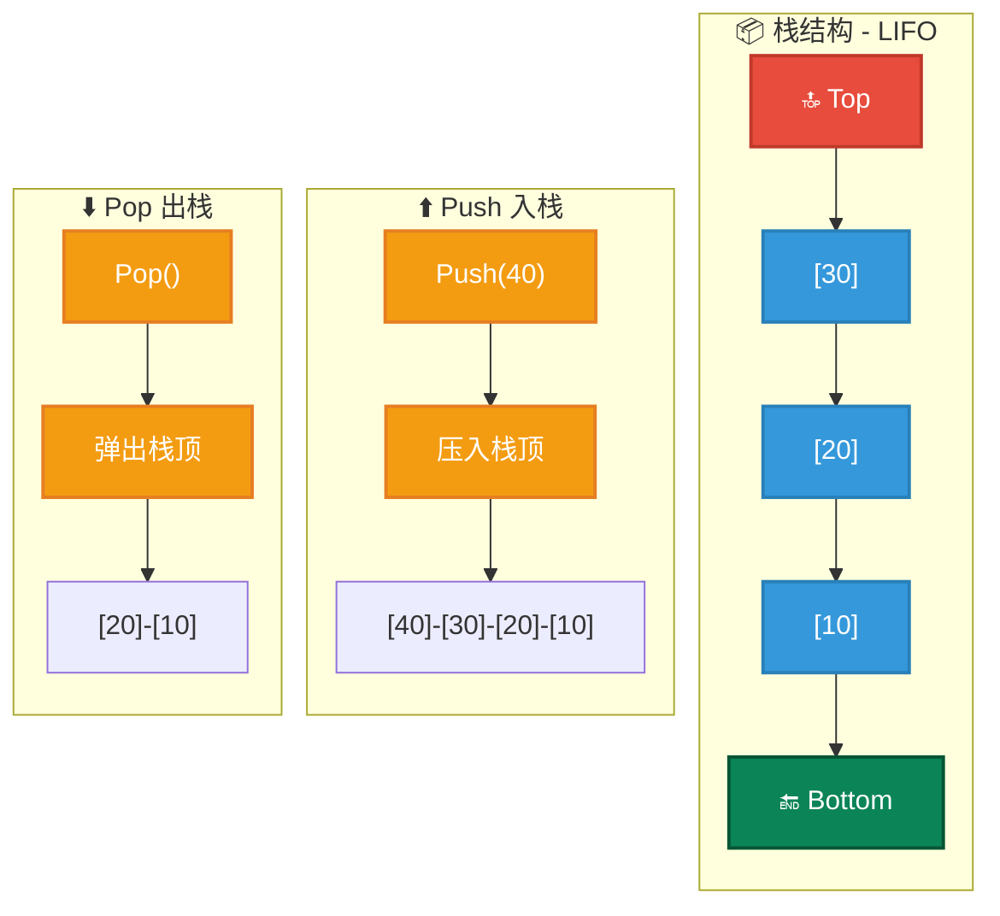
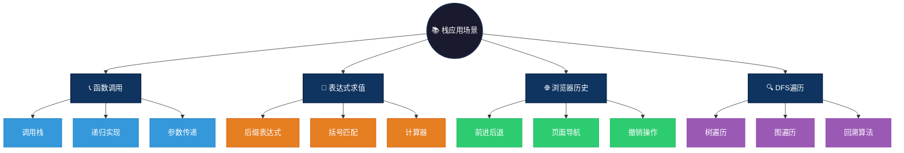

# Stack 数据结构概述

栈（Stack）是一种数据结构，它遵循后进先出（LIFO，Last In First Out）原则。栈的基本操作是推入（push）和弹出（pop）。在栈中，最后一个加入的元素将是第一个被移除的元素。栈广泛应用于程序的递归调用、表达式求值、括号匹配等场景。

# 图形结构示例
```c
  操作：Push(30)
  
  栈顶
   |
   V
  ---------------
  |    30       |  <- 新元素压入栈顶
  |    20       |
  |    10       |
  ---------------
  栈底
```

### 图形结构



---

# Stack特点

## 优点
- **简单高效**：栈的操作仅包括 push 和 pop，两种基本操作，且这些操作通常是 O(1) 的时间复杂度。
- **内存使用高效**：栈的内存分配和释放非常灵活，操作简单直接。

## 缺点
- **限制性**：栈只有一个访问点，无法像队列或数组那样随机访问元素，只能访问栈顶元素。
- **无法进行复杂的搜索**：由于栈只能访问栈顶元素，因此无法高效地进行元素查找。

# 操作方式
栈的基本操作包括：
1. **push**：将元素压入栈顶。
2. **pop**：移除栈顶元素并返回。
3. **peek**（或 top）：查看栈顶元素，但不移除。
4. **isEmpty**：检查栈是否为空。

# 应用场景

1. **函数调用栈**：程序在执行函数调用时，会将每次函数调用的相关信息压入栈中。
   - **调用栈管理**：存储局部变量、返回地址、参数等，函数返回时自动恢复现场
   - **递归实现**：系统使用栈保存每层递归的状态，支持函数自我调用
   - **异常处理**：try-catch 机制使用栈保存异常处理上下文

2. **表达式求值**：编译器和计算器中使用栈处理表达式。
   - **括号匹配**：使用栈检查表达式中括号是否成对出现，如 `(){[]}`
   - **后缀表达式计算**：将中缀表达式转为后缀（逆波兰），再用栈计算结果
   - **计算器实现**：iOS/Android 计算器应用使用栈处理运算符优先级

3. **浏览器历史记录**：浏览器的前进和后退功能通常通过栈来实现。
   - **页面导航栈**：双栈结构实现前进/后退功能，backStack 和 forwardStack
   - **撤销操作**：编辑器使用栈记录操作历史，支持 Ctrl+Z 撤销
   - **路由历史**：Vue/React Router 使用栈管理页面跳转历史

4. **深度优先搜索（DFS）**：在图或树的遍历中，深度优先搜索经常使用栈来辅助遍历。
   - **树遍历**：前序/中序/后序遍历的非递归实现使用显式栈
   - **图遍历**：DFS 遍历图时使用栈保存待访问节点，避免递归深度过大
   - **回溯算法**：迷宫求解、N皇后问题使用栈保存路径状态

### 应用场景可视化



---

# Stack简单例子

## c 语言
```c
#include <stdio.h>
#include <stdlib.h>

#define MAX 10

typedef struct {
    int arr[MAX];
    int top;
} Stack;

// 初始化栈
void initStack(Stack* s) {
    s->top = -1;
}

// 判断栈是否为空
int isEmpty(Stack* s) {
    return s->top == -1;
}

// 判断栈是否满
int isFull(Stack* s) {
    return s->top == MAX - 1;
}

// 入栈
void push(Stack* s, int value) {
    if (isFull(s)) {
        printf("Stack is full!\n");
        return;
    }
    s->arr[++(s->top)] = value;
    printf("%d pushed to stack\n", value);
}

// 出栈
int pop(Stack* s) {
    if (isEmpty(s)) {
        printf("Stack is empty!\n");
        return -1;
    }
    return s->arr[(s->top)--];
}

// 查看栈顶元素
int peek(Stack* s) {
    if (isEmpty(s)) {
        printf("Stack is empty!\n");
        return -1;
    }
    return s->arr[s->top];
}

int main() {
    Stack s;
    initStack(&s);

    push(&s, 10);
    push(&s, 20);
    push(&s, 30);
    
    printf("Top element is %d\n", peek(&s));

    printf("Popped element is %d\n", pop(&s));
    printf("Popped element is %d\n", pop(&s));

    return 0;
}
```

## java 语言
```java
public class Stack {
    private static final int MAX = 10;
    private int[] arr;
    private int top;

    public Stack() {
        arr = new int[MAX];
        top = -1;
    }

    // 判断栈是否为空
    public boolean isEmpty() {
        return top == -1;
    }

    // 判断栈是否满
    public boolean isFull() {
        return top == MAX - 1;
    }

    // 入栈
    public void push(int value) {
        if (isFull()) {
            System.out.println("Stack is full!");
            return;
        }
        arr[++top] = value;
        System.out.println(value + " pushed to stack");
    }

    // 出栈
    public int pop() {
        if (isEmpty()) {
            System.out.println("Stack is empty!");
            return -1;
        }
        return arr[top--];
    }

    // 查看栈顶元素
    public int peek() {
        if (isEmpty()) {
            System.out.println("Stack is empty!");
            return -1;
        }
        return arr[top];
    }

    public static void main(String[] args) {
        Stack s = new Stack();
        s.push(10);
        s.push(20);
        s.push(30);

        System.out.println("Top element is " + s.peek());

        System.out.println("Popped element is " + s.pop());
        System.out.println("Popped element is " + s.pop());
    }
}
```

## go 语言
```go
package main

import "fmt"

const MAX = 10

type Stack struct {
    arr [MAX]int
    top int
}

// 初始化栈
func (s *Stack) init() {
    s.top = -1
}

// 判断栈是否为空
func (s *Stack) isEmpty() bool {
    return s.top == -1
}

// 判断栈是否满
func (s *Stack) isFull() bool {
    return s.top == MAX-1
}

// 入栈
func (s *Stack) push(value int) {
    if s.isFull() {
        fmt.Println("Stack is full!")
        return
    }
    s.top++
    s.arr[s.top] = value
    fmt.Printf("%d pushed to stack\n", value)
}

// 出栈
func (s *Stack) pop() int {
    if s.isEmpty() {
        fmt.Println("Stack is empty!")
        return -1
    }
    value := s.arr[s.top]
    s.top--
    return value
}

// 查看栈顶元素
func (s *Stack) peek() int {
    if s.isEmpty() {
        fmt.Println("Stack is empty!")
        return -1
    }
    return s.arr[s.top]
}

func main() {
    var s Stack
    s.init()

    s.push(10)
    s.push(20)
    s.push(30)

    fmt.Println("Top element is", s.peek())

    fmt.Println("Popped element is", s.pop())
    fmt.Println("Popped element is", s.pop())
}

```

## js 语言
```js
class Stack {
    constructor() {
        this.arr = [];
    }

    // 判断栈是否为空
    isEmpty() {
        return this.arr.length === 0;
    }

    // 入栈
    push(value) {
        this.arr.push(value);
        console.log(`${value} pushed to stack`);
    }

    // 出栈
    pop() {
        if (this.isEmpty()) {
            console.log("Stack is empty!");
            return null;
        }
        return this.arr.pop();
    }

    // 查看栈顶元素
    peek() {
        if (this.isEmpty()) {
            console.log("Stack is empty!");
            return null;
        }
        return this.arr[this.arr.length - 1];
    }
}

const stack = new Stack();
stack.push(10);
stack.push(20);
stack.push(30);

console.log("Top element is " + stack.peek());

console.log("Popped element is " + stack.pop());
console.log("Popped element is " + stack.pop());

```