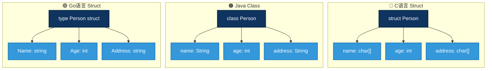
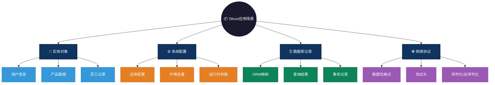

# struct 数据结构概述

`struct`（结构体）是一种复合数据结构，可将多个不同类型的数据组合成一个整体。每个数据字段都有自己的名称和类型。

C、C++、Go、Rust 等语言用 `struct` 来定义数据集合。而 Java、JavaScript、Python、Dart 等语言则使用 `class` 关键字。

`struct` 和 `class` 基本概念相似，`struct` 更轻量，侧重数据组织存储，而 `class` 用于表示更复杂对象或实体，能包含方法，支持继承等。 

# 图形结构示例

```text
+-----------------------+
|      Person           |
+-----------------------+
| name: string          |
| age: int              |
| address: string       |
+-----------------------+
```

### 图形结构



---

# 特点
## 优点
- 封装性：可以将多个相关的数据存储在一个单元中，便于管理。
- 类型安全：每个字段都有明确的数据类型，有助于减少错误。
- 灵活性：可以组合任意类型的数据，形成复杂的数据结构。

## 缺点
- 内存消耗：与简单的数据类型相比，struct 可能会占用更多的内存空间，特别是当结构体包含多个字段时。
- 复杂性增加：当字段较多时，struct 的维护和使用可能变得复杂。

# 操作方式
定义：通过定义结构体类型来创建一个新的 struct。
初始化：可以在定义时或通过构造函数、初始化列表等方式来初始化 struct 的字段。
访问：使用点（.）操作符来访问结构体中的字段。
修改：可以直接修改结构体字段的值。

# 应用场景

1. **表示实体对象**：如 Person、Product、Employee 等实体对象。
   - **用户信息**：存储用户姓名、年龄、邮箱、地址等属性
   - **产品数据**：商品名称、价格、库存、分类等字段封装
   - **员工记录**：工号、部门、职位、入职日期等人事信息

2. **系统配置和参数传递**：将多个相关参数打包在一起，简化函数调用。
   - **应用配置**：数据库连接串、超时时间、线程池大小等配置项
   - **环境变量**：系统环境配置结构化存储，便于管理和传递
   - **运行时参数**：函数多参数封装，避免参数过长，提高可读性

3. **存储数据库记录**：将数据库中的每一行数据映射到 struct 中。
   - **ORM映射**：GORM/Hibernate将数据库表映射为结构体对象
   - **查询结果**：SQL查询结果直接映射到struct字段，简化数据处理
   - **事务记录**：记录操作日志，包含时间、用户、操作类型、影响数据

4. **通信协议**：在网络编程中使用 struct 来打包和解包数据。
   - **数据包格式**：TCP/UDP协议中定义固定格式的消息结构
   - **协议头**：HTTP/IP头信息使用struct解析各个字段
   - **序列化/反序列化**：JSON/XML/Protobuf的数据模型基础

### Struct应用场景可视化



---

# 简单例子
```c
// c语言struct示例
#include <stdio.h>

struct Person {
    char name[50];
    int age;
    char address[100];
};

int main() {
    struct Person p1 = {"Alice", 30, "123 Main St"};
    printf("Name: %s\nAge: %d\nAddress: %s\n", p1.name, p1.age, p1.address);
    return 0;
}
```

```java
// java语言class示例
public class Person {
    String name;
    int age;
    String address;

    public Person(String name, int age, String address) {
        this.name = name;
        this.age = age;
        this.address = address;
    }

    public static void main(String[] args) {
        Person p1 = new Person("Alice", 30, "123 Main St");
        System.out.println("Name: " + p1.name);
        System.out.println("Age: " + p1.age);
        System.out.println("Address: " + p1.address);
    }
}
```

```go
// go语言struct示例
package main

import "fmt"

type Person struct {
    Name    string
    Age     int
    Address string
}

func main() {
    p1 := Person{Name: "Alice", Age: 30, Address: "123 Main St"}
    fmt.Println("Name:", p1.Name)
    fmt.Println("Age:", p1.Age)
    fmt.Println("Address:", p1.Address)
}

```

```js
// js语言class示例
class Person {
    constructor(name, age, address) {
        this.name = name;
        this.age = age;
        this.address = address;
    }
}

const p1 = new Person("Alice", 30, "123 Main St");
console.log(`Name: ${p1.name}`);
console.log(`Age: ${p1.age}`);
console.log(`Address: ${p1.address}`);
```