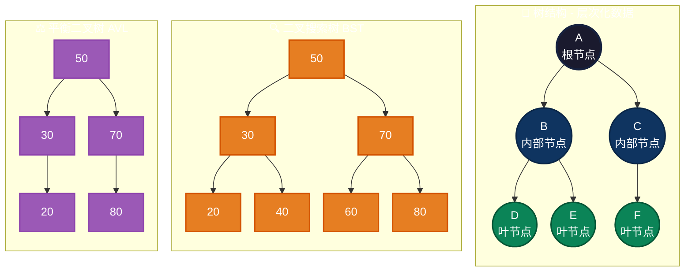
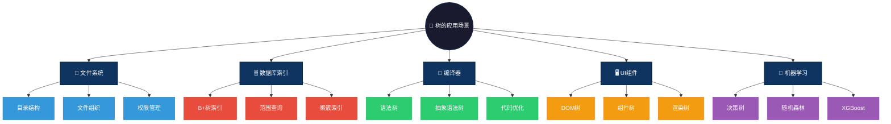

# Tree 数据结构概述

`Tree`（树）是一种层次化的数据结构，通常由节点和边组成。每个节点包含一个值，并且可以有多个子节点。树结构的特点是每个节点有且只有一个父节点，根节点没有父节点。树被广泛应用于许多算法和数据结构中，尤其是在需要表示层级关系、组织结构或递归问题的场景下。与链表、图等其他数据结构不同，树结构具有分支的层次性，节点之间的关系是树形的。

树的基本元素包括：
- **节点（Node）**：树中的基本单位，包含数据和指向子节点的链接。
- **边（Edge）**：连接节点的边，表示父节点与子节点之间的关系。
- **根节点（Root）**：树的顶部节点，没有父节点。
- **叶节点（Leaf）**：没有子节点的节点。

# 图形结构示例
```c
// 下图表示一棵树，其中 `A` 是根节点，
// `B`, `C` 是 `A` 的子节点，
// `D`, `E`, `F` 是叶节点。
    A
   / \
  B   C
 / \   \
D   E   F
```

### 图形结构



---

# tree结构特点

## 优点
- **层次结构**：树结构自然表示层级关系，非常适合表示组织结构、文件系统、分类结构等。
- **查找效率高**：在二叉搜索树等特定树型结构中，查找操作的时间复杂度为 O(log n)，效率较高。
- **递归结构**：树是递归定义的，很多问题（如遍历）可以使用递归方法轻松解决。

## 缺点
- **占用空间较大**：相比链表，树结构通常需要更多的指针存储，每个节点有多个指针需要存储子节点。
- **实现复杂**：某些类型的树（如平衡树）需要维护额外的信息，确保树的平衡性，增加了实现的复杂度。
- **不适合存储线性数据**：如果数据之间没有明确的层次关系，使用树结构可能会导致不必要的复杂度。

# 数据结构对比

| 数据结构 | 基本特性 | 时间复杂度（查找/插入/删除） | 应用场景 |
|----------|----------|----------------------------|----------|
| **Tree** | 层次化结构，每个节点有父节点和多个子节点 | 查找：O(log n)<br>插入：O(log n)<br>删除：O(log n) | 文件系统、数据库索引、语法树 |
| **Heap** | 完全二叉树，用于实现优先队列 | 查找：O(n)<br>插入：O(log n)<br>删除：O(log n) | 优先队列、任务调度 |
| **Stack** | 后进先出（LIFO）结构，元素按顺序插入/删除 | 查找：O(n)<br>插入：O(1)<br>删除：O(1) | 函数调用栈、逆波兰表达式 |
| **Map** | 存储键值对，键唯一 | 查找：O(1)（哈希表）<br>插入：O(1)<br>删除：O(1) | 配置存储、词频统计 |
| **Graph** | 节点与边构成，节点间有复杂关系 | 查找：O(V + E)<br>插入：O(1)<br>删除：O(1) | 网络路由、社交网络、项目调度 |
| **List** | 顺序或链式存储的线性表 | 查找：O(n)<br>插入：O(1)<br>删除：O(1)（链表） | 数据存储、图像处理、内存管理 |


# tree操作方式

## 常见的树操作包括：
- **插入（Insert）**：将一个新的节点插入到树中，通常根据节点的值来确定插入位置（如二叉搜索树）。
- **删除（Delete）**：删除树中的节点，删除操作需要考虑节点的子节点数量及位置。
- **查找（Search）**：查找树中是否包含某个特定值，通常是通过遍历树结构来查找。
- **遍历（Traverse）**：遍历树的节点，有前序遍历、中序遍历、后序遍历、层次遍历等不同方式。

# tree应用场景

1. **文件系统**：文件目录结构通常用树来表示，每个文件夹是一个节点，文件夹下的文件是其子节点。
   - **目录结构**：Linux/Windows文件系统使用B+树管理目录层级
   - **文件组织**：NTFS/EXT4使用树结构索引文件元数据
   - **权限管理**：ACL权限继承使用树结构传递父目录权限

2. **数据库索引**：B 树、B+ 树等树形结构常用于数据库索引，能够高效地查询数据。
   - **B+树索引**：MySQL InnoDB使用B+树存储主键索引，支持范围查询
   - **范围查询**：有序树结构高效支持BETWEEN、>、<等范围操作
   - **聚簇索引**：数据行与索引叶子节点存储在一起，减少IO

3. **编译器解析**：语法树和抽象语法树（AST）广泛应用于编译器中，用来表示程序的结构。
   - **语法树**：编译器前端将源代码解析为树形结构表示
   - **抽象语法树**：去除冗余信息后的精简语法树，用于代码分析和优化
   - **代码优化**：常量传播、死代码消除基于AST进行转换

4. **UI组件**：前端框架使用树结构管理组件层级。
   - **DOM树**：浏览器将HTML解析为DOM树，支持动态操作
   - **组件树**：React/Vue组件嵌套形成树结构，支持props传递
   - **渲染树**：浏览器合成层树，优化渲染性能

5. **机器学习**：决策树算法在AI领域广泛应用。
   - **决策树**：ID3/C4.5/CART算法基于树结构进行分类和回归
   - **随机森林**：集成多棵决策树，提高预测准确率
   - **XGBoost**：梯度提升树算法，Kaggle竞赛常用模型

### Tree应用场景可视化



---

# tree结构简单例子

## c语言tree例子
```c
#include <stdio.h>
#include <stdlib.h>

// 定义节点结构体
struct TreeNode {
    int value;
    struct TreeNode *left;
    struct TreeNode *right;
};

// 创建新节点
struct TreeNode* createNode(int value) {
    struct TreeNode *newNode = (struct TreeNode*) malloc(sizeof(struct TreeNode));
    newNode->value = value;
    newNode->left = newNode->right = NULL;
    return newNode;
}

// 前序遍历
void preorder(struct TreeNode* root) {
    if (root != NULL) {
        printf("%d ", root->value);
        preorder(root->left);
        preorder(root->right);
    }
}

int main() {
    struct TreeNode *root = createNode(1);
    root->left = createNode(2);
    root->right = createNode(3);
    root->left->left = createNode(4);
    root->left->right = createNode(5);

    preorder(root);  // 输出：1 2 4 5 3

    return 0;
}
```

## java语言tree例子
```java
// 定义树节点类
class TreeNode {
    int value;
    TreeNode left, right;

    // 构造函数
    TreeNode(int value) {
        this.value = value;
        left = right = null;
    }
}

public class TreeExample {
    // 前序遍历
    public static void preorder(TreeNode root) {
        if (root != null) {
            System.out.print(root.value + " ");
            preorder(root.left);
            preorder(root.right);
        }
    }

    public static void main(String[] args) {
        TreeNode root = new TreeNode(1);
        root.left = new TreeNode(2);
        root.right = new TreeNode(3);
        root.left.left = new TreeNode(4);
        root.left.right = new TreeNode(5);

        preorder(root);  // 输出：1 2 4 5 3
    }
}
```

## go语言tree例子
```go
package main

import "fmt"

// 定义树节点结构体
type TreeNode struct {
    value int
    left  *TreeNode
    right *TreeNode
}

// 创建新节点
func createNode(value int) *TreeNode {
    return &TreeNode{value: value}
}

// 前序遍历
func preorder(root *TreeNode) {
    if root != nil {
        fmt.Printf("%d ", root.value)
        preorder(root.left)
        preorder(root.right)
    }
}

func main() {
    root := createNode(1)
    root.left = createNode(2)
    root.right = createNode(3)
    root.left.left = createNode(4)
    root.left.right = createNode(5)

    preorder(root)  // 输出：1 2 4 5 3
}

```

## js语言tree例子
```js
class TreeNode {
    constructor(value) {
        this.value = value;
        this.left = null;
        this.right = null;
    }
}

function preorder(root) {
    if (root !== null) {
        console.log(root.value);
        preorder(root.left);
        preorder(root.right);
    }
}

const root = new TreeNode(1);
root.left = new TreeNode(2);
root.right = new TreeNode(3);
root.left.left = new TreeNode(4);
root.left.right = new TreeNode(5);

preorder(root);  // 输出：1 2 4 5 3

```