# 日历（Calendar）

> 日历打印算法，支持打印指定年份的月度日历和范围日历。本目录提供完整的日历计算和格式化打印实现。

## 导航

| [算法原理](#算法原理) | [复杂度分析](#复杂度分析) | [流程图](#流程图) | [实现列表](#实现列表) |

---

## 算法原理

日历计算基于**蔡勒公式（Zeller's Congruence）**或**基于基准日的日期计算**：
1. 确定基准日期（如1900年1月1日，星期一）
2. 计算目标日期与基准日期之间的天数差
3. 通过天数差模7计算星期几
4. 格式化打印日历网格

### 计算步骤

```
1. 计算目标年份之前的闰年数
   闰年数 = (年份-1)/4 - (年份-1)/100 + (年份-1)/400

2. 计算目标月份之前的总天数
   累加各月天数（闰年2月为29天）

3. 计算总天数差
   总天数 = (年份-1900)*365 + 闰年数 + 当月天数偏移

4. 计算星期几
   星期 = (基准日星期 + 总天数) % 7

5. 打印日历
   先打印缩进（首周前的空白）
   再按周打印日期
```

### 闰年判断

```
闰年条件：
- 能被4整除且不能被100整除，或
- 能被400整除
```

---

## 复杂度分析

| 指标 | 复杂度 | 说明 |
|------|--------|------|
| **时间复杂度** | O(1) | 固定计算步骤，与输入无关 |
| **空间复杂度** | O(1) | 仅使用常量存储 |
| **打印复杂度** | O(m) | m为打印月份数 |

---

## 流程图

```mermaid
%%{init: {'flowchart': {'nodeSpacing': 15, 'rankSpacing': 25, 'padding': 5}}}%%
graph LR
    S(["开始"]) --> INIT["基准日设定<br/>1900-1-1 星期一"]
    INIT --> INPUT["输入年月"]
    INPUT --> LEAP{"闰年?"}
    LEAP -->|"是"| DAYS1["2月=29天"]
    LEAP -->|"否"| DAYS2["2月=28天"]
    DAYS1 --> CALC["计算总天数差"]
    DAYS2 --> CALC
    CALC --> WEEK["计算星期几<br/>(总天数%7)"]
    WEEK --> PRINT["打印日历标题<br/>打印星期行"]
    PRINT --> INDENT["打印首周缩进"]
    INDENT --> LOOP["按周打印日期"]
    LOOP --> END(["结束"])

    classDef start fill:#0b8457,color:#fff,stroke:#065535
    classDef decision fill:#1a1a2e,color:#fff,stroke:#16213e
    classDef process fill:#0f3460,color:#fff,stroke:#0a2647

    class S,END start
    class LEAP decision
    class INIT,INPUT,DAYS1,DAYS2,CALC,WEEK,PRINT,INDENT,LOOP process
```



---

## 适用场景

- **日历应用**：桌面日历、日程管理器
- **日期计算**：计算任意日期的星期
- **排程系统**：工作计划、课程表生成
- **节假日安排**：基于日期的自动化处理
- **数据可视化**：时间序列数据展示

---

## 实现列表

| 语言 | 文件名 | 说明 |
|------|--------|------|
| C | [calendar.c](./calendar.c) | 完整日历计算实现 |
| Java | [Calendar.java](./Calendar.java) | 面向对象设计 |
| Go | [calendar.go](./calendar.go) | 时间包应用 |
| Python | [calendar.py](./calendar.py) | 简洁实现 |
| JavaScript | [calendar.js](./calendar.js) | Date对象操作 |
| TypeScript | [calendar.ts](./calendar.ts) | 类型安全版本 |
| Rust | [calendar.rs](./calendar.rs) | 内存安全实现 |

---

## 使用示例

### C 版本
```c
// 打印2024年3月日历
printCalendar(2024, 3);

// 打印2024年1-6月日历
printCalendarRange(2024, 1, 6);
```

### Python 版本
```python
# 打印2024年3月
calendar = Calendar()
calendar.print_month(2024, 3)

# 打印年份
calendar.print_year(2024)
```

---

## 扩展阅读

- 公历（格里高利历）与儒略历的区别
- ISO 8601 标准日期格式
- 不同文化历法的转换（农历、伊斯兰历等）
- 时区处理（UTC、本地时间）
