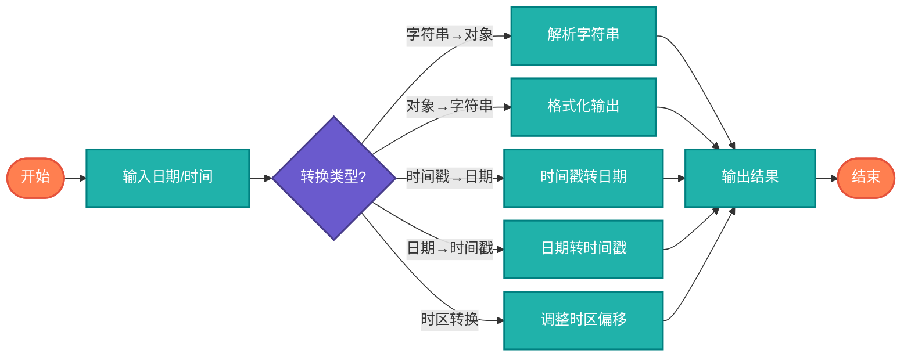

# 日期时间转换（Date-Time Conversion）

> 各种日期时间格式之间的相互转换，包括字符串解析、时区转换、时间戳转换等实用功能。

## 算法原理

### 支持转换类型

| 转换类型 | 说明 | 示例 |
|----------|------|------|
| 字符串↔时间对象 | 解析和格式化日期字符串 | "2024-01-01" ↔ Date |
| 时间戳↔日期 | Unix时间戳与日期互转 | 1704067200 ↔ 2024-01-01 |
| 时区转换 | 不同时区间的时间转换 | UTC ↔ CST |
| 12/24小时制 | 时间格式切换 | 2:30 PM ↔ 14:30 |
| ISO8601格式 | 标准日期格式处理 | 2024-01-01T00:00:00Z |

### 常用格式模式

```
YYYY-MM-DD     - 2024-01-15
DD/MM/YYYY     - 15/01/2024
MM-DD-YYYY     - 01-15-2024
YYYY年MM月DD日 - 2024年01月15日
HH:mm:ss       - 14:30:00
hh:mm:ss a     - 02:30:00 PM
```

---

## 复杂度分析

| 指标 | 复杂度 | 说明 |
|------|--------|------|
| **时间复杂度** | O(1) | 固定格式转换操作 |
| **空间复杂度** | O(1) | 常量空间存储结果 |
| **解析复杂度** | O(n) | n为字符串长度 |

## 算法流程



---

## 适用场景

- **数据导入导出**：CSV/JSON/XML日期字段处理
- **API开发**：前后端日期格式统一
- **日志分析**：时间戳转换为可读格式
- **国际化应用**：多时区、多语言日期显示
- **数据库存储**：日期对象与字符串互转

---

## 实现列表

| 语言 | 文件名 | 说明 |
|------|--------|------|
| C | [datetime_conversion.c](./datetime_conversion.c) | 手动解析实现 |
| Java | [DateTimeConversion.java](./DateTimeConversion.java) | SimpleDateFormat |
| Go | [conversion.go](./conversion.go) | time包应用 |
| Python | [datetime_conversion.py](./datetime_conversion.py) | datetime模块 |
| JavaScript | [datetime_conversion.js](./datetime_conversion.js) | Date对象操作 |
| TypeScript | [DateTimeConversion.ts](./DateTimeConversion.ts) | 类型安全版本 |
| Rust | [datetime_conversion.rs](./datetime_conversion.rs) | chrono库应用 |

---

## 使用示例

### Python 版本
```python
# 字符串转日期
date = parse_date("2024-01-15", "%Y-%m-%d")

# 日期转字符串
str_date = format_date(date, "%Y年%m月%d日")
# 结果: "2024年01月15日"

# 时间戳转换
timestamp = date_to_timestamp(date)
date = timestamp_to_date(1704067200)
```

### Java 版本
```java
// 格式转换
String formatted = DateTimeConversion.format(
    new Date(), "yyyy-MM-dd HH:mm:ss"
);

// 解析日期
Date date = DateTimeConversion.parse(
    "2024-01-15", "yyyy-MM-dd"
);
```

---

## 扩展阅读

- ISO 8601 国际标准日期格式
- RFC 3339 日期时间规范
- Unix时间戳（自1970-01-01起的秒数）
- 时区处理（IANA时区数据库）
- 夏令时（DST）处理
