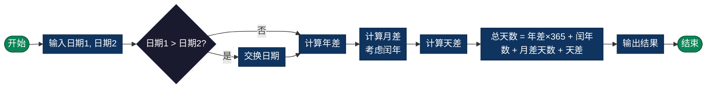

# 日期差计算（Date Difference）

> 计算两个日期之间的天数差、月数差、年数差，支持日期间隔的精确计算。

## 算法原理

### 天数差计算

1. **基准日方法**：
   - 将两个日期都转换为从基准日期（如1970-01-01）起的天数
   - 计算天数差 = 日期2天数 - 日期1天数

2. **逐月累加方法**：
   - 计算整年的天数差
   - 计算整月的天数差（考虑闰年）
   - 加上剩余天数差

### 考虑闰年

```
闰年规则：
- 能被4整除且不能被100整除，或
- 能被400整除

闰年2月有29天，平年28天
```

### 示例计算

```
计算 2024-01-15 到 2024-03-20 的天数差：

方法1 - 基准日计算：
2024-01-15 = 19723天（从1970-01-01起）
2024-03-20 = 19788天
差值 = 19788 - 19723 = 65天

方法2 - 逐月计算：
1月剩余：31 - 15 = 16天
2月：29天（2024是闰年）
3月：20天
总计：16 + 29 + 20 = 65天
```

---

## 复杂度分析

| 指标 | 复杂度 | 说明 |
|------|--------|------|
| **时间复杂度** | O(1) | 固定计算步骤 |
| **空间复杂度** | O(1) | 仅使用常量存储 |

---

## 流程图



---

## 适用场景

- **年龄计算**：精确计算周岁、月龄
- **项目管理**：计算工期、倒计时
- **金融计算**：利息天数、账期计算
- **数据分析**：时间序列间隔统计
- **纪念日提醒**：计算距离某个日期的天数

---

## 实现列表

| 语言 | 文件名 | 说明 |
|------|--------|------|
| C | [date_diff.c](./date_diff.c) | 手动计算实现 |
| Java | [DateDiff.java](./DateDiff.java) | Duration/Period类 |
| Go | [date_diff.go](./date_diff.go) | time包应用 |
| Python | [date_diff.py](./date_diff.py) | datetime模块 |
| JavaScript | [date_diff.js](./date_diff.js) | Date对象操作 |
| TypeScript | [DateDiff.ts](./DateDiff.ts) | 类型安全版本 |
| Rust | [date_diff.rs](./date_diff.rs) | chrono库应用 |

---

## 使用示例

### Python 版本
```python
# 计算天数差
diff = days_between("2024-01-15", "2024-03-20")
# 结果: 65

# 计算工作日（排除周末）
workdays = workdays_between("2024-01-01", "2024-01-31")
# 结果: 23
```

### Java 版本
```java
// 计算日期差
long days = DateDiff.daysBetween(
    LocalDate.of(2024, 1, 15),
    LocalDate.of(2024, 3, 20)
);
// 结果: 65
```

---

## 扩展阅读

- ISO 8601 日期标准
- Julian Day Number（儒略日数）
- 排除节假日的计算
- 不同时区的日期差处理
