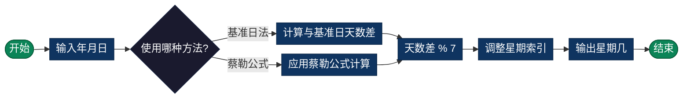

# 星期计算（Day of Week）

> 计算任意日期是星期几，基于已知的基准日期推算。

## 导航

| [算法原理](#算法原理) | [复杂度分析](#复杂度分析) | [流程图](#流程图) | [实现列表](#实现列表) |

---

## 算法原理

### 基于基准日的计算

1. 选定一个已知星期几的基准日期
   - 常用：1970-01-01 是星期四
   - 或：1900-01-01 是星期一

2. 计算目标日期与基准日期的天数差

3. 天数差模7得到星期几偏移量
   ```
   星期 = (基准日星期 + 天数差) % 7
   ```

### 蔡勒公式（Zeller's Congruence）

直接计算任意日期的星期几，无需基准日：

```
h = (q + [13(m+1)/5] + K + [K/4] + [J/4] - 2J) mod 7

其中：
h: 星期几 (0=星期六, 1=星期日, ..., 6=星期五)
q: 日期中的日
m: 月份 (3=3月, 4=4月, ..., 14=2月)
K: 世纪内年份 (year % 100)
J: 零基世纪 (year / 100)

注意：1月和2月视为上一年的13月和14月
```

### 示例计算

```
计算 2024-01-15 是星期几：

方法1 - 基准日法：
基准日 1970-01-01 是星期四
天数差 = 19723天
19723 % 7 = 2
星期 = (4 + 2) % 7 = 6 → 星期一

方法2 - 蔡勒公式：
2024年1月视为2023年13月
h = (15 + [13×14/5] + 23 + [23/4] + [20/4] - 2×20) mod 7
  = (15 + 36 + 23 + 5 + 5 - 40) mod 7
  = 44 mod 7 = 2 → 星期一 (1=星期日)
```

---

## 复杂度分析

| 指标 | 复杂度 | 说明 |
|------|--------|------|
| **时间复杂度** | O(1) | 固定公式计算 |
| **空间复杂度** | O(1) | 仅使用常量存储 |

---

## 流程图



---

## 适用场景

- **日历应用**：显示任意日期的星期
- **排班系统**：根据星期安排工作
- **节假日计算**：判断是否为周末
- **数据分析**：按星期统计趋势
- **预约系统**：判断营业日/休息日

---

## 实现列表

| 语言 | 文件名 | 说明 |
|------|--------|------|
| C | [day_of_week.c](./day_of_week.c) | 蔡勒公式实现 |
| Java | [DayOfWeek.java](./DayOfWeek.java) | LocalDate应用 |
| Go | [day_of_week.go](./day_of_week.go) | time包应用 |
| Python | [day_of_week.py](./day_of_week.py) | datetime模块 |
| JavaScript | [day_of_week.js](./day_of_week.js) | Date对象操作 |
| TypeScript | [DayOfWeek.ts](./DayOfWeek.ts) | 类型安全版本 |
| Rust | [day_of_week.rs](./day_of_week.rs) | chrono库应用 |

---

## 使用示例

### Python 版本
```python
# 计算星期几
weekday = get_day_of_week(2024, 1, 15)
# 结果: "星期一"

# 获取星期索引 (0=星期一, 6=星期日)
index = get_weekday_index(2024, 1, 15)
# 结果: 0
```

### C 版本
```c
// 计算星期几
const char* weekday = getDayOfWeek(2024, 1, 15);
// 结果: "星期一"
```

---

## 扩展阅读

- 蔡勒公式的数学推导
- 不同文化中的星期起始日差异
- ISO 8601 标准（星期一为每周第一天）
- 儒略历与格里高利历转换对星期计算的影响
