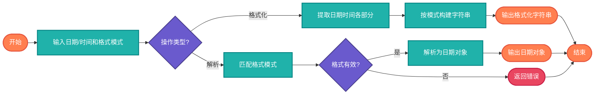

# 日期时间格式化（Date-Time Format）

> 日期时间字符串的格式化与解析，支持多种常用格式和自定义格式模式。

## 算法原理

### 常用格式模式

| 模式 | 示例 | 说明 |
|------|------|------|
| `yyyy-MM-dd` | 2024-01-15 | ISO标准日期格式 |
| `dd/MM/yyyy` | 15/01/2024 | 欧洲常用格式 |
| `MM-dd-yyyy` | 01-15-2024 | 美国常用格式 |
| `yyyy年MM月dd日` | 2024年01月15日 | 中文格式 |
| `HH:mm:ss` | 14:30:00 | 24小时制时间 |
| `hh:mm:ss a` | 02:30:00 PM | 12小时制带AM/PM |
| `yyyy-MM-dd HH:mm:ss` | 2024-01-15 14:30:00 | 日期时间完整格式 |
| `yyyy-MM-dd'T'HH:mm:ss'Z'` | 2024-01-15T14:30:00Z | ISO 8601格式 |

### 格式化符说明

| 符号 | 含义 | 示例 |
|------|------|------|
| `y` | 年 | 2024, 24 |
| `M` | 月 | 1, 01, Jan, January |
| `d` | 日 | 5, 05 |
| `H` | 时 (0-23) | 14 |
| `h` | 时 (1-12) | 2 |
| `m` | 分 | 30 |
| `s` | 秒 | 0, 00 |
| `a` | AM/PM | AM, PM |
| `E` | 星期 | Mon, Monday, 星期一 |

---

## 复杂度分析

| 指标 | 复杂度 | 说明 |
|------|--------|------|
| **时间复杂度** | O(n) | n为字符串长度 |
| **空间复杂度** | O(n) | 格式化结果存储 |

## 算法流程



---

## 适用场景

- **数据展示**：UI界面日期显示
- **日志记录**：统一日志时间格式
- **数据交换**：API接口日期字段
- **文件命名**：带时间戳的文件名
- **报表生成**：日期时间标签

---

## 实现列表

| 语言 | 文件名 | 说明 |
|------|--------|------|
| C | [datetime_format.c](./datetime_format.c) | strftime实现 |
| Java | [DateTimeFormat.java](./DateTimeFormat.java) | SimpleDateFormat |
| Go | [datetime_format.go](./datetime_format.go) | time.Format |
| Python | [datetime_format.py](./datetime_format.py) | strftime/strptime |
| JavaScript | [datetime_format.js](./datetime_format.js) | toLocaleDateString |
| TypeScript | [DateTimeFormat.ts](./DateTimeFormat.ts) | 类型安全版本 |
| Rust | [datetime_format.rs](./datetime_format.rs) | chrono格式化 |

---

## 使用示例

### Python 版本
```python
from datetime import datetime

# 格式化日期时间
now = datetime.now()
formatted = now.strftime("%Y-%m-%d %H:%M:%S")
# 结果: "2024-01-15 14:30:00"

# 解析日期字符串
date = datetime.strptime("2024-01-15", "%Y-%m-%d")
```

### Java 版本
```java
// 格式化
SimpleDateFormat sdf = new SimpleDateFormat("yyyy-MM-dd HH:mm:ss");
String formatted = sdf.format(new Date());

// 解析
Date date = sdf.parse("2024-01-15 14:30:00");
```

---

## 扩展阅读

- ISO 8601 日期时间标准
- RFC 3339 日期时间规范
- Unix时间戳格式化
- 多时区格式化显示
