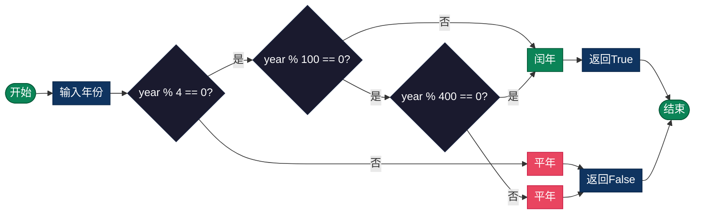

# 闰年判断（Leap Year）

> 判断给定年份是否为闰年，以及计算闰年相关的日期问题。

## 算法原理

### 闰年判定规则

格里高利历（公历）闰年规则：

```
1. 能被4整除且不能被100整除 → 闰年
2. 能被400整除 → 闰年
3. 其他情况 → 平年
```

### 逻辑表达式

```
isLeapYear = (year % 4 == 0 && year % 100 != 0) || (year % 400 == 0)
```

### 示例判断

```
年份    计算过程                              结果
────────────────────────────────────────────────────
2000    400整除 ✓                            闰年
1900    4整除 ✓, 100整除 ✓, 400不整除 ✗       平年
2024    4整除 ✓, 100不整除 ✓                  闰年
2023    4不整除 ✗                            平年
```

### 闰年的影响

- 2月有29天（平年28天）
- 全年366天（平年365天）
- 影响日期差计算、星期计算等

---

## 复杂度分析

| 指标 | 复杂度 | 说明 |
|------|--------|------|
| **时间复杂度** | O(1) | 固定模运算判断 |
| **空间复杂度** | O(1) | 仅使用布尔结果 |

---

## 流程图



---

## 适用场景

- **日历计算**：2月天数、全年天数
- **日期差计算**：涉及2月的日期间隔
- **生日提醒**：2月29日的特殊处理
- **数据统计**：按日统计的年均计算
- **金融计算**：利息天数计算（ACT/365）

---

## 实现列表

| 语言 | 文件名 | 说明 |
|------|--------|------|
| C | [leap_year.c](./leap_year.c) | 条件判断实现 |
| Java | [LeapYear.java](./LeapYear.java) | Year类应用 |
| Go | [leap_year.go](./leap_year.go) | time包应用 |
| Python | [leap_year.py](./leap_year.py) | calendar模块 |
| JavaScript | [leap_year.js](./leap_year.js) | Date对象判断 |
| TypeScript | [LeapYear.ts](./LeapYear.ts) | 类型安全版本 |
| Rust | [leap_year.rs](./leap_year.rs) | 标准库应用 |

---

## 使用示例

### Python 版本
```python
# 判断闰年
is_leap = is_leap_year(2024)
# 结果: True

# 获取2月天数
feb_days = get_month_days(2024, 2)
# 结果: 29
```

### C 版本
```c
// 判断闰年
int isLeap = isLeapYear(2024);
// 结果: 1 (true)

// 计算全年天数
int days = daysInYear(2024);
// 结果: 366
```

---

## 扩展阅读

- 儒略历与格里高利历的闰年规则差异
- 为什么需要闰年（地球公转周期365.2422天）
- 闰秒与UTC时间调整
- 不同历法中的闰月概念（农历）
