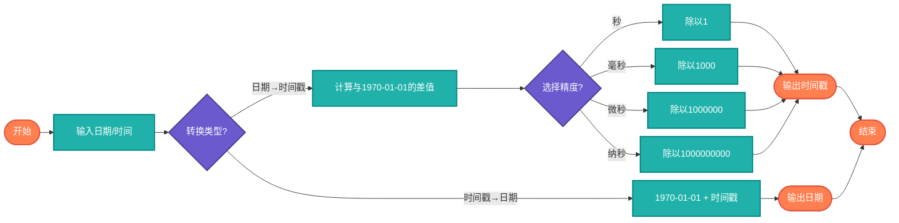

# 时间戳（Timestamp）

> Unix时间戳与日期时间的相互转换，以及毫秒/微秒/纳秒精度的时间戳处理。

## 算法原理

### Unix时间戳定义

Unix时间戳是从 **1970-01-01 00:00:00 UTC**（Unix纪元）起经过的秒数。

```
时间戳 = 当前时间 - 1970-01-01 00:00:00 UTC
```

### 精度级别

| 精度 | 单位 | 示例 | 典型应用 |
|------|------|------|----------|
| 秒级 | 秒 | 1704067200 | 日志记录 |
| 毫秒级 | 毫秒 | 1704067200000 | 前端JavaScript |
| 微秒级 | 微秒 | 1704067200000000 | 高性能计时 |
| 纳秒级 | 纳秒 | 1704067200000000000 | 科学计算 |

### 转换公式

```
日期 → 时间戳:
timestamp = (date - 1970-01-01) / 时间单位

时间戳 → 日期:
date = 1970-01-01 + timestamp × 时间单位
```

---

## 复杂度分析

| 指标 | 复杂度 | 说明 |
|------|--------|------|
| **时间复杂度** | O(1) | 固定算术运算 |
| **空间复杂度** | O(1) | 常量存储 |

## 算法流程



---

## 适用场景

- **数据库存储**：统一存储日期时间
- **API通信**：跨系统日期传输
- **日志记录**：精确时间标记
- **缓存过期**：TTL时间计算
- **排序索引**：数字比较优于字符串

---

## 实现列表

| 语言 | 文件名 | 说明 |
|------|--------|------|
| C | [timestamp.c](./timestamp.c) | time.h函数 |
| Java | [Timestamp.java](./Timestamp.java) | System.currentTimeMillis |
| Go | [timestamp.go](./timestamp.go) | time.Now().Unix |
| Python | [timestamp.py](./timestamp.py) | time.time() |
| JavaScript | [timestamp.js](./timestamp.js) | Date.now() |
| TypeScript | [Timestamp.ts](./Timestamp.ts) | 类型安全版本 |
| Rust | [timestamp.rs](./timestamp.rs) | SystemTime |

---

## 使用示例

### Python 版本
```python
import time
from datetime import datetime

# 获取当前时间戳
now = time.time()
# 结果: 1704067200.123456

# 时间戳转日期
date = datetime.fromtimestamp(1704067200)
# 结果: 2024-01-01 00:00:00

# 日期转时间戳
ts = datetime(2024, 1, 1).timestamp()
# 结果: 1704067200.0
```

### JavaScript 版本
```javascript
// 获取当前时间戳（毫秒）
const now = Date.now();
// 结果: 1704067200000

// 时间戳转日期
const date = new Date(1704067200000);
// 结果: Mon Jan 01 2024 00:00:00

// 日期转时间戳
const ts = new Date('2024-01-01').getTime();
// 结果: 1704067200000
```

---

## 扩展阅读

- Unix纪元（Epoch）的历史由来
- Y2K38问题（2038年时间戳溢出）
- 闰秒对时间戳的影响
- UTC与本地时间的转换
- ISO 8601与Unix时间戳的关系
