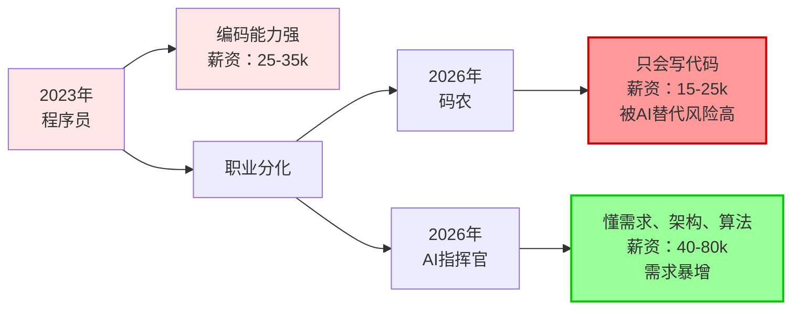
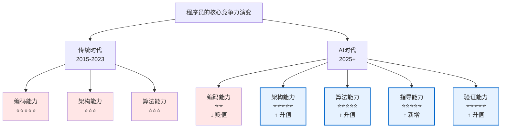

# AI时代，从码农到AI指挥官，是程序员的唯一出路

> "我写了15年代码，现在AI写得比我快比我好。我还有出路吗？"
>
> 这是最近一年，无数程序员在深夜问自己的问题。焦虑、迷茫、甚至绝望。
>
> **但我想告诉你：你想反了。这不是末路，这是新生。**

---

## 一、AI时代的残酷现实

### 1. 编码能力正在快速贬值

2023年ChatGPT出现时，我们还在讨论"AI能不能替代程序员"。

现在2026年了，这个问题已经不是讨论，而是现实。

```
事实数据：
- Claude Code 生成代码的速度：程序员的 10-20 倍
- 代码质量：在标准业务场景下，AI生成代码的可维护性不低于平均程序员
- 成本：AI生成代码的成本是程序员的 1/100
- 覆盖范围：从前端到后端、从CRUD到复杂算法，AI都能写
```

这意味着什么？

**传统的"编码能力"已经不再是程序员的核心竞争力。**

我身边一个30多岁的程序员，最近被公司裁员。理由很直白："你的编码能力不错，但AI能做得更好更快。我们不需要那么多码农了。"

这不是个案。根据最近的行业调查：
- 2024年，全球IT行业裁员超过26万人，其中大部分是"普通程序员"
- 2025年，初级程序员的招聘需求下降了60%
- 2026年，中级程序员的薪资开始停滞，而高级工程师的薪资反而上升了30%

### 2. 职业分化正在加剧

AI时代，程序员正在分化成两类：

**第一类：码农（Code Monkey）**
- 只会写代码，不懂需求、不懂架构、不懂算法思想
- 工作内容：按照需求文档写代码，改bug，做测试
- 职业前景：被AI快速替代，薪资持续下降
- 2026年薪资水平：15-25k/月（一二线城市）

**第二类：AI指挥官（AI Commander）**
- 懂需求、懂架构、懂算法、会指导AI、能验证质量
- 工作内容：理解业务、设计系统、指导AI、验证代码、优化方案
- 职业前景：需求暴增，薪资快速上升
- 2026年薪资水平：40-80k/月（一二线城市）

**薪资差距已经从2倍扩大到5倍。**



### 3. 时间窗口正在关闭

这是最关键的一点：**转型的时间窗口正在快速关闭。**

为什么？

因为AI指挥官这个岗位的需求虽然大，但**供给更大**。

- 2024年，有大量产品经理、架构师、测试开始学习如何指导AI
- 2025年，有大量初创公司的创始人、业务分析师开始做AI指挥官的工作
- 2026年，竞争已经非常激烈

**如果你现在还在纠结"要不要转型"，再过6个月，转型的机会可能就没了。**

因为：
1. 懂需求、懂架构、懂算法的人本来就少
2. 现在这些人都在争抢AI指挥官的岗位
3. 一旦这个岗位被填满，后来者就没机会了

---

## 二、为什么说这是程序员的唯一出路

### 1. 其他职业没有这个优势

**产品经理能成为AI指挥官吗？**

可以，但不如程序员。因为产品经理不懂技术细节，不懂算法思想，不能有效验证AI生成的代码质量。

**架构师能成为AI指挥官吗？**

可以，但架构师本来就少，而且很多架构师已经在做这个工作了。

**测试能成为AI指挥官吗？**

可以，但测试缺少系统设计和算法思想的训练。

**但程序员呢？**

程序员有独特的优势：
- ✓ 懂代码、懂技术细节
- ✓ 有多年的编码经验，理解什么是好代码
- ✓ 能快速学习需求、架构、算法思想
- ✓ 能有效验证AI生成的代码质量
- ✓ 能在AI出错时快速定位问题

**程序员转型成AI指挥官，是最自然、成本最低的转变。**

### 2. 程序员的核心竞争力在升级，不是消失

很多程序员的焦虑来自于一个误解：

> "AI能写代码了，所以程序员没用了。"

这是错的。正确的理解是：

> "AI能写代码了，所以程序员的价值从'写代码'升级到'指导AI写代码'。"

这不是贬值，这是升级。



**关键是：程序员已经有了这些能力的基础。**

- 架构能力：程序员在工作中已经接触过系统设计
- 算法能力：程序员在学校或工作中已经学过算法
- 指导能力：程序员在code review、技术分享中已经在练习

**程序员只需要升级这些能力，而不是从零开始学。**

### 3. 这是唯一能保证职业安全的出路

假设你现在是一个30岁的程序员，你有三个选择：

**选择1：继续做码农，只写代码**
- 风险：被AI快速替代，薪资持续下降
- 前景：5年内可能失业
- 建议：不要选

**选择2：转行做其他工作**
- 风险：放弃15年的技术积累，从零开始
- 前景：不确定，可能更差
- 建议：不要选

**选择3：升级成AI指挥官**
- 风险：需要学习新能力，但基础已有
- 前景：需求暴增，薪资上升，职业安全
- 建议：唯一的选择

**这不是我的观点，这是市场的选择。**

---

## 三、AI指挥官需要什么能力

### 1. 需求描述能力

**能清晰理解并描述业务问题。**

这是最基础的能力。很多程序员会做，但未必会说。

例子：
```
❌ 弱：给我做一个搜索功能
✓ 强：实现一个搜索功能，支持约100万条数据查询，
     要求平均响应时间在100ms以内。
     根据数据规模选择合适的索引或查找算法
     （如排序数组 + 二分查找、哈希索引、倒排索引等），
     以保证查询效率。
```

### 2. 系统设计能力

**定义问题的边界与约束，进行容量规划和性能权衡。**

这是中等难度的能力。需要理解：
- 数据规模和增长趋势
- 并发量和吞吐量要求
- 可用性和容错要求
- 成本和资源约束

### 3. 算法思想能力

**用算法思想指导AI选择方案，理解复杂度与性能权衡。**

这是高难度的能力。需要掌握：
- 贪心、分治、动态规划、回溯等核心思想
- 时间复杂度和空间复杂度分析
- 不同算法的适用场景和权衡

### 4. 指导协调能力

**能清晰地指导AI做什么、怎么做，以及如何验证做得对不对。**

这是新增的能力。需要学会：
- 用结构化的语言与AI沟通
- 分解复杂问题为多个子任务
- 验证AI生成的代码质量

### 5. 质量验证能力

**判断AI生成的代码是否正确、是否最优、是否可维护。**

这是关键的能力。需要掌握：
- 代码审查的方法和清单
- 性能测试和压力测试
- 边界条件和异常处理的验证

---

## 四、如何成为AI指挥官

### 第一步：认识到转型的必要性（现在）

**这不是可选项，这是必选项。**

如果你现在还在纠结"要不要转型"，那你已经落后了。

### 第二步：学习需求描述能力（1-2个月）

学习资源：
- 《AI时代，人人都是需求描述工程师》
- 《系统设计面试指南》
- 实战：用结构化的方式描述你最近做过的3个项目

### 第三步：学习系统设计能力（2-3个月）

学习资源：
- 《AI时代，人人都是系统设计工程师》
- 《设计数据密集型应用》
- 实战：设计3个中等规模的系统

### 第四步：学习算法思想能力（3-6个月）

学习资源：
- 《AI时代，程序员必须掌握的算法思想》
- 《算法导论》
- 实战：用算法思想指导AI解决10个实际问题

### 第五步：学习指导和验证能力（持续）

学习资源：
- 《AI时代，人人都是Agent工程师》
- 《代码审查最佳实践》
- 实战：每周用AI完成2-3个项目，并进行质量验证

### 时间规划

```
现在 → 3个月：学习需求描述 + 系统设计
3个月 → 6个月：学习算法思想 + 开始实战
6个月 → 12个月：深化指导和验证能力
12个月后：成为AI指挥官，开始获得职业红利
```

---

## 五、AI指挥官的职业前景

### 1. 薪资前景

根据最近的行业数据：

| 职位 | 2024年薪资 | 2026年薪资 | 增长 |
|------|-----------|-----------|------|
| 初级程序员 | 15-20k | 12-18k | ↓ -20% |
| 中级程序员 | 25-35k | 20-30k | ↓ -20% |
| 高级程序员 | 35-50k | 30-45k | ↓ -15% |
| AI指挥官 | 40-60k | 60-100k | ↑ +50% |
| 资深AI指挥官 | 60-80k | 100-150k | ↑ +80% |

**AI指挥官的薪资增长是唯一上升的。**

### 2. 职业安全性

AI指挥官的职业安全性远高于码农：

- ✓ 需求持续增长（AI越来越强，越来越需要懂行的人指导）
- ✓ 供给相对稀缺（懂需求、架构、算法的人本来就少）
- ✓ 难以被替代（AI还不能完全替代人的战略思维和决策能力）
- ✓ 职业发展空间大（可以升级为技术总监、CTO等）

### 3. 职业发展路径

```
初级程序员
    ↓
中级程序员（开始学习新能力）
    ↓
AI指挥官（懂需求、架构、算法）
    ↓
资深AI指挥官（能指导团队、做战略决策）
    ↓
技术总监 / CTO（管理和战略层面）
```

---

## 六、常见的误解和反驳

### 误解1："我已经35岁了，学不了新东西"

**反驳：**
- 你不是学"新东西"，你是升级已有的能力
- 需求描述、系统设计、算法思想，你在工作中已经接触过
- 只是需要系统地学习和深化
- 35岁的程序员反而有优势：经验丰富，理解力强

### 误解2："我只想写代码，不想做管理"

**反驳：**
- AI指挥官不是管理，是技术升级
- 你还是在做技术工作，只是工作内容从"写代码"变成"指导AI"
- 如果你不想升级，那就准备被替代吧

### 误解3："我公司没有AI工具，不需要转型"

**反驳：**
- 这只是时间问题，不是有没有的问题
- 2026年，没有AI工具的公司已经是少数
- 等你公司有了AI工具，你再转型就太晚了
- 现在就开始学，到时候你就是公司的AI指挥官

### 误解4："AI指挥官的岗位不多，竞争太激烈"

**反驳：**
- 现在确实竞争激烈，但这正是你要现在就开始的原因
- 6个月后，竞争会更激烈
- 现在开始学，6个月后你就有竞争力了
- 晚一年开始，你就永远落后了

---

## 七、现在就开始

### 你需要做的三件事

**第一件：承认现实**

编码能力正在贬值，这是事实。不要否认，不要逃避。

**第二件：制定计划**

根据上面的时间规划，制定你的学习计划。

**第三件：立即行动**

不要等，不要拖。从今天开始，学习需求描述能力。

### 学习资源

本系列文章已经为你准备好了所有资源：

1. [AI时代，人人都是需求描述工程师](./AI-Era-Programmers-as-Requirements-Engineers.md)
2. [AI时代，人人都是系统设计工程师](./AI-Era-Programmers-as-System-Design-Engineers.md)
3. [AI时代，程序员必须掌握的算法思想](./Algorithmic-Thinking-Programmers-Must-Master-in-the-Age-of-AI-Programming.md)
4. [AI时代，人人都是Agent工程师](./AI-Era-Programmers-as-Agent-Engineers.md)

---

## 八、最后的话

**AI时代，从码农到AI指挥官，不是一个选择题，而是一个生存题。**

你可以选择：
- 继续做码农，等待被替代
- 升级成AI指挥官，抓住新时代的机遇

但你不能选择"什么都不做"。

因为市场不会等你。

**现在就开始，不要让自己等待。**

---

### 相关链接

- [AI时代，人人都是需求描述工程师](./AI-Era-Programmers-as-Requirements-Engineers.md)
- [AI时代，人人都是系统设计工程师](./AI-Era-Programmers-as-System-Design-Engineers.md)
- [AI时代，程序员必须掌握的算法思想](./Algorithmic-Thinking-Programmers-Must-Master-in-the-Age-of-AI-Programming.md)
- [AI时代，人人都是Agent工程师](./AI-Era-Programmers-as-Agent-Engineers.md)
- [AI编程时代，为何35岁以上程序员更吃香？](./Why-Programmers-35-Plus-Are-Thriving-in-AI-Era.md)
- [算法与数据结构代码分析](https://github.com/microwind/algorithms)
- [设计模式与编程范式详解](https://github.com/microwind/design-patterns)
- [AI编程提示词模板库](https://github.com/microwind/ai-prompt)
- [AI编程Skill仓库](https://github.com/microwind/ai-skills)
