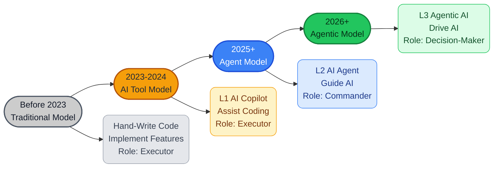
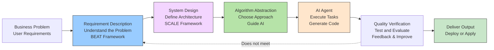
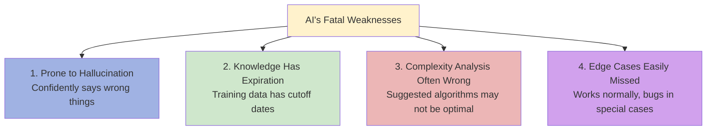

# Why Programmers Over 35 Are More Valuable in the AI Programming Era

> AI replacing manual programming has become an inevitable trend. So what does this mean for programmers over 35—will it accelerate career death, or open a new chapter?

The AI wave is here, and everyone is filled with anxiety and confusion. Some are starting to worry whether their careers have reached an end, especially older programmers.

Many believe the programming profession will die out, but I believe quite the opposite. Let's first look at what AI has changed about programming.

## 1. How Programming Has Changed in the AI Agent Era

When ChatGPT burst onto the scene in 2023, it was genuinely frightening. AI writes code really fast—frontend, backend, algorithms, deployment plans, test cases—all at its fingertips. With the successive launches of Cursor, Windsurf, Claude Code, Codex, and OpenClaw, AI Agents have completely disrupted the traditional programming model—AI can autonomously complete most coding work. **People no longer need to write code by hand.**

The impact is enormous. Let's look at how programming approaches have evolved.

### The Shift from "Hand-Writing Code" to "Driving AI"

**Traditional Development Approach:**

```
Requirements → Understanding → Design Document → Hand-Write Code → Test → Deploy
```

**AI Era Approach:**

```
Requirements → Understanding → Design Skills/Prompts → AI Generates Code → Verify → Deploy
```

From "writing it yourself" to "AI writes it," the center of gravity has completely shifted.



Currently, AI programming is generally in the Agent model, relying on Skills and Prompts for instruction-driven development. We are moving toward the Agentic era—where AI makes autonomous decisions and supports multi-task parallelism. You only need to provide goals and constraints, and **AI will automatically decompose, plan, and execute the entire workflow**.

A colleague responsible for promoting AI programming said:

> "I used to do architecture design, but now I skip even that—I just state requirements and constraints, and let AI analyze, create plans, and self-execute."

So the question is: If AI is this powerful, do programmers still have value? Where do programmers over 35 go from here?

---

## 2. What Capabilities AI Still Cannot Replace in the AI Agent Era
> No matter how powerful AI becomes, it is fundamentally still an executor—an intelligent agent that solves problems, at least for now.
>
> It excels at analyzing, optimizing, generating, and reasoning within known boundaries, but there are things it cannot do, or cannot do well.

There are some capabilities in software development that AI still cannot replace, or more precisely, **cannot fully replace**, such as the following:

| Capability | Analysis | Advantage of Experience |
|--------|------|------|
| **1. Defining Requirements** <br>What is the actual problem you need to solve? | AI can refine requirements, but the original requirements, business goals, and real pain points come from human observation and judgment of the real world | Experience accumulates from seeing requirements go from vague to clear, knowing which are false requirements, and which problems don't need technical solutions at all |
| **2. Making Trade-offs on Goals** <br>What is truly important? | AI can give you ten solutions, but choosing which one and why involves priorities, values, and strategic judgment—this is a cognitive problem, not a technical one | Experienced programmers know the difference between local and global optima; "what to do" matters more than "how to do it" |
| **3. Setting Boundaries** <br>What should and shouldn't be done? | AI will dutifully complete everything, but knowing which solutions have extremely high maintenance costs and which features plant hidden risks requires a human to call a halt | Boundary sense comes from having been burned. The ability to say "no" is harder than saying "yes"—AI won't proactively refuse; it will execute the wrong thing beautifully |
| **4. Managing Constraints** <br>What are the real-world conditions? | Time, budget, team capability, technical debt, compliance requirements—AI doesn't understand your actual situation | Experienced programmers excel at making "good enough" decisions under constraints, rather than pursuing unrealistic optimal solutions—this is engineering wisdom |
| **5. Evaluating Costs** <br>Is it worth doing? | AI generates code quickly, but real costs include testing, maintenance, cognitive burden, learning curve, and future extension costs | Senior programmers can glance at a solution and estimate the technical debt three years later—this is accumulated intuition, not something algorithms can provide |
| **6. Strategic Decision-Making** <br>How to navigate this path? | AI can provide roadmaps, but judging whether a path is viable requires deep understanding of people, organizations, and industries | Technical strategy is about finding a realistic path among organizational capabilities, market timing, and competitive dynamics—not just the technically optimal solution |
| **7. Evaluating Results** <br>Was it done well? | Code running doesn't mean it's correct; tests passing doesn't mean users are satisfied; features going live doesn't mean business goals are met | Evaluation criteria need to be defined and upheld by humans. Without human calibration, AI scores itself in the dark |

None of the above are coding abilities—they are business understanding, abstract thinking, and decision-making capabilities. In these areas, AI still cannot compete with humans.

**AI can replace people who solve problems, but it cannot yet replace people who define problems.**

> If AI truly develops independent consciousness (autonomous decision-making and execution is still not consciousness), the discussion wouldn't be about programmer career development, but about where humanity goes from here.

---

## 3. What the AI Agent Era Demands from Programmers

> The previous article ["In the AI Era, Everyone Is an Agent Engineer"](https://github.com/microwind/algorithms/blob/main/start-here/AI-Era-Programmers-as-Agent-Engineers.md) specifically introduced the requirements and development path for Agent Engineers. Here's a brief recap.

In the AI Agent era, what does an excellent programmer need?

**Not a "backend expert" or "frontend master," but a comprehensive engineer who "understands requirements, understands architecture, and understands algorithms"—in other words, an Agent Engineer (or AI Guidance Engineer).**

Comparison of engineer capability requirements between traditional development and the AI era:

| Capability Dimension | Traditional Era Requirement | AI Era Requirement | Difficulty |
|------|:---:|:---:|:---:|
| 1. **Code Writing Ability** | Very High | Moderate | ↓ Decreasing |
| 2. **Requirements Understanding** | Moderate | Very High | ↑ Increasing |
| 3. **System Design Ability** | High | Very High | ↑ Significantly Increasing |
| 4. **Algorithmic Thinking** | High | Very High | ↑ Significantly Increasing |
| 5. **Guidance & Supervision** | Low | Very High | ↑ Entirely New |
| 6. **Quality Verification** | High | Very High | ↑ Increasing |

As you can see, the times have changed and the requirements are vastly different.

Before, it was "clear division of labor"—product managers handled requirements, architects handled design, programmers handled implementation, and testers handled verification.

Now, it's "capability integration"—one person needs to understand requirements, architecture, and algorithms, then drive AI to do the work.

In the AI era, the requirements for programmers favor breadth over depth: you don't need to master every detail of every specialized domain, but you need to understand the core principles of each domain and apply them to real problems.

### Engineer Work Scenario in the AI Agent Era



**Framework Descriptions**

- **BEAT**: Background, Expectation, Action, Test—used for requirement clarification and decomposition.

- **SCALE**: Scale, Constraints, Architecture, Limitations, Evaluation—used as dimensional reference during system design.

> These frameworks are essentially prompt engineering specifications for structured expression, not proprietary terminology. You can also follow any specification you find reasonable.

---

## 4. You Don't Need to Focus on Implementation Details, But You Must Understand the Principles

Many people actually misunderstand this. They think "in the AI era, you don't need to learn technology anymore," and anyone can use AI to generate code.

The reality is quite the opposite. **You indeed don't need to focus on code implementation details, but you must understand the underlying technical principles**, especially algorithmic thinking, design patterns, and system architecture.

### For Example, Say You Have an Order Processing Feature

**If you directly ask AI:**

```c
Prompt: "Implement an order API that processes and updates inventory and logs"

AI might give you a bunch of code:
// Synchronous processing
processOrder(order);
updateInventory(order);
writeLog(order);
```

The AI's code logic is correct, but under high-concurrency scenarios, every request blocks waiting for inventory updates and log writes, creating obvious performance bottlenecks and low throughput.

**If you guide AI with direction:**

```c
Prompt: "High-concurrency order API, needs async processing for inventory and logs, core logic must respond within 200ms"

AI will give you a complete version:
// Core logic completes order confirmation first
// Async inventory update and log writing (thread pool/message queue)
// Ensures fast API response and stable performance
```

What's the difference in prompts? It's not about describing more implementation details, but about providing **constraints and direction** based on system design and algorithmic thinking.

I don't need to tell AI specifically how to implement things, like how to use thread pools or the exact way to write logs—**AI is better than me at those details**.

I only need to tell AI: the core issue is fast response under high-concurrency scenarios, and **specify the constraints and processing strategy**.

### Another Example: Adding a Search Feature to Products

If you simply say "implement a product search feature," AI might give you a simple linear scan approach that performs poorly with large data volumes.

But if you guide AI: **"Data scale is in the millions, query complexity needs to be O(log n) or better, can use indexing or inverted index structures."**

Then AI is much more likely to provide a more reasonable implementation:

```mermaid
%%{init: {'flowchart': {'nodeSpacing': 35, 'rankSpacing': 25, 'padding': 10}}}%%
graph LR

    %% ===== Correct Path =====
    A["Business Problem<br/>Fast search across 1M products"] --> B["Principle Thinking"]

    %% ===== Wrong Path =====
    A --> E["Direct to AI: Add search feature"]
    E --> F["AI Chooses Simple Approach"]
    F --> G["Linear Search"]
    G --> H["Performance Insufficient"]

    B --> B1["Constraints:<br/>Millions of records + O(log n) queries"]
    B1 --> B2["Algorithmic Thinking:<br>Indexed Queries"]
    B2 --> B3["Implementation:<br>Inverted Index / Elasticsearch"]
    B3 --> C["AI Generates Implementation"]
    C --> D["Efficient Search"]

    %% ===== Correct Path Colors =====
    style A fill:#FEF3C7,stroke:#F59E0B,rx:12,ry:12
    style B fill:#DBEAFE,stroke:#3B82F6,rx:10,ry:10
    style B1 fill:#DBEAFE,stroke:#3B82F6,rx:10,ry:10
    style B2 fill:#93C5FD,stroke:#2563EB,stroke-width:2px,rx:10,ry:10
    style B3 fill:#DBEAFE,stroke:#3B82F6,rx:10,ry:10
    style C fill:#E0E7FF,stroke:#6366F1,rx:10,ry:10
    style D fill:#BBF7D0,stroke:#22C55E,stroke-width:2px,rx:12,ry:12

    %% ===== Wrong Path Colors =====
    style E fill:#FED7AA,stroke:#F97316,rx:10,ry:10
    style F fill:#FDBA74,stroke:#EA580C,rx:10,ry:10
    style G fill:#FCA5A5,stroke:#DC2626,rx:10,ry:10
    style H fill:#FECACA,stroke:#B91C1C,stroke-width:2px,rx:12,ry:12
```



**In this process, I likewise don't need to tell AI the specific implementation details**, such as how to write Elasticsearch query DSL—AI can handle the details.

I only need to clarify the core constraints of the problem and the viable algorithmic direction, and let AI complete the concrete implementation.

### People Who Understand Principles Can Use Skills and Prompts Effectively

Through some open-source Skills repositories, such as **Superpowers**, **awesome-openclaw-skills**, and practical **Claude / OpenAI / OpenClaw Agent Skills**, you can achieve problem clarification, task decomposition, architecture design, and strategy derivation. But the final trade-offs and decisions still need to be made by humans.

With Skills in hand, you still need to iteratively refine solutions through multi-round Prompt conversations. Understanding technical principles enables better interaction with AI.

If you don't understand technical principles, the quality of AI-generated programs may not be very good. It's like having an AI video generation tool but not necessarily being a good director or editor—tools can execute for you, but judgment must come from humans.

This is why, even though AI can write code, you still need to understand business requirements, algorithmic thinking, and system design. Because these are the core weapons for guiding AI.

A 35+ veteran programmer may no longer chase the latest frameworks or APIs. But if you have this experience:

- **Algorithmic Thinking**: Greedy, divide-and-conquer, dynamic programming, backtracking

- **Complexity Awareness**: O(n), O(n log n), O(n²), knowing when to optimize

- **Data Structures**: Arrays, linked lists, hash tables, heaps, trees, knowing how to choose

- **System Design**: High-concurrency architecture, service decomposition, API design, data modeling

- **Distributed Fundamentals**: Consistency (CAP/BASE), transactions, idempotency, message reliability

- **Architecture Capabilities**: AKF scaling, microservice decomposition, domain modeling (DDD)

- **Engineering Experience**: Caching strategies, rate limiting, degradation, circuit breaking, retry mechanisms

- **Design Principles**: SOLID, KISS, DRY, etc.

- **Systems Thinking**: SCALE framework, performance bottleneck analysis, capacity assessment

Then when driving AI, you can accurately describe problems. For example:

> "This inventory deduction problem is essentially about **concurrency control**. Row locking has performance bottlenecks; optimistic locking requires a well-designed **retry mechanism**. Payment failures must roll back inventory to ensure **atomicity**."

A junior with only a few years of experience may have heard of these concepts but has never encountered real cases, so their understanding isn't deep. When facing difficult bugs, the advantage of veteran programmers becomes even more apparent.

---

## 5. AI Isn't Always Reliable—You Need to Verify

AI is smart, but sometimes it makes mistakes. AI far surpasses humans in some areas, but is quite unreliable in others.

### AI's Four Fatal Weaknesses



### A Few Examples

**Case 1: Rate Limiting Algorithm Performance Issue**

Ask AI to design an API rate limiter. It gives a token bucket implementation with clean code and correct logic. But careful analysis reveals it traverses the entire token list to clean up expired tokens on every request—an O(n) operation. Under high QPS, this step becomes a performance bottleneck.

A more reasonable approach: avoid full traversal on every request, such as using timestamp calculation or lazy updates, reducing per-request complexity to O(1) or near O(1). The fundamental problem isn't the token bucket algorithm itself, but the unreasonable implementation. Only the optimized version is truly production-ready.

**Case 2: Pagination Query Issue**

Ask AI to write a paginated product listing API. It gives the standard `LIMIT offset, size` approach. The first few pages work fine, but by page 1000 (assuming 10 items per page), `OFFSET 9990` means the database has to scan past 9,990 rows before discarding them—getting slower the further you go.

An experienced developer instantly recognizes the need for cursor-based pagination (keyset pagination), using `WHERE id > last_id LIMIT size` instead of OFFSET, so performance doesn't degrade as page numbers increase.

**Case 3: Input Debounce Issue**

Ask AI to implement a Suggest search box that responds to user input in real-time and displays results. It gives a simple debounce function that sends a request 300ms after the user stops typing. Looks reasonable.

But if a user types multiple keywords in rapid succession, since network request return order is unpredictable, a later request might return before an earlier one, causing the displayed results to not match the last input. This race condition can't be solved by debouncing alone.

An experienced frontend developer would add a request cancellation mechanism (such as AbortController), or validate results through request identifiers, ensuring only the last request's results are rendered to avoid data inconsistency.

### Four Must-Check Items for Verifying AI Code

Before deploying AI-generated code, you must check:

| Check Dimension | Core Question | Key Checkpoints |
| ------------- | ---------------------------- | ------------------------------------------------------------ |
| 1. Complexity Check | Does time complexity meet performance requirements? | Is it really O(log n) or actually O(n²)?<br>Will it timeout with large data volumes? |
| 2. Edge Cases | Any special cases missed? | How are new users/new data handled?<br>What about empty data, single items, or extreme sizes?<br>Degradation plans for network interruption or service outage? |
| 3. Business Logic | Does the code truly understand the business? | Is inventory deduction atomicity guaranteed?<br>Is user idempotency considered?<br>Is there a migration plan for legacy data? |
| 4. Performance Verification | Has it been tested in the actual environment? | How many QPS can a single machine handle?<br>How many servers are needed?<br>Can cache hit rate reach expectations? |

Quite a few issues have occurred from deploying AI code directly, and some problems only surface after running for a while—by then it's too late. Therefore, the overall flow and critical details must be manually reviewed.

Verification capability is the most critical aspect of driving AI, and experienced programmers have the advantage. Younger programmers may not be able to do this because they don't know what to check or can't judge where problems lie.

---

## 6. Comparing Strengths of New vs. Veteran Programmers

When it comes to writing code, especially CRUD and UI interaction development, veteran programmers may not match newcomers. New frameworks and concepts emerge constantly, and veteran programmers can't keep up.

### Advantages of Veteran Programmers Over 35

| Advantage | Why It Matters | Impact Level |
|------|---------|---------|
| **Rich System Design Experience** | Can quickly identify problem essence and avoid major pitfalls | Very High |
| **Understands Multiple Architecture Patterns** | Knows which approach to use for different problems | Very High |
| **Has Been Through Full Performance Optimization** | Knows when to optimize and how | High |
| **Deep Business Understanding** | Can extract true requirements from surface needs | Very High |
| **Deep Technical Understanding** | Can verify whether AI solutions are reliable | Very High |
| **Big Picture Thinking** | Can see the whole system and make trade-offs | High |

### Advantages of Newer Programmers Under 35

| Advantage | Why It Matters | Impact Level |
|------|---------|---------|
| **Learn New Technologies Fast** | Can quickly get up to speed with AI tools and new frameworks | High |
| **No Historical Baggage** | Willing to try new AI workflows | High |
| **High Energy** | More time for learning, faster iteration speed | Moderately High |
| **Strong Adaptability** | High acceptance of new tools and new processes | High |

In the Agent era, the value of experience has become prominent. Previously, for CRUD and UI interaction work, young people were sufficient and veteran programmers weren't cost-effective. Now, driving AI requires experience, and veteran programmers actually have the advantage.

Simply put, in the traditional era, coding ability dominated and young people who learn fast had the advantage. In the Agent era, the ability to drive AI dominates, and experienced people actually have the advantage.

35+ veteran engineers have typically experienced:

- The complete lifecycle of small projects from zero to one
- Architecture design and evolution of medium-scale projects
- Distributed system challenges of large-scale projects
- Specific details of performance optimization
- Real-world problems across multiple business domains

**This is all experience, accumulated through real projects over many years.**

### Why Do Experienced Programmers Have the Advantage?

#### The Ability to Guide AI Accumulates Over Time

| Stage | Required Capability | Who Excels | Reason |
|------|------|--------|--------|
| Requirements Understanding | Understanding business essence, identifying hidden needs, eliminating ambiguity | Engineers with 5+ years of experience | Have seen enough business patterns |
| System Design | Weighing trade-offs, identifying single points of failure, planning for scalability | Engineers with 10+ years of experience | Have experienced systems growing from small to large |
| Algorithmic Thinking | Identifying problem types, choosing optimal approaches, verifying complexity | Engineers with 10+ years of experience | Have seen enough problems, tried enough approaches |
| Verification & Optimization | Identifying AI errors, finding improvement directions, iterative optimization | Engineers with 15+ years of experience | Know common pitfalls, have seen enough failures |

It's not that young people can't do it—it's that some abilities genuinely need time to develop. Especially decision-making and judgment.

#### Experience Determines Whether You Depend on AI or Command It
- Those with less experience depend on AI but are helpless when AI makes mistakes
- Those with more experience can guide AI and correct it when AI makes mistakes
- Experienced people use AI as a tool; inexperienced people get led astray by AI

#### Not All Veteran Programmers Have the Advantage
- **Those who refuse to learn AI tools**—no matter how experienced, if you can't drive AI, it's like sitting in an intelligent cockpit but not knowing how to give commands
- **Those with only "management experience" but no "technical judgment"**—the AI era needs people who can make technical decisions, not people who only write PowerPoints
- **Those whose experience stays at the surface level of technology**—those who only know framework details and applications but don't understand underlying principles and mechanisms
- **Those who lack full-stack technology and big-picture business thinking**—those still guarding their narrow territory technically and unable to think comprehensively about business

Those who truly have the advantage are people who **have broad knowledge, understand how things work, and actively embrace AI**.

---

## 7. How Veteran Programmers Can Seize This Opportunity

> If you're a programmer over 35, the AI era is an excellent window of opportunity.
>
> Leveraging the AI wave, you can become an Agent Engineer, a decision-maker, or even start your own business.

### Learn the Methodology for Guiding AI

- **Methods for understanding requirements**—Figure out: What's the current state, what's the goal, what needs to be done, and how to verify. ["In the AI Era, How Programmers Can Become Requirements Description Engineers"](https://github.com/microwind/algorithms/blob/main/start-here/AI-Era-Programmers-as-Requirements-Engineers.md)

- **Methods for designing systems**—Clarify: Scale, constraints, architecture, boundaries, and evaluation metrics. ["In the AI Era, How Programmers Can Become System Design Engineers"](https://github.com/microwind/algorithms/blob/main/start-here/AI-Era-Programmers-as-System-Design-Engineers.md)

- **Methods for solving problems**—Choose: Transform vague business problems into computable, optimizable problem models, and select appropriate solving strategies. ["In the AI Era, How Programmers Can Become Algorithmic Thinking Engineers"](https://github.com/microwind/algorithms/blob/main/start-here/AI-Era-Programmers-as-Algorithmic-Thinkers.md)

Actually, you've been doing this in your projects all along—you just never summarized it this way.

### Study System Architecture Design and Algorithmic Thinking

Complete your study of [System Design](https://github.com/microwind/algorithms/blob/main/start-here/AI-Era-Programmers-as-System-Design-Engineers.md) and [Algorithmic Thinking](https://github.com/microwind/algorithms/blob/main/start-here/AI-Era-Programmers-Need-Algorithmic-Thinking.md), mastering the significance and application of each approach.

You don't need to hand-write every algorithm, but you should understand:
- The core logic of each design pattern and algorithmic approach
- Which problems call for which designs and approaches
- How to use architectural design and algorithmic thinking to guide AI

### Continuously Practice Verifying AI Code

This is the most important part—nothing matters more than continuous learning. Use AI programming tools more, and with experience, you'll naturally develop intuition.

Every time AI gives you code, ask yourself:
- What is this solution's complexity?
- Can it run at my data scale?
- Are there edge cases not considered?
- Is there a better algorithm available?
- Can this architecture scale?
- Are there single points of failure?

At first, reviewing may take time. But after a month or two, you'll develop intuition—one glance at the code and you'll know if there's a problem.

---

## 8. The Future: AI Does the Work, Humans Set the Direction

As AI develops, you'll no longer need to guide step-by-step through prompts. AI can autonomously plan tasks—people using OpenClaw may already be doing this. You just need to tell AI what you want, and leave the rest to AI for autonomous execution. But just like autonomous driving—you may no longer need a driver, but you still need someone to set the destination and change the route at any time.

### First Transformation: From "Guiding AI" to "Supervising AI"

```mermaid
%%{init: {'flowchart': {'nodeSpacing': 35, 'rankSpacing': 25, 'padding': 10}}}%%
graph LR
    %% ===== Now (2025-2027) =====
    P0("Now<br>(2025-2027)")
    P1("You<br/>Role: Guide")
    P2("Define Requirements")
    P3("Guide AI to Generate Plans & Solutions")
    P4("AI Generates Code")
    P5("Manual Verification")
    P6("Automated Deployment")

    P0 --> P1 --> P2 --> P3 --> P4 --> P5 --> P6

    %% ===== Future (2026-2030) =====
    F0("Future<br>(2026-2030)")
    F1("You<br/>Role: Supervisor")
    F2("Describe Requirements")
    F3("AI Autonomously Plans + Designs Solutions")
    F4("AI Generates Code")
    F5("AI Verifies")
    F6("AI Deploys")

    F0 --> F1 --> F2 --> F3 --> F4 --> F5 --> F6

    %% ===== Node Styles =====
    style P0 fill:#DF3636,stroke:#B91C1C,color:#ffffff,stroke-width:2px,rx:10,ry:10
    style P1 fill:#FECACA,stroke:#B91C1C,color:#000000,stroke-width:2px,rx:8,ry:8
    style P2 fill:#FECACA,stroke:#B91C1C,color:#000000,stroke-width:2px,rx:8,ry:8
    style P3 fill:#FECACA,stroke:#B91C1C,color:#000000,stroke-width:2px,rx:8,ry:8
    style P4 fill:#FECACA,stroke:#B91C1C,color:#000000,stroke-width:2px,rx:8,ry:8
    style P5 fill:#FECACA,stroke:#B91C1C,color:#000000,stroke-width:2px,rx:8,ry:8
    style P6 fill:#FECACA,stroke:#B91C1C,color:#000000,stroke-width:2px,rx:8,ry:8

    style F0 fill:#4B6FD1,stroke:#1E40AF,color:#ffffff,stroke-width:2px,rx:10,ry:10
    style F1 fill:#BFDBFE,stroke:#1E3A8A,color:#000000,stroke-width:2px,rx:8,ry:8
    style F2 fill:#BFDBFE,stroke:#1E3A8A,color:#000000,stroke-width:2px,rx:8,ry:8
    style F3 fill:#BFDBFE,stroke:#1E3A8A,color:#000000,stroke-width:2px,rx:8,ry:8
    style F4 fill:#BFDBFE,stroke:#1E3A8A,color:#000000,stroke-width:2px,rx:8,ry:8
    style F5 fill:#BFDBFE,stroke:#1E3A8A,color:#000000,stroke-width:2px,rx:8,ry:8
    style F6 fill:#BFDBFE,stroke:#1E3A8A,color:#000000,stroke-width:2px,rx:8,ry:8
```


The difference between these two is: AI can understand problems on its own, decompose requirements, formulate plans and execution strategies, and finally generate code. Your work shifts from "guiding" to "supervising."

Further ahead, it's hard to say what AI will become—perhaps it truly can autonomously complete the entire pipeline from requirements to solutions, and at that point, people only need to present ideas to AI, which will think and plan for you.

> Perhaps one day, AI will generate its own requirements, AIs will make requests to each other, and AI will autonomously discover and solve problems. When that happens, humans can truly sit back and relax. :)

### Second Transformation: From "Writing Code" to "Defining Requirements + Supervising"

As AI matures, what's needed is:
- People who understand business and can ask good questions
- People who can define boundaries and constraints
- People who can set goals and priorities
- People who can verify solution quality

These all boil down to "defining requirements" and "supervising."

### Third Transformation: AI Gets Stronger, but Requirements for Programmers Actually Increase

As AI gets stronger, demands on humans also increase. Because verifying AI is far harder than writing code.

Whether an AI-generated system has problems—you can't tell at a glance. You need to understand the system's overall design, the reasoning behind each decision, and where potential flaws lie. This requires higher experience and judgment.

So the future isn't "programmers being eliminated," but "programmers who can only do grunt work being eliminated." Those who truly understand systems, algorithms, and business will become increasingly valuable.

---

## 9. Summary

AI replacing manual programming is a foregone conclusion—actively embracing it is the only way forward. Programming used to be a "young person's game," and programmers over 35 would start feeling anxious. Now times have changed—AI has dramatically lowered the barrier to "writing code," and in doing so, has made abilities that require time to accumulate—"understanding problems and making judgments"—far more valuable.

Key points of this article:

- **AI changes how we code, not the essence of engineering**—your role shifts from executor to decision-maker
- **Experience is no longer baggage, but the capability to drive AI**—the pitfalls you've encountered are exactly the constraints AI needs most
- **You don't need to hand-write code, but you need to judge quality**—verification capability is scarcer than coding ability
- **The real risk isn't age, but stopping learning**—veteran programmers who refuse AI tools will also be eliminated

Code becomes outdated, frameworks get deprecated, but your ability to understand and judge problems only appreciates with time.

Experienced programmers, empowered by AI, don't necessarily need traditional employment—freelancing, consulting, side projects, or starting a personal company are all excellent choices.

**For experienced programmers, this is nothing short of a rare opportunity.** What do you think? Feel free to share your thoughts.

---

## Related Links

- [In the AI Era, Everyone Is an AI Agent Engineer](https://github.com/microwind/algorithms/blob/main/start-here/AI-Era-Programmers-as-Agent-Engineers.md)
- [In the AI Era, Everyone Is a Requirements Description Engineer](https://github.com/microwind/algorithms/blob/main/start-here/AI-Era-Programmers-as-Requirements-Engineers.md)
- [In the AI Era, Everyone Is a System Design Engineer](https://github.com/microwind/algorithms/blob/main/start-here/AI-Era-Programmers-as-System-Design-Engineers.md)
- [In the AI Era, Everyone Is an Algorithmic Thinking Engineer](https://github.com/microwind/algorithms/blob/main/start-here/AI-Era-Programmers-as-Algorithmic-Thinkers.md)
- [Algorithms and Data Structure Code Analysis](https://github.com/microwind/algorithms)
- [Design Patterns and Programming Paradigms](https://github.com/microwind/design-patterns)
- [AI Programming Prompt Templates](https://github.com/microwind/ai-prompt)
- [AI Programming Skills Repository](https://github.com/microwind/ai-skills)
