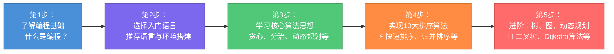

# 🚀 Algorithms - AI时代更需要学习数据结构与算法

> **在AI时代，深刻理解数据结构与算法才能真正驾驭AI，发挥其最大价值。** https://github.com/microwind/algorithms/

   

---

## 💡 为什么学习这个库？

这不仅是一个**算法教学库**，更是一个**编程思维训练营**。把握核心算法思想，紧跟AI时代步伐！

### 📚 核心特性

| 特性 | 说明 |
|:---------|--------|
| **多语言对照学习** | 同一算法用 **C、Java、Python、JavaScript、Go、TypeScript、Rust** 等 7+ 种语言实现，理解语言特性与算法思想的结合 |
| **完整学习闭环** | 从概念理解 → 代码实现 → 复杂度分析 → 练习应用，一站式学习 |
| **AI时代的新视角** | 包含《AI时代程序员的三层能力》系列文章，教你如何用算法思想指导AI编程 |
| **代码质量高** | 所有代码都有详细注释，遵循工程最佳实践，可直接用于面试和项目 |
| **循序渐进** | 从新手入门指南到高级算法思想，适合各个学习阶段 |
| **持续更新** | 定期补充新的算法、语言实现和真实项目案例 |

---

## 🎬 快速开始（3分钟上手）
<!--
┌─────────────────────────────────────┐
│   第1步：了解编程基础                  │
│   📖 什么是编程？                      │
└──────────────┬──────────────────────┘
               ↓
┌──────────────────────────────────────┐
│   第2步：选择入门语言                   │
│   🐍 推荐语言与环境搭建                  │
└──────────────┬───────────────────────┘
               ↓
┌──────────────────────────────────────┐
│   第3步：学习核心算法思想                │
│   🧩 贪心、分治、动态规划等              │
└──────────────┬───────────────────────┘
               ↓
┌──────────────────────────────────────┐
│   第4步：实现10大排序算法               │
│   ⚡ 快速排序、归并排序等                │
└──────────────┬───────────────────────┘
               ↓
┌──────────────────────────────────────┐
│   第5步：进阶：树、图、动态规划           │
│   🌳 二叉树、Dijkstra算法等             │
└──────────────────────────────────────┘
-->

**推荐学习路线：**

- [学习路线](../start-here/learning-path.md) - 完整的学习规划（包含时间估计）
- [什么是编程](../start-here/what-is-programming.md) - 理解编程本质
- [推荐语言](../start-here/recommand-learning-languages.md) - 选择适合的语言

---

## 🧠 AI时代的新挑战：三层能力框架

AI能写代码，但不能替代你的思考。掌握这**三层能力**，让你成为AI时代的优秀程序员：

### 第一层：需求描述工程师（What）
理解问题，清晰地表达需求
- [AI时代，程序员都应该是需求描述工程师](../start-here/AI-Era-Programmers-as-Requirements-Engineers.md)

### 第二层：系统设计工程师（Scope）
定义边界，合理设计系统架构
-  [AI时代，程序员都应该是系统设计工程师](../start-here/AI-Era-Programmers-as-System-Design-Engineers.md)

### 第三层：算法思想工程师（How）
掌握算法思想，用思想指导AI编程
-  [AI时代，程序员都应该是算法思想工程师](../start-here/AI-Era-Programmers-as-Algorithmic-Thinkers.md)

这三篇文章是一个**完整体系**，帮你理解如何在AI时代保持竞争力。

---

## 📚 完整学习内容地图

### 🔍 搜索与查找（10种算法）

| 算法 | 时间复杂度 | 难度 | 代码 |
|------|-----------|------|------|
| [线性搜索](../searching/linear/) | O(n) | ⭐ | [多语言](../searching/linear/) |
| [二分查找](../searching/binarysearch/) | O(log n) | ⭐ | [多语言](../searching/binarysearch/) |
| [插值查找](../searching/interpolation/) | O(log log n) | ⭐⭐ | [多语言](../searching/interpolation/) |
| [指数查找](../searching/exponential/) | O(log n) | ⭐⭐ | [多语言](../searching/exponential/) |
| [跳跃查找](../searching/jump/) | O(√n) | ⭐⭐ | [多语言](../searching/jump/) |
| [朴素字符串搜索](../string/nativesearch/) | O(mn) | ⭐ | [多语言](../string/nativesearch/) |
| [KMP搜索](../string/KMPsearch/) | O(n+m) | ⭐⭐⭐ | [多语言](../string/KMPsearch/) |
| [Boyer-Moore搜索](../string/BoyerMoore/) | O(n/m) | ⭐⭐⭐ | [多语言](../string/BoyerMoore/) |
| [Rabin-Karp搜索](../string/RabinKarp/) | O(n+m) | ⭐⭐⭐ | [多语言](../string/RabinKarp/) |
| [最长公共子序列](../string/LCS/) | O(mn) | ⭐⭐⭐ | [多语言](../string/LCS/) |

---

### 📊 排序算法（10大经典排序）

| 排序算法 | 时间复杂度 平均/最坏 | 空间复杂度 | 稳定性 | 最佳场景 | 代码 |
|---------|----------------------|-----------|------|---------|------|
| [冒泡排序](../sorting/bubblesort/) | O(n²)/O(n²) | O(1) | ✅ | 小规模、教学 | [多语言](../sorting/bubblesort/) |
| [插入排序](../sorting/insertsort/) | O(n²)/O(n²) | O(1) | ✅ | 小规模、半有序 | [多语言](../sorting/insertsort/) |
| [选择排序](../sorting/selectionsort/) | O(n²)/O(n²) | O(1) | ❌ | 交换次数少 | [多语言](../sorting/selectionsort/) |
| [堆排序](../sorting/heapsort/) | O(n log n)/O(n log n) | O(1) | ❌ | 优先队列、TOP K | [多语言](../sorting/heapsort/) |
| [快速排序](../sorting/quicksort/) | O(n log n)/O(n²) | O(log n) | ❌ | 通用排序 | [多语言](../sorting/quicksort/) |
| [归并排序](../sorting/mergesort/) | O(n log n)/O(n log n) | O(n) | ✅ | 大数据、外部排序 | [多语言](../sorting/mergesort/) |
| [希尔排序](../sorting/shellsort/) | O(n log n)/O(n²) | O(1) | ❌ | 中等规模 | [多语言](../sorting/shellsort/) |
| [计数排序](../sorting/countingsort/) | O(n+k)/O(n+k) | O(k) | ✅ | 整数、范围有限 | [多语言](../sorting/countingsort/) |
| [桶排序](../sorting/bucketsort/) | O(n+k)/O(n²) | O(n+k) | ✅ | 均匀分布 | [多语言](../sorting/bucketsort/) |
| [基数排序](../sorting/radixsort/) | O(nk)/O(nk) | O(n+k) | ✅ | 大整数排序 | [多语言](../sorting/radixsort/) |

---

### 🌳 数据结构（7大基础结构）

| 数据结构 | 查找 | 插入 | 删除 | 空间 | 用途 | 学习 |
|---------|------|------|------|------|------|------|
| [数组](../data-structures/array/) | O(1) | O(n) | O(n) | O(n) | 随机访问 | [查看](../data-structures/array/) |
| [链表](../data-structures/linked/) | O(n) | O(1) | O(1) | O(n) | 频繁插删 | [查看](../data-structures/linked/) |
| [栈](../data-structures/stack/) | O(n) | O(1) | O(1) | O(n) | LIFO 处理 | [查看](../data-structures/stack/) |
| [队列](../data-structures/queue/) | O(n) | O(1) | O(1) | O(n) | FIFO 处理 | [查看](../data-structures/queue/) |
| [树](../data-structures/tree/) | O(log n) | O(log n) | O(log n) | O(n) | 分层数据 | [查看](../data-structures/tree/) |
| [图](../data-structures/graph/) | O(V+E) | O(1) | O(1) | O(V+E) | 关系数据 | [查看](../data-structures/graph/) |
| [哈希表](../data-structures/hash/) | O(1) | O(1) | O(1) | O(n) | 快速查找 | [查看](../data-structures/hash/) |

---

### 🧩 7大核心算法策略思想

掌握这7大思想，你就能解决99%的编程问题：

#### 1️⃣ 贪心算法 Greedy
- **核心**：每步选最优，期望全局最优
- **适用**：最优子结构 + 无后效性
- **例子**：活动选择、最小生成树、霍夫曼编码
- **学习**：[贪心算法详解](../algorithmic-thinking/greedy-algorithm/)

#### 2️⃣ 分治算法 Divide and Conquer
- **核心**：分解 → 求解 → 合并
- **适用**：子问题结构相同
- **例子**：快排、归并排序、二分查找
- **学习**：[分治算法详解](../algorithmic-thinking/divide-and-conquer/)

#### 3️⃣ 动态规划 Dynamic Programming
- **核心**：空间换时间，记忆化避免重复
- **适用**：最优子结构 + 重叠子问题
- **例子**：背包问题、最长递增子序列、编辑距离
- **学习**：[动态规划详解](../algorithmic-thinking/dynamic-programming/)

#### 4️⃣ 回溯算法 Backtracking
- **核心**：尝试 → 探索 → 回退
- **适用**：需要遍历所有可能
- **例子**：N皇后、数独、排列组合
- **学习**：[回溯算法详解](../algorithmic-thinking/backtracking/)

#### 5️⃣ 分支限界 Branch and Bound
- **核心**：系统探索 + 聪明剪枝
- **适用**：优化问题
- **例子**：背包问题、旅行商问题
- **学习**：[分支限界详解](../algorithmic-thinking/branch-and-bound/)

#### 6️⃣ **随机化算法策略 Randomization Strategies**
- **蒙特卡洛**：随机采样估算
- **随机快排**：随机 pivot，避免最坏情况
- **模拟退火**：随机扰动，跳出局部最优
- **学习**：[随机化算法策略详解](../algorithmic-thinking/random-algorithm/)

#### 7️⃣  搜索算法策略 Search Strategies

- **BFS**：广度优先，最短路径
- **DFS**：深度优先，全局遍历
- **A\***：启发式搜索，目标导向
- **学习**：[搜索算法策略详解](../algorithmic-thinking/search-algorithms/)

---

### 🎓 项目实战

通过真实项目巩固所学：

| 项目 | 涉及算法 | 难度 | 代码 |
|------|---------|------|------|
| [LRU缓存实现](../practice-projects/lru-cache/) | 哈希表+双向链表 | ⭐⭐ | [查看](../practice-projects/lru-cache/) |
| [搜索建议系统](../practice-projects/search-suggestions/) | Trie树 | ⭐⭐⭐ | [查看](../practice-projects/search-suggestions/) |
| [接雨水](../practice-projects/trapping-water/) | 动态规划+栈 | ⭐⭐⭐ | [查看](../practice-projects/trapping-water/) |
| [路径规划](../practice-projects/path-planning/) | Dijkstra+A* | ⭐⭐⭐ | [查看](../practice-projects/path-planning/) |
| [推荐系统](../practice-projects/recommendation/) | 图算法+贪心 | ⭐⭐⭐⭐ | [查看](../practice-projects/recommendation/) |

---

## 🌐 支持的编程语言

本库用**7+种编程语言**实现同一算法，让你理解语言特性与算法的结合：

<table>
<tr>
  <td align="center"> C</td>
  <td align="center"> Java</td>
  <td align="center"> Python</td>
  <td align="center"> JavaScript</td>
</tr>
<tr>
  <td align="center"> Go</td>
  <td align="center"> TypeScript</td>
  <td align="center"> Rust</td>
  <td align="center"> C++</td>
</tr>
</table>

**为什么要学多种语言？**

- 理解**算法本质**（与语言无关）
- 掌握**语言特性**（如Python的列表 vs Java的ArrayList）
- **拓宽视野**（每种语言都有设计哲学）
- **面试加分**（多语言能力很吃香）

---

## 📖 完整导航

| 章节 | 内容 | 适合人群 |
|------|------|---------|
| [学习路线](../start-here/learning-path.md) | 从零到精通的学习规划 | 完全新手 |
| [什么是编程](../start-here/what-is-programming.md) | 理解编程的本质与核心 | 初学者 |
| [算法思想](../start-here/algorithmic-thinking.md) | 核心算法思想讲解 | 初级程序员 |
| [环境搭建](../start-here/environment-setup.md) | 多种语言的开发环境配置 | 开发者 |
| [推荐语言](../start-here/recommand-learning-languages.md) | 根据背景选择语言 | 初学者 |
| [常见问题](../start-here/faq.md) | 学习过程中的Q&A | 所有人 |

### 🤖 AI时代的算法学习

| 标题 | 核心内容 | 链接 |
|------|---------|------|
| **需求描述工程师** | 学会清晰表达问题 | [阅读](../start-here/AI-Era-Programmers-as-Requirements-Engineers.md) |
| **系统设计工程师** | 学会合理设计系统 | [阅读](../start-here/AI-Era-Programmers-as-System-Design-Engineers.md) |
| **算法思想工程师** | 学会用算法指导AI | [阅读](../start-here/AI-Era-Programmers-as-Algorithmic-Thinkers.md) |

### 📖 算法分类学习

- [搜索与查找](../searching/) - 10种搜索算法详解
- [排序算法](../sorting/) - 10大排序算法对比
- [字符串算法](../string/) - 字符串处理与匹配
- [树与图](../tree/)、[图论](../graph/) - 树和图的遍历与最优路径
- [数据结构](../data-structures/) - 7大基础数据结构
- [递归](../recursion/) - 递归思想与实现
- [数学算法](../math/) - 数论与数学计算
- [位运算](../bit-manipulation/) - 高效的位操作技巧
- [动态规划](../algorithmic-thinking/dynamic-programming/) - 经典DP问题

---

## 💪 你将获得什么？

### ✅ 知识体系

- **完整的算法与数据结构体系**：从基础到进阶，系统化学习
- **清晰的学习路径**：避免走弯路，高效学习
- **深度的思想理解**：不只是记住算法，而是理解其本质
- **多语言的视野**：用不同语言实现，拓宽思维

### 💻 实战能力

- **高质量代码**：每个算法都有精简、规范的实现
- **即插即用**：代码可直接用于面试和项目
- **包含测试**：提供完整的测试用例和验证
- **复杂度分析**：清楚地理解时间和空间权衡

### 🚀 职业发展

- **面试突破**：掌握核心算法思想，面试不再怂
- **晋升加速**：深刻的算法理解是优秀工程师的标志
- **AI时代竞争力**：用算法思想指导AI，成为稀缺人才
- **技术品味**：学会如何思考和设计，而不只是编码

---

## 🎬 快速导航

- **零基础学编程** → [点击开始学习路线](../start-here/learning-path.md)
- **快速学10大排序** → [查看排序算法表格](#-排序算法10大经典排序)
- **掌握算法思想** → [阅读完整的算法思想指南](../start-here/algorithmic-thinking.md)
- **准备面试** → [开始做实战项目](#-实战项目学以致用)
- **理解AI时代编程** → [读三篇AI时代文章](../start-here/AI-Era-Programmers-as-Requirements-Engineers.md)
- **查找某个算法** → [用Ctrl+F搜索这个页面](#完整学习内容地图)

---

## 📊 项目统计

| 指标 | 数值 |
|------|------|
| **算法数量** | 50+ |
| **编程语言** | 7+ |
| **代码行数** | 20,000+ |
| **学习资源** | 100+ |
| **月度更新** | 持续更新中 |

---

## 🌟 用户评价

> "这个库帮我从初学者变成了算法高手，不仅学会了算法，还学会了如何思考问题。" - 大学生读者

> "多语言实现让我理解了不同编程语言的特点和设计哲学。" - 全栈工程师

> "AI时代的三层能力框架完全改变了我对编程的理解！" - 职业发展中的程序员

---

## 🤝 贡献与反馈

- [贡献指南](../CONTRIBUTING.md) - 欢迎贡献代码和文章
- [提交问题](https://github.com/microwind/algorithms/issues) - 反馈bug和建议
- [Star本项目](https://github.com/microwind/algorithms) - 如果帮助了你

---

## 📚 相关资源

这个项目是**《AI时代程序员成长体系》**的一部分：

- **[algorithms](https://github.com/microwind/algorithms)** - 算法与数据结构（本项目）
- **[design-patterns](https://github.com/microwind/design-patterns)** - 设计模式与编程范式
- **[ai-prompt](https://github.com/microwind/ai-prompt)** - AI编程提示词库
- **[ai-skills](https://github.com/microwind/ai-skills)** - AI编程Skill库

---

## 🎯 下一步

**不要只是看，要动手实践：**

1. 选择一个感兴趣的算法
2. 用你喜欢的语言实现一遍
3. 分析时间和空间复杂度
4. 找一个相关的LeetCode题目练习
5. 总结学习笔记

[→ 开始学习](../start-here/learning-path.md) | [→ 查看所有算法](../README.md) | [→ 访问GitHub](https://github.com/microwind/algorithms)

---

  <strong>用算法思想驾驭AI，在AI时代闪闪发光</strong> 
  <em>Algorithms for everyone, in the Age of AI</em>

