# 广度优先搜索（BFS）

> 图的层次遍历算法，使用队列实现，适用于最短路径、连通性检测等问题。

## 算法原理

### 核心思想

BFS从起始节点开始，逐层向外扩展，先访问所有邻居，再访问邻居的邻居。

```
1. 将起始节点加入队列，标记为已访问
2. 从队列取出一个节点
3. 访问该节点的所有未访问邻居，加入队列
4. 重复步骤2-3直到队列为空
```

### 示例遍历

```
图: 0 -- 1 -- 2
    |    |
    3 -- 4

BFS遍历顺序（从0开始）:
第0层: 0
第1层: 1, 3
第2层: 2, 4

结果: [0, 1, 3, 2, 4]
```

---

## 复杂度分析

| 指标 | 复杂度 | 说明 |
|------|--------|------|
| **时间复杂度** | O(V+E) | V顶点数，E边数 |
| **空间复杂度** | O(V) | 队列和访问标记 |

## 算法流程

```mermaid
%%{init: {'flowchart': {'nodeSpacing': 15, 'rankSpacing': 25, 'padding': 20}}}%%
graph LR
    S(["开始"]) --> INPUT["输入图和起点"]
    INPUT --> INIT["初始化队列和访问标记"]
    INIT --> ENQ["起点入队，标记已访问"]
    ENQ --> CHECK{"队列非空?"}
    CHECK -->|"否"| END(["返回遍历结果"])
    CHECK -->|"是"| DEQUEUE["取出节点u"]
    DEQUEUE --> ADD["加入结果列表"]
    ADD --> NEIGHBOR["遍历u的邻居v"]
    NEIGHBOR --> N_CHECK{"所有邻居处理完?"}
    N_CHECK -->|"否"| VISITED{"v已访问?"}
    VISITED -->|"是"| NEXT["下一个邻居"]
    VISITED -->|"否"| MARK["标记v为已访问"]
    MARK --> ENQV["v入队"]
    ENQV --> NEXT
    NEXT --> NEIGHBOR
    N_CHECK -->|"是"| CHECK

    %% 节点样式
    classDef start fill:#ff7f50,color:#fff,stroke:#e5533c,stroke-width:2px
    classDef end1 fill:#ff7f50,color:#fff,stroke:#e5533c,stroke-width:2px
    classDef decision fill:#6a5acd,color:#fff,stroke:#483d8b,stroke-width:2px
    classDef process fill:#20b2aa,color:#fff,stroke:#008080,stroke-width:2px
    
    %% 应用样式
    class S,END start
    class CHECK,VISITED,N_CHECK decision
    class INPUT,INIT,ENQ,DEQUEUE,ADD,NEIGHBOR,MARK,ENQV,NEXT process
```



---

## 适用场景

- **最短路径**：无权图最短路径
- **连通性检测**：图是否连通
- **迷宫求解**：寻找最短出路
- **社交网络**：好友推荐（共同好友）
- **Web爬虫**：按层次抓取页面

---

## 实现列表

| 语言 | 文件名 | 说明 |
|------|--------|------|
| C | [graph_bfs.c](./graph_bfs.c) | 邻接矩阵实现 |
| Java | [GraphBFS.java](./GraphBFS.java) | Queue实现 |
| Go | [graph_bfs.go](./graph_bfs.go) | slice队列 |
| Python | [graph_bfs.py](./graph_bfs.py) | deque实现 |
| JavaScript | [graph_bfs.js](./graph_bfs.js) | 数组队列 |
| TypeScript | [GraphBFS.ts](./GraphBFS.ts) | 类型安全 |
| Rust | [graph_bfs.rs](./graph_bfs.rs) | VecDeque实现 |

---

## 使用示例

### Python 版本
```python
graph = {
    0: [1, 3],
    1: [0, 2, 4],
    2: [1],
    3: [0, 4],
    4: [1, 3]
}
result = bfs(graph, 0)
# [0, 1, 3, 2, 4]
```

---

## 扩展阅读

- Dijkstra算法（带权最短路径）
- A*搜索算法
- 双向BFS优化
