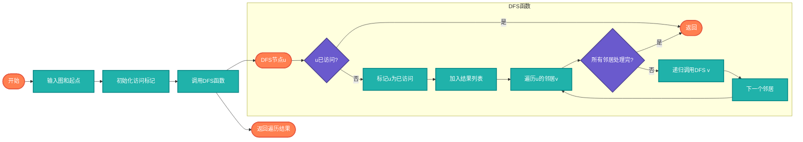

# 深度优先搜索（DFS）

> 图的深度遍历算法，使用递归或栈实现，适用于路径查找、拓扑排序、连通分量等问题。

## 算法原理

### 核心思想

DFS从一个节点开始，尽可能深地探索，直到无法继续再回溯。

```
递归版本:
1. 访问当前节点，标记为已访问
2. 对每个未访问的邻居递归调用DFS

迭代版本（栈）:
1. 将起始节点压入栈
2. 弹出栈顶节点并访问
3. 将未访问的邻居压入栈
4. 重复直到栈为空
```

### 示例遍历

```
图: 0 -- 1 -- 2
    |    |
    3 -- 4

DFS遍历顺序（从0开始）:
0 → 1 → 2 → 回溯 → 4 → 回溯 → 3

结果: [0, 1, 2, 4, 3]
```

---

## 复杂度分析

| 指标 | 复杂度 | 说明 |
|------|--------|------|
| **时间复杂度** | O(V+E) | V顶点数，E边数 |
| **空间复杂度** | O(V) | 递归栈或显式栈 |

## 算法流程（递归版本）



---

## 适用场景

- **路径查找**：迷宫、游戏AI
- **连通分量**：查找所有连通子图
- **拓扑排序**：任务调度
- **环检测**：图中是否存在环
- **回溯算法**：八皇后、数独求解

---

## 实现列表

| 语言 | 文件名 | 说明 |
|------|--------|------|
| C | [graph_dfs.c](./graph_dfs.c) | 递归实现 |
| C | [graph_dfs_iterative.c](./graph_dfs_iterative.c) | 栈实现 |
| Java | [GraphDFS.java](./GraphDFS.java) | 递归/迭代 |
| Go | [graph_dfs.go](./graph_dfs.go) | 栈实现 |
| Python | [graph_dfs.py](./graph_dfs.py) | 简洁实现 |
| JavaScript | [graph_dfs.js](./graph_dfs.js) | 递归实现 |
| TypeScript | [GraphDFS.ts](./GraphDFS.ts) | 类型安全 |
| Rust | [graph_dfs.rs](./graph_dfs.rs) | 迭代器实现 |

---

## 使用示例

### Python 版本
```python
graph = {
    0: [1, 3],
    1: [0, 2, 4],
    2: [1],
    3: [0, 4],
    4: [1, 3]
}
result = dfs(graph, 0)
# [0, 1, 2, 4, 3]
```

---

## 扩展阅读

- 回溯算法框架
- 拓扑排序（Kahn算法）
- 强连通分量（Tarjan算法）
