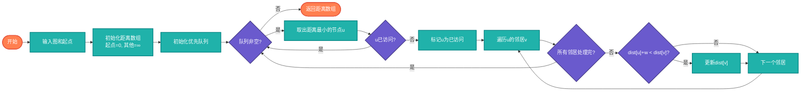

# 迪杰斯特拉算法（Dijkstra）

> 带权图单源最短路径算法，适用于非负权重图。

## 算法原理

### 核心思想

贪心策略：每次选择距离起点最近的未确定节点，更新其邻居的距离。

```
1. 初始化：起点距离=0，其他=∞
2. 选择距离最小的未确定节点u
3. 对u的每个邻居v：
   如果 dist[u] + w(u,v) < dist[v]，更新dist[v]
4. 标记u为已确定
5. 重复2-4直到所有节点确定
```

### 示例

```
    4
0 ----→ 1
|       |
1|      |2
↓       ↓
2 ----→ 3
    1

最短路径（0到其他点）:
0→1: 4
0→2: 1
0→3: 2 (0→2→3)
```

---

## 复杂度分析

| 实现方式 | 时间复杂度 | 空间复杂度 |
|----------|-----------|-----------|
| 数组实现 | O(V²) | O(V) |
| 优先队列（二叉堆） | O(E log V) | O(V) |
| 斐波那契堆 | O(E + V log V) | O(V) |

## 算法流程



---

## 适用场景

- **地图导航**：最短路径规划
- **网络路由**：OSPF协议
- **物流配送**：最优路线
- **游戏开发**：NPC寻路

---

## 实现列表

| 语言 | 文件名 | 说明 |
|------|--------|------|
| C | [graph_dijkstra.c](./graph_dijkstra.c) | 数组实现 |
| Java | [GraphDijkstra.java](./GraphDijkstra.java) | PriorityQueue |
| Go | [graph_dijkstra.go](./graph_dijkstra.go) | 堆实现 |
| Python | [graph_dijkstra.py](./graph_dijkstra.py) | heapq |
| JavaScript | [graph_dijkstra.js](./graph_dijkstra.js) | 优先队列 |
| TypeScript | [GraphDijkstra.ts](./GraphDijkstra.ts) | 类型安全 |
| Rust | [graph_dijkstra.rs](./graph_dijkstra.rs) | BinaryHeap |

---

## 使用示例

### Python 版本
```python
graph = {
    0: {1: 4, 2: 1},
    1: {3: 2},
    2: {1: 2, 3: 5},
    3: {}
}
distances = dijkstra(graph, 0)
# {0: 0, 1: 4, 2: 1, 3: 6}
```

---

## 扩展阅读

- Bellman-Ford算法（处理负权重）
- Floyd-Warshall算法（多源最短路径）
- A*算法（启发式搜索）
