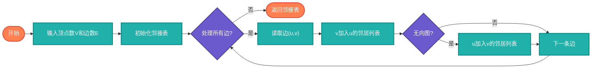

# 图的表示（Graph Representation）

> 图的存储结构，包括邻接矩阵和邻接表两种主要表示方式。

## 算法原理

### 邻接矩阵

使用二维数组存储图，matrix[i][j]表示边(i,j)的权重。

```
适合：稠密图，快速判断边是否存在
空间：O(V²)

示例（4个节点的图）:
    0  1  2  3
0 [ 0  1  0  1 ]
1 [ 1  0  1  0 ]
2 [ 0  1  0  1 ]
3 [ 1  0  1  0 ]
```

### 邻接表

使用链表或数组存储每个节点的邻居。

```
适合：稀疏图，节省空间
空间：O(V+E)

示例:
0: [1, 3]
1: [0, 2]
2: [1, 3]
3: [0, 2]
```

### 对比

| 操作 | 邻接矩阵 | 邻接表 |
|------|----------|--------|
| 添加边 | O(1) | O(1) |
| 删除边 | O(1) | O(E) |
| 查询边 | O(1) | O(E) |
| 遍历邻居 | O(V) | O(E) |
| 空间 | O(V²) | O(V+E) |

---

## 复杂度分析

| 指标 | 邻接矩阵 | 邻接表 |
|------|----------|--------|
| **空间复杂度** | O(V²) | O(V+E) |
| **建图时间** | O(V²) | O(E) |

## 算法流程（邻接表构建）



---

## 适用场景

- **邻接矩阵**：稠密图，频繁查询边
- **邻接表**：稀疏图，节省内存
- **邻接多重表**：无向图边操作优化
- **十字链表**：有向图优化

---

## 实现列表

| 语言 | 文件名 | 说明 |
|------|--------|------|
| C | [graph.c](./graph.c) | 邻接表实现 |
| Java | [Graph.java](./Graph.java) | 类封装 |
| Go | [graph.go](./graph.go) | map实现 |
| Python | [graph.py](./graph.py) | 字典实现 |
| JavaScript | [graph.js](./graph.js) | 对象实现 |
| TypeScript | [Graph.ts](./Graph.ts) | 类型安全 |
| Rust | [graph.rs](./graph.rs) | 结构体实现 |

---

## 使用示例

### Python 版本
```python
# 邻接表
graph = {
    0: [1, 3],
    1: [0, 2],
    2: [1, 3],
    3: [0, 2]
}

# 邻接矩阵
matrix = [
    [0, 1, 0, 1],
    [1, 0, 1, 0],
    [0, 1, 0, 1],
    [1, 0, 1, 0]
]
```

---

## 扩展阅读

- 带权图的表示
- 有向图与无向图的区别
- 图的压缩存储
