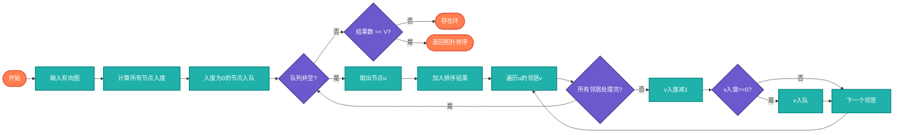

# 拓扑排序（Topological Sort）

> 对有向无环图（DAG）的节点进行线性排序，使得对于每条边(u,v)，u在v之前。

## 算法原理

### Kahn算法（基于入度）

```
1. 计算所有节点的入度
2. 将入度为0的节点加入队列
3. 依次取出节点，加入排序结果
4. 将该节点的邻居入度减1，若变为0则入队
5. 重复3-4直到队列为空
6. 若结果节点数<V，说明有环
```

### DFS方法

```
1. 对未访问的节点进行DFS
2. DFS返回时将节点加入结果栈
3. 逆序输出结果
```

### 示例

```
图: A → B → D
    ↓   ↓
    C → E

拓扑排序结果: [A, B, C, D, E] 或 [A, C, B, E, D]
（可能存在多个合法排序）
```

---

## 复杂度分析

| 指标 | 复杂度 | 说明 |
|------|--------|------|
| **时间复杂度** | O(V+E) | V顶点数，E边数 |
| **空间复杂度** | O(V) | 队列/栈 |

## 算法流程（Kahn算法）



---

## 适用场景

- **任务调度**：依赖关系处理
- **编译顺序**：Makefile依赖
- **课程选修**：先修课安排
- **数据处理**：ETL流程编排
- **包管理**：npm/pip依赖解析

---

## 实现列表

| 语言 | 文件名 | 说明 |
|------|--------|------|
| C | [topological_sort.c](./topological_sort.c) | Kahn算法 |
| Java | [TopologicalSort.java](./TopologicalSort.java) | 队列实现 |
| Go | [topological_sort.go](./topological_sort.go) | map入度 |
| Python | [topological_sort.py](./topological_sort.py) | 简洁实现 |
| JavaScript | [topological_sort.js](./topological_sort.js) | 队列实现 |
| TypeScript | [TopologicalSort.ts](./TopologicalSort.ts) | 类型安全 |
| Rust | [topological_sort.rs](./topological_sort.rs) | Vec实现 |

---

## 使用示例

### Python 版本
```python
graph = {
    'A': ['B', 'C'],
    'B': ['D', 'E'],
    'C': ['E'],
    'D': [],
    'E': []
}
result = topological_sort(graph)
# ['A', 'B', 'C', 'D', 'E'] 或 ['A', 'C', 'B', 'E', 'D']
```

---

## 扩展阅读

- 检测有向图环
- 最长路径（DAG）
- 关键路径（AOE网）
