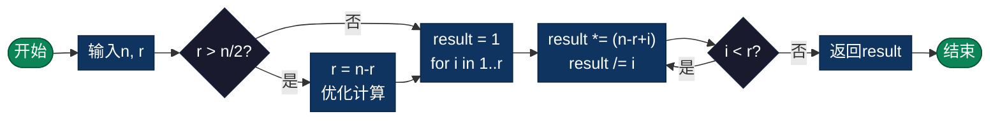

# 组合数学（Combination）

> 排列组合计算，包括阶乘、排列数、组合数计算，以及帕斯卡三角形生成。

## 算法原理

### 核心公式

| 概念 | 公式 | 说明 |
|------|------|------|
| 阶乘 | n! = n × (n-1) × ... × 1 | 0! = 1 |
| 排列数 | P(n,r) = n! / (n-r)! | 有序选取r个 |
| 组合数 | C(n,r) = n! / (r!(n-r)!) | 无序选取r个 |
| 帕斯卡公式 | C(n,r) = C(n-1,r-1) + C(n-1,r) | 递推计算 |

### 示例计算

```
C(5,2) = 5! / (2! × 3!) = 120 / (2 × 6) = 10

帕斯卡三角形:
    1
   1 1
  1 2 1
 1 3 3 1
1 4 6 4 1
```

---

## 复杂度分析

| 指标 | 复杂度 | 说明 |
|------|--------|------|
| **时间复杂度** | O(r) 或 O(n) | 乘除法次数 |
| **空间复杂度** | O(1) | 迭代计算 |
| **动态规划** | O(n×r) | 打表法 |

---

## 流程图



---

## 适用场景

- **概率计算**：组合概率问题
- **密码学**：密钥空间计算
- **算法分析**：复杂度估计
- **彩票概率**：中奖概率计算
- **机器学习**：特征组合

---

## 实现列表

| 语言 | 文件名 | 说明 |
|------|--------|------|
| C | [combine.c](./combine.c) | 基础实现 |
| C | [combination_advanced.c](./combination_advanced.c) | 高级实现 |
| Java | [Combine.java](./Combine.java) | 类封装 |
| Go | [combine.go](./combine.go) | 并发安全 |
| Python | [combination.py](./combination.py) | 完整实现 |
| Python | [combine.py](./combine.py) | 简洁实现 |
| JavaScript | [combine.js](./combine.js) | 函数实现 |
| TypeScript | [Combine.ts](./Combine.ts) | 类型安全 |
| Rust | [combine.rs](./combine.rs) | 内存安全 |

---

## 使用示例

### Python 版本
```python
# 组合数
result = combination(5, 2)  # 10

# 排列数
result = permutation(5, 2)  # 20

# 阶乘
result = factorial(5)  # 120

# 帕斯卡三角形
pascal = generate_pascal(5)
```

---

## 扩展阅读

- 二项式定理
- 容斥原理
- 生成函数
- 斯特林数
