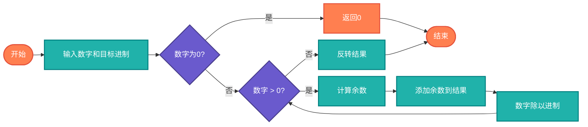

# 数值进制转换（Number Base Conversion）

> 不同进制数之间的相互转换，包括二进制、八进制、十进制、十六进制等。

## 算法原理

### 进制转换原理

**十进制转其他进制（除基取余法）**：
```
不断除以目标基数，取余数作为当前位
最后将余数逆序排列

示例: 十进制 156 转二进制
156 ÷ 2 = 78 余 0
78 ÷ 2 = 39 余 0
39 ÷ 2 = 19 余 1
19 ÷ 2 = 9 余 1
9 ÷ 2 = 4 余 1
4 ÷ 2 = 2 余 0
2 ÷ 2 = 1 余 0
1 ÷ 2 = 0 余 1
结果: 10011100 (从下往上读余数)
```

**其他进制转十进制（位权展开法）**：
```
按位乘以基数的幂次，求和

示例: 二进制 1011 转十进制
1×2³ + 0×2² + 1×2¹ + 1×2⁰
= 8 + 0 + 2 + 1 = 11
```

### 常用进制

| 进制 | 基数 | 示例 | 前缀 |
|------|------|------|------|
| 二进制 | 2 | 1010 | 0b |
| 八进制 | 8 | 12 | 0o |
| 十进制 | 10 | 10 | - |
| 十六进制 | 16 | A | 0x |

---

## 复杂度分析

| 指标 | 复杂度 | 说明 |
|------|--------|------|
| **时间复杂度** | O(log n) | 数字位数决定 |
| **空间复杂度** | O(log n) | 结果存储 |

## 算法流程



---

## 适用场景

- **计算机科学**：底层数据表示
- **网络编程**：IP地址、MAC地址
- **密码学**：十六进制密钥表示
- **嵌入式开发**：寄存器操作
- **数据压缩**：二进制编码

---

## 实现列表

| 语言 | 文件名 | 说明 |
|------|--------|------|
| C | [base_conversion.c](./base_conversion.c) | 手动实现 |
| Java | [BaseConversion.java](./BaseConversion.java) | 类封装 |
| Go | [base_conversion.go](./base_conversion.go) | strconv应用 |
| Python | [base_conversion.py](./base_conversion.py) | 内置函数 |
| JavaScript | [base_conversion.js](./base_conversion.js) | toString/parseInt |
| TypeScript | [BaseConversion.ts](./BaseConversion.ts) | 类型安全 |
| Rust | [base_conversion.rs](./base_conversion.rs) | 标准库应用 |

---

## 使用示例

### Python 版本
```python
# 十进制转二进制
binary = bin(156)  # '0b10011100'

# 十进制转十六进制
hex_val = hex(156)  # '0x9c'

# 任意进制转换
decimal = int('1010', 2)  # 10
decimal = int('FF', 16)   # 255
```

---

## 扩展阅读

- BCD编码（二进制编码的十进制）
- 浮点数的二进制表示（IEEE 754）
- 补码与有符号数表示
- 任意精度进制转换
