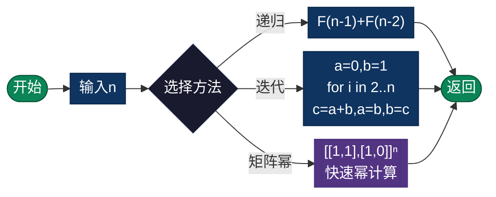

# 斐波那契数列（Fibonacci）

> 经典的递归与动态规划问题，展示了多种算法优化技巧。

## 导航

| [算法原理](#算法原理) | [复杂度分析](#复杂度分析) | [流程图](#流程图) | [实现列表](#实现列表) |

---

## 算法原理

### 定义

```
F(0) = 0, F(1) = 1
F(n) = F(n-1) + F(n-2)  (n ≥ 2)
```

数列: 0, 1, 1, 2, 3, 5, 8, 13, 21, 34, 55, 89, 144...

### 实现方法对比

| 方法 | 时间复杂度 | 空间复杂度 | 特点 |
|------|-----------|-----------|------|
| 递归 | O(2ⁿ) | O(n)栈空间 | 最直观，效率最低 |
| 记忆化 | O(n) | O(n) | 存储已计算值 |
| 迭代 | O(n) | O(1) | 最优空间 |
| 矩阵快速幂 | O(log n) | O(1) | 最优时间 |
| 通项公式 | O(1) | O(1) | 浮点精度问题 |

---

## 复杂度分析

| 指标 | 复杂度 | 说明 |
|------|--------|------|
| **最优时间** | O(log n) | 矩阵快速幂 |
| **最优空间** | O(1) | 迭代法 |
| **黄金比例** | φ = (1+√5)/2 ≈ 1.618 | F(n) ≈ φⁿ/√5 |

---

## 流程图



---

## 适用场景

- **算法教学**：递归vs迭代vs动态规划
- **自然界建模**：植物生长、兔子繁殖
- **金融分析**：技术分析中的斐波那契回调
- **艺术设计**：黄金比例应用
- **数据结构**：斐波那契堆

---

## 实现列表

| 语言 | 文件名 | 说明 |
|------|--------|------|
| C | [fibonacci.c](./fibonacci.c) | 多方法对比 |
| Java | [Fibonacci.java](./Fibonacci.java) | 类封装 |
| Go | [fibonacci.go](./fibonacci.go) | 并发实现 |
| Python | [fibonacci.py](./fibonacci.py) | 生成器实现 |
| JavaScript | [fibonacci.js](./fibonacci.js) | 多种方法 |
| TypeScript | [Fibonacci.ts](./Fibonacci.ts) | 类型安全 |
| Rust | [fibonacci.rs](./fibonacci.rs) | 迭代器实现 |

---

## 使用示例

### Python 版本
```python
# 迭代法
result = fibonacci_iterative(10)  # 55

# 递归+记忆化
result = fibonacci_memo(10)  # 55

# 矩阵快速幂
result = fibonacci_matrix(100)  # 354224848179261915075

# 生成数列
sequence = fibonacci_sequence(10)
# [0, 1, 1, 2, 3, 5, 8, 13, 21, 34]
```

---

## 扩展阅读

- 黄金比例 φ 的数学性质
- 斐波那契堆数据结构
- 通项公式推导（比奈公式）
- 卢卡斯数列
