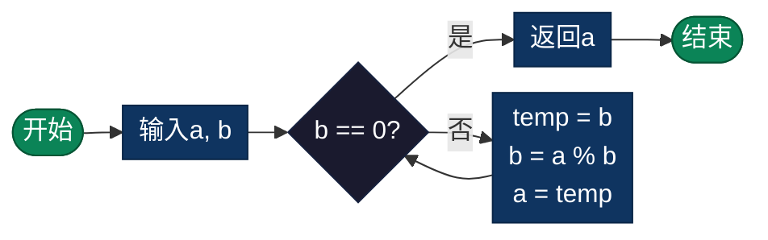

# 最大公约数（GCD - Greatest Common Divisor）

> 计算两个数的最大公约数，使用高效的欧几里得算法。

## 算法原理

### 欧几里得算法

核心定理：`gcd(a, b) = gcd(b, a % b)`

```
证明:
a = b × q + r  (r = a % b)
若d整除a和b，则d必整除r
反之，若d整除b和r，则d必整除a
因此 gcd(a, b) = gcd(b, r)
```

### 示例计算

```
gcd(48, 18):
48 ÷ 18 = 2 余 12  → gcd(18, 12)
18 ÷ 12 = 1 余 6   → gcd(12, 6)
12 ÷ 6  = 2 余 0   → gcd(6, 0) = 6

结果: 6
```

### 扩展欧几里得算法

求 `ax + by = gcd(a, b)` 的整数解 x, y。

---

## 复杂度分析

| 指标 | 复杂度 | 说明 |
|------|--------|------|
| **时间复杂度** | O(log min(a,b)) | 余数快速减小 |
| **空间复杂度** | O(1) | 迭代实现 |
| **递归深度** | O(log min(a,b)) | 递归实现 |

---

## 流程图



---

## 适用场景

- **分数化简**：约分到最简形式
- **密码学**：RSA算法中求模逆元
- **数论问题**：同余方程、中国剩余定理
- **音乐理论**：节拍计算、音程简化
- **图形处理**：图像比例保持

---

## 实现列表

| 语言 | 文件名 | 说明 |
|------|--------|------|
| C | [gcd.c](./gcd.c) | 欧几里得实现 |
| Java | [GCD.java](./GCD.java) | 类封装 |
| Go | [gcd.go](./gcd.go) | 简洁实现 |
| Python | [gcd.py](./gcd.py) | math.gcd包装 |
| JavaScript | [gcd.js](./gcd.js) | ES6实现 |
| TypeScript | [GCD.ts](./GCD.ts) | 类型安全 |
| Rust | [gcd.rs](./gcd.rs) | 泛型实现 |

---

## 使用示例

### Python 版本
```python
# 最大公约数
result = gcd(48, 18)  # 6

# 最小公倍数
lcm = abs(48 * 18) // gcd(48, 18)  # 144

# 多数字GCD
result = gcd_multiple([12, 18, 24])  # 6
```

---

## 扩展阅读

- 扩展欧几里得算法
- 最小公倍数（LCM）
- Stein算法（二进制GCD）
- 贝祖定理
