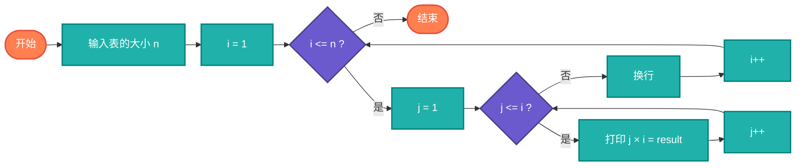

# 乘法表（Multiplication Table）

> 打印九九乘法表及其扩展版本，是编程入门的经典练习题。

## 算法原理

### 九九乘法表

使用双重循环生成：
```
外层循环 i: 1 到 9（被乘数）
内层循环 j: 1 到 i（乘数）
打印: j × i = 结果
```

### 扩展版本

- **更大范围**: 1到n的乘法表
- **不同进制**: 二进制、十六进制乘法
- **格式化输出**: 对齐、表格样式

---

## 复杂度分析

| 指标 | 复杂度 | 说明 |
|------|--------|------|
| **时间复杂度** | O(n²) | 双重循环 |
| **空间复杂度** | O(1) | 仅打印输出 |

## 算法流程



---

## 适用场景

- **编程教学**：循环结构入门
- **数学学习**：乘法口诀练习
- **格式化练习**：输出对齐技巧
- **算法思维**：嵌套循环理解

---

## 实现列表

| 语言 | 文件名 | 说明 |
|------|--------|------|
| C | [multiplication_table.c](./multiplication_table.c) | 基础实现 |
| Java | [MultiplicationTable.java](./MultiplicationTable.java) | 类封装 |
| Go | [multiplication_table.go](./multiplication_table.go) | 格式化输出 |
| Python | [multiplication_table.py](./multiplication_table.py) | 简洁实现 |
| JavaScript | [multiplication_table.js](./multiplication_table.js) | 控制台输出 |
| TypeScript | [MultiplicationTable.ts](./MultiplicationTable.ts) | 类型安全 |
| Rust | [multiplication_table.rs](./multiplication_table.rs) | 格式化实现 |

---

## 使用示例

### Python 版本
```python
# 打印九九乘法表
print_multiplication_table()

# 输出:
# 1×1=1
# 1×2=2 2×2=4
# 1×3=3 2×3=6 3×3=9
# ...

# 打印n×n乘法表
print_table(12)
```

---

## 扩展阅读

- 大九九与小九九的区别
- 古代乘法表历史
- 编程中的格式化输出技巧
