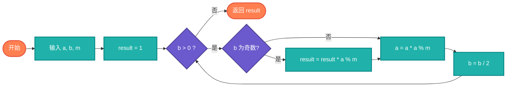

# 数论基础（Number Theory）

> 数论是数学的一个分支，研究整数的性质。包含模运算、同余、欧拉函数等基础算法。

## 算法原理

### 核心概念

| 概念 | 定义 | 公式 |
|------|------|------|
| 模运算 | 取余运算 | a mod m = r |
| 同余 | a ≡ b (mod m) | m \| (a-b) |
| 欧拉函数 φ(n) | 小于n的互质数个数 | φ(n) = n × Π(1-1/p) |
| 模幂运算 | a^b mod m | 快速幂算法 |
| 模逆元 | ax ≡ 1 (mod m) | x = a^(-1) mod m |

### 快速幂算法

```
a^b mod m 的计算:
1. 将b转换为二进制
2. 利用 a^(2k) = (a^k)²
3. 从低位到高位，逐位计算

示例: 3^13 mod 7
13 = 1101₂
3^1 mod 7 = 3
3^2 mod 7 = 2
3^4 mod 7 = 4
3^8 mod 7 = 2
结果 = 3×4×2 mod 7 = 3
```

---

## 复杂度分析

| 算法 | 时间复杂度 | 空间复杂度 |
|------|-----------|-----------|
| 模运算 | O(1) | O(1) |
| 欧拉函数 | O(√n) | O(1) |
| 快速幂 | O(log b) | O(1) |
| 扩展欧几里得 | O(log min(a,b)) | O(1) |

## 算法流程（快速幂）



---

## 适用场景

- **密码学**：RSA、ECC算法基础
- **哈希算法**：模运算取桶位置
- **随机数生成**：线性同余生成器
- **竞赛编程**：数论题目
- **编码理论**：校验码计算

---

## 实现列表

| 语言 | 文件名 | 说明 |
|------|--------|------|
| C | [modular.c](./modular.c) | 模运算实现 |
| Java | [NumberTheory.java](./NumberTheory.java) | 类封装 |
| Go | [number_theory.go](./number_theory.go) | 并发安全 |
| Python | [number_theory.py](./number_theory.py) | 简洁实现 |
| JavaScript | [number_theory.js](./number_theory.js) | BigInt支持 |
| TypeScript | [NumberTheory.ts](./NumberTheory.ts) | 类型安全 |
| Rust | [number_theory.rs](./number_theory.rs) | 泛型实现 |

---

## 使用示例

### Python 版本
```python
# 快速幂
result = mod_pow(3, 100, 7)  # 3^100 mod 7 = 4

# 欧拉函数
phi = euler_phi(10)  # 4

# 模逆元
inv = mod_inverse(3, 7)  # 5, 因为 3×5 mod 7 = 1

# 中国剩余定理
result = chinese_remainder([2,3,2], [3,5,7])  # 23
```

---

## 扩展阅读

- 费马小定理
- 欧拉定理
- 中国剩余定理
- 素数测试（Miller-Rabin）
- 离散对数问题
