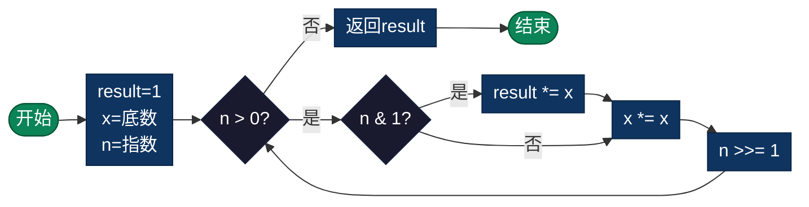

# 幂运算（Power）

> 高效计算整数的幂，包括快速幂算法和浮点数次幂。

## 导航

| [算法原理](#算法原理) | [复杂度分析](#复杂度分析) | [流程图](#流程图) | [实现列表](#实现列表) |

---

## 算法原理

### 快速幂算法

利用二进制的思想：
```
x^n = x^(二进制各位的幂的乘积)

例如 x^13, 13 = 1101₂ = 8+4+1
x^13 = x^8 × x^4 × x^1

计算过程:
result = 1
while n > 0:
    if n & 1: result *= x
    x *= x
    n >>= 1
```

### 示例计算

```
计算 3^13:

n=13(1101), x=3
第1轮: n&1=1, result=3, x=9, n=6
第2轮: n&1=0, result=3, x=81, n=3
第3轮: n&1=1, result=243, x=6561, n=1
第4轮: n&1=1, result=1594323, x=43046721, n=0

结果: 1594323 = 3^13
```

---

## 复杂度分析

| 指标 | 复杂度 | 说明 |
|------|--------|------|
| **朴素算法** | O(n) | n次乘法 |
| **快速幂** | O(log n) | 二进制位数次乘法 |
| **空间复杂度** | O(1) | 迭代实现 |

---

## 流程图



---

## 适用场景

- **科学计算**：指数运算
- **密码学**：RSA加密中的大数幂运算
- **图形学**：矩阵变换
- **复利计算**：金融公式
- **数值分析**：迭代法

---

## 实现列表

| 语言 | 文件名 | 说明 |
|------|--------|------|
| C | [power.c](./power.c) | 快速幂实现 |
| Java | [Power.java](./Power.java) | 类封装 |
| Go | [power.go](./power.go) | 简洁实现 |
| Python | [power.py](./power.py) | pow函数应用 |
| JavaScript | [power.js](./power.js) | Math.pow |
| TypeScript | [Power.ts](./Power.ts) | 类型安全 |
| Rust | [power.rs](./power.rs) | 泛型实现 |

---

## 使用示例

### Python 版本
```python
# 快速幂
result = fast_pow(2, 10)  # 1024

# 模幂运算（用于大数）
result = mod_pow(2, 100, 1000000007)

# 浮点数次幂
result = pow(2, 0.5)  # 1.414...
```

---

## 扩展阅读

- 矩阵快速幂
- 浮点数次幂实现
- 对数换底公式
- 指数函数泰勒展开
