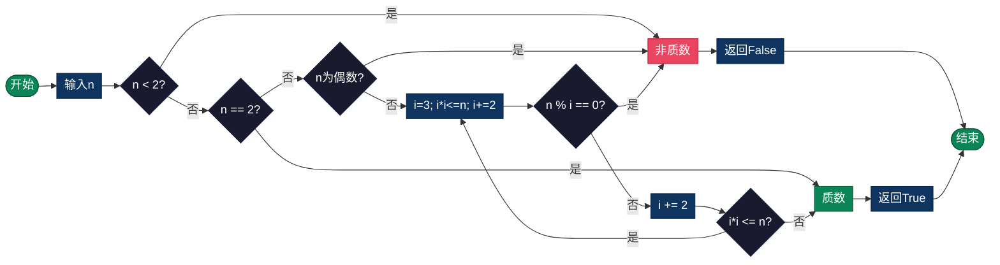

# 质数算法（Prime Number）

> 质数判断、质数生成、质因数分解等数论基础算法。

## 算法原理

### 质数判断

试除法优化：只需检查到 √n

```
优化依据:
若n有大于√n的因数a，则必有小于√n的因数b=n/a
因此只需检查 [2, √n] 范围内的因数

进一步优化：
只需检查质数（2, 3, 5, 7...）
6k±1优化（除2,3外，质数必为6k±1形式）
```

### 埃拉托斯特尼筛法

生成范围内所有质数：

```
1. 标记2为质数，筛去所有2的倍数
2. 找到下一个未标记数3，标记为质数，筛去倍数
3. 重复直到√n
4. 剩余未标记数均为质数
```

### 质因数分解

```
60 = 2² × 3 × 5
分解步骤:
60 ÷ 2 = 30
30 ÷ 2 = 15
15 ÷ 3 = 5
5 ÷ 5 = 1
```

---

## 复杂度分析

| 算法 | 时间复杂度 | 空间复杂度 |
|------|-----------|-----------|
| 试除法判断 | O(√n) | O(1) |
| 埃氏筛 | O(n log log n) | O(n) |
| 质因数分解 | O(√n) | O(log n) |

---

## 流程图



---

## 适用场景

- **密码学**：RSA、Diffie-Hellman等算法
- **哈希表**：质数大小的桶数量
- **随机数生成**：梅森素数应用
- **竞赛编程**：数论题目基础
- **分布式系统**：一致性哈希

---

## 实现列表

| 语言 | 文件名 | 说明 |
|------|--------|------|
| C | [prime.c](./prime.c) | 多算法实现 |
| Java | [Prime.java](./Prime.java) | 类封装 |
| Go | [prime.go](./prime.go) | 并发筛选 |
| Python | [prime.py](./prime.py) | 简洁实现 |
| JavaScript | [prime.js](./prime.js) | 筛法实现 |
| TypeScript | [Prime.ts](./Prime.ts) | 类型安全 |
| Rust | [prime.rs](./prime.rs) | 迭代器实现 |

---

## 使用示例

### Python 版本
```python
# 质数判断
is_prime = is_prime(17)  # True

# 生成质数列表
primes = generate_primes(100)
# [2, 3, 5, 7, 11, 13, ... 97]

# 质因数分解
factors = prime_factors(60)  # {2: 2, 3: 1, 5: 1}

# 第n个质数
p = nth_prime(100)  # 541
```

---

## 扩展阅读

- 素数定理（π(n) ≈ n/ln(n)）
- 孪生素数猜想
- 哥德巴赫猜想
- 梅森素数
- RSA算法原理
