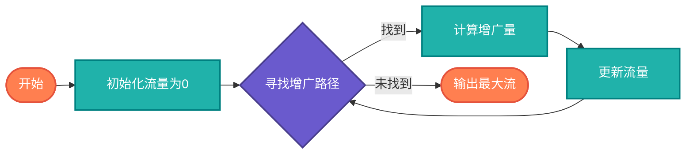

## 【网络流算法详解】Java/Go/Python/JS/C/Rust不同语言实现

## 说明

网络流算法是图论中的重要算法，用于解决网络中流量传输的最优化问题。在AI时代，网络流算法广泛应用于物流优化、交通调度、资源分配、计算机网络路由等场景。

> **生活类比**：就像城市交通系统，网络流算法帮助优化车流量，确保道路网络能够高效运输最多车辆而不拥堵。

## 算法分类

### 1. 最大流算法
- **Ford-Fulkerson算法** - 基于增广路径的经典算法
- **Edmonds-Karp算法** - Ford-Fulkerson的BFS优化版本
- **Dinic算法** - 分层图的高效算法
- **Push-Relabel算法** - 基于预流推进的算法

### 2. 最小割算法
- **Stoer-Wagner算法** - 全局最小割
- **Karger算法** - 随机化最小割算法

### 3. 费用流算法
- **最小费用最大流** - 考虑费用的流算法
- **成功最短路** - 费用流的基础算法

## 算法流程

### Ford-Fulkerson算法流程图



## 时间复杂度分析

- **Ford-Fulkerson**: O(E * max_flow)
- **Edmonds-Karp**: O(VE²)
- **Dinic**: O(V²E) 或 O(E√V)
- **Push-Relabel**: O(V³)

# 代码

## Java

```java
import java.util.*;

public class NetworkFlow {
    
    static class Edge {
        int to, capacity, flow, rev;
        
        Edge(int to, int capacity, int flow, int rev) {
            this.to = to;
            this.capacity = capacity;
            this.flow = flow;
            this.rev = rev;
        }
    }
    
    static class Graph {
        int n;
        List<Edge>[] adj;
        
        @SuppressWarnings("unchecked")
        Graph(int n) {
            this.n = n;
            adj = new ArrayList[n];
            for (int i = 0; i < n; i++) {
                adj[i] = new ArrayList<>();
            }
        }
        
        void addEdge(int u, int v, int capacity) {
            adj[u].add(new Edge(v, capacity, 0, adj[v].size()));
            adj[v].add(new Edge(u, 0, 0, adj[u].size() - 1));
        }
    }
    
    // Ford-Fulkerson算法
    public static int fordFulkerson(Graph graph, int source, int sink) {
        int maxFlow = 0;
        int[] parent = new int[graph.n];
        
        while (bfs(graph, source, sink, parent)) {
            int pathFlow = Integer.MAX_VALUE;
            
            // 找到增广路径的最小容量
            for (int v = sink; v != source; v = parent[v]) {
                int u = parent[v];
                for (Edge edge : graph.adj[u]) {
                    if (edge.to == v && edge.capacity - edge.flow > 0) {
                        pathFlow = Math.min(pathFlow, edge.capacity - edge.flow);
                        break;
                    }
                }
            }
            
            // 更新流量
            for (int v = sink; v != source; v = parent[v]) {
                int u = parent[v];
                for (Edge edge : graph.adj[u]) {
                    if (edge.to == v && edge.capacity - edge.flow > 0) {
                        edge.flow += pathFlow;
                        break;
                    }
                }
                for (Edge edge : graph.adj[v]) {
                    if (edge.to == u && edge.flow > 0) {
                        edge.flow -= pathFlow;
                        break;
                    }
                }
            }
            
            maxFlow += pathFlow;
        }
        
        return maxFlow;
    }
    
    private static boolean bfs(Graph graph, int source, int sink, int[] parent) {
        boolean[] visited = new boolean[graph.n];
        Queue<Integer> queue = new LinkedList<>();
        
        queue.add(source);
        visited[source] = true;
        parent[source] = -1;
        
        while (!queue.isEmpty()) {
            int u = queue.poll();
            
            for (Edge edge : graph.adj[u]) {
                if (!visited[edge.to] && edge.capacity - edge.flow > 0) {
                    queue.add(edge.to);
                    parent[edge.to] = u;
                    visited[edge.to] = true;
                    
                    if (edge.to == sink) {
                        return true;
                    }
                }
            }
        }
        
        return false;
    }
    
    public static void main(String[] args) {
        Graph graph = new Graph(6);
        
        // 添加边
        graph.addEdge(0, 1, 16);
        graph.addEdge(0, 2, 13);
        graph.addEdge(1, 2, 10);
        graph.addEdge(1, 3, 12);
        graph.addEdge(2, 1, 4);
        graph.addEdge(2, 4, 14);
        graph.addEdge(3, 2, 9);
        graph.addEdge(3, 5, 20);
        graph.addEdge(4, 3, 7);
        graph.addEdge(4, 5, 4);
        
        int maxFlow = fordFulkerson(graph, 0, 5);
        System.out.println("最大流: " + maxFlow);
    }
}
```

## Python

```python
from collections import deque

class Edge:
    def __init__(self, to, capacity, flow, rev):
        self.to = to
        self.capacity = capacity
        self.flow = flow
        self.rev = rev

class Graph:
    def __init__(self, n):
        self.n = n
        self.adj = [[] for _ in range(n)]
    
    def add_edge(self, u, v, capacity):
        self.adj[u].append(Edge(v, capacity, 0, len(self.adj[v])))
        self.adj[v].append(Edge(u, 0, 0, len(self.adj[u]) - 1))

def bfs(graph, source, sink, parent):
    visited = [False] * graph.n
    queue = deque()
    
    queue.append(source)
    visited[source] = True
    parent[source] = -1
    
    while queue:
        u = queue.popleft()
        
        for edge in graph.adj[u]:
            if not visited[edge.to] and edge.capacity - edge.flow > 0:
                queue.append(edge.to)
                parent[edge.to] = u
                visited[edge.to] = True
                
                if edge.to == sink:
                    return True
    
    return False

def ford_fulkerson(graph, source, sink):
    max_flow = 0
    parent = [-1] * graph.n
    
    while bfs(graph, source, sink, parent):
        path_flow = float('inf')
        
        # 找到增广路径的最小容量
        v = sink
        while v != source:
            u = parent[v]
            for edge in graph.adj[u]:
                if edge.to == v and edge.capacity - edge.flow > 0:
                    path_flow = min(path_flow, edge.capacity - edge.flow)
                    break
            v = u
        
        # 更新流量
        v = sink
        while v != source:
            u = parent[v]
            for edge in graph.adj[u]:
                if edge.to == v and edge.capacity - edge.flow > 0:
                    edge.flow += path_flow
                    break
            for edge in graph.adj[v]:
                if edge.to == u and edge.flow > 0:
                    edge.flow -= path_flow
                    break
            v = u
        
        max_flow += path_flow
    
    return max_flow

def main():
    graph = Graph(6)
    
    # 添加边
    graph.add_edge(0, 1, 16)
    graph.add_edge(0, 2, 13)
    graph.add_edge(1, 2, 10)
    graph.add_edge(1, 3, 12)
    graph.add_edge(2, 1, 4)
    graph.add_edge(2, 4, 14)
    graph.add_edge(3, 2, 9)
    graph.add_edge(3, 5, 20)
    graph.add_edge(4, 3, 7)
    graph.add_edge(4, 5, 4)
    
    max_flow = ford_fulkerson(graph, 0, 5)
    print(f"最大流: {max_flow}")

if __name__ == "__main__":
    main()
```

## Go

```go
package main

import (
	"fmt"
)

type Edge struct {
	to       int
	capacity int
	flow     int
	rev      int
}

type Graph struct {
	n   int
	adj [][]Edge
}

func NewGraph(n int) *Graph {
	adj := make([][]Edge, n)
	return &Graph{n: n, adj: adj}
}

func (g *Graph) AddEdge(u, v, capacity int) {
	g.adj[u] = append(g.adj[u], Edge{to: v, capacity: capacity, flow: 0, rev: len(g.adj[v])})
	g.adj[v] = append(g.adj[v], Edge{to: u, capacity: 0, flow: 0, rev: len(g.adj[u]) - 1})
}

func bfs(graph *Graph, source, sink int, parent []int) bool {
	visited := make([]bool, graph.n)
	queue := []int{source}
	
	visited[source] = true
	parent[source] = -1
	
	for len(queue) > 0 {
		u := queue[0]
		queue = queue[1:]
		
		for _, edge := range graph.adj[u] {
			if !visited[edge.to] && edge.capacity-edge.flow > 0 {
				queue = append(queue, edge.to)
				parent[edge.to] = u
				visited[edge.to] = true
				
				if edge.to == sink {
					return true
				}
			}
		}
	}
	
	return false
}

func fordFulkerson(graph *Graph, source, sink int) int {
	maxFlow := 0
	parent := make([]int, graph.n)
	
	for bfs(graph, source, sink, parent) {
		pathFlow := 1 << 31 - 1 // 最大整数
		
		// 找到增广路径的最小容量
		for v := sink; v != source; v = parent[v] {
			u := parent[v]
			for _, edge := range graph.adj[u] {
				if edge.to == v && edge.capacity-edge.flow > 0 {
					if edge.capacity-edge.flow < pathFlow {
						pathFlow = edge.capacity - edge.flow
					}
					break
				}
			}
		}
		
		// 更新流量
		for v := sink; v != source; v = parent[v] {
			u := parent[v]
			for i := range graph.adj[u] {
				if graph.adj[u][i].to == v && graph.adj[u][i].capacity-graph.adj[u][i].flow > 0 {
					graph.adj[u][i].flow += pathFlow
					break
				}
			}
			for i := range graph.adj[v] {
				if graph.adj[v][i].to == u && graph.adj[v][i].flow > 0 {
					graph.adj[v][i].flow -= pathFlow
					break
				}
			}
		}
		
		maxFlow += pathFlow
	}
	
	return maxFlow
}

func main() {
	graph := NewGraph(6)
	
	// 添加边
	graph.AddEdge(0, 1, 16)
	graph.AddEdge(0, 2, 13)
	graph.AddEdge(1, 2, 10)
	graph.AddEdge(1, 3, 12)
	graph.AddEdge(2, 1, 4)
	graph.AddEdge(2, 4, 14)
	graph.AddEdge(3, 2, 9)
	graph.AddEdge(3, 5, 20)
	graph.AddEdge(4, 3, 7)
	graph.AddEdge(4, 5, 4)
	
	maxFlow := fordFulkerson(graph, 0, 5)
	fmt.Printf("最大流: %d\n", maxFlow)
}
```

## JavaScript

```javascript
class Edge {
    constructor(to, capacity, flow, rev) {
        this.to = to;
        this.capacity = capacity;
        this.flow = flow;
        this.rev = rev;
    }
}

class Graph {
    constructor(n) {
        this.n = n;
        this.adj = Array.from({ length: n }, () => []);
    }
    
    addEdge(u, v, capacity) {
        this.adj[u].push(new Edge(v, capacity, 0, this.adj[v].length));
        this.adj[v].push(new Edge(u, 0, 0, this.adj[u].length - 1));
    }
}

function bfs(graph, source, sink, parent) {
    const visited = new Array(graph.n).fill(false);
    const queue = [source];
    
    visited[source] = true;
    parent[source] = -1;
    
    while (queue.length > 0) {
        const u = queue.shift();
        
        for (const edge of graph.adj[u]) {
            if (!visited[edge.to] && edge.capacity - edge.flow > 0) {
                queue.push(edge.to);
                parent[edge.to] = u;
                visited[edge.to] = true;
                
                if (edge.to === sink) {
                    return true;
                }
            }
        }
    }
    
    return false;
}

function fordFulkerson(graph, source, sink) {
    let maxFlow = 0;
    const parent = new Array(graph.n).fill(-1);
    
    while (bfs(graph, source, sink, parent)) {
        let pathFlow = Infinity;
        
        // 找到增广路径的最小容量
        for (let v = sink; v !== source; v = parent[v]) {
            const u = parent[v];
            for (const edge of graph.adj[u]) {
                if (edge.to === v && edge.capacity - edge.flow > 0) {
                    pathFlow = Math.min(pathFlow, edge.capacity - edge.flow);
                    break;
                }
            }
        }
        
        // 更新流量
        for (let v = sink; v !== source; v = parent[v]) {
            const u = parent[v];
            for (const edge of graph.adj[u]) {
                if (edge.to === v && edge.capacity - edge.flow > 0) {
                    edge.flow += pathFlow;
                    break;
                }
            }
            for (const edge of graph.adj[v]) {
                if (edge.to === u && edge.flow > 0) {
                    edge.flow -= pathFlow;
                    break;
                }
            }
        }
        
        maxFlow += pathFlow;
    }
    
    return maxFlow;
}

// 示例使用
const graph = new Graph(6);

// 添加边
graph.addEdge(0, 1, 16);
graph.addEdge(0, 2, 13);
graph.addEdge(1, 2, 10);
graph.addEdge(1, 3, 12);
graph.addEdge(2, 1, 4);
graph.addEdge(2, 4, 14);
graph.addEdge(3, 2, 9);
graph.addEdge(3, 5, 20);
graph.addEdge(4, 3, 7);
graph.addEdge(4, 5, 4);

const maxFlow = fordFulkerson(graph, 0, 5);
console.log("最大流:", maxFlow);
```

## C

```c
#include <stdio.h>
#include <stdlib.h>
#include <string.h>
#include <limits.h>

#define MAX_V 100

typedef struct {
    int to, capacity, flow, rev;
} Edge;

typedef struct {
    int n;
    Edge* adj[MAX_V];
    int adj_size[MAX_V];
} Graph;

Graph* createGraph(int n) {
    Graph* graph = (Graph*)malloc(sizeof(Graph));
    graph->n = n;
    memset(graph->adj_size, 0, sizeof(graph->adj_size));
    return graph;
}

void addEdge(Graph* graph, int u, int v, int capacity) {
    Edge* forward = (Edge*)malloc(sizeof(Edge));
    forward->to = v;
    forward->capacity = capacity;
    forward->flow = 0;
    forward->rev = graph->adj_size[v];
    
    Edge* backward = (Edge*)malloc(sizeof(Edge));
    backward->to = u;
    backward->capacity = 0;
    backward->flow = 0;
    backward->rev = graph->adj_size[u];
    
    graph->adj[u][graph->adj_size[u]++] = *forward;
    graph->adj[v][graph->adj_size[v]++] = *backward;
}

int bfs(Graph* graph, int source, int sink, int* parent) {
    int visited[MAX_V] = {0};
    int queue[MAX_V], front = 0, rear = 0;
    
    queue[rear++] = source;
    visited[source] = 1;
    parent[source] = -1;
    
    while (front < rear) {
        int u = queue[front++];
        
        for (int i = 0; i < graph->adj_size[u]; i++) {
            Edge* edge = &graph->adj[u][i];
            if (!visited[edge->to] && edge->capacity - edge->flow > 0) {
                queue[rear++] = edge->to;
                parent[edge->to] = u;
                visited[edge->to] = 1;
                
                if (edge->to == sink) {
                    return 1;
                }
            }
        }
    }
    
    return 0;
}

int fordFulkerson(Graph* graph, int source, int sink) {
    int maxFlow = 0;
    int parent[MAX_V];
    
    while (bfs(graph, source, sink, parent)) {
        int pathFlow = INT_MAX;
        
        // 找到增广路径的最小容量
        for (int v = sink; v != source; v = parent[v]) {
            int u = parent[v];
            for (int i = 0; i < graph->adj_size[u]; i++) {
                Edge* edge = &graph->adj[u][i];
                if (edge->to == v && edge->capacity - edge->flow > 0) {
                    if (edge->capacity - edge->flow < pathFlow) {
                        pathFlow = edge->capacity - edge->flow;
                    }
                    break;
                }
            }
        }
        
        // 更新流量
        for (int v = sink; v != source; v = parent[v]) {
            int u = parent[v];
            for (int i = 0; i < graph->adj_size[u]; i++) {
                Edge* edge = &graph->adj[u][i];
                if (edge->to == v && edge->capacity - edge->flow > 0) {
                    edge->flow += pathFlow;
                    break;
                }
            }
            for (int i = 0; i < graph->adj_size[v]; i++) {
                Edge* edge = &graph->adj[v][i];
                if (edge->to == u && edge->flow > 0) {
                    edge->flow -= pathFlow;
                    break;
                }
            }
        }
        
        maxFlow += pathFlow;
    }
    
    return maxFlow;
}

int main() {
    Graph* graph = createGraph(6);
    
    // 添加边
    addEdge(graph, 0, 1, 16);
    addEdge(graph, 0, 2, 13);
    addEdge(graph, 1, 2, 10);
    addEdge(graph, 1, 3, 12);
    addEdge(graph, 2, 1, 4);
    addEdge(graph, 2, 4, 14);
    addEdge(graph, 3, 2, 9);
    addEdge(graph, 3, 5, 20);
    addEdge(graph, 4, 3, 7);
    addEdge(graph, 4, 5, 4);
    
    int maxFlow = fordFulkerson(graph, 0, 5);
    printf("最大流: %d\n", maxFlow);
    
    return 0;
}
```

## Rust

```rust
use std::collections::VecDeque;

#[derive(Debug, Clone)]
struct Edge {
    to: usize,
    capacity: i32,
    flow: i32,
    rev: usize,
}

#[derive(Debug)]
struct Graph {
    n: usize,
    adj: Vec<Vec<Edge>>,
}

impl Graph {
    fn new(n: usize) -> Self {
        Graph {
            n,
            adj: vec![Vec::new(); n],
        }
    }
    
    fn add_edge(&mut self, u: usize, v: usize, capacity: i32) {
        let forward = Edge {
            to: v,
            capacity,
            flow: 0,
            rev: self.adj[v].len(),
        };
        
        let backward = Edge {
            to: u,
            capacity: 0,
            flow: 0,
            rev: self.adj[u].len(),
        };
        
        self.adj[u].push(forward);
        self.adj[v].push(backward);
    }
}

fn bfs(graph: &Graph, source: usize, sink: usize, parent: &mut [Option<usize>]) -> bool {
    let mut visited = vec![false; graph.n];
    let mut queue = VecDeque::new();
    
    queue.push_back(source);
    visited[source] = true;
    parent[source] = None;
    
    while let Some(u) = queue.pop_front() {
        for edge in &graph.adj[u] {
            if !visited[edge.to] && edge.capacity - edge.flow > 0 {
                queue.push_back(edge.to);
                parent[edge.to] = Some(u);
                visited[edge.to] = true;
                
                if edge.to == sink {
                    return true;
                }
            }
        }
    }
    
    false
}

fn ford_fulkerson(graph: &mut Graph, source: usize, sink: usize) -> i32 {
    let mut max_flow = 0;
    let mut parent = vec![None; graph.n];
    
    while bfs(graph, source, sink, &mut parent) {
        let mut path_flow = i32::MAX;
        
        // 找到增广路径的最小容量
        let mut v = sink;
        while v != source {
            if let Some(u) = parent[v] {
                for edge in &graph.adj[u] {
                    if edge.to == v && edge.capacity - edge.flow > 0 {
                        path_flow = path_flow.min(edge.capacity - edge.flow);
                        break;
                    }
                }
                v = u;
            } else {
                break;
            }
        }
        
        // 更新流量
        let mut v = sink;
        while v != source {
            if let Some(u) = parent[v] {
                for edge in &mut graph.adj[u] {
                    if edge.to == v && edge.capacity - edge.flow > 0 {
                        edge.flow += path_flow;
                        break;
                    }
                }
                for edge in &mut graph.adj[v] {
                    if edge.to == u && edge.flow > 0 {
                        edge.flow -= path_flow;
                        break;
                    }
                }
                v = u;
            } else {
                break;
            }
        }
        
        max_flow += path_flow;
    }
    
    max_flow
}

fn main() {
    let mut graph = Graph::new(6);
    
    // 添加边
    graph.add_edge(0, 1, 16);
    graph.add_edge(0, 2, 13);
    graph.add_edge(1, 2, 10);
    graph.add_edge(1, 3, 12);
    graph.add_edge(2, 1, 4);
    graph.add_edge(2, 4, 14);
    graph.add_edge(3, 2, 9);
    graph.add_edge(3, 5, 20);
    graph.add_edge(4, 3, 7);
    graph.add_edge(4, 5, 4);
    
    let max_flow = ford_fulkerson(&mut graph, 0, 5);
    println!("最大流: {}", max_flow);
}
```

# 链接

网络流算法源码：[https://github.com/microwind/algorithms/tree/main/network-flow](https://github.com/microwind/algorithms/tree/main/network-flow)

其他算法源码：[https://github.com/microwind/algorithms](https://github.com/microwind/algorithms)
