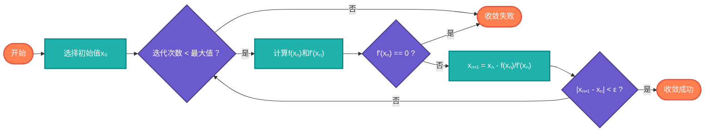

## 【数值分析算法详解】Java/Go/Python/JS/C不同语言实现

## 说明

数值分析算法（Numerical Analysis Algorithms）是解决数学问题的计算方法，特别适用于难以求得解析解的情况。在AI时代，数值分析是机器学习、深度学习、科学计算的核心基础，帮助我们将复杂的数学问题转化为可计算的数值解。

> **生活类比**：就像用尺子测量不规则物体的长度，我们无法得到精确值，但可以通过多次测量和计算得到足够精确的近似值。数值分析就是数学问题的"精密测量"技术。

## 算法分类

### 1. 数值积分算法
- **梯形法则** - 基础数值积分方法
- **辛普森法则** - 更精确的积分方法
- **高斯积分** - 高精度数值积分
- **蒙特卡洛积分** - 随机采样积分

### 2. 数值微分算法
- **中心差分法** - 基础数值微分
- **前向差分法** - 简单微分方法
- **后向差分法** - 另一种微分方法
- **高阶差分** - 提高精度

### 3. 方程求解算法
- **二分法** - 求根基础方法
- **牛顿法** - 快速收敛求根
- **弦截法** - 不需要导数的求根
- **不动点迭代** - 收敛性分析

### 4. 线性代数算法
- **高斯消元法** - 线性方程组求解
- **LU分解** - 矩阵分解方法
- **QR分解** - 正交分解
- **幂迭代法** - 特征值计算

### 5. 插值与拟合算法
- **拉格朗日插值** - 多项式插值
- **牛顿插值** - 高效插值方法
- **样条插值** - 平滑插值
- **最小二乘拟合** - 数据拟合

## 算法流程

### 牛顿法求根流程图



# 代码

## Java

```java
public class NumericalAnalysis {
    
    // 数值积分算法
    public static class NumericalIntegration {
        
        // 梯形法则
        public static double trapezoidalRule(Function<Double, Double> f, double a, double b, int n) {
            double h = (b - a) / n;
            double sum = 0.5 * (f.apply(a) + f.apply(b));
            
            for (int i = 1; i < n; i++) {
                double x = a + i * h;
                sum += f.apply(x);
            }
            
            return sum * h;
        }
        
        // 辛普森法则
        public static double simpsonsRule(Function<Double, Double> f, double a, double b, int n) {
            if (n % 2 != 0) n++; // 确保n为偶数
            
            double h = (b - a) / n;
            double sum = f.apply(a) + f.apply(b);
            
            for (int i = 1; i < n; i++) {
                double x = a + i * h;
                if (i % 2 == 0) {
                    sum += 2 * f.apply(x);
                } else {
                    sum += 4 * f.apply(x);
                }
            }
            
            return sum * h / 3;
        }
        
        // 蒙特卡洛积分
        public static double monteCarloIntegration(Function<Double, Double> f, double a, double b, int samples) {
            double sum = 0;
            Random random = new Random();
            
            for (int i = 0; i < samples; i++) {
                double x = a + (b - a) * random.nextDouble();
                sum += f.apply(x);
            }
            
            return (b - a) * sum / samples;
        }
    }
    
    // 数值微分算法
    public static class NumericalDifferentiation {
        
        // 中心差分法
        public static double centralDifference(Function<Double, Double> f, double x, double h) {
            return (f.apply(x + h) - f.apply(x - h)) / (2 * h);
        }
        
        // 前向差分法
        public static double forwardDifference(Function<Double, Double> f, double x, double h) {
            return (f.apply(x + h) - f.apply(x)) / h;
        }
        
        // 后向差分法
        public static double backwardDifference(Function<Double, Double> f, double x, double h) {
            return (f.apply(x) - f.apply(x - h)) / h;
        }
        
        // 二阶导数（中心差分）
        public static double secondDerivative(Function<Double, Double> f, double x, double h) {
            return (f.apply(x + h) - 2 * f.apply(x) + f.apply(x - h)) / (h * h);
        }
    }
    
    // 方程求解算法
    public static class EquationSolving {
        
        // 二分法
        public static double bisectionMethod(Function<Double, Double> f, double a, double b, double epsilon, int maxIterations) {
            if (f.apply(a) * f.apply(b) > 0) {
                throw new IllegalArgumentException("Function must have opposite signs at endpoints");
            }
            
            double left = a, right = b;
            
            for (int i = 0; i < maxIterations; i++) {
                double mid = (left + right) / 2;
                double fMid = f.apply(mid);
                
                if (Math.abs(fMid) < epsilon || Math.abs(right - left) < epsilon) {
                    return mid;
                }
                
                if (f.apply(left) * fMid < 0) {
                    right = mid;
                } else {
                    left = mid;
                }
            }
            
            return (left + right) / 2;
        }
        
        // 牛顿法
        public static double newtonMethod(Function<Double, Double> f, Function<Double, Double> df, 
                                        double x0, double epsilon, int maxIterations) {
            double x = x0;
            
            for (int i = 0; i < maxIterations; i++) {
                double fx = f.apply(x);
                double dfx = df.apply(x);
                
                if (Math.abs(dfx) < epsilon) {
                    throw new ArithmeticException("Derivative is zero, cannot continue");
                }
                
                double xNew = x - fx / dfx;
                
                if (Math.abs(xNew - x) < epsilon) {
                    return xNew;
                }
                
                x = xNew;
            }
            
            return x;
        }
        
        // 弦截法
        public static double secantMethod(Function<Double, Double> f, double x0, double x1, 
                                       double epsilon, int maxIterations) {
            double xPrev = x0, xCurr = x1;
            
            for (int i = 0; i < maxIterations; i++) {
                double fPrev = f.apply(xPrev);
                double fCurr = f.apply(xCurr);
                
                if (Math.abs(fCurr - fPrev) < epsilon) {
                    throw new ArithmeticException("Function values are too close");
                }
                
                double xNew = xCurr - fCurr * (xCurr - xPrev) / (fCurr - fPrev);
                
                if (Math.abs(xNew - xCurr) < epsilon) {
                    return xNew;
                }
                
                xPrev = xCurr;
                xCurr = xNew;
            }
            
            return xCurr;
        }
    }
    
    // 线性代数算法
    public static class LinearAlgebra {
        
        // 高斯消元法
        public static double[] gaussianElimination(double[][] A, double[] b) {
            int n = A.length;
            
            // 前向消元
            for (int i = 0; i < n; i++) {
                // 找到主元
                int maxRow = i;
                for (int k = i + 1; k < n; k++) {
                    if (Math.abs(A[k][i]) > Math.abs(A[maxRow][i])) {
                        maxRow = k;
                    }
                }
                
                // 交换行
                double[] temp = A[i];
                A[i] = A[maxRow];
                A[maxRow] = temp;
                double tempB = b[i];
                b[i] = b[maxRow];
                b[maxRow] = tempB;
                
                // 消元
                for (int k = i + 1; k < n; k++) {
                    double factor = A[k][i] / A[i][i];
                    b[k] -= factor * b[i];
                    for (int j = i; j < n; j++) {
                        A[k][j] -= factor * A[i][j];
                    }
                }
            }
            
            // 回代
            double[] x = new double[n];
            for (int i = n - 1; i >= 0; i--) {
                x[i] = b[i];
                for (int j = i + 1; j < n; j++) {
                    x[i] -= A[i][j] * x[j];
                }
                x[i] /= A[i][i];
            }
            
            return x;
        }
        
        // LU分解
        public static class LUDecomposition {
            public double[][] L;
            public double[][] U;
            
            public LUDecomposition(double[][] A) {
                int n = A.length;
                L = new double[n][n];
                U = new double[n][n];
                
                // 初始化L和U
                for (int i = 0; i < n; i++) {
                    L[i][i] = 1;
                }
                
                // 分解
                for (int i = 0; i < n; i++) {
                    // 计算U的第i行
                    for (int j = i; j < n; j++) {
                        double sum = 0;
                        for (int k = 0; k < i; k++) {
                            sum += L[i][k] * U[k][j];
                        }
                        U[i][j] = A[i][j] - sum;
                    }
                    
                    // 计算L的第i列
                    for (int j = i + 1; j < n; j++) {
                        double sum = 0;
                        for (int k = 0; k < i; k++) {
                            sum += L[j][k] * U[k][i];
                        }
                        L[j][i] = (A[j][i] - sum) / U[i][i];
                    }
                }
            }
            
            public double[] solve(double[] b) {
                int n = L.length;
                double[] y = new double[n];
                double[] x = new double[n];
                
                // 前向替换 Ly = b
                for (int i = 0; i < n; i++) {
                    y[i] = b[i];
                    for (int j = 0; j < i; j++) {
                        y[i] -= L[i][j] * y[j];
                    }
                }
                
                // 后向替换 Ux = y
                for (int i = n - 1; i >= 0; i--) {
                    x[i] = y[i];
                    for (int j = i + 1; j < n; j++) {
                        x[i] -= U[i][j] * x[j];
                    }
                    x[i] /= U[i][i];
                }
                
                return x;
            }
        }
        
        // 幂迭代法求最大特征值
        public static EigenResult powerIteration(double[][] A, double[] initialVector, 
                                              double epsilon, int maxIterations) {
            int n = A.length;
            double[] v = initialVector.clone();
            
            // 归一化初始向量
            double norm = 0;
            for (double val : v) norm += val * val;
            norm = Math.sqrt(norm);
            for (int i = 0; i < n; i++) v[i] /= norm;
            
            double eigenvalue = 0;
            
            for (int i = 0; i < maxIterations; i++) {
                // 矩阵向量乘法
                double[] w = new double[n];
                for (int j = 0; j < n; j++) {
                    for (int k = 0; k < n; k++) {
                        w[j] += A[j][k] * v[k];
                    }
                }
                
                // 计算特征值
                double newEigenvalue = 0;
                for (int j = 0; j < n; j++) {
                    newEigenvalue += w[j] * v[j];
                }
                
                // 检查收敛
                if (Math.abs(newEigenvalue - eigenvalue) < epsilon) {
                    break;
                }
                
                eigenvalue = newEigenvalue;
                
                // 归一化向量
                norm = 0;
                for (double val : w) norm += val * val;
                norm = Math.sqrt(norm);
                for (int j = 0; j < n; j++) v[j] = w[j] / norm;
            }
            
            return new EigenResult(eigenvalue, v);
        }
        
        public static class EigenResult {
            public double eigenvalue;
            public double[] eigenvector;
            
            public EigenResult(double eigenvalue, double[] eigenvector) {
                this.eigenvalue = eigenvalue;
                this.eigenvector = eigenvector;
            }
        }
    }
    
    // 插值与拟合算法
    public static class Interpolation {
        
        // 拉格朗日插值
        public static double lagrangeInterpolation(double[] x, double[] y, double xi) {
            int n = x.length;
            double result = 0;
            
            for (int i = 0; i < n; i++) {
                double term = y[i];
                for (int j = 0; j < n; j++) {
                    if (i != j) {
                        term *= (xi - x[j]) / (x[i] - x[j]);
                    }
                }
                result += term;
            }
            
            return result;
        }
        
        // 牛顿插值
        public static double newtonInterpolation(double[] x, double[] y, double xi) {
            int n = x.length;
            double[][] dividedDiff = new double[n][n];
            
            // 初始化差分表
            for (int i = 0; i < n; i++) {
                dividedDiff[i][0] = y[i];
            }
            
            // 计算差商
            for (int j = 1; j < n; j++) {
                for (int i = 0; i < n - j; i++) {
                    dividedDiff[i][j] = (dividedDiff[i + 1][j - 1] - dividedDiff[i][j - 1]) / 
                                      (x[i + j] - x[i]);
                }
            }
            
            // 计算插值
            double result = dividedDiff[0][0];
            double product = 1;
            
            for (int i = 1; i < n; i++) {
                product *= (xi - x[i - 1]);
                result += dividedDiff[0][i] * product;
            }
            
            return result;
        }
        
        // 最小二乘拟合
        public static LinearFitResult leastSquaresFit(double[] x, double[] y) {
            int n = x.length;
            double sumX = 0, sumY = 0, sumXY = 0, sumX2 = 0;
            
            for (int i = 0; i < n; i++) {
                sumX += x[i];
                sumY += y[i];
                sumXY += x[i] * y[i];
                sumX2 += x[i] * x[i];
            }
            
            double denominator = n * sumX2 - sumX * sumX;
            double slope = (n * sumXY - sumX * sumY) / denominator;
            double intercept = (sumY - slope * sumX) / n;
            
            // 计算R²
            double meanY = sumY / n;
            double ssTotal = 0, ssResidual = 0;
            
            for (int i = 0; i < n; i++) {
                double predicted = slope * x[i] + intercept;
                ssTotal += (y[i] - meanY) * (y[i] - meanY);
                ssResidual += (y[i] - predicted) * (y[i] - predicted);
            }
            
            double rSquared = 1 - ssResidual / ssTotal;
            
            return new LinearFitResult(slope, intercept, rSquared);
        }
        
        public static class LinearFitResult {
            public double slope;
            public double intercept;
            public double rSquared;
            
            public LinearFitResult(double slope, double intercept, double rSquared) {
                this.slope = slope;
                this.intercept = intercept;
                this.rSquared = rSquared;
            }
        }
    }
}
```

## Python

```python
import numpy as np
from typing import Callable, Tuple, List
import random
import math

class NumericalAnalysis:
    
    class NumericalIntegration:
        
        @staticmethod
        def trapezoidal_rule(f: Callable[[float], float], a: float, b: float, n: int) -> float:
            """梯形法则数值积分"""
            h = (b - a) / n
            sum_val = 0.5 * (f(a) + f(b))
            
            for i in range(1, n):
                x = a + i * h
                sum_val += f(x)
            
            return sum_val * h
        
        @staticmethod
        def simpsons_rule(f: Callable[[float], float], a: float, b: float, n: int) -> float:
            """辛普森法则数值积分"""
            if n % 2 != 0:
                n += 1  # 确保n为偶数
            
            h = (b - a) / n
            sum_val = f(a) + f(b)
            
            for i in range(1, n):
                x = a + i * h
                if i % 2 == 0:
                    sum_val += 2 * f(x)
                else:
                    sum_val += 4 * f(x)
            
            return sum_val * h / 3
        
        @staticmethod
        def monte_carlo_integration(f: Callable[[float], float], a: float, b: float, samples: int) -> float:
            """蒙特卡洛积分"""
            sum_val = 0
            
            for _ in range(samples):
                x = a + (b - a) * random.random()
                sum_val += f(x)
            
            return (b - a) * sum_val / samples
    
    class NumericalDifferentiation:
        
        @staticmethod
        def central_difference(f: Callable[[float], float], x: float, h: float) -> float:
            """中心差分法"""
            return (f(x + h) - f(x - h)) / (2 * h)
        
        @staticmethod
        def forward_difference(f: Callable[[float], float], x: float, h: float) -> float:
            """前向差分法"""
            return (f(x + h) - f(x)) / h
        
        @staticmethod
        def backward_difference(f: Callable[[float], float], x: float, h: float) -> float:
            """后向差分法"""
            return (f(x) - f(x - h)) / h
        
        @staticmethod
        def second_derivative(f: Callable[[float], float], x: float, h: float) -> float:
            """二阶导数（中心差分）"""
            return (f(x + h) - 2 * f(x) + f(x - h)) / (h * h)
    
    class EquationSolving:
        
        @staticmethod
        def bisection_method(f: Callable[[float], float], a: float, b: float, 
                           epsilon: float = 1e-6, max_iterations: int = 1000) -> float:
            """二分法求根"""
            if f(a) * f(b) > 0:
                raise ValueError("Function must have opposite signs at endpoints")
            
            left, right = a, b
            
            for _ in range(max_iterations):
                mid = (left + right) / 2
                f_mid = f(mid)
                
                if abs(f_mid) < epsilon or abs(right - left) < epsilon:
                    return mid
                
                if f(left) * f_mid < 0:
                    right = mid
                else:
                    left = mid
            
            return (left + right) / 2
        
        @staticmethod
        def newton_method(f: Callable[[float], float], df: Callable[[float], float], 
                        x0: float, epsilon: float = 1e-6, max_iterations: int = 1000) -> float:
            """牛顿法求根"""
            x = x0
            
            for _ in range(max_iterations):
                fx = f(x)
                dfx = df(x)
                
                if abs(dfx) < epsilon:
                    raise ArithmeticError("Derivative is zero, cannot continue")
                
                x_new = x - fx / dfx
                
                if abs(x_new - x) < epsilon:
                    return x_new
                
                x = x_new
            
            return x
        
        @staticmethod
        def secant_method(f: Callable[[float], float], x0: float, x1: float,
                         epsilon: float = 1e-6, max_iterations: int = 1000) -> float:
            """弦截法求根"""
            x_prev, x_curr = x0, x1
            
            for _ in range(max_iterations):
                f_prev = f(x_prev)
                f_curr = f(x_curr)
                
                if abs(f_curr - f_prev) < epsilon:
                    raise ArithmeticError("Function values are too close")
                
                x_new = x_curr - f_curr * (x_curr - x_prev) / (f_curr - f_prev)
                
                if abs(x_new - x_curr) < epsilon:
                    return x_new
                
                x_prev, x_curr = x_curr, x_new
            
            return x_curr
    
    class LinearAlgebra:
        
        @staticmethod
        def gaussian_elimination(A: np.ndarray, b: np.ndarray) -> np.ndarray:
            """高斯消元法求解线性方程组"""
            n = len(A)
            A = A.astype(float).copy()
            b = b.astype(float).copy()
            
            # 前向消元
            for i in range(n):
                # 找到主元
                max_row = i + np.argmax(np.abs(A[i:, i]))
                if max_row != i:
                    A[[i, max_row]] = A[[max_row, i]]
                    b[[i, max_row]] = b[[max_row, i]]
                
                # 消元
                for k in range(i + 1, n):
                    factor = A[k, i] / A[i, i]
                    b[k] -= factor * b[i]
                    A[k, i:] -= factor * A[i, i:]
            
            # 回代
            x = np.zeros(n)
            for i in range(n - 1, -1, -1):
                x[i] = b[i]
                for j in range(i + 1, n):
                    x[i] -= A[i, j] * x[j]
                x[i] /= A[i, i]
            
            return x
        
        @staticmethod
        def lu_decomposition(A: np.ndarray) -> Tuple[np.ndarray, np.ndarray]:
            """LU分解"""
            n = len(A)
            L = np.eye(n)
            U = A.astype(float).copy()
            
            for i in range(n):
                # 计算L的第i列
                for j in range(i + 1, n):
                    L[j, i] = U[j, i] / U[i, i]
                    U[j, i:] -= L[j, i] * U[i, i:]
            
            return L, U
        
        @staticmethod
        def power_iteration(A: np.ndarray, initial_vector: np.ndarray,
                           epsilon: float = 1e-6, max_iterations: int = 1000) -> Tuple[float, np.ndarray]:
            """幂迭代法求最大特征值"""
            n = len(A)
            v = initial_vector.astype(float).copy()
            
            # 归一化初始向量
            v = v / np.linalg.norm(v)
            
            eigenvalue = 0
            
            for _ in range(max_iterations):
                # 矩阵向量乘法
                w = A @ v
                
                # 计算特征值
                new_eigenvalue = np.dot(w, v)
                
                # 检查收敛
                if abs(new_eigenvalue - eigenvalue) < epsilon:
                    break
                
                eigenvalue = new_eigenvalue
                
                # 归一化向量
                v = w / np.linalg.norm(w)
            
            return eigenvalue, v
    
    class Interpolation:
        
        @staticmethod
        def lagrange_interpolation(x: np.ndarray, y: np.ndarray, xi: float) -> float:
            """拉格朗日插值"""
            n = len(x)
            result = 0
            
            for i in range(n):
                term = y[i]
                for j in range(n):
                    if i != j:
                        term *= (xi - x[j]) / (x[i] - x[j])
                result += term
            
            return result
        
        @staticmethod
        def newton_interpolation(x: np.ndarray, y: np.ndarray, xi: float) -> float:
            """牛顿插值"""
            n = len(x)
            divided_diff = np.zeros((n, n))
            
            # 初始化差分表
            divided_diff[:, 0] = y
            
            # 计算差商
            for j in range(1, n):
                for i in range(n - j):
                    divided_diff[i, j] = (divided_diff[i + 1, j - 1] - divided_diff[i, j - 1]) / \
                                       (x[i + j] - x[i])
            
            # 计算插值
            result = divided_diff[0, 0]
            product = 1
            
            for i in range(1, n):
                product *= (xi - x[i - 1])
                result += divided_diff[0, i] * product
            
            return result
        
        @staticmethod
        def least_squares_fit(x: np.ndarray, y: np.ndarray) -> Tuple[float, float, float]:
            """最小二乘拟合"""
            n = len(x)
            sum_x = np.sum(x)
            sum_y = np.sum(y)
            sum_xy = np.sum(x * y)
            sum_x2 = np.sum(x * x)
            
            denominator = n * sum_x2 - sum_x * sum_x
            slope = (n * sum_xy - sum_x * sum_y) / denominator
            intercept = (sum_y - slope * sum_x) / n
            
            # 计算R²
            mean_y = sum_y / n
            ss_total = np.sum((y - mean_y) ** 2)
            ss_residual = np.sum((y - (slope * x + intercept)) ** 2)
            r_squared = 1 - ss_residual / ss_total
            
            return slope, intercept, r_squared
```

## Go

```go
package numericalanalysis

import (
	"fmt"
	"math"
	"math/rand"
)

// 数值积分算法
type NumericalIntegration struct{}

func (ni NumericalIntegration) TrapezoidalRule(f func(float64) float64, a, b float64, n int) float64 {
	h := (b - a) / float64(n)
	sum := 0.5 * (f(a) + f(b))
	
	for i := 1; i < n; i++ {
		x := a + float64(i)*h
		sum += f(x)
	}
	
	return sum * h
}

func (ni NumericalIntegration) SimpsonsRule(f func(float64) float64, a, b float64, n int) float64 {
	if n%2 != 0 {
		n++ // 确保n为偶数
	}
	
	h := (b - a) / float64(n)
	sum := f(a) + f(b)
	
	for i := 1; i < n; i++ {
		x := a + float64(i)*h
		if i%2 == 0 {
			sum += 2 * f(x)
		} else {
			sum += 4 * f(x)
		}
	}
	
	return sum * h / 3
}

func (ni NumericalIntegration) MonteCarloIntegration(f func(float64) float64, a, b float64, samples int) float64 {
	sum := 0.0
	
	for i := 0; i < samples; i++ {
		x := a + (b-a)*rand.Float64()
		sum += f(x)
	}
	
	return (b - a) * sum / float64(samples)
}

// 数值微分算法
type NumericalDifferentiation struct{}

func (nd NumericalDifferentiation) CentralDifference(f func(float64) float64, x, h float64) float64 {
	return (f(x+h) - f(x-h)) / (2 * h)
}

func (nd NumericalDifferentiation) ForwardDifference(f func(float64) float64, x, h float64) float64 {
	return (f(x+h) - f(x)) / h
}

func (nd NumericalDifferentiation) BackwardDifference(f func(float64) float64, x, h float64) float64 {
	return (f(x) - f(x-h)) / h
}

func (nd NumericalDifferentiation) SecondDerivative(f func(float64) float64, x, h float64) float64 {
	return (f(x+h) - 2*f(x) + f(x-h)) / (h * h)
}

// 方程求解算法
type EquationSolving struct{}

func (es EquationSolving) BisectionMethod(f func(float64) float64, a, b, epsilon float64, maxIterations int) float64 {
	if f(a)*f(b) > 0 {
		panic("Function must have opposite signs at endpoints")
	}
	
	left, right := a, b
	
	for i := 0; i < maxIterations; i++ {
		mid := (left + right) / 2
		fMid := f(mid)
		
		if math.Abs(fMid) < epsilon || math.Abs(right-left) < epsilon {
			return mid
		}
		
		if f(left)*fMid < 0 {
			right = mid
		} else {
			left = mid
		}
	}
	
	return (left + right) / 2
}

func (es EquationSolving) NewtonMethod(f, df func(float64) float64, x0, epsilon float64, maxIterations int) float64 {
	x := x0
	
	for i := 0; i < maxIterations; i++ {
		fx := f(x)
		dfx := df(x)
		
		if math.Abs(dfx) < epsilon {
			panic("Derivative is zero, cannot continue")
		}
		
		xNew := x - fx/dfx
		
		if math.Abs(xNew-x) < epsilon {
			return xNew
		}
		
		x = xNew
	}
	
	return x
}

func (es EquationSolving) SecantMethod(f func(float64) float64, x0, x1, epsilon float64, maxIterations int) float64 {
	xPrev, xCurr := x0, x1
	
	for i := 0; i < maxIterations; i++ {
		fPrev := f(xPrev)
		fCurr := f(xCurr)
		
		if math.Abs(fCurr-fPrev) < epsilon {
			panic("Function values are too close")
		}
		
		xNew := xCurr - fCurr*(xCurr-xPrev)/(fCurr-fPrev)
		
		if math.Abs(xNew-xCurr) < epsilon {
			return xNew
		}
		
		xPrev, xCurr = xCurr, xNew
	}
	
	return xCurr
}

// 线性代数算法
type LinearAlgebra struct{}

func (la LinearAlgebra) GaussianElimination(A [][]float64, b []float64) []float64 {
	n := len(A)
	
	// 深拷贝矩阵和向量
	matrix := make([][]float64, n)
	for i := range matrix {
		matrix[i] = make([]float64, n)
		copy(matrix[i], A[i])
	}
	vector := make([]float64, n)
	copy(vector, b)
	
	// 前向消元
	for i := 0; i < n; i++ {
		// 找到主元
		maxRow := i
		for k := i + 1; k < n; k++ {
			if math.Abs(matrix[k][i]) > math.Abs(matrix[maxRow][i]) {
				maxRow = k
			}
		}
		
		// 交换行
		matrix[i], matrix[maxRow] = matrix[maxRow], matrix[i]
		vector[i], vector[maxRow] = vector[maxRow], vector[i]
		
		// 消元
		for k := i + 1; k < n; k++ {
			factor := matrix[k][i] / matrix[i][i]
			vector[k] -= factor * vector[i]
			for j := i; j < n; j++ {
				matrix[k][j] -= factor * matrix[i][j]
			}
		}
	}
	
	// 回代
	x := make([]float64, n)
	for i := n - 1; i >= 0; i-- {
		x[i] = vector[i]
		for j := i + 1; j < n; j++ {
			x[i] -= matrix[i][j] * x[j]
		}
		x[i] /= matrix[i][i]
	}
	
	return x
}

type LUDecomposition struct {
	L [][]float64
	U [][]float64
}

func (la LinearAlgebra) LUDecomposition(A [][]float64) *LUDecomposition {
	n := len(A)
	L := make([][]float64, n)
	U := make([][]float64, n)
	
	// 初始化L和U
	for i := 0; i < n; i++ {
		L[i] = make([]float64, n)
		U[i] = make([]float64, n)
		L[i][i] = 1
		copy(U[i], A[i])
	}
	
	// 分解
	for i := 0; i < n; i++ {
		// 计算U的第i行
		for j := i; j < n; j++ {
			sum := 0.0
			for k := 0; k < i; k++ {
				sum += L[i][k] * U[k][j]
			}
			U[i][j] = A[i][j] - sum
		}
		
		// 计算L的第i列
		for j := i + 1; j < n; j++ {
			sum := 0.0
			for k := 0; k < i; k++ {
				sum += L[j][k] * U[k][i]
			}
			L[j][i] = (A[j][i] - sum) / U[i][i]
		}
	}
	
	return &LUDecomposition{L: L, U: U}
}

func (lu *LUDecomposition) Solve(b []float64) []float64 {
	n := len(lu.L)
	y := make([]float64, n)
	x := make([]float64, n)
	
	// 前向替换 Ly = b
	for i := 0; i < n; i++ {
		y[i] = b[i]
		for j := 0; j < i; j++ {
			y[i] -= lu.L[i][j] * y[j]
		}
	}
	
	// 后向替换 Ux = y
	for i := n - 1; i >= 0; i-- {
		x[i] = y[i]
		for j := i + 1; j < n; j++ {
			x[i] -= lu.U[i][j] * x[j]
		}
		x[i] /= lu.U[i][i]
	}
	
	return x
}

type EigenResult struct {
	Eigenvalue  float64
	Eigenvector []float64
}

func (la LinearAlgebra) PowerIteration(A [][]float64, initialVector []float64, epsilon float64, maxIterations int) *EigenResult {
	n := len(A)
	v := make([]float64, n)
	copy(v, initialVector)
	
	// 归一化初始向量
	norm := 0.0
	for _, val := range v {
		norm += val * val
	}
	norm = math.Sqrt(norm)
	for i := range v {
		v[i] /= norm
	}
	
	eigenvalue := 0.0
	
	for i := 0; i < maxIterations; i++ {
		// 矩阵向量乘法
		w := make([]float64, n)
		for j := 0; j < n; j++ {
			for k := 0; k < n; k++ {
				w[j] += A[j][k] * v[k]
			}
		}
		
		// 计算特征值
		newEigenvalue := 0.0
		for j := 0; j < n; j++ {
			newEigenvalue += w[j] * v[j]
		}
		
		// 检查收敛
		if math.Abs(newEigenvalue-eigenvalue) < epsilon {
			break
		}
		
		eigenvalue = newEigenvalue
		
		// 归一化向量
		norm = 0.0
		for _, val := range w {
			norm += val * val
		}
		norm = math.Sqrt(norm)
		for j := range v {
			v[j] = w[j] / norm
		}
	}
	
	return &EigenResult{
		Eigenvalue:  eigenvalue,
		Eigenvector: v,
	}
}

// 插值与拟合算法
type Interpolation struct{}

func (in Interpolation) LagrangeInterpolation(x, y []float64, xi float64) float64 {
	n := len(x)
	result := 0.0
	
	for i := 0; i < n; i++ {
		term := y[i]
		for j := 0; j < n; j++ {
			if i != j {
				term *= (xi - x[j]) / (x[i] - x[j])
			}
		}
		result += term
	}
	
	return result
}

func (in Interpolation) NewtonInterpolation(x, y []float64, xi float64) float64 {
	n := len(x)
	dividedDiff := make([][]float64, n)
	for i := range dividedDiff {
		dividedDiff[i] = make([]float64, n)
	}
	
	// 初始化差分表
	for i := 0; i < n; i++ {
		dividedDiff[i][0] = y[i]
	}
	
	// 计算差商
	for j := 1; j < n; j++ {
		for i := 0; i < n-j; i++ {
			dividedDiff[i][j] = (dividedDiff[i+1][j-1] - dividedDiff[i][j-1]) / (x[i+j] - x[i])
		}
	}
	
	// 计算插值
	result := dividedDiff[0][0]
	product := 1.0
	
	for i := 1; i < n; i++ {
		product *= (xi - x[i-1])
		result += dividedDiff[0][i] * product
	}
	
	return result
}

type LinearFitResult struct {
	Slope     float64
	Intercept float64
	RSquared  float64
}

func (in Interpolation) LeastSquaresFit(x, y []float64) *LinearFitResult {
	n := len(x)
	sumX, sumY, sumXY, sumX2 := 0.0, 0.0, 0.0, 0.0
	
	for i := 0; i < n; i++ {
		sumX += x[i]
		sumY += y[i]
		sumXY += x[i] * y[i]
		sumX2 += x[i] * x[i]
	}
	
	denominator := float64(n)*sumX2 - sumX*sumX
	slope := (float64(n)*sumXY - sumX*sumY) / denominator
	intercept := (sumY - slope*sumX) / float64(n)
	
	// 计算R²
	meanY := sumY / float64(n)
	ssTotal, ssResidual := 0.0, 0.0
	
	for i := 0; i < n; i++ {
		predicted := slope*x[i] + intercept
		ssTotal += (y[i] - meanY) * (y[i] - meanY)
		ssResidual += (y[i] - predicted) * (y[i] - predicted)
	}
	
	rSquared := 1 - ssResidual/ssTotal
	
	return &LinearFitResult{
		Slope:     slope,
		Intercept: intercept,
		RSquared:  rSquared,
	}
}
```

# 链接

数值分析算法源码：[https://github.com/microwind/algorithms/tree/main/numerical-analysis](https://github.com/microwind/algorithms/tree/main/numerical-analysis)

其他算法源码：[https://github.com/microwind/algorithms](https://github.com/microwind/algorithms)
