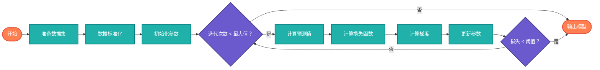

## 【概率统计算法详解】Java/Go/Python/JS/C不同语言实现

## 说明

概率统计算法（Probability and Statistics Algorithms）是处理不确定性和随机性的数学方法。在AI时代，概率统计是机器学习、深度学习、数据科学的理论基础，帮助我们理解数据分布、进行推断预测和评估模型性能。

> **生活类比**：就像天气预报，基于历史数据和概率模型预测明天的降雨概率。概率统计算法就是数据的"天气预报系统"，帮助我们预测和决策。

## 算法分类

### 1. 描述统计算法
- **均值、中位数、众数** - 集中趋势度量
- **方差、标准差** - 离散程度度量
- **偏度、峰度** - 分布形状度量
- **分位数** - 位置度量

### 2. 概率分布算法
- **正态分布** - 高斯分布计算
- **二项分布** - 离散概率分布
- **泊松分布** - 稀有事件分布
- **指数分布** - 连续概率分布

### 3. 假设检验算法
- **t检验** - 均值差异检验
- **卡方检验** - 独立性检验
- **F检验** - 方差齐性检验
- **ANOVA** - 方差分析

### 4. 回归分析算法
- **线性回归** - 最小二乘法
- **逻辑回归** - 分类算法
- **多项式回归** - 非线性拟合
- **岭回归** - 正则化回归

### 5. 采样算法
- **蒙特卡洛采样** - 随机采样
- **重要性采样** - 高效采样
- **拒绝采样** - 分布采样
- **马尔可夫链** - MCMC采样

## 算法流程

### 线性回归流程图



# 代码

## Java

```java
import java.util.*;
import java.util.stream.Collectors;

public class ProbabilityStatistics {
    
    // 描述统计算法
    public static class DescriptiveStatistics {
        
        // 基础统计量
        public static double mean(double[] data) {
            double sum = 0;
            for (double value : data) {
                sum += value;
            }
            return sum / data.length;
        }
        
        public static double median(double[] data) {
            Arrays.sort(data);
            int n = data.length;
            if (n % 2 == 0) {
                return (data[n/2 - 1] + data[n/2]) / 2;
            } else {
                return data[n/2];
            }
        }
        
        public static double mode(double[] data) {
            Map<Double, Integer> frequency = new HashMap<>();
            for (double value : data) {
                frequency.put(value, frequency.getOrDefault(value, 0) + 1);
            }
            
            double mode = data[0];
            int maxCount = 0;
            for (Map.Entry<Double, Integer> entry : frequency.entrySet()) {
                if (entry.getValue() > maxCount) {
                    maxCount = entry.getValue();
                    mode = entry.getKey();
                }
            }
            
            return mode;
        }
        
        public static double variance(double[] data) {
            double mean = mean(data);
            double sum = 0;
            for (double value : data) {
                sum += Math.pow(value - mean, 2);
            }
            return sum / data.length;
        }
        
        public static double standardDeviation(double[] data) {
            return Math.sqrt(variance(data));
        }
        
        public static double skewness(double[] data) {
            double mean = mean(data);
            double std = standardDeviation(data);
            double sum = 0;
            
            for (double value : data) {
                sum += Math.pow((value - mean) / std, 3);
            }
            
            return sum / data.length;
        }
        
        public static double kurtosis(double[] data) {
            double mean = mean(data);
            double std = standardDeviation(data);
            double sum = 0;
            
            for (double value : data) {
                sum += Math.pow((value - mean) / std, 4);
            }
            
            return sum / data.length - 3; // 减去3得到超额峰度
        }
        
        public static double percentile(double[] data, double percentile) {
            Arrays.sort(data);
            double index = (percentile / 100.0) * (data.length - 1);
            int lower = (int) Math.floor(index);
            int upper = (int) Math.ceil(index);
            
            if (lower == upper) {
                return data[lower];
            } else {
                double weight = index - lower;
                return data[lower] * (1 - weight) + data[upper] * weight;
            }
        }
    }
    
    // 概率分布算法
    public static class ProbabilityDistributions {
        
        // 正态分布
        public static double normalPDF(double x, double mean, double std) {
            return (1.0 / (std * Math.sqrt(2 * Math.PI))) * 
                   Math.exp(-0.5 * Math.pow((x - mean) / std, 2));
        }
        
        public static double normalCDF(double x, double mean, double std) {
            return 0.5 * (1 + erf((x - mean) / (std * Math.sqrt(2))));
        }
        
        // 误差函数近似
        private static double erf(double z) {
            double t = 1.0 / (1.0 + 0.5 * Math.abs(z));
            double ans = 1 - t * Math.exp(-z*z - 1.26551223 +
                                        t * (1.00002368 +
                                        t * (0.37409196 +
                                        t * (0.09678418 +
                                        t * (-0.18628806 +
                                        t * (0.27886807 +
                                        t * (-1.13520398 +
                                        t * (1.48851587 +
                                        t * (-0.82215223 +
                                        t * 0.17087277)))))))));
            return z >= 0 ? ans : -ans;
        }
        
        // 二项分布
        public static double binomialPMF(int k, int n, double p) {
            return combination(n, k) * Math.pow(p, k) * Math.pow(1 - p, n - k);
        }
        
        public static double binomialCDF(int k, int n, double p) {
            double sum = 0;
            for (int i = 0; i <= k; i++) {
                sum += binomialPMF(i, n, p);
            }
            return sum;
        }
        
        private static double combination(int n, int k) {
            return factorial(n) / (factorial(k) * factorial(n - k));
        }
        
        private static double factorial(int n) {
            if (n <= 1) return 1;
            double result = 1;
            for (int i = 2; i <= n; i++) {
                result *= i;
            }
            return result;
        }
        
        // 泊松分布
        public static double poissonPMF(int k, double lambda) {
            return Math.pow(lambda, k) * Math.exp(-lambda) / factorial(k);
        }
        
        public static double poissonCDF(int k, double lambda) {
            double sum = 0;
            for (int i = 0; i <= k; i++) {
                sum += poissonPMF(i, lambda);
            }
            return sum;
        }
        
        // 指数分布
        public static double exponentialPDF(double x, double lambda) {
            return x >= 0 ? lambda * Math.exp(-lambda * x) : 0;
        }
        
        public static double exponentialCDF(double x, double lambda) {
            return x >= 0 ? 1 - Math.exp(-lambda * x) : 0;
        }
    }
    
    // 假设检验算法
    public static class HypothesisTesting {
        
        // t检验
        public static TTestResult tTest(double[] sample1, double[] sample2) {
            double mean1 = DescriptiveStatistics.mean(sample1);
            double mean2 = DescriptiveStatistics.mean(sample2);
            double var1 = DescriptiveStatistics.variance(sample1);
            double var2 = DescriptiveStatistics.variance(sample2);
            int n1 = sample1.length;
            int n2 = sample2.length;
            
            // 合并标准差
            double pooledStd = Math.sqrt(((n1 - 1) * var1 + (n2 - 1) * var2) / (n1 + n2 - 2));
            
            // t统计量
            double tStat = (mean1 - mean2) / (pooledStd * Math.sqrt(1.0/n1 + 1.0/n2));
            
            // 自由度
            int df = n1 + n2 - 2;
            
            // p值（双尾检验）
            double pValue = 2 * (1 - tCDF(Math.abs(tStat), df));
            
            return new TTestResult(tStat, df, pValue);
        }
        
        // t分布CDF近似
        private static double tCDF(double t, int df) {
            // 使用正态分布近似（当df较大时）
            if (df > 30) {
                return ProbabilityDistributions.normalCDF(t, 0, 1);
            }
            
            // 简化的t分布计算
            double x = (df / (df + t * t));
            double beta = 0.5 * df;
            double result = 1 - 0.5 * incompleteBeta(x, beta, 0.5);
            return t > 0 ? result : 1 - result;
        }
        
        // 不完全贝塔函数简化版
        private static double incompleteBeta(double x, double a, double b) {
            // 简化实现，实际应用中应使用更精确的算法
            return Math.pow(x, a) * Math.pow(1 - x, b) / (a + b);
        }
        
        // 卡方检验
        public static ChiSquareTestResult chiSquareTest(double[] observed, double[] expected) {
            double chiSquare = 0;
            for (int i = 0; i < observed.length; i++) {
                chiSquare += Math.pow(observed[i] - expected[i], 2) / expected[i];
            }
            
            int df = observed.length - 1;
            double pValue = 1 - chiSquareCDF(chiSquare, df);
            
            return new ChiSquareTestResult(chiSquare, df, pValue);
        }
        
        // 卡方分布CDF简化版
        private static double chiSquareCDF(double x, int df) {
            // 使用正态分布近似（当df较大时）
            if (df > 30) {
                double z = Math.sqrt(2 * x) - Math.sqrt(2 * df - 1);
                return ProbabilityDistributions.normalCDF(z, 0, 1);
            }
            
            // 简化实现
            return 1 - Math.exp(-x/2);
        }
        
        public static class TTestResult {
            public double tStatistic;
            public int degreesOfFreedom;
            public double pValue;
            
            public TTestResult(double tStatistic, int degreesOfFreedom, double pValue) {
                this.tStatistic = tStatistic;
                this.degreesOfFreedom = degreesOfFreedom;
                this.pValue = pValue;
            }
        }
        
        public static class ChiSquareTestResult {
            public double chiSquare;
            public int degreesOfFreedom;
            public double pValue;
            
            public ChiSquareTestResult(double chiSquare, int degreesOfFreedom, double pValue) {
                this.chiSquare = chiSquare;
                this.degreesOfFreedom = degreesOfFreedom;
                this.pValue = pValue;
            }
        }
    }
    
    // 回归分析算法
    public static class RegressionAnalysis {
        
        // 线性回归
        public static LinearRegressionResult linearRegression(double[] x, double[] y) {
            int n = x.length;
            double sumX = 0, sumY = 0, sumXY = 0, sumX2 = 0;
            
            for (int i = 0; i < n; i++) {
                sumX += x[i];
                sumY += y[i];
                sumXY += x[i] * y[i];
                sumX2 += x[i] * x[i];
            }
            
            double denominator = n * sumX2 - sumX * sumX;
            double slope = (n * sumXY - sumX * sumY) / denominator;
            double intercept = (sumY - slope * sumX) / n;
            
            // 计算R²
            double meanY = sumY / n;
            double ssTotal = 0, ssResidual = 0;
            
            for (int i = 0; i < n; i++) {
                double predicted = slope * x[i] + intercept;
                ssTotal += Math.pow(y[i] - meanY, 2);
                ssResidual += Math.pow(y[i] - predicted, 2);
            }
            
            double rSquared = 1 - ssResidual / ssTotal;
            
            return new LinearRegressionResult(slope, intercept, rSquared);
        }
        
        // 逻辑回归
        public static LogisticRegressionResult logisticRegression(double[][] X, double[] y, 
                                                                 double learningRate, int epochs) {
            int n = X.length;
            int m = X[0].length;
            
            double[] weights = new double[m];
            double bias = 0;
            
            // 梯度下降
            for (int epoch = 0; epoch < epochs; epoch++) {
                double[] gradientWeights = new double[m];
                double gradientBias = 0;
                
                for (int i = 0; i < n; i++) {
                    double z = bias;
                    for (int j = 0; j < m; j++) {
                        z += weights[j] * X[i][j];
                    }
                    
                    double prediction = sigmoid(z);
                    double error = prediction - y[i];
                    
                    for (int j = 0; j < m; j++) {
                        gradientWeights[j] += error * X[i][j];
                    }
                    gradientBias += error;
                }
                
                // 更新参数
                for (int j = 0; j < m; j++) {
                    weights[j] -= learningRate * gradientWeights[j] / n;
                }
                bias -= learningRate * gradientBias / n;
            }
            
            return new LogisticRegressionResult(weights, bias);
        }
        
        private static double sigmoid(double z) {
            return 1.0 / (1.0 + Math.exp(-z));
        }
        
        public static class LinearRegressionResult {
            public double slope;
            public double intercept;
            public double rSquared;
            
            public LinearRegressionResult(double slope, double intercept, double rSquared) {
                this.slope = slope;
                this.intercept = intercept;
                this.rSquared = rSquared;
            }
        }
        
        public static class LogisticRegressionResult {
            public double[] weights;
            public double bias;
            
            public LogisticRegressionResult(double[] weights, double bias) {
                this.weights = weights;
                this.bias = bias;
            }
            
            public double predict(double[] x) {
                double z = bias;
                for (int i = 0; i < x.length; i++) {
                    z += weights[i] * x[i];
                }
                return sigmoid(z);
            }
        }
    }
    
    // 采样算法
    public static class SamplingAlgorithms {
        
        // 蒙特卡洛采样
        public static double monteCarloSampling(Function<Double, Double> f, 
                                               double a, double b, int samples) {
            double sum = 0;
            Random random = new Random();
            
            for (int i = 0; i < samples; i++) {
                double x = a + (b - a) * random.nextDouble();
                sum += f.apply(x);
            }
            
            return (b - a) * sum / samples;
        }
        
        // 重要性采样
        public static double importanceSampling(Function<Double, Double> f, 
                                             Function<Double, Double> g, 
                                             Function<Double, Double> importanceDist,
                                             double a, double b, int samples) {
            double sum = 0;
            Random random = new Random();
            
            for (int i = 0; i < samples; i++) {
                double x = sampleFromDistribution(importanceDist, a, b, random);
                double weight = g.apply(x) / importanceDist.apply(x);
                sum += f.apply(x) * weight;
            }
            
            return sum / samples;
        }
        
        // 简化的分布采样
        private static double sampleFromDistribution(Function<Double, Double> dist, 
                                                    double a, double b, Random random) {
            // 简化实现：使用均匀分布
            return a + (b - a) * random.nextDouble();
        }
        
        // 拒绝采样
        public static double rejectionSampling(Function<Double, Double> targetDist,
                                             Function<Double, Double> proposalDist,
                                             double a, double b, double M, int maxAttempts) {
            Random random = new Random();
            
            for (int attempt = 0; attempt < maxAttempts; attempt++) {
                double x = a + (b - a) * random.nextDouble();
                double u = random.nextDouble();
                
                if (u < targetDist.apply(x) / (M * proposalDist.apply(x))) {
                    return x;
                }
            }
            
            throw new RuntimeException("Rejection sampling failed after " + maxAttempts + " attempts");
        }
    }
}
```

## Python

```python
import numpy as np
import pandas as pd
from scipy import stats
from typing import List, Tuple, Callable
import random
import math

class ProbabilityStatistics:
    
    class DescriptiveStatistics:
        
        @staticmethod
        def mean(data: List[float]) -> float:
            """计算均值"""
            return np.mean(data)
        
        @staticmethod
        def median(data: List[float]) -> float:
            """计算中位数"""
            return np.median(data)
        
        @staticmethod
        def mode(data: List[float]) -> float:
            """计算众数"""
            return float(stats.mode(data)[0][0])
        
        @staticmethod
        def variance(data: List[float]) -> float:
            """计算方差"""
            return np.var(data)
        
        @staticmethod
        def standard_deviation(data: List[float]) -> float:
            """计算标准差"""
            return np.std(data)
        
        @staticmethod
        def skewness(data: List[float]) -> float:
            """计算偏度"""
            return stats.skew(data)
        
        @staticmethod
        def kurtosis(data: List[float]) -> float:
            """计算峰度"""
            return stats.kurtosis(data)
        
        @staticmethod
        def percentile(data: List[float], percentile: float) -> float:
            """计算分位数"""
            return np.percentile(data, percentile)
    
    class ProbabilityDistributions:
        
        @staticmethod
        def normal_pdf(x: float, mean: float = 0, std: float = 1) -> float:
            """正态分布概率密度函数"""
            return stats.norm.pdf(x, mean, std)
        
        @staticmethod
        def normal_cdf(x: float, mean: float = 0, std: float = 1) -> float:
            """正态分布累积分布函数"""
            return stats.norm.cdf(x, mean, std)
        
        @staticmethod
        def binomial_pmf(k: int, n: int, p: float) -> float:
            """二项分布概率质量函数"""
            return stats.binom.pmf(k, n, p)
        
        @staticmethod
        def binomial_cdf(k: int, n: int, p: float) -> float:
            """二项分布累积分布函数"""
            return stats.binom.cdf(k, n, p)
        
        @staticmethod
        def poisson_pmf(k: int, lambda_param: float) -> float:
            """泊松分布概率质量函数"""
            return stats.poisson.pmf(k, lambda_param)
        
        @staticmethod
        def poisson_cdf(k: int, lambda_param: float) -> float:
            """泊松分布累积分布函数"""
            return stats.poisson.cdf(k, lambda_param)
        
        @staticmethod
        def exponential_pdf(x: float, lambda_param: float) -> float:
            """指数分布概率密度函数"""
            return stats.expon.pdf(x, scale=1/lambda_param)
        
        @staticmethod
        def exponential_cdf(x: float, lambda_param: float) -> float:
            """指数分布累积分布函数"""
            return stats.expon.cdf(x, scale=1/lambda_param)
    
    class HypothesisTesting:
        
        @staticmethod
        def t_test(sample1: List[float], sample2: List[float]) -> Tuple[float, int, float]:
            """独立样本t检验"""
            t_stat, p_value = stats.ttest_ind(sample1, sample2)
            df = len(sample1) + len(sample2) - 2
            return t_stat, df, p_value
        
        @staticmethod
        def chi_square_test(observed: List[float], expected: List[float]) -> Tuple[float, int, float]:
            """卡方检验"""
            chi2_stat, p_value = stats.chisquare(observed, expected)
            df = len(observed) - 1
            return chi2_stat, df, p_value
        
        @staticmethod
        def anova_test(*samples: List[float]) -> Tuple[float, int, float]:
            """方差分析"""
            f_stat, p_value = stats.f_oneway(*samples)
            # 简化的自由度计算
            df_between = len(samples) - 1
            df_within = sum(len(sample) for sample in samples) - len(samples)
            return f_stat, df_between, p_value
    
    class RegressionAnalysis:
        
        @staticmethod
        def linear_regression(x: List[float], y: List[float]) -> Tuple[float, float, float]:
            """线性回归"""
            slope, intercept, r_value, p_value, std_err = stats.linregress(x, y)
            return slope, intercept, r_value ** 2
        
        @staticmethod
        def logistic_regression(X: List[List[float]], y: List[float], 
                              learning_rate: float = 0.01, epochs: int = 1000):
            """逻辑回归"""
            X = np.array(X)
            y = np.array(y)
            n, m = X.shape
            
            # 初始化参数
            weights = np.zeros(m)
            bias = 0
            
            # 梯度下降
            for epoch in range(epochs):
                # 计算预测值
                z = np.dot(X, weights) + bias
                predictions = 1 / (1 + np.exp(-z))
                
                # 计算梯度
                error = predictions - y
                gradient_weights = np.dot(X.T, error) / n
                gradient_bias = np.mean(error)
                
                # 更新参数
                weights -= learning_rate * gradient_weights
                bias -= learning_rate * gradient_bias
            
            return LogisticRegressionResult(weights, bias)
        
        @staticmethod
        def polynomial_regression(x: List[float], y: List[float], degree: int) -> Tuple[np.ndarray, float]:
            """多项式回归"""
            coefficients = np.polyfit(x, y, degree)
            
            # 计算R²
            predictions = np.polyval(coefficients, x)
            ss_total = np.sum((y - np.mean(y)) ** 2)
            ss_residual = np.sum((y - predictions) ** 2)
            r_squared = 1 - ss_residual / ss_total
            
            return coefficients, r_squared
    
    class SamplingAlgorithms:
        
        @staticmethod
        def monte_carlo_sampling(f: Callable[[float], float], a: float, b: float, samples: int) -> float:
            """蒙特卡洛采样"""
            sum_val = 0
            for _ in range(samples):
                x = a + (b - a) * random.random()
                sum_val += f(x)
            return (b - a) * sum_val / samples
        
        @staticmethod
        def importance_sampling(f: Callable[[float], float], g: Callable[[float], float],
                              importance_dist: Callable[[float], float],
                              a: float, b: float, samples: int) -> float:
            """重要性采样"""
            sum_val = 0
            for _ in range(samples):
                x = ProbabilityStatistics.SamplingAlgorithms._sample_from_distribution(importance_dist, a, b)
                weight = g(x) / importance_dist(x)
                sum_val += f(x) * weight
            return sum_val / samples
        
        @staticmethod
        def rejection_sampling(target_dist: Callable[[float], float], proposal_dist: Callable[[float], float],
                             a: float, b: float, M: float, max_attempts: int = 1000) -> float:
            """拒绝采样"""
            for _ in range(max_attempts):
                x = a + (b - a) * random.random()
                u = random.random()
                
                if u < target_dist(x) / (M * proposal_dist(x)):
                    return x
            
            raise RuntimeError(f"Rejection sampling failed after {max_attempts} attempts")
        
        @staticmethod
        def _sample_from_distribution(dist: Callable[[float], float], a: float, b: float) -> float:
            """简化的分布采样"""
            # 这里简化为均匀分布，实际应用中应根据具体分布实现
            return a + (b - a) * random.random()
        
        @staticmethod
        def metropolis_hastings(target_dist: Callable[[float], float], initial_x: float,
                               proposal_std: float, samples: int) -> List[float]:
            """Metropolis-Hastings采样"""
            samples_list = [initial_x]
            current_x = initial_x
            
            for _ in range(samples):
                # 提议新样本
                proposed_x = current_x + np.random.normal(0, proposal_std)
                
                # 计算接受概率
                acceptance_ratio = target_dist(proposed_x) / target_dist(current_x)
                acceptance_prob = min(1, acceptance_ratio)
                
                # 接受或拒绝
                if random.random() < acceptance_prob:
                    current_x = proposed_x
                
                samples_list.append(current_x)
            
            return samples_list


class LogisticRegressionResult:
    def __init__(self, weights: np.ndarray, bias: float):
        self.weights = weights
        self.bias = bias
    
    def predict(self, x: List[float]) -> float:
        """预测概率"""
        z = self.bias + np.dot(self.weights, x)
        return 1 / (1 + np.exp(-z))
    
    def predict_class(self, x: List[float], threshold: float = 0.5) -> int:
        """预测类别"""
        prob = self.predict(x)
        return 1 if prob >= threshold else 0
```

## Go

```go
package probabilitystatistics

import (
	"fmt"
	"math"
	"math/rand"
	"sort"
)

// 描述统计算法
type DescriptiveStatistics struct{}

func (ds DescriptiveStatistics) Mean(data []float64) float64 {
	sum := 0.0
	for _, value := range data {
		sum += value
	}
	return sum / float64(len(data))
}

func (ds DescriptiveStatistics) Median(data []float64) float64 {
	sorted := make([]float64, len(data))
	copy(sorted, data)
	sort.Float64s(sorted)
	
	n := len(sorted)
	if n%2 == 0 {
		return (sorted[n/2-1] + sorted[n/2]) / 2
	}
	return sorted[n/2]
}

func (ds DescriptiveStatistics) Mode(data []float64) float64 {
	frequency := make(map[float64]int)
	for _, value := range data {
		frequency[value]++
	}
	
	mode := data[0]
	maxCount := 0
	for value, count := range frequency {
		if count > maxCount {
			maxCount = count
			mode = value
		}
	}
	
	return mode
}

func (ds DescriptiveStatistics) Variance(data []float64) float64 {
	mean := ds.Mean(data)
	sum := 0.0
	for _, value := range data {
		sum += math.Pow(value-mean, 2)
	}
	return sum / float64(len(data))
}

func (ds DescriptiveStatistics) StandardDeviation(data []float64) float64 {
	return math.Sqrt(ds.Variance(data))
}

func (ds DescriptiveStatistics) Skewness(data []float64) float64 {
	mean := ds.Mean(data)
	std := ds.StandardDeviation(data)
	sum := 0.0
	
	for _, value := range data {
		sum += math.Pow((value-mean)/std, 3)
	}
	
	return sum / float64(len(data))
}

func (ds DescriptiveStatistics) Kurtosis(data []float64) float64 {
	mean := ds.Mean(data)
	std := ds.StandardDeviation(data)
	sum := 0.0
	
	for _, value := range data {
		sum += math.Pow((value-mean)/std, 4)
	}
	
	return sum/float64(len(data)) - 3 // 减去3得到超额峰度
}

func (ds DescriptiveStatistics) Percentile(data []float64, percentile float64) float64 {
	sorted := make([]float64, len(data))
	copy(sorted, data)
	sort.Float64s(sorted)
	
	index := (percentile / 100.0) * float64(len(sorted)-1)
	lower := int(math.Floor(index))
	upper := int(math.Ceil(index))
	
	if lower == upper {
		return sorted[lower]
	}
	
	weight := index - float64(lower)
	return sorted[lower]*(1-weight) + sorted[upper]*weight
}

// 概率分布算法
type ProbabilityDistributions struct{}

func (pd ProbabilityDistributions) NormalPDF(x, mean, std float64) float64 {
	return (1.0 / (std * math.Sqrt(2*math.PI))) * 
		   math.Exp(-0.5*math.Pow((x-mean)/std, 2))
}

func (pd ProbabilityDistributions) NormalCDF(x, mean, std float64) float64 {
	return 0.5 * (1 + erf((x-mean)/(std*math.Sqrt(2))))
}

// 误差函数近似
func erf(z float64) float64 {
	t := 1.0 / (1.0 + 0.5*math.Abs(z))
	ans := 1 - t*math.Exp(-z*z-1.26551223+
		t*(1.00002368+
		t*(0.37409196+
		t*(0.09678418+
		t*(-0.18628806+
		t*(0.27886807+
		t*(-1.13520398+
		t*(1.48851587+
		t*(-0.82215223+
		t*0.17087277)))))))))
	if z >= 0 {
		return ans
	}
	return -ans
}

func (pd ProbabilityDistributions) BinomialPMF(k, n int, p float64) float64 {
	return combination(n, k) * math.Pow(p, float64(k)) * math.Pow(1-p, float64(n-k))
}

func (pd ProbabilityDistributions) BinomialCDF(k, n int, p float64) float64 {
	sum := 0.0
	for i := 0; i <= k; i++ {
		sum += pd.BinomialPMF(i, n, p)
	}
	return sum
}

func combination(n, k int) float64 {
	return factorial(n) / (factorial(k) * factorial(n-k))
}

func factorial(n int) float64 {
	if n <= 1 {
		return 1
	}
	result := 1.0
	for i := 2; i <= n; i++ {
		result *= float64(i)
	}
	return result
}

func (pd ProbabilityDistributions) PoissonPMF(k int, lambda float64) float64 {
	return math.Pow(lambda, float64(k)) * math.Exp(-lambda) / factorial(k)
}

func (pd ProbabilityDistributions) PoissonCDF(k int, lambda float64) float64 {
	sum := 0.0
	for i := 0; i <= k; i++ {
		sum += pd.PoissonPMF(i, lambda)
	}
	return sum
}

func (pd ProbabilityDistributions) ExponentialPDF(x, lambda float64) float64 {
	if x < 0 {
		return 0
	}
	return lambda * math.Exp(-lambda*x)
}

func (pd ProbabilityDistributions) ExponentialCDF(x, lambda float64) float64 {
	if x < 0 {
		return 0
	}
	return 1 - math.Exp(-lambda*x)
}

// 假设检验算法
type HypothesisTesting struct{}

type TTestResult struct {
	TStatistic      float64
	DegreesFreedom  int
	PValue          float64
}

func (ht HypothesisTesting) TTest(sample1, sample2 []float64) TTestResult {
	mean1 := DescriptiveStatistics{}.Mean(sample1)
	mean2 := DescriptiveStatistics{}.Mean(sample2)
	var1 := DescriptiveStatistics{}.Variance(sample1)
	var2 := DescriptiveStatistics{}.Variance(sample2)
	n1 := len(sample1)
	n2 := len(sample2)
	
	// 合并标准差
	pooledStd := math.Sqrt(((float64(n1)-1)*var1 + (float64(n2)-1)*var2) / float64(n1+n2-2))
	
	// t统计量
	tStat := (mean1 - mean2) / (pooledStd * math.Sqrt(1.0/float64(n1)+1.0/float64(n2)))
	
	// 自由度
	df := n1 + n2 - 2
	
	// p值（双尾检验）
	pValue := 2 * (1 - tCDF(math.Abs(tStat), df))
	
	return TTestResult{tStat, df, pValue}
}

// t分布CDF近似
func tCDF(t float64, df int) float64 {
	// 使用正态分布近似（当df较大时）
	if df > 30 {
		return ProbabilityDistributions{}.NormalCDF(t, 0, 1)
	}
	
	// 简化的t分布计算
	x := float64(df) / (float64(df) + t*t)
	beta := 0.5 * float64(df)
	result := 1 - 0.5*incompleteBeta(x, beta, 0.5)
	if t > 0 {
		return result
	}
	return 1 - result
}

// 不完全贝塔函数简化版
func incompleteBeta(x, a, b float64) float64 {
	// 简化实现，实际应用中应使用更精确的算法
	return math.Pow(x, a) * math.Pow(1-x, b) / (a + b)
}

type ChiSquareTestResult struct {
	ChiSquare       float64
	DegreesFreedom  int
	PValue          float64
}

func (ht HypothesisTesting) ChiSquareTest(observed, expected []float64) ChiSquareTestResult {
	chiSquare := 0.0
	for i := 0; i < len(observed); i++ {
		chiSquare += math.Pow(observed[i]-expected[i], 2) / expected[i]
	}
	
	df := len(observed) - 1
	pValue := 1 - chiSquareCDF(chiSquare, df)
	
	return ChiSquareTestResult{chiSquare, df, pValue}
}

// 卡方分布CDF简化版
func chiSquareCDF(x float64, df int) float64 {
	// 使用正态分布近似（当df较大时）
	if df > 30 {
		z := math.Sqrt(2*x) - math.Sqrt(2*float64(df)-1)
		return ProbabilityDistributions{}.NormalCDF(z, 0, 1)
	}
	
	// 简化实现
	return 1 - math.Exp(-x/2)
}

// 回归分析算法
type RegressionAnalysis struct{}

type LinearRegressionResult struct {
	Slope     float64
	Intercept float64
	RSquared  float64
}

func (ra RegressionAnalysis) LinearRegression(x, y []float64) LinearRegressionResult {
	n := len(x)
	sumX, sumY, sumXY, sumX2 := 0.0, 0.0, 0.0, 0.0
	
	for i := 0; i < n; i++ {
		sumX += x[i]
		sumY += y[i]
		sumXY += x[i] * y[i]
		sumX2 += x[i] * x[i]
	}
	
	denominator := float64(n)*sumX2 - sumX*sumX
	slope := (float64(n)*sumXY - sumX*sumY) / denominator
	intercept := (sumY - slope*sumX) / float64(n)
	
	// 计算R²
	meanY := sumY / float64(n)
	ssTotal, ssResidual := 0.0, 0.0
	
	for i := 0; i < n; i++ {
		predicted := slope*x[i] + intercept
		ssTotal += math.Pow(y[i]-meanY, 2)
		ssResidual += math.Pow(y[i]-predicted, 2)
	}
	
	rSquared := 1 - ssResidual/ssTotal
	
	return LinearRegressionResult{slope, intercept, rSquared}
}

type LogisticRegressionResult struct {
	Weights []float64
	Bias    float64
}

func (ra RegressionAnalysis) LogisticRegression(X [][]float64, y []float64, learningRate float64, epochs int) LogisticRegressionResult {
	n := len(X)
	m := len(X[0])
	
	weights := make([]float64, m)
	bias := 0.0
	
	// 梯度下降
	for epoch := 0; epoch < epochs; epoch++ {
		gradientWeights := make([]float64, m)
		gradientBias := 0.0
		
		for i := 0; i < n; i++ {
			// 计算线性组合
			z := bias
			for j := 0; j < m; j++ {
				z += weights[j] * X[i][j]
			}
			
			// 计算预测值
			prediction := sigmoid(z)
			error := prediction - y[i]
			
			// 计算梯度
			for j := 0; j < m; j++ {
				gradientWeights[j] += error * X[i][j]
			}
			gradientBias += error
		}
		
		// 更新参数
		for j := 0; j < m; j++ {
			weights[j] -= learningRate * gradientWeights[j] / float64(n)
		}
		bias -= learningRate * gradientBias / float64(n)
	}
	
	return LogisticRegressionResult{weights, bias}
}

func sigmoid(z float64) float64 {
	return 1.0 / (1.0 + math.Exp(-z))
}

func (lrr LogisticRegressionResult) Predict(x []float64) float64 {
	z := lrr.Bias
	for i := 0; i < len(x); i++ {
		z += lrr.Weights[i] * x[i]
	}
	return sigmoid(z)
}

// 采样算法
type SamplingAlgorithms struct{}

func (sa SamplingAlgorithms) MonteCarloSampling(f func(float64) float64, a, b float64, samples int) float64 {
	sum := 0.0
	for i := 0; i < samples; i++ {
		x := a + (b-a)*rand.Float64()
		sum += f(x)
	}
	return (b - a) * sum / float64(samples)
}

func (sa SamplingAlgorithms) ImportanceSampling(f, g, importanceDist func(float64) float64,
                                               a, b float64, samples int) float64 {
	sum := 0.0
	for i := 0; i < samples; i++ {
		x := sampleFromDistribution(importanceDist, a, b)
		weight := g(x) / importanceDist(x)
		sum += f(x) * weight
	}
	return sum / float64(samples)
}

// 简化的分布采样
func sampleFromDistribution(dist func(float64) float64, a, b float64) float64 {
	// 简化实现：使用均匀分布
	return a + (b-a)*rand.Float64()
}

func (sa SamplingAlgorithms) RejectionSampling(targetDist, proposalDist func(float64) float64,
                                             a, b, M float64, maxAttempts int) float64 {
	for attempt := 0; attempt < maxAttempts; attempt++ {
		x := a + (b-a)*rand.Float64()
		u := rand.Float64()
		
		if u < targetDist(x)/(M*proposalDist(x)) {
			return x
		}
	}
	
	panic(fmt.Sprintf("Rejection sampling failed after %d attempts", maxAttempts))
}

func (sa SamplingAlgorithms) MetropolisHastings(targetDist func(float64) float64,
                                               initialX, proposalStd float64, samples int) []float64 {
	samplesList := make([]float64, 0, samples)
	currentX := initialX
	
	for i := 0; i < samples; i++ {
		// 提议新样本
		proposedX := currentX + rand.NormFloat64()*proposalStd
		
		// 计算接受概率
		acceptanceRatio := targetDist(proposedX) / targetDist(currentX)
		acceptanceProb := math.Min(1, acceptanceRatio)
		
		// 接受或拒绝
		if rand.Float64() < acceptanceProb {
			currentX = proposedX
		}
		
		samplesList = append(samplesList, currentX)
	}
	
	return samplesList
}
```

# 链接

概率统计算法源码：[https://github.com/microwind/algorithms/tree/main/probability-statistics](https://github.com/microwind/algorithms/tree/main/probability-statistics)

其他算法源码：[https://github.com/microwind/algorithms](https://github.com/microwind/algorithms)
