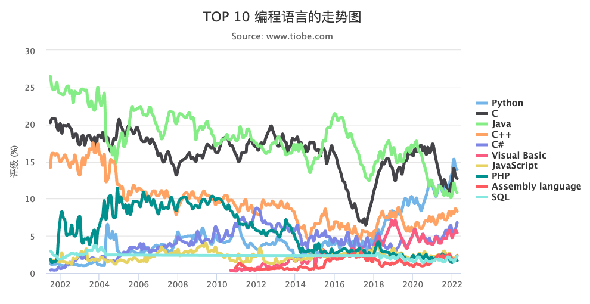
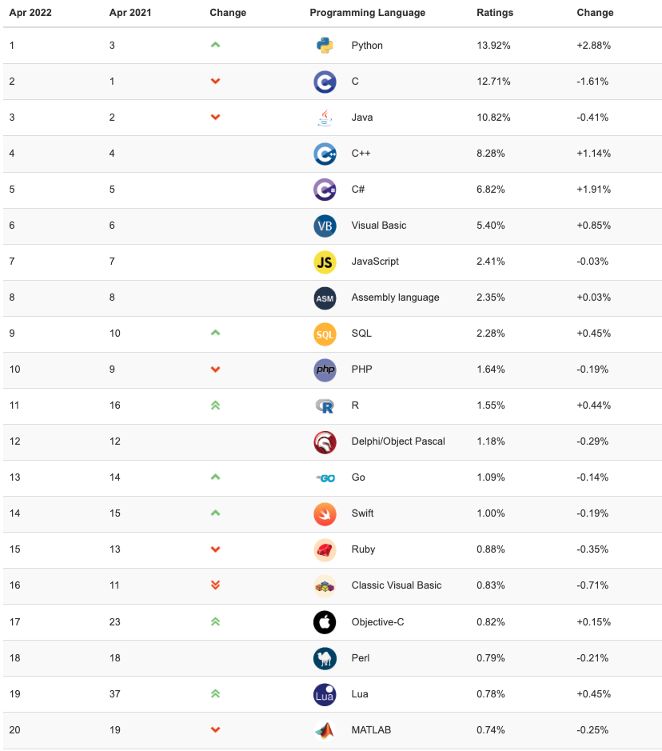

# 2022年推荐学习和不推荐学习的编程语言
### 选择学习哪门编程语言，首先需要具备以下观念，然后再来确定要学习哪门语言。

 1. 编程语言有很多种，这世上没有完美的编程语言。每门语言都有不少缺陷。
 2. 不同语言的适用范围不同，我们应该根据应用情况来选择合适的编程语言。
 3. 编程语言都在不断地发展变化，语言会不断优化升级，最终也都会被淘汰。
   
### 以下列出一些值得入门学习的编程语言，其他语言就不一一列举了。一家之言，仅作参考。

| 语言 | 推荐指数 | 推荐原因 | 不推荐指数 | 不推荐原因 |
| ---- | ---- | ---- | ---- | ---- |
| Python | ☆☆☆☆☆ | 1、容易上手，语言很友好  2、适用范围广，Web后端、机器学习、大数据、数据可视化等  3、非常流行，开发者庞大 | ☆ | 1、用缩进来表示语句  2、有很多简写函数，不好记 |
| JavaScript | ☆☆☆☆☆ | 1、容易上手，语言灵活 2、无处不在，从前端、移动端、服务端哪里都可以用 3、开发者众多，非常流行 | ☆ | 1、语法过于灵活，深入学习难度大 2、就业市场饱和 |
| Go | ☆☆☆☆☆ | 1、性能优秀，轻量级 2、语法友好，借鉴C、Java、JS 3、Google出品 | ☆ | 1、范围略窄，主要适用Web后端，取代Java和PHP 2、流行度还不够 | 
| TypeScript | ☆☆☆☆☆ | 1、容易上手，语法好懂 2、是JS的超集，强类型 3、有替代JS的趋势 | ☆ | 1、只是JS的超集 2、比JS啰嗦 |
| Dart| ☆☆☆☆ | 1、语言友好，借鉴了JS，强类型 2、适用于Andorid、iOS、Web，跨平台、跨终端的Flutter应用 3、Google力推 | ☆☆ | 1、性能有待验证 2、流行度不够
| Java | ☆☆☆☆ | 1、跨平台、通用性强 2、适用范围广，Android与企业级应用很流行 3、语言严谨，经典的面向对象语言 | ☆☆ | 1、越来越庞大臃肿 2、被Go、NodeJS、Kotlin、Dart等替代可能性很大 |
| C# | ☆☆☆☆ | 1、平台无关、简单通用 2、语法严谨，成熟度高 3、微软出品 | ☆☆ | 1、流行度不够2、主要在Windows使用 |
| Kotlin | ☆☆☆ | 1、替代Java的语言 2、语法简便、优雅 3、适用范围广 | ☆☆☆ | 1、知名度低 2、推广有难度 | 
Swift | ☆☆☆ | 1、替代ObectiveC的语言 2、语法简单，易上手 3、开发iOS利器 | ☆☆☆ | 1、适用范围窄，主要是苹果系列开发 2、知名度低 | 
| Rust | ☆☆☆ | 1、性能卓越 2、语法精炼、优秀 3、可能替代C与C++ | ☆☆☆ | 1、学习难度大 2、知名度低  3、文档少 |
| C | ☆☆☆ | 1、老牌经典语言，高级语言的范本 2、学算法和数据结构的最佳语言 3、性能高，适合系统开发 | ☆☆☆ | 1、内存不好管理 2、缺乏面向对象 3、有点老了 | 
| C++ | ☆☆ | 1、经典面向对象语言 2、桌面程序和游戏开发的首选 3、性能高，是C语言超集 | ☆☆☆☆ | 1、学习难度大 2、内存不安全 3、有被C#、Rust或其他语言取代风险 |
| R | ☆☆ | 1、适用数学、统计、机器学习、金融科技等 2、简单易学，适合数据分析 3、小巧玲珑，兼容好 | ☆☆☆☆ | 1、语法不是很友好 2、可以被Python等取代 3、处理大文本差 |
| Ruby | ☆ | 1、适合Web开发 2、简单易学 3、快速部署 | ☆☆☆☆☆ | 1、不流行 2、性能一般 3、逐渐被取代 |
| PHP | ☆ | 1、曾经流行的Web后端语言 2、上手很简单，开发速度快 3、与MySQL配合很方便 | ☆☆☆☆☆ | 1、太多功能函数，不要记忆 2、性能一般 3、逐渐被取代
| ---- | ---- | ---- | ---- | ---- |

### 编程语言趋势与排名参考

